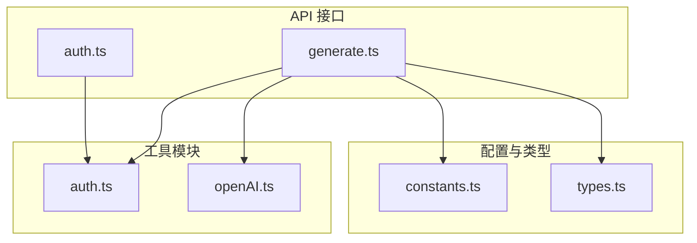
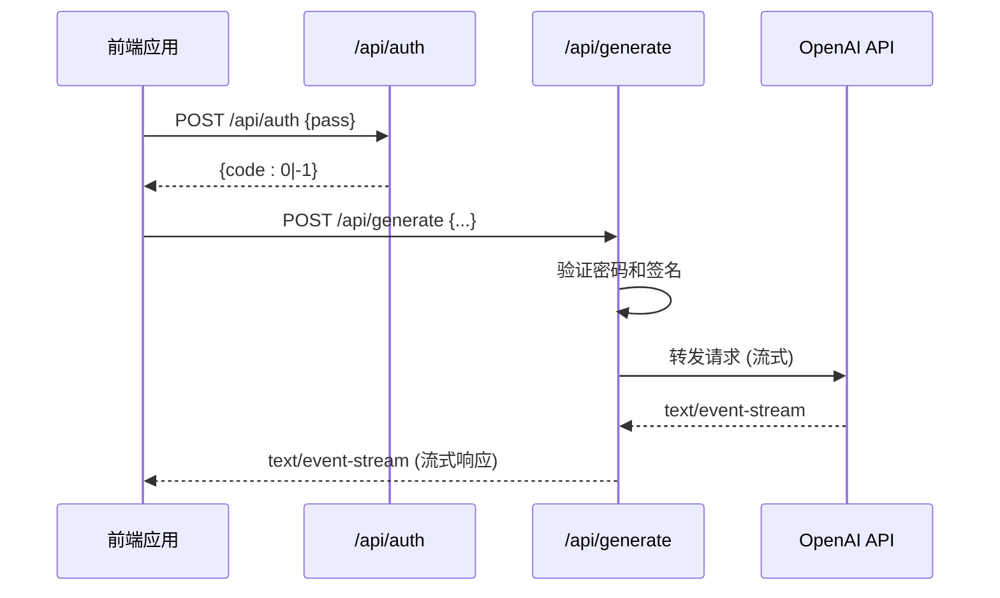
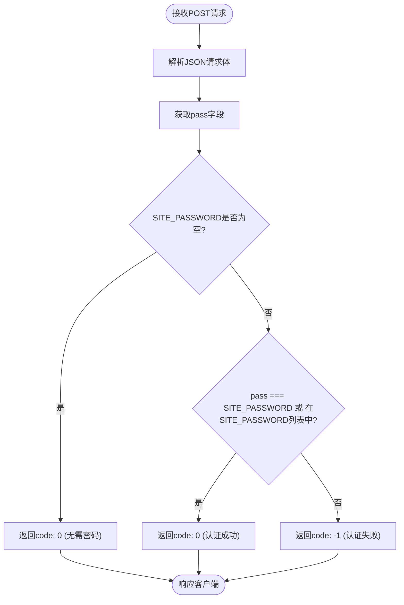
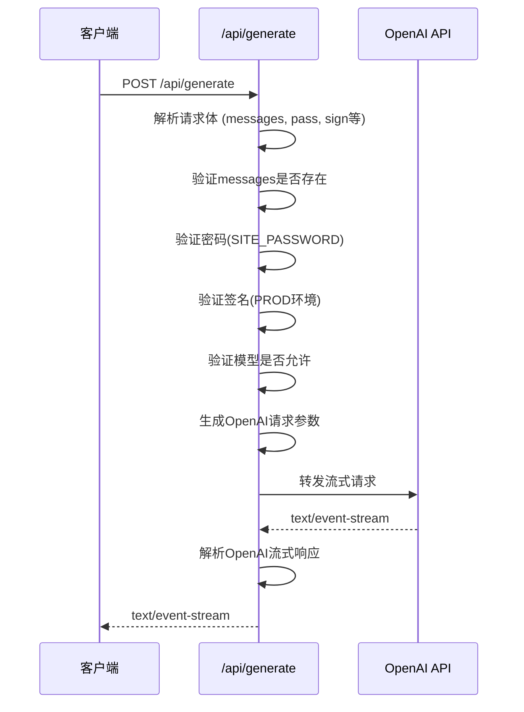
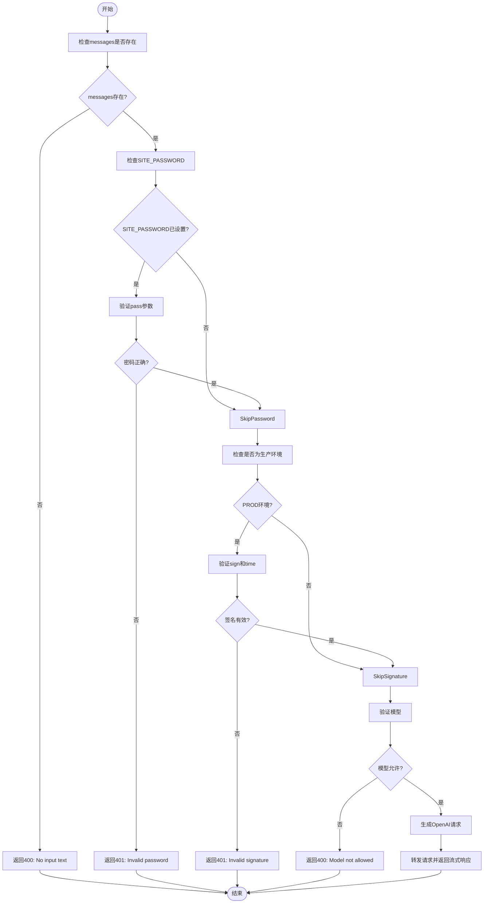
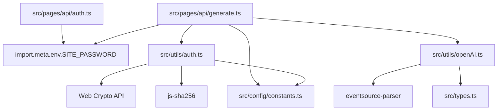

# API接口文档

<cite>
**本文档引用的文件**  
- [auth.ts](file://src/pages/api/auth.ts)
- [generate.ts](file://src/pages/api/generate.ts)
- [auth.ts](file://src/utils/auth.ts)
- [openAI.ts](file://src/utils/openAI.ts)
- [constants.ts](file://src/config/constants.ts)
- [types.ts](file://src/types.ts)
- [README.md](file://README.md)
</cite>

## 目录
1. [简介](#简介)
2. [项目结构](#项目结构)
3. [核心组件](#核心组件)
4. [架构概览](#架构概览)
5. [详细组件分析](#详细组件分析)
6. [依赖分析](#依赖分析)
7. [性能考虑](#性能考虑)
8. [故障排除指南](#故障排除指南)
9. [结论](#结论)

## 简介
本项目是一个基于 Astro 和 Solid.js 构建的轻量级 AI 聊天 Web 应用，提供两个核心 API 接口：`/api/auth` 用于身份验证，`/api/generate` 用于生成 AI 响应。该应用支持多平台部署（Docker、Vercel、Netlify），具备模型切换、对话历史保存、Markdown 渲染等丰富功能，并通过密码和签名机制保障 API 安全。

## 项目结构
项目采用模块化结构，主要分为以下几个部分：
- `src/pages/api/`：存放 API 接口实现文件
- `src/utils/`：工具函数，包括认证和 OpenAI 请求处理
- `src/config/`：应用常量配置
- `src/types/`：类型定义
- 根目录包含部署配置文件（Dockerfile、vercel.json 等）

**图示来源**
- [auth.ts](file://src/pages/api/auth.ts)
- [generate.ts](file://src/pages/api/generate.ts)
- [auth.ts](file://src/utils/auth.ts)
- [openAI.ts](file://src/utils/openAI.ts)
- [constants.ts](file://src/config/constants.ts)
- [types.ts](file://src/types.ts)

**本节来源**
- [README.md](file://README.md)

## 核心组件
本项目的核心功能由两个 API 接口驱动：`/api/auth` 负责用户身份验证，返回认证结果；`/api/generate` 负责与 OpenAI API 通信，生成流式文本响应。两个接口均通过环境变量进行配置，并实现了密码验证和请求签名等安全机制。

**本节来源**
- [auth.ts](file://src/pages/api/auth.ts#L1-L12)
- [generate.ts](file://src/pages/api/generate.ts#L1-L70)

## 架构概览
系统采用前后端分离架构，前端通过 API 调用后端服务，后端代理 OpenAI 请求并返回流式响应。

**图示来源**
- [auth.ts](file://src/pages/api/auth.ts#L1-L12)
- [generate.ts](file://src/pages/api/generate.ts#L1-L70)

## 详细组件分析

### /api/auth 接口分析
该接口用于验证用户访问密码，支持单个或多个密码配置。

#### 认证逻辑流程图

**图示来源**
- [auth.ts](file://src/pages/api/auth.ts#L1-L12)

**本节来源**
- [auth.ts](file://src/pages/api/auth.ts#L1-L12)

### /api/generate 接口分析
该接口是核心功能接口，负责处理聊天消息并返回 AI 生成的流式响应。

#### 请求处理序列图

**图示来源**
- [generate.ts](file://src/pages/api/generate.ts#L1-L70)
- [openAI.ts](file://src/utils/openAI.ts#L4-L71)

#### 请求参数验证流程

**图示来源**
- [generate.ts](file://src/pages/api/generate.ts#L1-L70)

**本节来源**
- [generate.ts](file://src/pages/api/generate.ts#L1-L70)
- [openAI.ts](file://src/utils/openAI.ts#L4-L71)
- [auth.ts](file://src/utils/auth.ts#L27-L34)
- [constants.ts](file://src/config/constants.ts#L1-L17)

## 依赖分析
系统各组件之间存在明确的依赖关系，确保功能模块化和代码复用。

**图示来源**
- [auth.ts](file://src/pages/api/auth.ts)
- [generate.ts](file://src/pages/api/generate.ts)
- [auth.ts](file://src/utils/auth.ts)
- [openAI.ts](file://src/utils/openAI.ts)
- [constants.ts](file://src/config/constants.ts)
- [types.ts](file://src/types.ts)

**本节来源**
- [generate.ts](file://src/pages/api/generate.ts#L1-L70)
- [auth.ts](file://src/utils/auth.ts#L1-L35)
- [openAI.ts](file://src/utils/openAI.ts#L1-L71)

## 性能考虑
- **流式响应**：`/api/generate` 接口使用 `text/event-stream` 实现流式传输，用户可即时看到 AI 生成内容，提升体验。
- **签名验证**：通过时间戳验证防止重放攻击，超时时间为 5 分钟（由 `CONFIG.AUTH_TIMEOUT` 控制）。
- **错误处理**：对 OpenAI API 调用进行异常捕获，避免因后端错误导致服务中断。
- **代理支持**：支持通过 `HTTPS_PROXY` 环境变量配置代理，适应不同网络环境。

## 故障排除指南
### 常见错误及解决方案

**错误：401 Unauthorized (Invalid password)**
- **原因**：未提供密码或密码错误
- **解决方案**：检查请求中的 `pass` 参数是否与 `.env` 文件中的 `SITE_PASSWORD` 匹配

**错误：401 Unauthorized (Invalid signature)**
- **原因**：签名验证失败，可能由于时间戳过期或密钥不匹配
- **解决方案**：确保 `PUBLIC_SECRET_KEY` 配置正确，且客户端与服务器时间差在 5 分钟内

**错误：400 Bad Request (No input text)**
- **原因**：请求体中缺少 `messages` 字段
- **解决方案**：确保请求体包含 `messages` 数组

**错误：500 Internal Server Error**
- **原因**：调用 OpenAI API 时发生网络错误
- **解决方案**：检查 `OPENAI_API_KEY` 是否正确，网络连接是否正常，或是否需要配置代理

**本节来源**
- [generate.ts](file://src/pages/api/generate.ts#L1-L70)
- [auth.ts](file://src/utils/auth.ts#L27-L34)

## 结论
本项目提供了一套完整、安全且易于部署的 AI 聊天 API 解决方案。通过 `/api/auth` 和 `/api/generate` 两个接口，实现了用户认证和 AI 内容生成的核心功能。系统设计考虑了安全性（密码、签名）、性能（流式响应）和可扩展性（多模型支持），适合个人使用和二次开发。