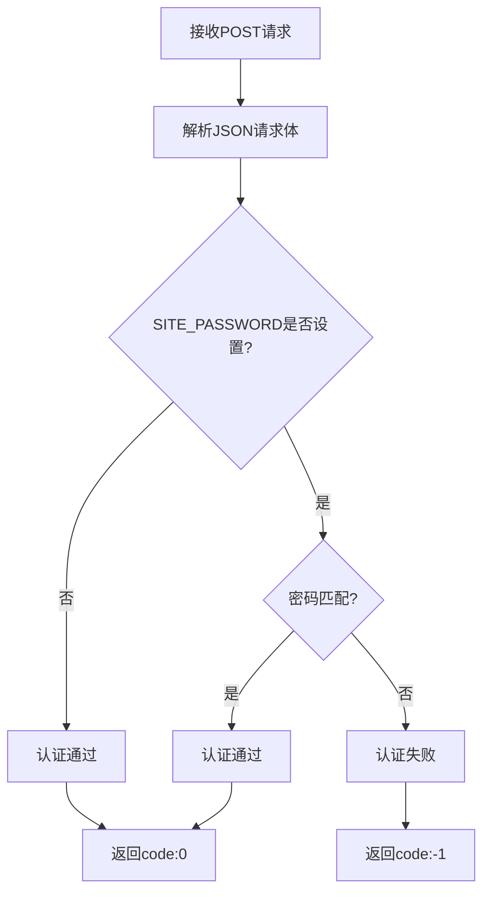
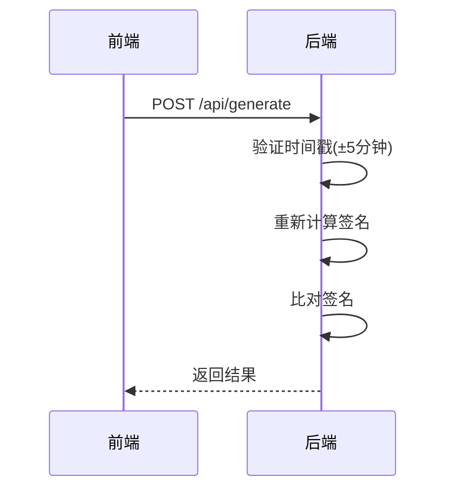
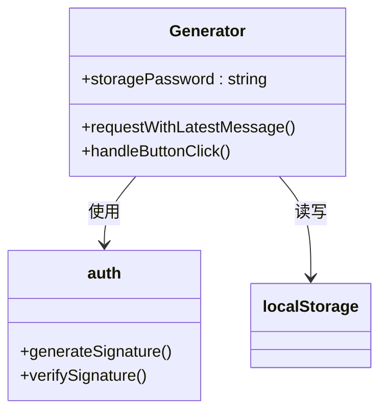
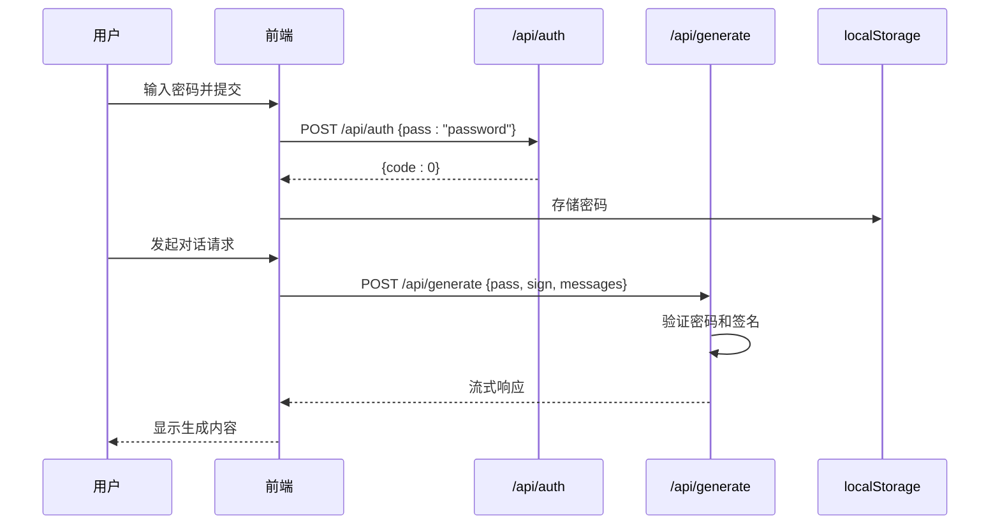

# /api/auth 接口文档

<cite>
**本文档引用的文件**  
- [auth.ts](file://src/pages/api/auth.ts#L1-L13)
- [generate.ts](file://src/pages/api/generate.ts#L1-L71)
- [auth.ts](file://src/utils/auth.ts#L1-L35)
- [constants.ts](file://src/config/constants.ts#L1-L38)
- [Generator.tsx](file://src/components/Generator.tsx#L1-L392)
- [openAI.ts](file://src/utils/openAI.ts#L1-L72)
</cite>

## 目录
1. [接口概述](#接口概述)
2. [请求方法与路径](#请求方法与路径)
3. [请求体参数](#请求体参数)
4. [认证逻辑实现](#认证逻辑实现)
5. [响应格式](#响应格式)
6. [安全实践](#安全实践)
7. [前端集成](#前端集成)
8. [调用示例](#调用示例)
9. [权限控制流程](#权限控制流程)

## 接口概述
`/api/auth` 接口用于验证用户提交的密码是否正确。该接口通过比对用户输入的密码与环境变量中配置的密码来完成身份认证，是系统访问控制的第一道防线。

**Section sources**
- [auth.ts](file://src/pages/api/auth.ts#L1-L13)

## 请求方法与路径
- **HTTP 方法**: `POST`
- **路径**: `/api/auth`
- **内容类型**: `Content-Type: application/json`

该接口仅接受 JSON 格式的 POST 请求，必须在请求头中明确指定 `Content-Type: application/json`。

**Section sources**
- [auth.ts](file://src/pages/api/auth.ts#L1-L13)
- [openAI.ts](file://src/utils/openAI.ts#L11)

## 请求体参数
请求体必须为 JSON 格式，包含以下字段：

| 字段名 | 类型 | 必需 | 描述 |
|--------|------|------|------|
| `pass` | 字符串 | 是 | 用户提交的明文密码 |

**示例请求体**:
```json
{
  "pass": "mysecretpassword"
}
```

**Section sources**
- [auth.ts](file://src/pages/api/auth.ts#L7-L9)

## 认证逻辑实现
认证逻辑基于环境变量 `SITE_PASSWORD` 进行比对，支持单密码或多密码配置。

### 密码配置
- 环境变量 `SITE_PASSWORD` 可设置单个密码或以逗号分隔的多个密码
- 若未设置 `SITE_PASSWORD`，则站点为公开访问模式

### 认证流程


**Diagram sources**
- [auth.ts](file://src/pages/api/auth.ts#L2-L12)

**Section sources**
- [auth.ts](file://src/pages/api/auth.ts#L2-L12)
- [generate.ts](file://src/pages/api/generate.ts#L11)

## 响应格式
### 成功响应
当密码验证通过时，返回 HTTP 200 状态码和以下 JSON 响应：

```json
{
  "code": 0
}
```

### 失败响应
当密码验证失败时，返回 HTTP 200 状态码和以下 JSON 响应：

```json
{
  "code": -1
}
```

> **注意**: 尽管认证失败，接口仍返回 HTTP 200 状态码，通过 `code` 字段的值来区分成功（0）与失败（-1）。真正的 HTTP 401 状态码在 `/api/generate` 接口的后续调用中使用。

**Section sources**
- [auth.ts](file://src/pages/api/auth.ts#L10-L12)

## 安全实践
### 密码哈希处理
虽然 `/api/auth` 接口直接比对明文密码，但系统在其他环节实现了更高级的安全机制：

- 使用 `crypto.subtle.digest` 或 `js-sha256` 库进行 SHA-256 哈希计算
- 在生产环境中通过签名机制防止重放攻击

### 签名验证机制


**Diagram sources**
- [auth.ts](file://src/utils/auth.ts#L1-L35)
- [generate.ts](file://src/pages/api/generate.ts#L16-L24)

**Section sources**
- [auth.ts](file://src/utils/auth.ts#L1-L35)
- [constants.ts](file://src/config/constants.ts#L8-L10)

## 前端集成
### Generator 组件密码逻辑
`Generator` 组件负责处理用户密码输入和认证状态管理：



**Diagram sources**
- [Generator.tsx](file://src/components/Generator.tsx#L1-L392)
- [auth.ts](file://src/utils/auth.ts#L1-L35)

**Section sources**
- [Generator.tsx](file://src/components/Generator.tsx#L1-L392)

### 认证状态持久化
- 密码通过 `localStorage` 持久化存储，键名为 `pass`
- 用户首次输入密码后，后续请求自动携带认证信息
- 提供密码输入界面，但具体UI组件未在分析范围内

## 调用示例
### 正确密码认证
```bash
curl -X POST https://your-domain.com/api/auth \
  -H "Content-Type: application/json" \
  -d '{"pass": "correct_password"}'
```

**响应**:
```json
{"code":0}
```

### 错误密码认证
```bash
curl -X POST https://your-domain.com/api/auth \
  -H "Content-Type: application/json" \
  -d '{"pass": "wrong_password"}'
```

**响应**:
```json
{"code":-1}
```

## 权限控制流程
认证通过后，用户才能成功调用 `/api/generate` 接口生成内容。

### 完整认证流程


**Diagram sources**
- [auth.ts](file://src/pages/api/auth.ts#L1-L13)
- [generate.ts](file://src/pages/api/generate.ts#L1-L71)
- [Generator.tsx](file://src/components/Generator.tsx#L1-L392)

**Section sources**
- [generate.ts](file://src/pages/api/generate.ts#L16-L24)
- [Generator.tsx](file://src/components/Generator.tsx#L1-L392)

### 权限验证逻辑
在 `/api/generate` 接口中，系统会再次验证密码：

```typescript
if (sitePassword && !(sitePassword === pass || passList.includes(pass))) {
  return new Response(JSON.stringify({
    error: { message: 'Invalid password.' }
  }), { status: 401 })
}
```

只有通过此验证，请求才会被转发到 OpenAI API。

**Section sources**
- [generate.ts](file://src/pages/api/generate.ts#L16-L20)