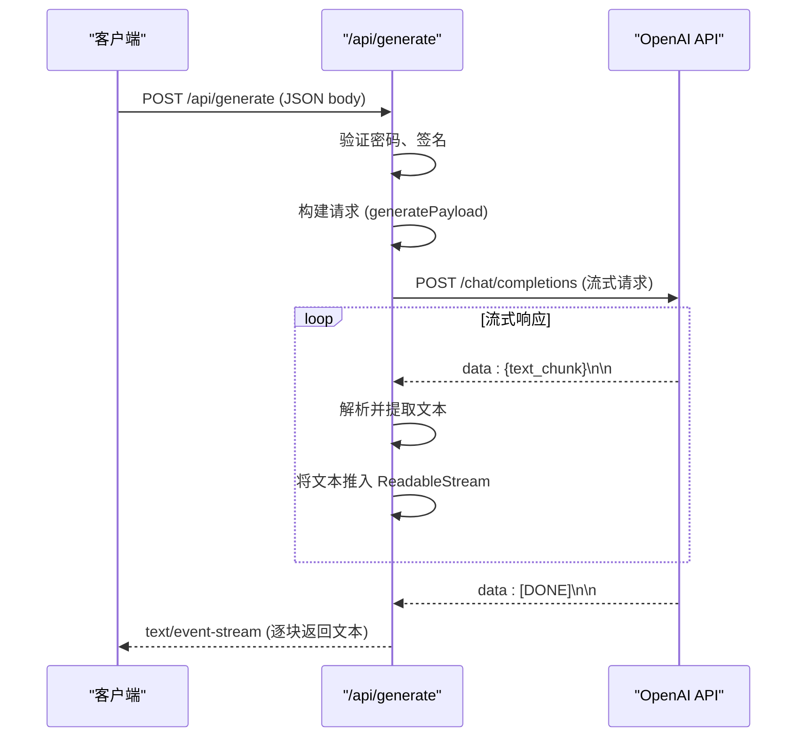

# /api/generate 接口文档

<cite>
**本文档中引用的文件**   
- [generate.ts](file://src/pages/api/generate.ts)
- [openAI.ts](file://src/utils/openAI.ts)
- [constants.ts](file://src/config/constants.ts)
- [types.ts](file://src/types.ts)
- [auth.ts](file://src/utils/auth.ts)
- [Generator.tsx](file://src/components/Generator.tsx)
</cite>

## 目录
1. [接口概述](#接口概述)
2. [请求方法与URL](#请求方法与url)
3. [请求体参数](#请求体参数)
4. [响应格式](#响应格式)
5. [错误处理](#错误处理)
6. [调用示例](#调用示例)
7. [依赖与配置](#依赖与配置)

## 接口概述

`/api/generate` 接口是本应用的核心，负责处理用户输入并调用 OpenAI 的聊天补全 API 来生成 AI 回复。该接口采用流式传输（`text/event-stream`），能够实时地将 AI 生成的文本片段逐块返回给客户端，从而实现类似打字机效果的即时响应。

**Section sources**
- [generate.ts](file://src/pages/api/generate.ts#L1-L70)

## 请求方法与URL

该接口通过 HTTP POST 方法调用。

- **方法**: `POST`
- **URL**: `/api/generate`

## 请求体参数

客户端必须在请求体（JSON 格式）中提供以下参数。

```json
{
  "messages": [...],
  "time": 1234567890,
  "pass": "your_password",
  "sign": "generated_signature",
  "temperature": 0.8,
  "model": "gpt-4o"
}
```

### 参数说明

| 参数名 | 类型 | 必需 | 说明 |
| :--- | :--- | :--- | :--- |
| `messages` | 数组 | 是 | 消息数组，包含对话的历史记录。每个消息对象必须包含 `role` 和 `content` 字段。`role` 可以是 `"system"`、`"user"` 或 `"assistant"`。 |
| `time` | 数字 | 是 | 当前时间戳（毫秒），用于生成签名，防止重放攻击。 |
| `pass` | 字符串 | 否 | 站点访问密码。如果环境变量 `SITE_PASSWORD` 已设置，则此参数为必需。支持多个密码，用英文逗号分隔。 |
| `sign` | 字符串 | 是 | 基于 `time`、`messages` 中最后一条消息内容和 `PUBLIC_SECRET_KEY` 生成的签名。在生产环境（`import.meta.env.PROD`）下为必需。 |
| `temperature` | 数字 | 否 | 控制 AI 生成文本的随机性。值越高，输出越随机；值越低，输出越确定。默认值为 `0.6`。 |
| `model` | 字符串 | 否 | 要使用的 AI 模型 ID。如果未提供，则使用环境变量 `OPENAI_API_MODEL` 或默认模型 `gpt-4.1`。 |

**Section sources**
- [generate.ts](file://src/pages/api/generate.ts#L16-L69)
- [types.ts](file://src/types.ts#L1-L4)
- [constants.ts](file://src/config/constants.ts#L1-L37)
- [auth.ts](file://src/utils/auth.ts#L1-L34)
- [Generator.tsx](file://src/components/Generator.tsx#L120-L170)

## 响应格式

该接口返回一个 `text/event-stream` 流，响应头为 `Content-Type: text/event-stream; charset=utf-8`。

### 流式数据格式

服务器会将 AI 生成的文本分割成多个片段，通过 `data:` 字段逐个发送。每个数据块的格式如下：

```
data: {text_chunk}\n\n
```

- `data:` 是事件流的标准前缀。
- `{text_chunk}` 是从 OpenAI API 流式返回的一个文本片段。
- `\n\n` 是每个事件块的结束标记。

当 AI 完成生成时，会发送一个特殊的结束标记：
```
data: [DONE]\n\n
```

### 响应解析流程

1.  接口首先调用 `generatePayload` 函数构建一个符合 OpenAI API 规范的请求选项对象。
2.  使用 `fetch` 函数向 `https://api.openai.com/v1/chat/completions` 发起 POST 请求，并启用 `stream: true`。
3.  收到 OpenAI 的原始响应后，`parseOpenAIStream` 函数会创建一个 `ReadableStream`。
4.  该函数使用 `eventsource-parser` 库解析原始的 `text/event-stream` 数据。
5.  对于每一个解析出的 `data` 事件，它会提取 `json.choices[0].delta.content` 字段的值（即文本片段）。
6.  将提取出的文本片段通过 `TextEncoder` 编码后，推入 `ReadableStream` 的控制器。
7.  最终，接口返回这个 `ReadableStream`，客户端可以监听其 `reader` 来实时接收数据。



**Diagram sources**
- [generate.ts](file://src/pages/api/generate.ts#L1-L70)
- [openAI.ts](file://src/utils/openAI.ts#L1-L71)

**Section sources**
- [openAI.ts](file://src/utils/openAI.ts#L1-L71)

## 错误处理

当请求出现错误时，接口会返回一个 JSON 格式的错误响应，并附带相应的 HTTP 状态码。

### 状态码与错误响应

| 状态码 | 含义 | 错误响应示例 |
| :--- | :--- | :--- |
| `200` | 成功。响应为 `text/event-stream` 流。 | (流式数据，无 JSON) |
| `400` | 请求错误。例如，缺少 `messages` 参数或请求了不允许的模型。 | ```json {"error": {"message": "No input text."}} ``` |
| `401` | 未授权。例如，提供的密码或签名无效。 | ```json {"error": {"message": "Invalid password."}} ``` |
| `500` | 服务器内部错误。例如，调用 OpenAI API 时发生网络错误。 | ```json {"error": {"code": "FetchError", "message": "request to https://api.openai.com/v1/chat/completions failed, reason: connect ETIMEDOUT 104.18.13.25:443"}} ``` |

### 错误处理逻辑

- **缺少消息**: 如果请求体中没有 `messages` 字段，立即返回 `400` 状态码。
- **密码验证**: 如果设置了 `SITE_PASSWORD` 且提供的 `pass` 不匹配，则返回 `401` 状态码。
- **签名验证**: 在生产环境下，如果 `sign` 与根据 `time` 和最后一条消息内容生成的签名不匹配，或时间戳超时（超过5分钟），则返回 `401` 状态码。
- **模型验证**: 如果请求的 `model` 不在 `AVAILABLE_MODELS` 列表中，则返回 `400` 状态码。
- **OpenAI 调用失败**: 在调用 `fetch` 时捕获任何错误（如网络超时），记录到控制台，并返回 `500` 状态码及错误详情。

**Section sources**
- [generate.ts](file://src/pages/api/generate.ts#L16-L69)
- [constants.ts](file://src/config/constants.ts#L1-L37)

## 调用示例

### curl 命令示例

以下是一个使用 `curl` 命令调用此接口的示例。由于涉及签名生成，此示例假设 `SITE_PASSWORD` 未设置且不在生产环境，因此省略了 `pass` 和 `sign` 参数。

```bash
curl -X POST https://your-domain.com/api/generate \
  -H "Content-Type: application/json" \
  -d '{
    "messages": [
      {"role": "user", "content": "你好，世界！"}
    ],
    "temperature": 0.7,
    "model": "gpt-4o"
  }' \
  --no-buffer
```

**注意**: `--no-buffer` 选项对于正确处理流式响应至关重要。

### 客户端代码示例

在 `Generator.tsx` 组件中，可以看到完整的调用流程，包括签名生成：

```typescript
const timestamp = Date.now()
const response = await fetch('/api/generate', {
  method: 'POST',
  body: JSON.stringify({
    messages: requestMessageList,
    time: timestamp,
    pass: storagePassword,
    sign: await generateSignature({
      t: timestamp,
      m: requestMessageList?.[requestMessageList.length - 1]?.content || '',
    }),
    temperature: temperature(),
    model: chatModel(),
  }),
  signal: controller.signal,
})
```

**Section sources**
- [Generator.tsx](file://src/components/Generator.tsx#L120-L170)

## 依赖与配置

该接口的正常运行依赖于以下环境变量和配置。

### 环境变量

| 环境变量 | 说明 |
| :--- | :--- |
| `OPENAI_API_KEY` | **必需**。用于认证 OpenAI API 调用的密钥。 |
| `HTTPS_PROXY` | **可选**。用于访问 OpenAI API 的代理地址（如 `http://127.0.0.1:7890`）。 |
| `OPENAI_API_BASE_URL` | **可选**。OpenAI API 的基础 URL，可用于私有化部署或反向代理。 |
| `SITE_PASSWORD` | **可选**。站点访问密码。 |
| `PUBLIC_SECRET_KEY` | **必需（生产环境）**。用于生成和验证 API 调用签名的密钥。 |

### 应用内常量

| 常量 | 说明 |
| :--- | :--- |
| `CONFIG.DEFAULT_MODEL` | 默认使用的模型 ID（如 `gpt-4.1`）。 |
| `CONFIG.DEFAULT_TEMPERATURE` | `temperature` 参数的默认值（如 `0.6`）。 |
| `AVAILABLE_MODELS` | 允许使用的模型列表。 |

**Section sources**
- [generate.ts](file://src/pages/api/generate.ts#L1-L15)
- [constants.ts](file://src/config/constants.ts#L1-L37)
- [README.md](file://README.md#L24-L116)