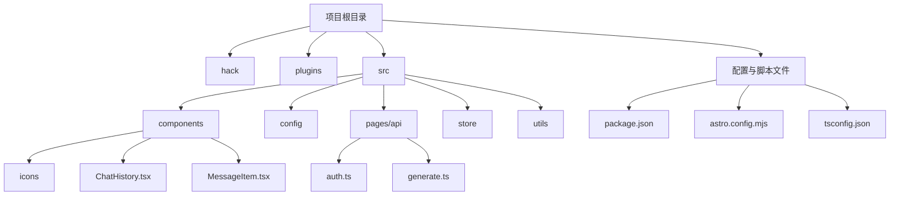
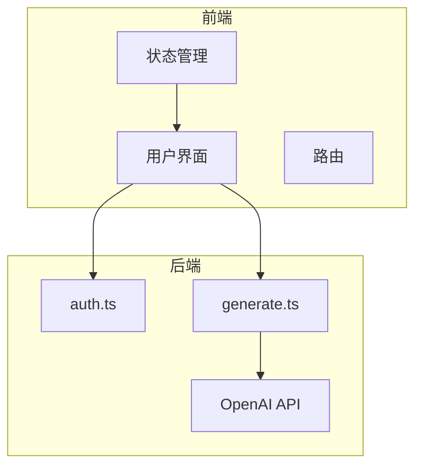
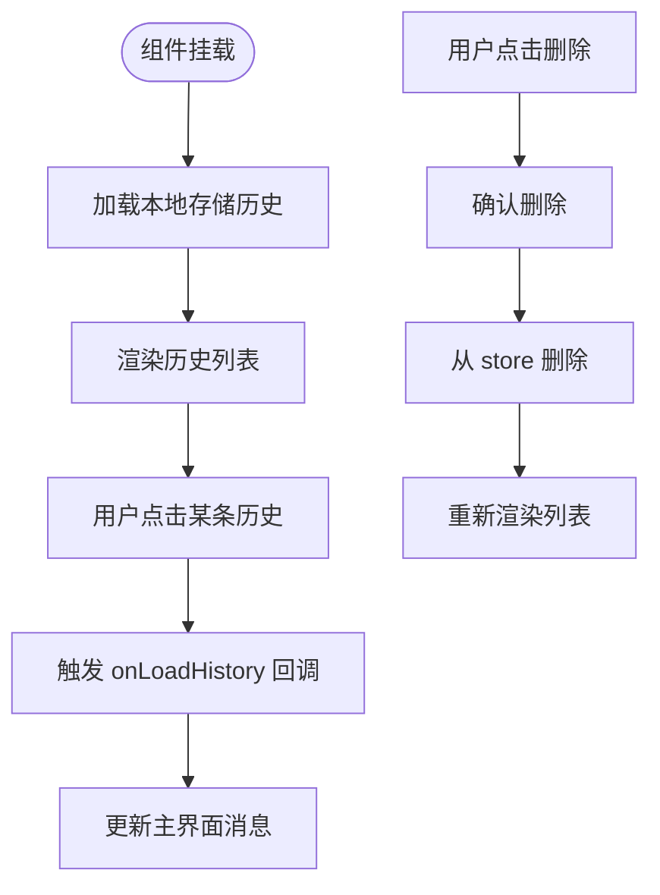
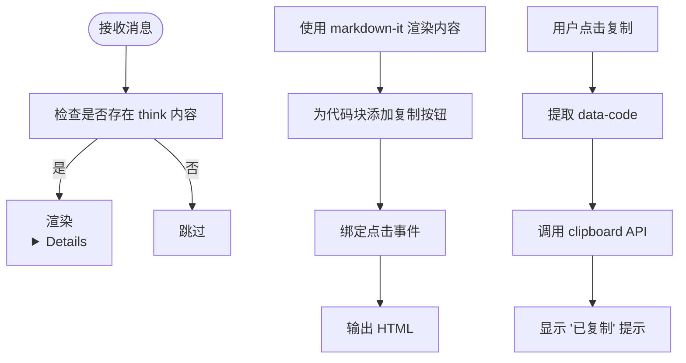
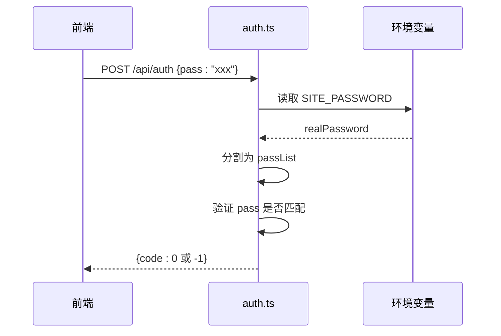
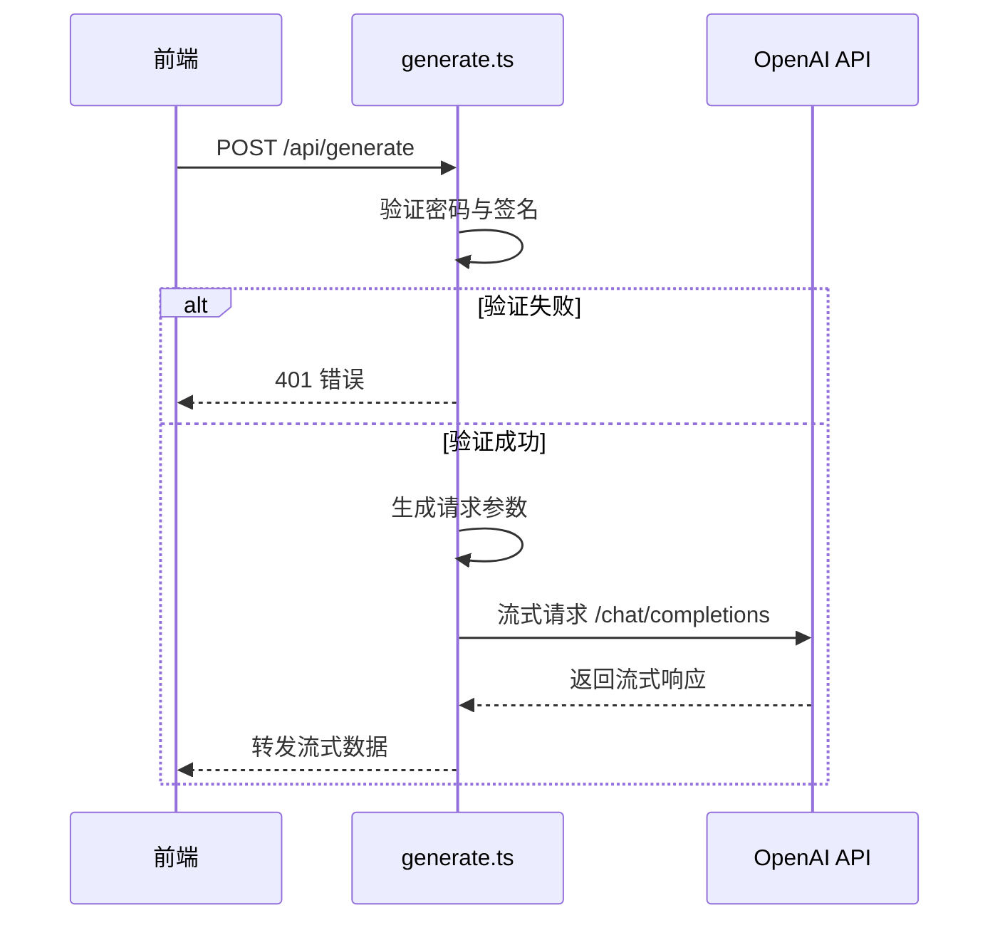
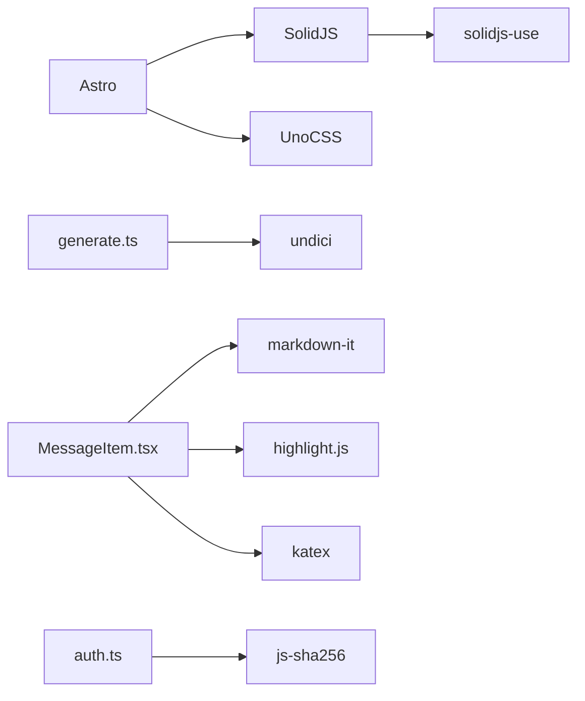

# 开发者指南

<cite>
**本文档引用的文件**  
- [README.md](file://README.md)
- [package.json](file://package.json)
- [astro.config.mjs](file://astro.config.mjs)
- [src/config/constants.ts](file://src/config/constants.ts)
- [src/pages/api/auth.ts](file://src/pages/api/auth.ts)
- [src/pages/api/generate.ts](file://src/pages/api/generate.ts)
- [src/components/ChatHistory.tsx](file://src/components/ChatHistory.tsx)
- [src/components/MessageItem.tsx](file://src/components/MessageItem.tsx)
- [src/utils/auth.ts](file://src/utils/auth.ts)
- [src/utils/openAI.ts](file://src/utils/openAI.ts)
- [tsconfig.json](file://tsconfig.json)
</cite>

## 目录
1. [简介](#简介)
2. [项目结构](#项目结构)
3. [核心组件](#核心组件)
4. [架构概览](#架构概览)
5. [详细组件分析](#详细组件分析)
6. [依赖分析](#依赖分析)
7. [性能考量](#性能考量)
8. [调试与故障排除](#调试与故障排除)
9. [代码规范与贡献流程](#代码规范与贡献流程)
10. [扩展与二次开发](#扩展与二次开发)

## 简介
本指南旨在为开发者提供完整的本地开发环境搭建、代码结构理解、调试技巧及社区贡献流程。项目 `chat-mini` 是一个基于 Astro 和 Solid.js 构建的轻量级 AI 聊天 Web 应用，支持多平台部署、模型动态切换、思维过程可视化等丰富功能。通过本指南，贡献者将能够快速上手并高效参与开发。

## 项目结构
项目采用功能模块化组织方式，主要分为前端组件、API 路由、状态管理、工具函数和配置文件。



**图示来源**  
- [README.md](file://README.md)
- [项目结构](file://.)

**本节来源**  
- [README.md](file://README.md#L1-L116)

## 核心组件
项目核心由前端 UI 组件、后端 API 接口、状态管理与工具函数构成。

- **前端组件**：使用 Solid.js 构建响应式 UI，如 `ChatHistory.tsx` 和 `MessageItem.tsx`。
- **API 路由**：位于 `src/pages/api/`，处理身份验证与消息生成。
- **状态管理**：通过 `historyStore.ts` 管理本地聊天历史。
- **工具函数**：`auth.ts` 和 `openAI.ts` 提供签名验证与 OpenAI 请求封装。

**本节来源**  
- [README.md](file://README.md#L1-L116)
- [src/components/ChatHistory.tsx](file://src/components/ChatHistory.tsx#L1-L115)
- [src/pages/api/generate.ts](file://src/pages/api/generate.ts#L1-L71)

## 架构概览
系统采用前后端分离架构，前端基于 Astro 框架集成 Solid.js，后端通过 Astro API 路由提供服务。



**图示来源**  
- [src/pages/api/auth.ts](file://src/pages/api/auth.ts#L1-L14)
- [src/pages/api/generate.ts](file://src/pages/api/generate.ts#L1-L71)
- [src/store/historyStore.ts](file://src/store/historyStore.ts)

**本节来源**  
- [README.md](file://README.md#L1-L116)

## 详细组件分析

### 前端组件分析

#### 聊天历史组件 (ChatHistory.tsx)
该组件负责展示和管理用户的历史对话记录。



**图示来源**  
- [src/components/ChatHistory.tsx](file://src/components/ChatHistory.tsx#L1-L115)

**本节来源**  
- [src/components/ChatHistory.tsx](file://src/components/ChatHistory.tsx#L1-L115)

#### 消息项组件 (MessageItem.tsx)
该组件渲染单条消息，支持 Markdown、LaTeX 和代码块复制。



**图示来源**  
- [src/components/MessageItem.tsx](file://src/components/MessageItem.tsx#L1-L119)

**本节来源**  
- [src/components/MessageItem.tsx](file://src/components/MessageItem.tsx#L1-L119)

### API 路由分析

#### 身份验证 API (auth.ts)
处理前端传入的密码，验证是否匹配环境变量 `SITE_PASSWORD`。



**图示来源**  
- [src/pages/api/auth.ts](file://src/pages/api/auth.ts#L1-L14)

**本节来源**  
- [src/pages/api/auth.ts](file://src/pages/api/auth.ts#L1-L14)

#### 消息生成 API (generate.ts)
核心接口，负责转发请求至 OpenAI 并流式返回响应。



**图示来源**  
- [src/pages/api/generate.ts](file://src/pages/api/generate.ts#L1-L71)

**本节来源**  
- [src/pages/api/generate.ts](file://src/pages/api/generate.ts#L1-L71)

## 依赖分析
项目依赖清晰，分为核心框架、UI 库、工具与开发依赖。



**图示来源**  
- [package.json](file://package.json#L1-L47)
- [src/components/MessageItem.tsx](file://src/components/MessageItem.tsx#L1-L119)
- [src/utils/auth.ts](file://src/utils/auth.ts#L1-L36)

**本节来源**  
- [package.json](file://package.json#L1-L47)

## 性能考量
- **前端渲染**：使用 Astro 的岛屿架构，仅激活交互组件，提升首屏性能。
- **消息流式传输**：通过 `parseOpenAIStream` 实现流式响应，降低延迟感知。
- **本地存储**：使用防抖保存 (`SAVE_DEBOUNCE_TIME: 500ms`)，减少频繁写入。
- **CDN 优化**：UnoCSS 按需生成样式，减少 CSS 体积。

## 调试与故障排除

### 调试 API 路由
1. 在 `generate.ts` 中添加 `console.log(body)` 查看请求参数。
2. 检查 `fetch` 请求的 `initOptions` 是否正确。
3. 使用 `pnpm dev` 启动本地服务，通过 `http://localhost:4321/api/generate` 测试。

### 调试前端组件
1. 使用浏览器开发者工具检查组件状态（Solid.js 支持 React DevTools 扩展）。
2. 在 `MessageItem.tsx` 中添加 `console.log(htmlString())` 验证 Markdown 渲染。
3. 检查 `onClick` 事件绑定是否正确。

### 常见问题
- **API 密钥错误**：确保 `.env` 文件中 `OPENAI_API_KEY` 正确。
- **跨域问题**：部署时确保 Vercel/Netlify 环境变量已配置。
- **签名失败**：检查 `PUBLIC_SECRET_KEY` 是否一致，时间戳是否超时。

**本节来源**  
- [src/pages/api/generate.ts](file://src/pages/api/generate.ts#L1-L71)
- [src/components/MessageItem.tsx](file://src/components/MessageItem.tsx#L1-L119)
- [src/utils/auth.ts](file://src/utils/auth.ts#L1-L36)

## 代码规范与贡献流程

### 代码风格规范
- **格式化工具**：项目隐含使用 Prettier 进行代码格式化（通过 `eslint` 配置）。
- **ESLint 规则**：通过 `@evan-yang/eslint-config` 统一代码风格。
- **TypeScript 配置**：继承 `astro/tsconfigs/base`，启用严格类型检查。

```json
// tsconfig.json
{
  "extends": "astro/tsconfigs/base",
  "compilerOptions": {
    "jsx": "preserve",
    "jsxImportSource": "solid-js",
    "paths": { "@/*": ["src/*"] }
  }
}
```

**本节来源**  
- [tsconfig.json](file://tsconfig.json#L1-L13)
- [package.json](file://package.json#L1-L47)

### 提交信息格式
建议采用 [Conventional Commits](https://www.conventionalcommits.org/) 规范：
```
feat: 新增模型支持
fix: 修复历史记录删除 bug
docs: 更新 README 部署说明
```

### Pull Request 审查流程
1. Fork 仓库并创建特性分支。
2. 提交 PR，描述变更内容与影响。
3. 维护者将审查代码风格、功能完整性与测试覆盖。
4. 合并前需通过 CI 检查。

## 扩展与二次开发

### 鼓励贡献的方向
- **新增模型支持**：修改 `AVAILABLE_MODELS` 数组即可。
- **UI 优化**：调整 UnoCSS 样式或组件结构。
- **新插件开发**：在 `plugins/` 目录下添加新插件。

### 扩展点说明

#### 修改可用模型列表
编辑 `src/config/constants.ts` 中的 `AVAILABLE_MODELS`：

```ts
export const AVAILABLE_MODELS = [
  { id: 'gpt-4o', name: 'OpenAI-4o' },
  { id: 'claude-3', name: 'Claude-3' }, // 新增
  { id: 'gemini-pro', name: 'Gemini Pro' }, // 新增
] as const
```

#### 添加新插件
在 `plugins/` 目录创建新文件，如 `addWatermark.ts`，并在 `astro.config.mjs` 中注册。

**本节来源**  
- [src/config/constants.ts](file://src/config/constants.ts#L1-L38)
- [astro.config.mjs](file://astro.config.mjs#L1-L70)