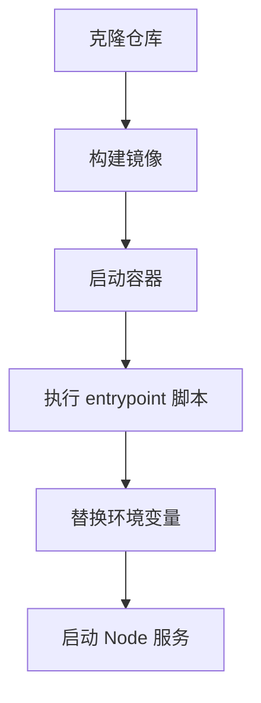
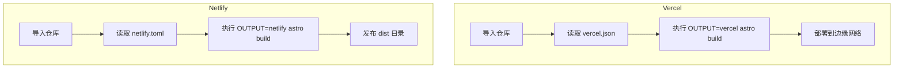

# 快速开始指南

<cite>
**本文档中引用的文件**  
- [README.md](file://README.md)
- [Dockerfile](file://Dockerfile)
- [docker-compose.yml](file://docker-compose.yml)
- [docker-compose.dev.yml](file://docker-compose.dev.yml)
- [vercel.json](file://vercel.json)
- [netlify.toml](file://netlify.toml)
- [src/config/constants.ts](file://src/config/constants.ts)
- [src/pages/api/auth.ts](file://src/pages/api/auth.ts)
- [src/pages/api/generate.ts](file://src/pages/api/generate.ts)
- [src/utils/auth.ts](file://src/utils/auth.ts)
- [hack/docker-env-replace.sh](file://hack/docker-env-replace.sh)
- [hack/docker-entrypoint.sh](file://hack/docker-entrypoint.sh)
- [.env.example](file://.env.example)
</cite>

## 目录
1. [简介](#简介)
2. [项目结构](#项目结构)
3. [本地部署步骤](#本地部署步骤)
4. [Docker 部署](#docker-部署)
5. [平台自动部署](#平台自动部署)
6. [环境变量配置](#环境变量配置)
7. [常见问题排查](#常见问题排查)
8. [附录](#附录)

## 简介

`chat-mini` 是一款基于 Astro 和 Solid.js 构建的轻量级 AI 聊天 Web 应用，支持多种部署方式，包括本地运行、Docker 容器化部署以及 Vercel 和 Netlify 平台的一键部署。本指南将帮助新手用户在 5 分钟内完成本地部署和基本配置。

## 项目结构

以下是 `chat-mini` 项目的主要目录结构：

```
.
├── hack                     # Docker 相关脚本
│   ├── docker-entrypoint.sh # Docker 容器启动脚本
│   └── docker-env-replace.sh # 构建后环境变量注入脚本
├── plugins                  # Astro 插件
├── src                      # 源代码目录
│   ├── components           # UI 组件
│   ├── config               # 配置文件
│   ├── pages/api            # API 路由
│   ├── store                # 状态管理
│   ├── utils                # 工具函数
│   └── ...                  # 其他资源
├── .env.example             # 环境变量示例文件
├── Dockerfile               # Docker 构建文件
├── docker-compose.yml       # 生产环境 Docker Compose 配置
├── docker-compose.dev.yml   # 开发环境 Docker Compose 配置
├── vercel.json              # Vercel 部署配置
├── netlify.toml             # Netlify 部署配置
└── package.json             # 项目依赖和脚本定义
```

**Section sources**
- [README.md](file://README.md)

## 本地部署步骤

### 1. 克隆仓库

首先，克隆项目仓库到本地：

```bash
git clone https://github.com/your-username/chat-mini.git
cd chat-mini
```

### 2. 安装依赖

使用 `pnpm` 安装项目依赖：

```bash
pnpm install
```

### 3. 配置环境变量

复制 `.env.example` 文件为 `.env`，并填入必要的环境变量，至少需要设置 `OPENAI_API_KEY`：

```bash
cp .env.example .env
```

编辑 `.env` 文件，例如：

```env
OPENAI_API_KEY=your_openai_api_key_here
SITE_PASSWORD=your_password
PUBLIC_SECRET_KEY=a_complex_random_string
```

### 4. 启动开发服务器

运行以下命令启动开发服务器：

```bash
pnpm dev
```

在浏览器中打开 `http://localhost:4321` 即可访问应用。

### 5. 构建生产版本

构建用于生产的静态文件：

```bash
pnpm build
```

预览构建结果：

```bash
pnpm preview
```

**Section sources**
- [README.md](file://README.md#L45-L75)

## Docker 部署

### 使用 Docker Compose 快速启动

项目提供了 `docker-compose.yml` 文件，可一键启动服务：

```bash
# 构建并以后台模式启动服务
docker-compose up -d --build

# 停止并移除容器
docker-compose down
```

服务将在 `http://localhost:3000` 上运行。

### 开发环境热重载

使用 `docker-compose.dev.yml` 可在开发环境中实现代码热重载：

```bash
docker-compose -f docker-compose.dev.yml up --build
```

该配置将源码目录挂载到容器中，支持实时修改和刷新。

### Docker 构建流程分析

`Dockerfile` 采用多阶段构建策略：

```dockerfile
FROM node:21-alpine as builder
WORKDIR /usr/src
RUN npm install -g pnpm@7
COPY . .
RUN pnpm install
RUN pnpm run build

FROM node:21-alpine
WORKDIR /usr/src
RUN npm install -g pnpm@7
COPY --from=builder /usr/src/dist ./dist
COPY --from=builder /usr/src/hack ./
COPY package.json pnpm-lock.yaml .npmrc ./
RUN pnpm install
ENV HOST=0.0.0.0 PORT=3000 NODE_ENV=production
EXPOSE $PORT
CMD ["/bin/sh", "docker-entrypoint.sh"]
```

构建完成后，通过 `hack/docker-entrypoint.sh` 启动服务，并在启动前执行 `docker-env-replace.sh` 将环境变量注入到构建后的 JS 文件中。



**Diagram sources**
- [Dockerfile](file://Dockerfile#L1-L17)
- [hack/docker-entrypoint.sh](file://hack/docker-entrypoint.sh#L1-L29)
- [hack/docker-env-replace.sh](file://hack/docker-env-replace.sh#L1-L28)

**Section sources**
- [Dockerfile](file://Dockerfile)
- [docker-compose.yml](file://docker-compose.yml)
- [docker-compose.dev.yml](file://docker-compose.dev.yml)
- [hack/docker-entrypoint.sh](file://hack/docker-entrypoint.sh)
- [hack/docker-env-replace.sh](file://hack/docker-env-replace.sh)

## 平台自动部署

### Vercel 部署机制

`vercel.json` 文件定义了构建命令：

```json
{
  "buildCommand": "OUTPUT=vercel astro build"
}
```

当项目导入 Vercel 时，平台会自动识别该配置，执行 `astro build` 命令并部署到边缘网络。

### Netlify 部署机制

`netlify.toml` 文件配置了 Netlify 的构建环境和命令：

```toml
[build.environment]
  NETLIFY_USE_PNPM = "true"
  NODE_VERSION = "18"

[build]
  command = "OUTPUT=netlify astro build"
  publish = "dist"
```

Netlify 将使用 pnpm 和 Node.js 18 构建项目，并将 `dist` 目录作为发布目录。



**Diagram sources**
- [vercel.json](file://vercel.json)
- [netlify.toml](file://netlify.toml)

**Section sources**
- [vercel.json](file://vercel.json)
- [netlify.toml](file://netlify.toml)

## 环境变量配置

### 环境变量（`.env`）

| 变量名 | 说明 |
| :--- | :--- |
| `OPENAI_API_KEY` | **必需**，你的 OpenAI API 密钥。 |
| `OPENAI_API_MODEL` | 默认使用的模型 ID。 |
| `SITE_PASSWORD` | 网站访问密码，多个密码用英文逗号 `,` 分隔。留空则公开访问。 |
| `PUBLIC_SECRET_KEY` | 用于 API 调用的签名密钥，请设置为一个复杂的随机字符串。 |
| `HTTPS_PROXY` | OpenAI API 的代理地址，例如 `http://127.0.0.1:7890`。 |
| `OPENAI_API_BASE_URL` | OpenAI API 的基础 URL，用于代理或私有化部署。 |
| `HEAD_SCRIPTS` | 在页面 `</head>` 标签前注入的分析或其他脚本。 |

### 应用内常量（`src/config/constants.ts`）

```ts
export const CONFIG = {
  MAX_HISTORY_MESSAGES: 9,
  MAX_HISTORY_COUNT: 25,
  DEFAULT_TEMPERATURE: 0.6,
  DEFAULT_MODEL: 'gpt-4.1',
} as const
```

**Section sources**
- [README.md](file://README.md#L77-L110)
- [src/config/constants.ts](file://src/config/constants.ts)

## 常见问题排查

### 环境变量未生效

**问题**：在 Docker 部署中，`.env` 文件中的变量未被正确注入。

**解决方案**：确保 `docker-compose.yml` 中正确映射了环境变量，并检查 `hack/docker-env-replace.sh` 脚本是否在启动时执行。该脚本会将环境变量替换到 `dist` 目录下的 `.mjs` 文件中。

### API 密钥错误

**问题**：提示“Invalid API Key”或“Authentication failed”。

**解决方案**：
1. 检查 `.env` 文件中的 `OPENAI_API_KEY` 是否正确。
2. 确保没有多余的空格或换行符。
3. 在 `src/pages/api/generate.ts` 中，API 请求头使用 `Bearer ${apiKey}`，确保密钥格式正确。

```ts
headers: {
  'Authorization': `Bearer ${apiKey}`,
}
```

### Docker 构建失败

**问题**：`pnpm install` 或 `pnpm build` 失败。

**解决方案**：
1. 确保本地已安装 `pnpm` 或使用镜像内安装的版本。
2. 检查网络连接，必要时设置 `HTTPS_PROXY`。
3. 查看构建日志，确认依赖下载是否超时。

### 访问密码无效

**问题**：输入密码后仍无法访问。

**分析**：认证逻辑位于 `src/pages/api/auth.ts`：

```ts
const realPassword = import.meta.env.SITE_PASSWORD || ''
const passList = realPassword.split(',') || []

export const post: APIRoute = async(context) => {
  const body = await context.request.json()
  const { pass } = body
  return new Response(JSON.stringify({
    code: (!realPassword || pass === realPassword || passList.includes(pass)) ? 0 : -1,
  }))
}
```

**解决方案**：确保 `SITE_PASSWORD` 在 `.env` 中正确设置，且前端传递的密码与之匹配。

### 签名验证失败

**问题**：生产环境下提示“Invalid signature”。

**分析**：系统使用 `PUBLIC_SECRET_KEY` 对时间戳和消息内容生成 SHA-256 签名，防止重放攻击。

```ts
export const verifySignature = async(payload: AuthPayload, sign: string) => {
  if (Math.abs(payload.t - Date.now()) > CONFIG.AUTH_TIMEOUT) {
    return false
  }
  const payloadSign = await generateSignature(payload)
  return payloadSign === sign
}
```

**解决方案**：确保 `PUBLIC_SECRET_KEY` 已设置，且客户端与服务器时间同步。

**Section sources**
- [src/pages/api/auth.ts](file://src/pages/api/auth.ts)
- [src/pages/api/generate.ts](file://src/pages/api/generate.ts)
- [src/utils/auth.ts](file://src/utils/auth.ts)
- [hack/docker-env-replace.sh](file://hack/docker-env-replace.sh)

## 附录

### 可用脚本

- `pnpm dev`: 启动开发服务器。
- `pnpm build`: 为 Node.js 环境构建生产版本。
- `pnpm build:vercel`: 为 Vercel 平台构建。
- `pnpm build:netlify`: 为 Netlify 平台构建。
- `pnpm preview`: 在本地预览构建后的产物。
- `pnpm lint`: 检查代码风格。
- `pnpm lint:fix`: 自动修复代码风格问题。

### 错误消息映射

```ts
export const ERROR_MESSAGES = {
  NETWORK_ERROR: '网络连接失败，请检查网络后重试',
  AUTH_FAILED: '身份验证失败，请重新登录',
  SAVE_FAILED: '保存失败，请稍后重试',
  LOAD_FAILED: '加载失败，请刷新页面重试',
} as const
```

**Section sources**
- [README.md](file://README.md#L112-L128)
- [src/config/constants.ts](file://src/config/constants.ts#L29-L37)