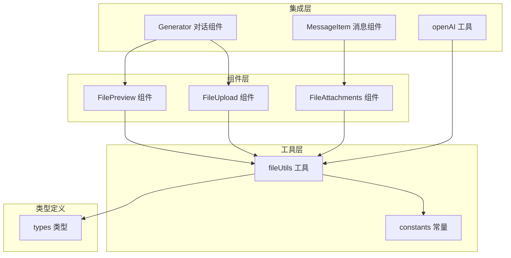
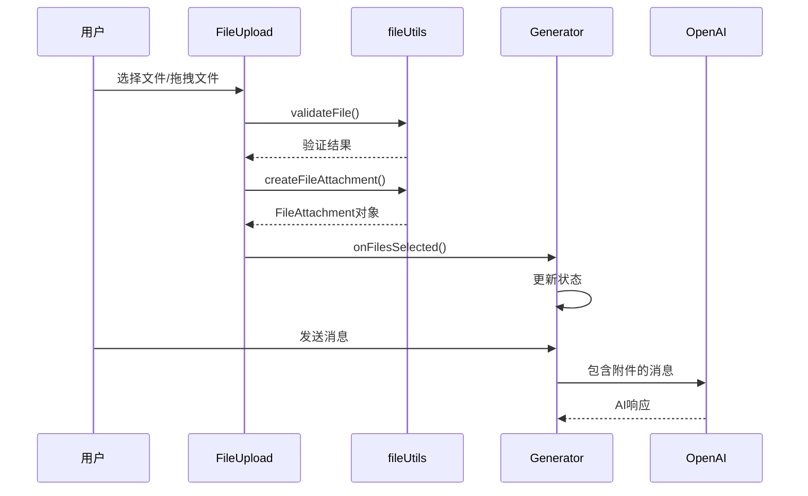
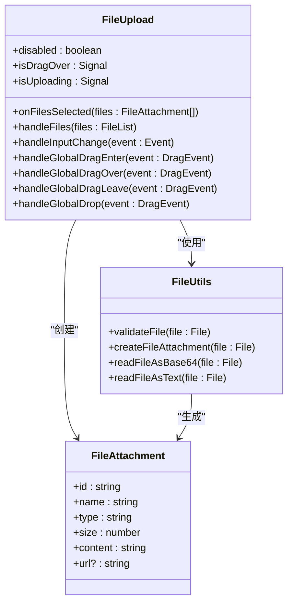
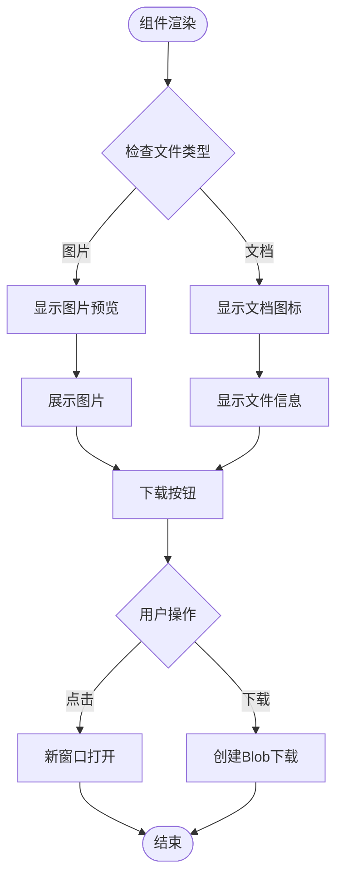
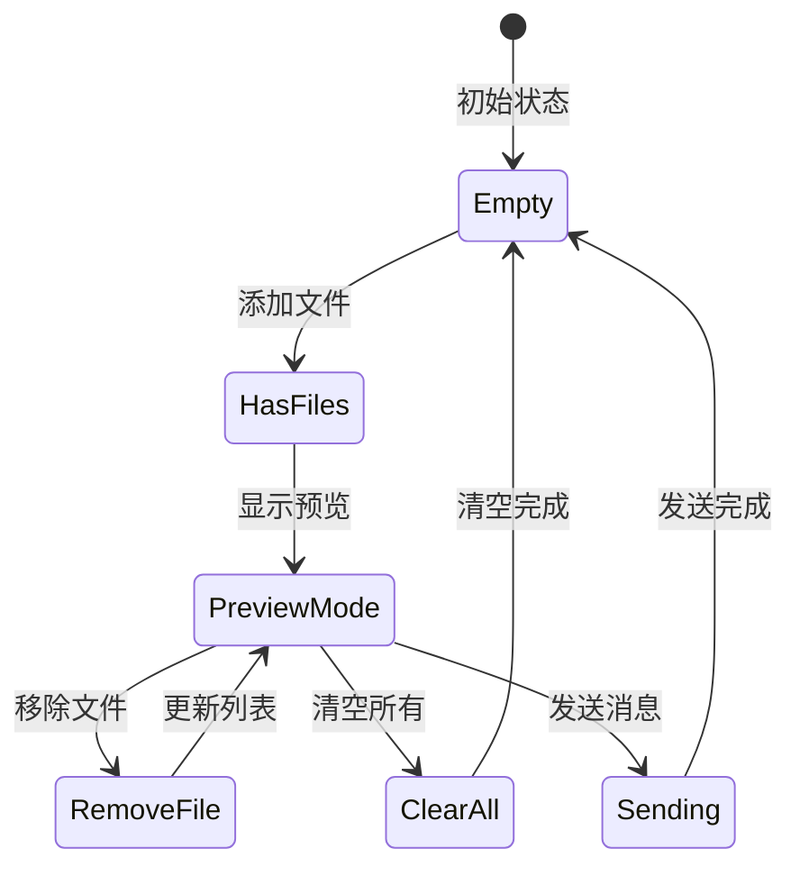
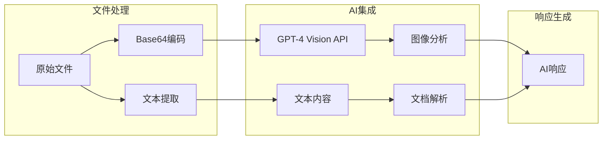

# 文件上传功能

<cite>
**本文档引用的文件**
- [FileUpload.tsx](file://src/components/FileUpload.tsx)
- [FileAttachments.tsx](file://src/components/FileAttachments.tsx)
- [FilePreview.tsx](file://src/components/FilePreview.tsx)
- [fileUtils.ts](file://src/utils/fileUtils.ts)
- [constants.ts](file://src/config/constants.ts)
- [types.ts](file://src/types.ts)
- [Generator.tsx](file://src/components/Generator.tsx)
- [MessageItem.tsx](file://src/components/MessageItem.tsx)
- [openAI.ts](file://src/utils/openAI.ts)
</cite>

## 目录
1. [简介](#简介)
2. [项目结构](#项目结构)
3. [核心组件](#核心组件)
4. [架构概览](#架构概览)
5. [详细组件分析](#详细组件分析)
6. [文件类型支持](#文件类型支持)
7. [用户交互方式](#用户交互方式)
8. [与AI对话集成](#与ai对话集成)
9. [配置方法](#配置方法)
10. [使用示例](#使用示例)
11. [故障排除指南](#故障排除指南)
12. [结论](#结论)

## 简介

文件上传功能是Chat Mini应用的核心特性之一，它允许用户通过点击或拖拽的方式上传各种类型的文件，并在AI对话中利用这些文件内容进行智能分析和处理。该功能支持多种文件格式，包括图片、PDF文档、文本文件和代码文件，为用户提供了一个直观且高效的文件管理体验。

## 项目结构

文件上传功能的实现分布在多个模块中，形成了一个清晰的分层架构：



**图表来源**
- [FileUpload.tsx](file://src/components/FileUpload.tsx#L1-L136)
- [fileUtils.ts](file://src/utils/fileUtils.ts#L1-L155)
- [constants.ts](file://src/config/constants.ts#L1-L85)

## 核心组件

文件上传功能由四个核心组件构成，每个组件都有明确的职责分工：

### FileUpload 组件
负责文件选择和拖拽上传功能，提供用户友好的界面交互。

### FileAttachments 组件
展示已上传文件的预览和管理界面，支持文件下载和删除操作。

### FilePreview 组件
显示待上传文件的预览列表，允许用户在发送前预览和管理文件。

### fileUtils 工具集
提供文件处理的核心逻辑，包括验证、转换和管理功能。

**章节来源**
- [FileUpload.tsx](file://src/components/FileUpload.tsx#L1-L136)
- [FileAttachments.tsx](file://src/components/FileAttachments.tsx#L1-L78)
- [FilePreview.tsx](file://src/components/FilePreview.tsx#L1-L48)
- [fileUtils.ts](file://src/utils/fileUtils.ts#L1-L155)

## 架构概览

文件上传功能采用事件驱动的架构模式，通过Solid.js的状态管理系统实现响应式更新：



**图表来源**
- [FileUpload.tsx](file://src/components/FileUpload.tsx#L41-L81)
- [fileUtils.ts](file://src/utils/fileUtils.ts#L34-L88)
- [Generator.tsx](file://src/components/Generator.tsx#L75-L118)

## 详细组件分析

### FileUpload 组件分析

FileUpload 组件是文件上传功能的主要入口点，实现了完整的文件选择和拖拽上传流程：



**图表来源**
- [FileUpload.tsx](file://src/components/FileUpload.tsx#L1-L136)
- [fileUtils.ts](file://src/utils/fileUtils.ts#L1-L155)
- [types.ts](file://src/types.ts#L1-L10)

#### 关键特性：
- **多文件支持**：支持同时选择多个文件
- **拖拽功能**：完整的拖拽上传体验
- **实时验证**：文件类型和大小实时验证
- **错误处理**：详细的错误提示和处理机制

**章节来源**
- [FileUpload.tsx](file://src/components/FileUpload.tsx#L1-L136)

### FileAttachments 组件分析

FileAttachments 组件负责展示已上传文件的预览和管理界面：



**图表来源**
- [FileAttachments.tsx](file://src/components/FileAttachments.tsx#L10-L78)

#### 功能特点：
- **智能预览**：根据文件类型显示不同的预览方式
- **文件管理**：支持文件下载和删除操作
- **响应式布局**：适应不同屏幕尺寸的网格布局

**章节来源**
- [FileAttachments.tsx](file://src/components/FileAttachments.tsx#L1-L78)

### FilePreview 组件分析

FilePreview 组件提供待上传文件的预览和管理界面：



**图表来源**
- [FilePreview.tsx](file://src/components/FilePreview.tsx#L10-L48)

**章节来源**
- [FilePreview.tsx](file://src/components/FilePreview.tsx#L1-L48)

## 文件类型支持

系统支持广泛的文件类型，分为两大类：

### 图片文件类型
- JPEG (.jpg, .jpeg)
- PNG (.png)
- GIF (.gif)
- WebP (.webp)

### 文档文件类型
- PDF (.pdf)
- 纯文本 (.txt)
- Markdown (.md, .markdown)
- Word文档 (.doc, .docx)
- JavaScript (.js, .jsx, .ts, .tsx)
- HTML (.html, .htm)
- CSS (.css, .scss, .sass, .less)
- PHP (.php)
- Go (.go)
- Python (.py, .python)
- Java (.java)
- C/C++ (.c, .cpp, .cc, .cxx)
- C# (.cs)
- JSON (.json)
- XML (.xml)
- YAML (.yaml, .yml)
- 日志文件 (.log)

**章节来源**
- [constants.ts](file://src/config/constants.ts#L20-L50)

## 用户交互方式

### 点击上传
用户可以通过点击按钮触发文件选择对话框，支持多文件选择：

```typescript
<input
  type="file"
  multiple
  accept={ACCEPTED_TYPES}
  onChange={handleInputChange}
/>
```

### 拖拽上传
系统提供完整的拖拽上传体验：

- **全局拖拽监听**：监听整个文档的拖拽事件
- **视觉反馈**：拖拽悬停时显示覆盖层
- **智能识别**：只接受包含文件的数据传输
- **安全处理**：防止默认行为和事件冒泡

**章节来源**
- [FileUpload.tsx](file://src/components/FileUpload.tsx#L41-L81)

## 与AI对话集成

文件上传功能与AI对话系统深度集成，支持以下场景：

### 内容传递
文件内容被转换为适当格式后传递给AI模型：



**图表来源**
- [openAI.ts](file://src/utils/openAI.ts#L1-L44)

### 支持的AI模型
- GPT-4.1
- GPT-5
- GPT-4o
- OpenAI-o3
- DeepSeek-V3
- DeepSeek-R1
- Grok-3

**章节来源**
- [openAI.ts](file://src/utils/openAI.ts#L1-L44)
- [constants.ts](file://src/config/constants.ts#L52-L62)

## 配置方法

### 文件大小限制
系统提供了灵活的文件大小限制配置：

```typescript
// 最大文件大小：50MB
MAX_FILE_SIZE: 50 * 1024 * 1024,

// 最大图片大小：10MB  
MAX_IMAGE_SIZE: 10 * 1024 * 1024,
```

### 允许的文件类型
通过常量配置定义支持的文件类型：

```typescript
ALLOWED_IMAGE_TYPES: [
  'image/jpeg',
  'image/png', 
  'image/gif',
  'image/webp'
],

ALLOWED_DOCUMENT_TYPES: [
  // 各种文档类型...
],
```

**章节来源**
- [constants.ts](file://src/config/constants.ts#L15-L50)

## 使用示例

### 基本使用
```typescript
<FileUpload 
  onFilesSelected={(files) => {
    console.log('上传的文件:', files);
  }}
/>
```

### 在对话组件中使用
```typescript
<Generator />
```

### 自定义配置
```typescript
<FileUpload 
  onFilesSelected={handleFiles}
  disabled={false}
/>
```

## 故障排除指南

### 常见问题及解决方案

#### 文件上传失败
**症状**：文件无法上传或上传过程中出错
**原因**：文件类型不支持或文件大小超限
**解决方案**：
1. 检查文件类型是否在支持列表中
2. 确认文件大小不超过限制
3. 尝试压缩图片或分割大文件

#### 拖拽功能失效
**症状**：拖拽文件时无反应
**原因**：浏览器兼容性或事件监听器冲突
**解决方案**：
1. 确保浏览器支持File API
2. 检查是否有其他元素阻止事件传播
3. 刷新页面重新初始化

#### 图片预览问题
**症状**：图片无法正确预览
**原因**：Base64编码错误或内存泄漏
**解决方案**：
1. 检查文件读取是否成功
2. 确保及时清理Blob URL
3. 验证图片格式有效性

**章节来源**
- [fileUtils.ts](file://src/utils/fileUtils.ts#L34-L88)
- [FileUpload.tsx](file://src/components/FileUpload.tsx#L41-L81)

## 结论

文件上传功能是Chat Mini应用的重要组成部分，它通过精心设计的架构和组件实现了完整的文件管理体验。该功能不仅支持多种文件类型，还提供了直观的用户交互方式，并与AI对话系统无缝集成。

### 主要优势
- **用户体验优秀**：支持点击和拖拽两种上传方式
- **类型丰富**：涵盖主流的文件格式
- **性能优化**：合理的大小限制和内存管理
- **集成度高**：与AI对话系统深度整合

### 技术特色
- **响应式设计**：基于Solid.js的状态管理
- **事件驱动**：完整的拖拽事件处理
- **错误处理**：完善的验证和错误提示机制
- **可扩展性**：模块化设计便于功能扩展

通过这个综合性的文件上传功能，用户可以轻松地将各种类型的文件融入到AI对话中，极大地提升了应用的功能性和实用性。