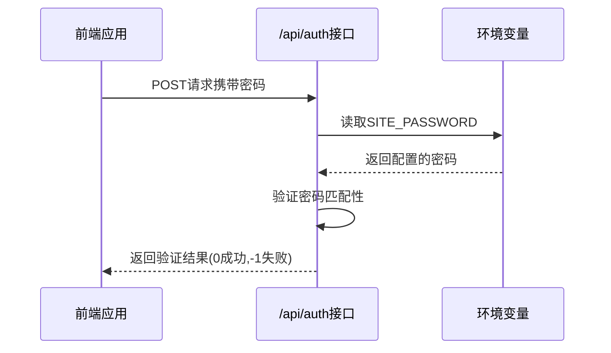
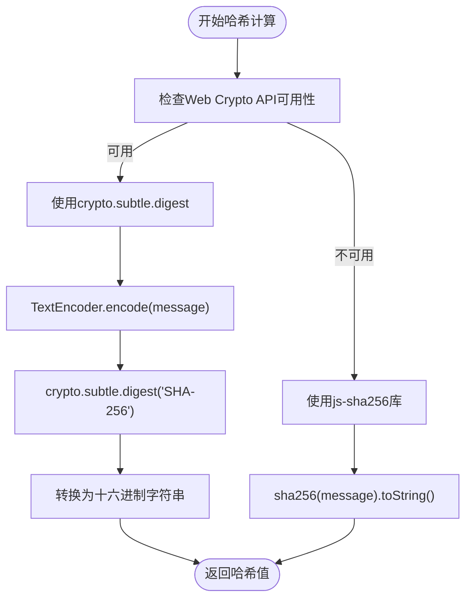
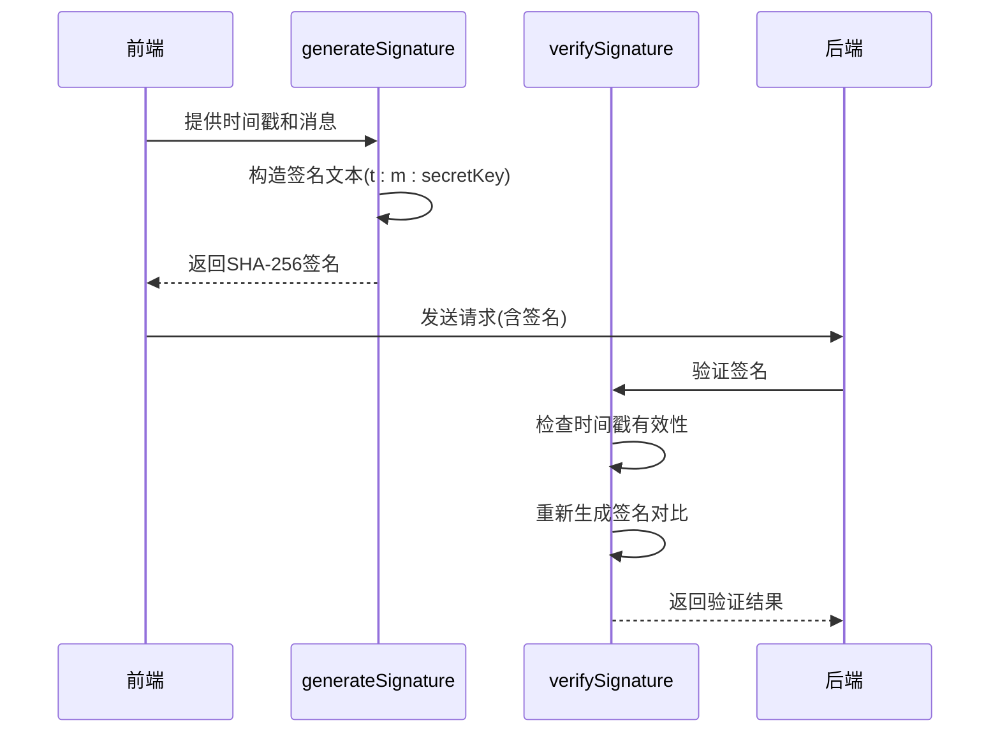
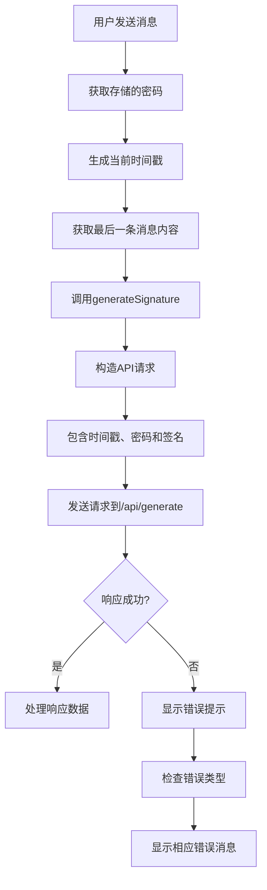

# 安全验证机制

<cite>
**本文档引用的文件**   
- [auth.ts](file://src/pages/api/auth.ts)
- [auth.ts](file://src/utils/auth.ts)
- [Generator.tsx](file://src/components/Generator.tsx)
- [constants.ts](file://src/config/constants.ts)
- [ErrorMessageItem.tsx](file://src/components/ErrorMessageItem.tsx)
- [env.d.ts](file://src/env.d.ts)
</cite>

## 目录
1. [安全验证机制概述](#安全验证机制概述)
2. [/api/auth接口认证逻辑分析](#api/auth接口认证逻辑分析)
3. [加密工具函数实现与安全考量](#加密工具函数实现与安全考量)
4. [前端认证流程集成](#前端认证流程集成)
5. [支持的认证模式与配置示例](#支持的认证模式与配置示例)
6. [安全头设置与防护策略](#安全头设置与防护策略)
7. [典型安全漏洞防范](#典型安全漏洞防范)

## 安全验证机制概述
本系统实现了多层次的安全验证机制，包括基于密码的访问控制、基于时间戳的签名验证和会话保护。系统通过环境变量配置敏感信息，使用SHA-256哈希算法进行数据完整性验证，并实现了防重放攻击的时间窗口控制。前端与后端协同工作，确保API调用的安全性。

## /api/auth接口认证逻辑分析
系统通过`/api/auth`接口实现基本的密码验证功能，该接口验证客户端提供的密码是否与环境变量中配置的密码匹配。



**接口认证流程：**
1. 从`import.meta.env.SITE_PASSWORD`环境变量读取配置的密码
2. 将密码字符串按逗号分割为密码列表
3. 接收客户端POST请求中的密码参数
4. 验证密码是否为空（空密码表示公开访问）
5. 验证密码是否与主密码匹配或存在于密码列表中
6. 返回相应的状态码

**认证逻辑代码实现：**
```typescript
const realPassword = import.meta.env.SITE_PASSWORD || ''
const passList = realPassword.split(',') || []

export const post: APIRoute = async(context) => {
  const body = await context.request.json()
  const { pass } = body
  return new Response(JSON.stringify({
    code: (!realPassword || pass === realPassword || passList.includes(pass)) ? 0 : -1,
  }))
}
```

**Section sources**
- [auth.ts](file://src/pages/api/auth.ts#L1-L13)

## 加密工具函数实现与安全考量
`src/utils/auth.ts`文件提供了核心的加密工具函数，包括签名生成和验证功能，使用SHA-256算法确保数据完整性。

### SHA-256哈希计算实现
系统实现了双重的SHA-256哈希计算机制，优先使用浏览器内置的Web Crypto API，降级使用js-sha256库。



**安全考量：**
- 优先使用浏览器内置的Web Crypto API，提供更强的安全保证
- 降级方案使用js-sha256库确保兼容性
- 哈希结果转换为标准的十六进制字符串格式

### 签名生成与验证机制
系统实现了基于时间戳和消息内容的签名机制，防止请求被篡改和重放攻击。



**签名生成逻辑：**
```typescript
export const generateSignature = async(payload: AuthPayload) => {
  const { t: timestamp, m: lastMessage } = payload
  const secretKey = import.meta.env.PUBLIC_SECRET_KEY as string || ''
  const signText = `${timestamp}:${lastMessage}:${secretKey}`
  return await digestMessage(signText)
}
```

**签名验证逻辑：**
```typescript
export const verifySignature = async(payload: AuthPayload, sign: string) => {
  // 验证时间戳，防止重放攻击
  if (Math.abs(payload.t - Date.now()) > CONFIG.AUTH_TIMEOUT) {
    return false
  }
  const payloadSign = await generateSignature(payload)
  return payloadSign === sign
}
```

**安全特性：**
- 使用`PUBLIC_SECRET_KEY`作为签名密钥，增加破解难度
- 包含时间戳防止重放攻击
- 验证时间窗口由`AUTH_TIMEOUT`常量控制（默认5分钟）

**Section sources**
- [auth.ts](file://src/utils/auth.ts#L8-L34)

## 前端认证流程集成
`Generator.tsx`组件实现了完整的认证流程集成，包括密码管理、签名生成和错误处理。

### 认证流程实现
前端在每次API调用时自动处理认证相关逻辑：



**关键代码实现：**
```typescript
const requestWithLatestMessage = async() => {
  const storagePassword = localStorage.getItem('pass')
  const timestamp = Date.now()
  const response = await fetch('/api/generate', {
    method: 'POST',
    body: JSON.stringify({
      messages: requestMessageList,
      time: timestamp,
      pass: storagePassword,
      sign: await generateSignature({
        t: timestamp,
        m: requestMessageList?.[requestMessageList.length - 1]?.content || '',
      }),
      temperature: temperature(),
      model: chatModel(),
    }),
    signal: controller.signal,
  })
}
```

### 访问控制与错误提示
系统实现了友好的错误处理机制，将技术性错误转换为用户可理解的提示。

```mermaid
flowchart TD
A[接收错误响应] --> B[解析错误信息]
B --> C{错误类型判断}
C --> |网络相关| D[显示"网络连接失败"]
C --> |认证相关| E[显示"身份验证失败"]
C --> |API相关| F[显示"服务暂时不可用"]
C --> |其他| G[显示"发生未知错误"]
D --> H[提供重试按钮]
E --> H
F --> H
G --> H
```

**错误处理实现：**
```typescript
const getFriendlyErrorMessage = (error: ErrorMessage): string => {
  const { code, message } = error
  
  // 网络相关错误
  if (code?.includes('fetch') || message?.includes('fetch') || message?.includes('network')) {
    return ERROR_MESSAGES.NETWORK_ERROR
  }
  
  // 认证相关错误
  if (code?.includes('auth') || message?.includes('auth') || message?.includes('401')) {
    return ERROR_MESSAGES.AUTH_FAILED
  }
  
  // API相关错误
  if (code?.includes('api') || message?.includes('api')) {
    return '服务暂时不可用，请稍后重试'
  }
  
  // 默认返回原始消息，但去掉技术细节
  return message || '发生未知错误，请重试'
}
```

**Section sources**
- [Generator.tsx](file://src/components/Generator.tsx#L1-L391)
- [ErrorMessageItem.tsx](file://src/components/ErrorMessageItem.tsx#L1-L60)

## 支持的认证模式与配置示例
系统支持多种认证模式，通过环境变量进行灵活配置。

### 认证模式
**1. 密码保护模式**
- 通过`SITE_PASSWORD`环境变量设置访问密码
- 支持单个密码或多个密码（用逗号分隔）
- 密码存储在`localStorage`中，实现会话保持

**2. Token签名验证模式**
- 基于时间戳和消息内容的SHA-256签名
- 使用`PUBLIC_SECRET_KEY`作为签名密钥
- 防止请求篡改和重放攻击

### 配置示例
**环境变量配置(.env文件):**
```env
# OpenAI API密钥（必需）
OPENAI_API_KEY=your_openai_api_key_here

# 网站访问密码，多个密码用英文逗号分隔，留空则公开访问
SITE_PASSWORD=mysecretpassword,anotherpassword

# 用于API调用的签名密钥，设置为复杂的随机字符串
PUBLIC_SECRET_KEY=a_very_complex_and_random_string_for_signature

# OpenAI API模型
OPENAI_API_MODEL=gpt-4o

# HTTPS代理（可选）
HTTPS_PROXY=http://127.0.0.1:7890
```

**应用内常量配置(constants.ts):**
```typescript
export const CONFIG = {
  // 时间相关
  AUTH_TIMEOUT: 1000 * 60 * 5, // 5分钟，防重放攻击时间窗口
  SAVE_DEBOUNCE_TIME: 500, // 保存防抖时间
  
  // 对话相关
  MAX_HISTORY_MESSAGES: 9, // 传给OpenAI API的最大上下文条数
  MAX_HISTORY_COUNT: 25,  // 保留的历史会话数量
  
  // UI相关
  SCROLL_THRESHOLD: 25, // 滚动阈值
  SMOOTH_SCROLL_DELAY: 300, // 平滑滚动延迟
  
  // 模型和温度默认值
  DEFAULT_TEMPERATURE: 0.6, // 默认温度
  DEFAULT_MODEL: 'gpt-4.1', // 默认模型
} as const
```

**Section sources**
- [env.d.ts](file://src/env.d.ts#L1-L14)
- [constants.ts](file://src/config/constants.ts#L1-L37)

## 安全头设置与防护策略
系统实现了多项安全防护策略，确保应用的整体安全性。

### 安全头设置
虽然在代码中未直接设置HTTP安全头，但通过以下方式确保安全：
- 使用HTTPS协议传输敏感数据
- 敏感信息通过环境变量注入，避免硬编码
- 前端构建时通过`docker-env-replace.sh`脚本替换环境变量

### 防暴力破解策略
系统通过以下机制防止暴力破解攻击：
- **密码复杂度要求**：建议使用复杂密码并通过`PUBLIC_SECRET_KEY`增加签名密钥复杂度
- **无显式限流**：当前实现未包含请求频率限制，依赖部署环境的防护机制
- **会话保护**：密码存储在`localStorage`而非`sessionStorage`，平衡安全与用户体验

### 敏感信息保护措施
**1. 环境变量管理**
- 敏感信息（API密钥、密码等）通过环境变量配置
- `.env`文件不应提交到版本控制系统
- 使用`.env.example`提供配置模板

**2. 前端安全**
- `PUBLIC_SECRET_KEY`虽在前端可见，但与时间戳结合使用防止滥用
- 签名验证在后端进行，确保安全性
- 使用Web Crypto API进行哈希计算，避免纯JavaScript实现的安全风险

**3. 数据传输安全**
- 所有API调用通过HTTPS加密传输
- 请求包含时间戳和签名，确保数据完整性
- 敏感操作需要重新验证

**Section sources**
- [docker-env-replace.sh](file://hack/docker-env-replace.sh#L1-L28)
- [env.d.ts](file://src/env.d.ts#L1-L14)

## 典型安全漏洞防范
系统针对常见安全漏洞提供了相应的防范措施。

### CSRF（跨站请求伪造）防范
虽然本应用主要为单页应用，但仍采取了以下预防措施：
- **签名机制**：每个请求都需要有效的签名，包含时间戳和消息内容
- **Origin检查**：虽然代码中未显式实现，但部署时可通过服务器配置检查Origin头
- **SameSite Cookie**：建议部署时配置适当的Cookie策略

### XSS（跨站脚本）攻击防范
系统通过以下方式防范XSS攻击：
- **输入验证**：对用户输入的消息内容进行适当处理
- **DOM操作安全**：使用SolidJS框架的自动转义功能
- **内容安全策略(CSP)**：通过`HEAD_SCRIPTS`环境变量可注入CSP头
- **避免innerHTML**：代码中未使用危险的DOM操作方法

### 其他安全建议
**1. 部署安全**
- 定期更新依赖库，防止已知漏洞
- 使用WAF（Web应用防火墙）提供额外保护
- 配置适当的CORS策略

**2. 密钥管理**
- `PUBLIC_SECRET_KEY`应设置为足够长的随机字符串
- 定期轮换签名密钥
- 监控异常的API调用模式

**3. 日志与监控**
- 记录认证失败事件用于安全分析
- 监控异常的请求频率
- 设置告警机制应对潜在攻击

**Section sources**
- [Generator.tsx](file://src/components/Generator.tsx#L1-L391)
- [auth.ts](file://src/utils/auth.ts#L1-L34)