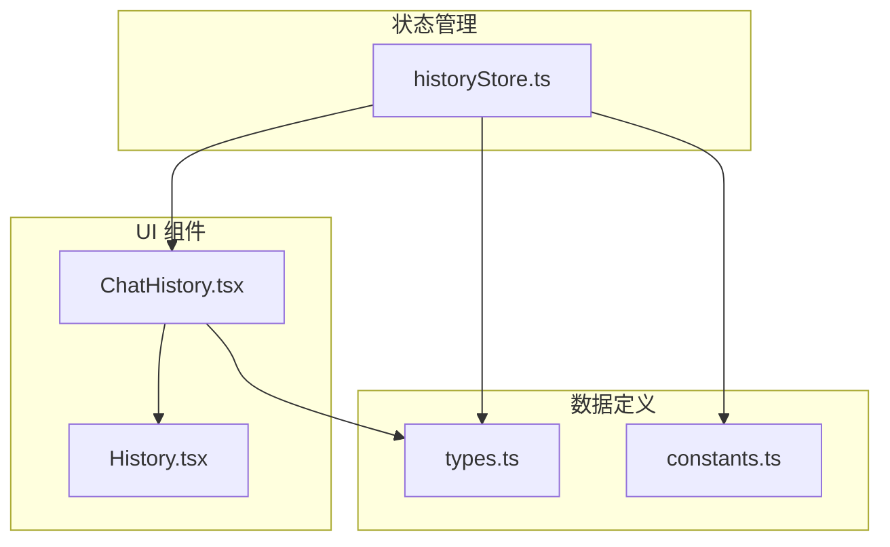
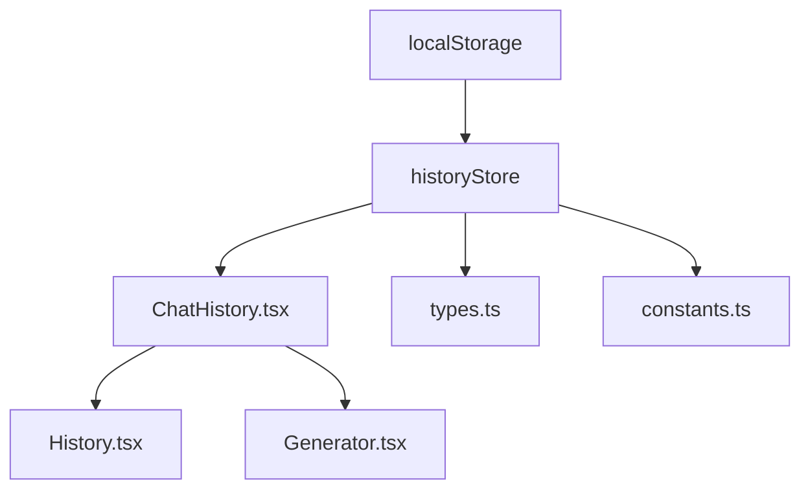
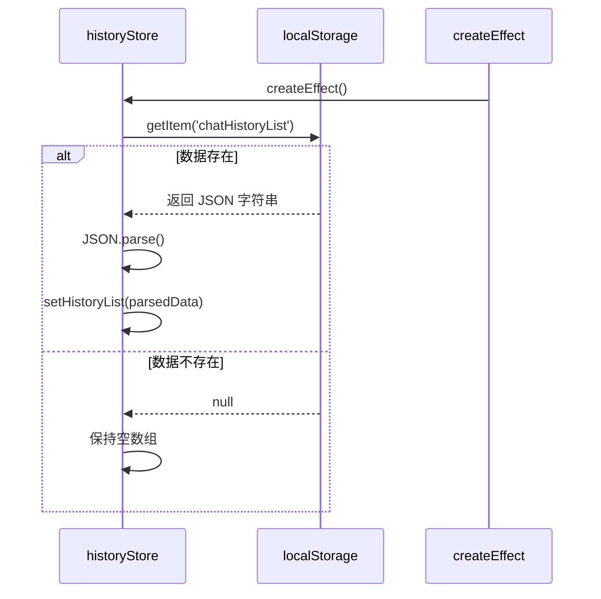
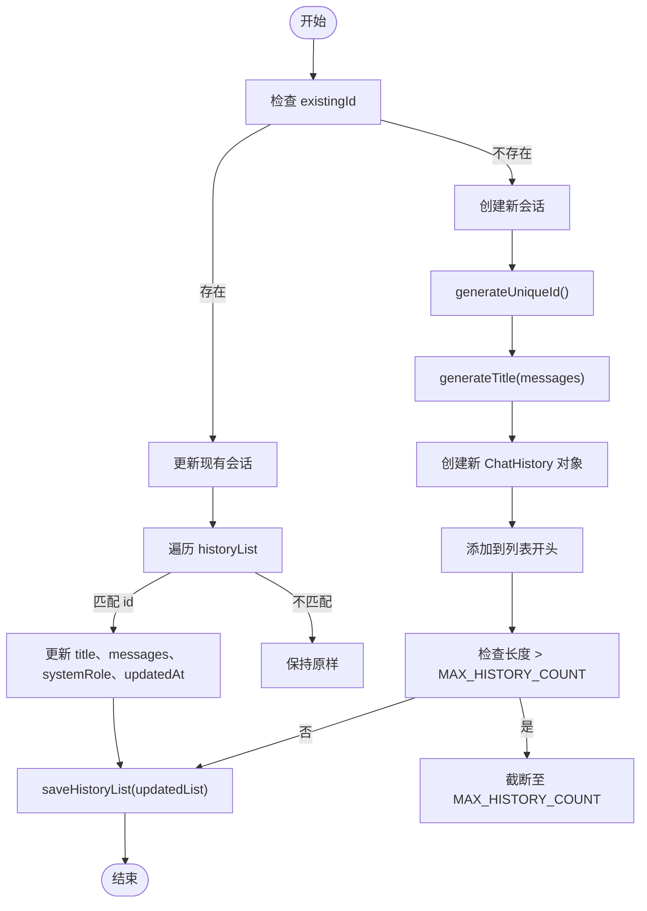
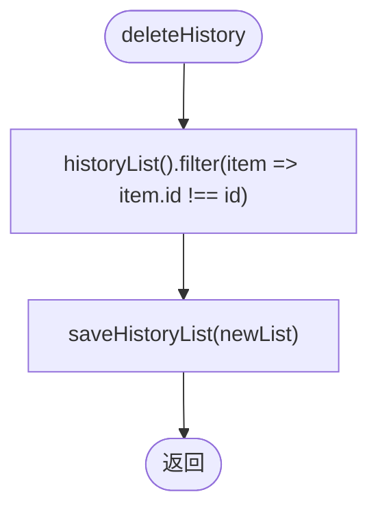
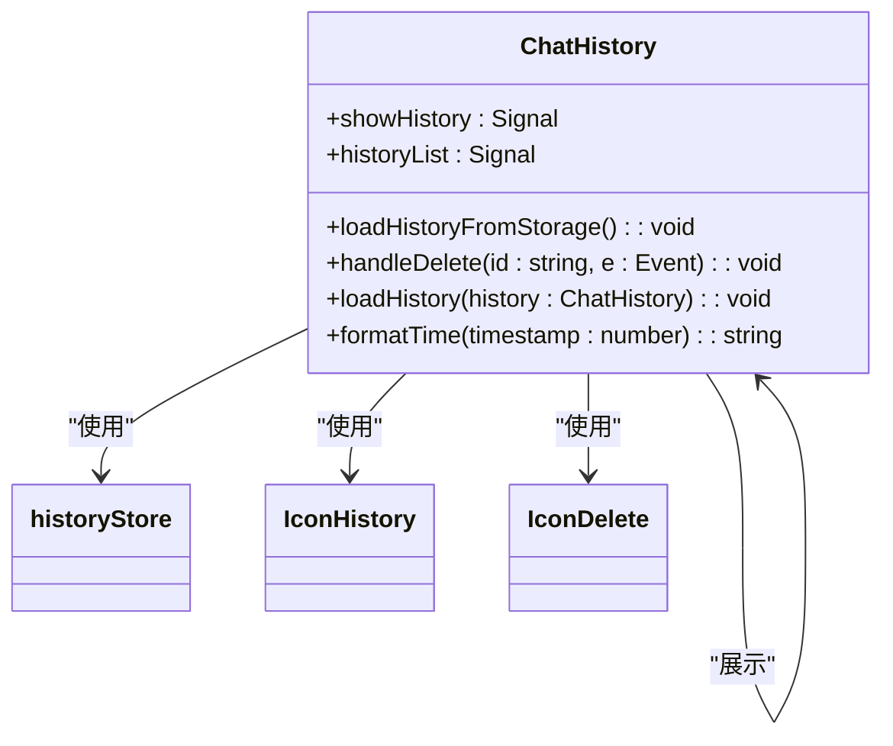
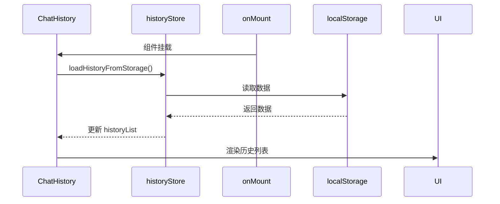
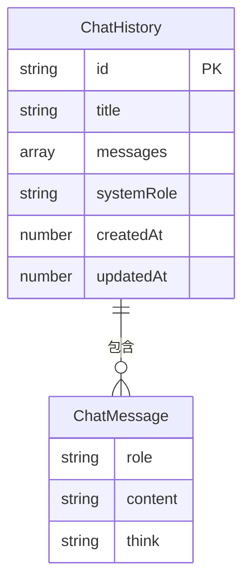
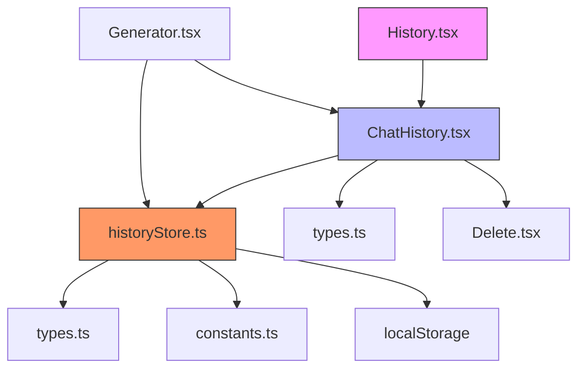
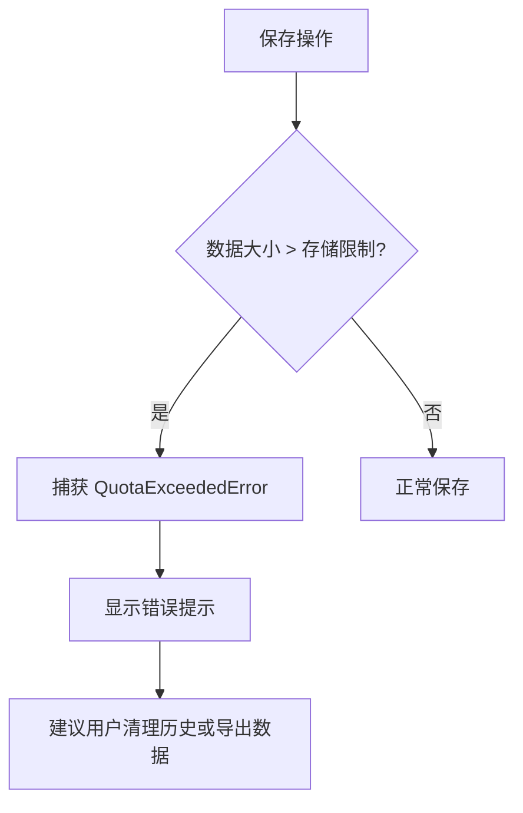

# 对话历史管理

<cite>
**本文档引用的文件**  
- [historyStore.ts](file://src/store/historyStore.ts)
- [ChatHistory.tsx](file://src/components/ChatHistory.tsx)
- [History.tsx](file://src/components/icons/History.tsx)
- [types.ts](file://src/types.ts)
- [constants.ts](file://src/config/constants.ts)
</cite>

## 目录
1. [简介](#简介)
2. [项目结构](#项目结构)
3. [核心组件](#核心组件)
4. [架构概览](#架构概览)
5. [详细组件分析](#详细组件分析)
6. [依赖关系分析](#依赖关系分析)
7. [性能考量](#性能考量)
8. [故障排除指南](#故障排除指南)
9. [结论](#结论)

## 简介
本文档全面讲解基于 `localStorage` 的对话历史持久化机制。详细描述 `historyStore.ts` 中使用 Solid.js Signal 实现的状态管理模型，包括会话创建、加载、删除和持久化逻辑；分析 `ChatHistory.tsx` 组件如何与 store 交互以实现历史记录的可视化展示与选择功能；说明图标组件 `History.tsx` 在 UI 中的触发作用。解释数据结构设计，如 `ChatHistory` 与 `ChatMessage` 的类型定义及其序列化策略。提供本地存储的数据格式示例，并说明如何处理存储容量限制与跨设备同步问题。包含常见问题解决方案，如历史记录丢失恢复、数据清理机制等。

## 项目结构
项目采用基于功能的组织结构，主要模块包括组件、配置、状态管理、工具和类型定义。对话历史管理功能集中在 `src/store/historyStore.ts` 中，由 `src/components/ChatHistory.tsx` 负责 UI 展示，通过 `src/components/icons/History.tsx` 图标触发。数据结构定义在 `src/types.ts`，相关配置参数位于 `src/config/constants.ts`。



**图示来源**  
- [historyStore.ts](file://src/store/historyStore.ts)
- [ChatHistory.tsx](file://src/components/ChatHistory.tsx)
- [History.tsx](file://src/components/icons/History.tsx)
- [types.ts](file://src/types.ts)
- [constants.ts](file://src/config/constants.ts)

## 核心组件
核心组件包括 `historyStore.ts` 中的状态管理器、`ChatHistory.tsx` 历史记录展示组件、`History.tsx` 触发图标以及 `types.ts` 中的数据结构定义。这些组件协同工作，实现了对话历史的持久化存储、加载、展示和管理功能。

**组件来源**  
- [historyStore.ts](file://src/store/historyStore.ts)
- [ChatHistory.tsx](file://src/components/ChatHistory.tsx)
- [History.tsx](file://src/components/icons/History.tsx)
- [types.ts](file://src/types.ts)

## 架构概览
系统采用分层架构，自下而上包括数据存储层（localStorage）、状态管理层（Solid.js Signal）、业务逻辑层（store actions）和 UI 层（组件）。数据流为：UI 触发操作 → 调用 store 方法 → 更新内存状态 → 持久化到 localStorage。



**图示来源**  
- [historyStore.ts](file://src/store/historyStore.ts)
- [ChatHistory.tsx](file://src/components/ChatHistory.tsx)
- [History.tsx](file://src/components/icons/History.tsx)
- [types.ts](file://src/types.ts)
- [constants.ts](file://src/config/constants.ts)

## 详细组件分析

### historyStore.ts 状态管理分析
`historyStore.ts` 使用 Solid.js 的 `createSignal` 实现响应式状态管理，通过 `localStorage` 实现数据持久化。

#### 状态定义
```typescript
const [historyList, setHistoryList] = createSignal<ChatHistory[]>([])
```
- `historyList`: 存储所有对话历史的信号（Signal）
- `setHistoryList`: 更新信号值的函数

#### 初始化加载


**图示来源**  
- [historyStore.ts](file://src/store/historyStore.ts#L9-L18)

#### 会话创建与更新
`saveOrUpdateChat` 函数处理新会话创建和现有会话更新：



**图示来源**  
- [historyStore.ts](file://src/store/historyStore.ts#L63-L104)

#### 会话删除


**图示来源**  
- [historyStore.ts](file://src/store/historyStore.ts#L48-L61)

#### 持久化策略
使用 `useThrottleFn` 实现防抖保存，避免频繁写入：

```typescript
const saveHistoryList = useThrottleFn((list: ChatHistory[]) => {
  try {
    localStorage.setItem('chatHistoryList', JSON.stringify(list))
    setHistoryList(list)
  } catch (e) {
    console.error('Failed to save chat history:', e)
  }
}, CONFIG.SAVE_DEBOUNCE_TIME, false, true)
```

- 防抖时间：`CONFIG.SAVE_DEBOUNCE_TIME`（500ms）
- 序列化：`JSON.stringify`
- 键名：`chatHistoryList`

**组件来源**  
- [historyStore.ts](file://src/store/historyStore.ts#L48-L56)
- [constants.ts](file://src/config/constants.ts#L8)

### ChatHistory.tsx 组件分析
`ChatHistory.tsx` 是对话历史的可视化组件，负责展示历史记录列表并处理用户交互。

#### 组件结构


**图示来源**  
- [ChatHistory.tsx](file://src/components/ChatHistory.tsx)

#### 生命周期与数据加载


**图示来源**  
- [ChatHistory.tsx](file://src/components/ChatHistory.tsx#L11-L15)

#### 用户交互流程
```mermaid
flowchart TD
A[点击历史图标] --> B[显示/隐藏弹窗]
B --> C{显示状态}
C --> |显示| D[渲染历史列表]
D --> E{列表为空?}
E --> |是| F[显示“暂无历史对话”]
E --> |否| G[For 循环渲染每条记录]
G --> H[显示标题、时间、消息数]
H --> I[悬停显示删除按钮]
I --> J[点击删除: handleDelete]
J --> K[调用 deleteHistory(id)]
G --> L[点击记录: loadHistory]
L --> M[调用 props.onLoadHistory]
M --> N[通知父组件加载会话]
```

**组件来源**  
- [ChatHistory.tsx](file://src/components/ChatHistory.tsx)

### History.tsx 图标组件分析
`History.tsx` 是一个简单的 SVG 图标组件，用于在 UI 中触发历史对话弹窗的显示/隐藏。

```tsx
export default () => {
  return (
    <svg xmlns="http://www.w3.org/2000/svg" width="1.1em" height="1.1em" viewBox="0 0 24 24">
      <path fill="currentColor" d="M12 2C6.48 2 2 6.48 2 12s4.48 10 10 10s10-4.48 10-10S17.52 2 12 2zm0 18c-4.41 0-8-3.59-8-8s3.59-8 8-8s8 3.59 8 8s-3.59 8-8 8zm.5-13H11v6l5.25 3.15l.75-1.23l-4.5-2.67z" />
    </svg>
  )
}
```

该组件被 `ChatHistory.tsx` 引用，作为历史对话按钮的图标。

**组件来源**  
- [History.tsx](file://src/components/icons/History.tsx)

### 数据结构设计分析

#### ChatMessage 类型
```typescript
export interface ChatMessage {
  role: 'system' | 'user' | 'assistant'
  content: string
  think?: string
}
```
- `role`: 消息角色，三种类型：系统、用户、助手
- `content`: 消息内容文本
- `think`: 可选字段，可能用于存储思考过程

#### ChatHistory 类型
```typescript
export interface ChatHistory {
  id: string
  title: string
  messages: ChatMessage[]
  systemRole: string
  createdAt: number
  updatedAt: number
}
```
- `id`: 唯一标识符，使用 `crypto.randomUUID()` 或时间戳+随机数生成
- `title`: 会话标题，基于第一条用户消息生成
- `messages`: 消息数组，按时间顺序存储
- `systemRole`: 系统角色设置
- `createdAt`: 创建时间戳（毫秒）
- `updatedAt`: 更新时间戳（毫秒）



**图示来源**  
- [types.ts](file://src/types.ts)

## 依赖关系分析
系统各组件间存在明确的依赖关系，形成清晰的数据流和控制流。



**图示来源**  
- [historyStore.ts](file://src/store/historyStore.ts)
- [ChatHistory.tsx](file://src/components/ChatHistory.tsx)
- [History.tsx](file://src/components/icons/History.tsx)
- [types.ts](file://src/types.ts)
- [constants.ts](file://src/config/constants.ts)

## 性能考量
系统在性能方面进行了多项优化：

1. **防抖保存**：使用 `useThrottleFn` 将保存操作限制在 500ms 一次，避免频繁写入 localStorage
2. **历史数量限制**：通过 `CONFIG.MAX_HISTORY_COUNT`（默认 25）限制存储的历史会话数量，防止存储膨胀
3. **内存状态管理**：使用 Solid.js Signal 实现高效的状态更新和响应式渲染
4. **按需加载**：每次启动时从 localStorage 加载数据，避免重复读取

存储策略相关配置：
- `MAX_HISTORY_COUNT`: 25（保留最近 25 次会话）
- `SAVE_DEBOUNCE_TIME`: 500ms（保存防抖时间）

**配置来源**  
- [constants.ts](file://src/config/constants.ts#L4-L8)

## 故障排除指南

### 常见问题及解决方案

#### 历史记录丢失
**可能原因**：
- 浏览器隐私模式或无痕模式
- localStorage 被手动清除
- 存储空间不足

**解决方案**：
1. 检查浏览器是否处于隐私模式
2. 确认 localStorage 是否被其他扩展或脚本清除
3. 检查存储配额（通常为 5-10MB）

```javascript
// 检查 localStorage 使用情况
console.log('Storage usage:', localStorage.length, 'items');
console.log('Chat history size:', localStorage.getItem('chatHistoryList')?.length, 'chars');
```

#### 数据清理机制
系统自动清理机制：
- 保留最近 `MAX_HISTORY_COUNT`（25）条记录
- 新记录添加到列表开头，超出数量时自动截断

手动清理方法：
```javascript
// 清除所有历史记录
localStorage.removeItem('chatHistoryList');
// 重新加载状态
location.reload();
```

#### 跨设备同步问题
当前系统基于 localStorage，**不支持跨设备同步**。解决方案建议：
1. 实现云同步功能（需用户账户系统）
2. 提供导入/导出功能（JSON 文件）
3. 使用浏览器同步功能（依赖用户设置）

#### 存储容量限制处理


错误处理已在代码中实现：
```typescript
try {
  localStorage.setItem('chatHistoryList', JSON.stringify(list))
} catch (e) {
  console.error('Failed to save chat history:', e)
}
```

**组件来源**  
- [historyStore.ts](file://src/store/historyStore.ts#L50-L54)

## 结论
本系统实现了基于 localStorage 的对话历史持久化机制，具有以下特点：

1. **响应式状态管理**：使用 Solid.js Signal 实现高效的状态更新
2. **可靠的数据持久化**：通过 JSON 序列化将数据存储在 localStorage
3. **用户友好的界面**：提供直观的历史记录展示和管理功能
4. **性能优化**：采用防抖保存和数量限制防止性能下降
5. **健壮的错误处理**：对存储操作进行异常捕获和处理

未来改进方向：
- 增加云同步功能实现跨设备访问
- 提供历史记录导入/导出功能
- 增强搜索和分类功能
- 实现更智能的会话标题生成

该设计在本地存储场景下表现良好，平衡了功能完整性、性能和用户体验。