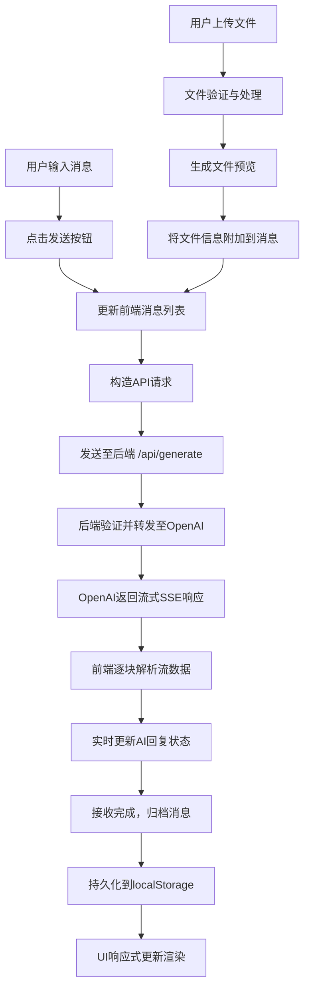
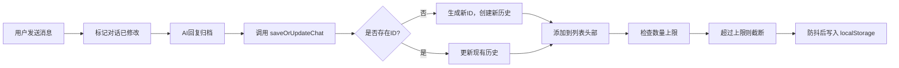
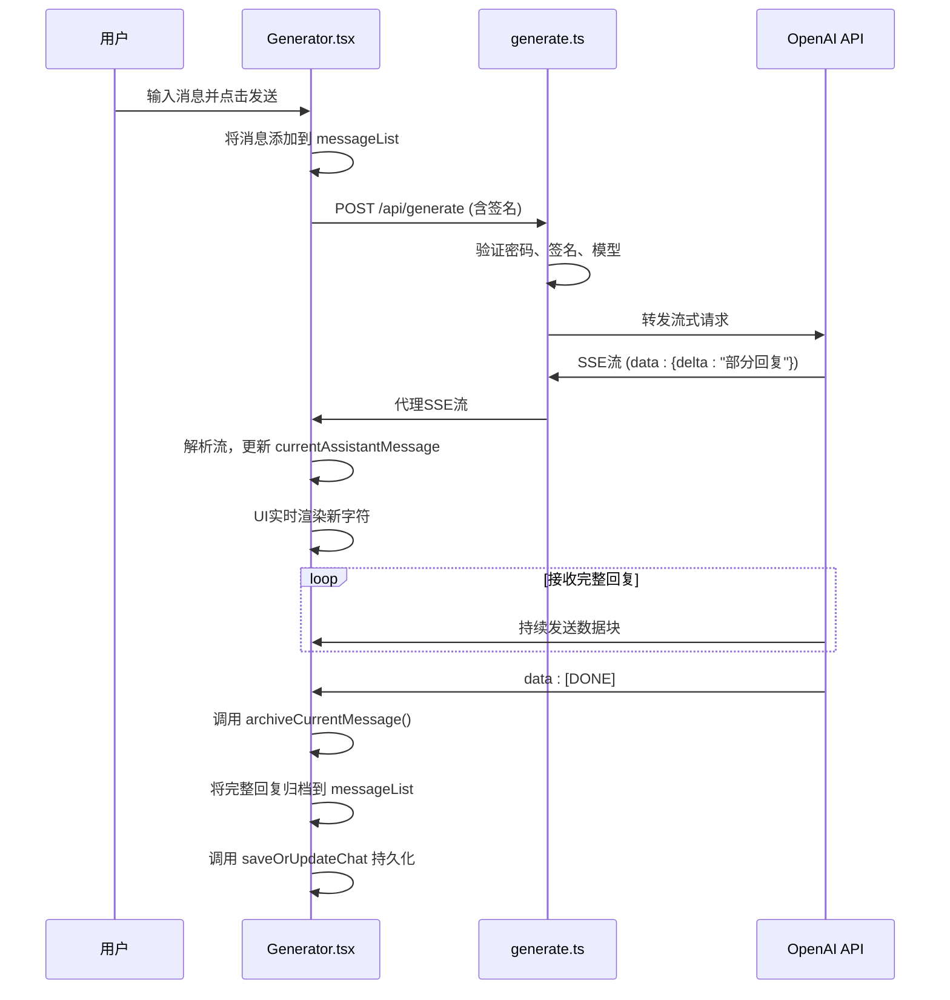
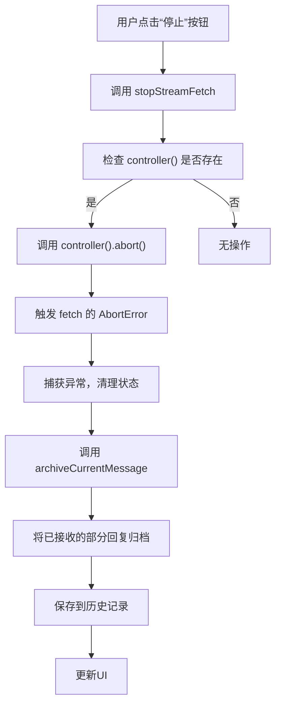
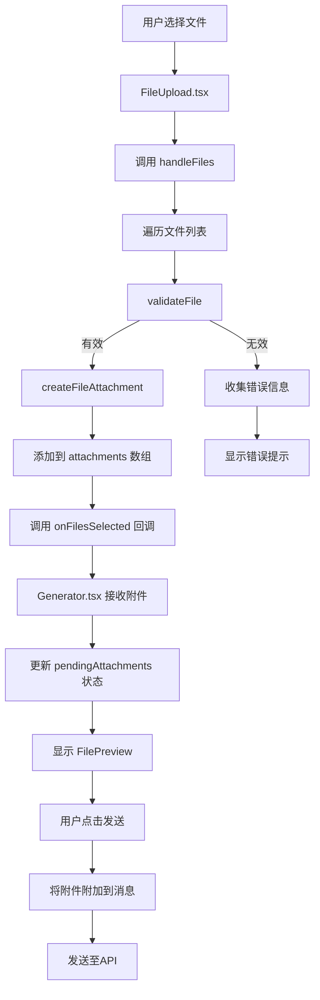
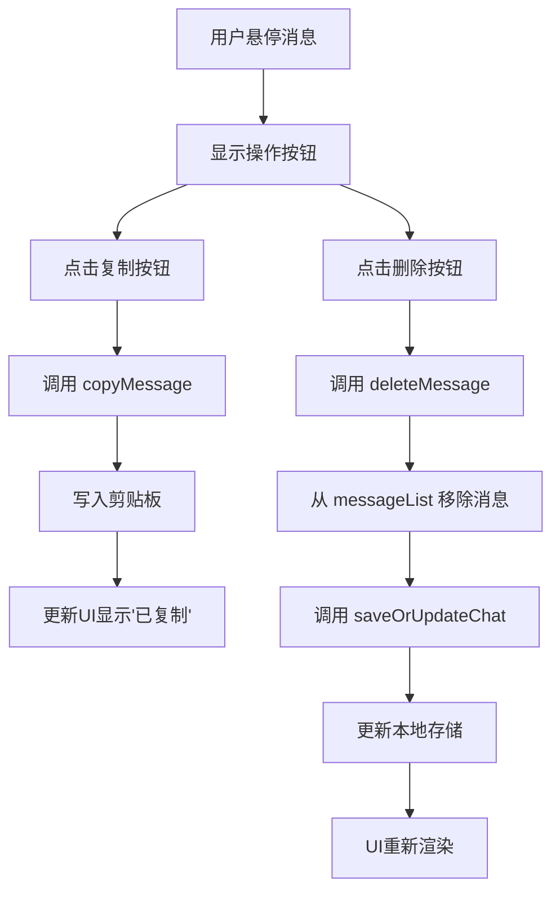

# 核心功能详解

<cite>
**本文档引用的文件**   
- [Generator.tsx](file://src/components/Generator.tsx) - *新增消息复制和删除功能*
- [historyStore.ts](file://src/store/historyStore.ts)
- [openAI.ts](file://src/utils/openAI.ts)
- [generate.ts](file://src/pages/api/generate.ts)
- [constants.ts](file://src/config/constants.ts) - *扩展支持的文件类型*
- [auth.ts](file://src/utils/auth.ts)
- [MessageItem.tsx](file://src/components/MessageItem.tsx) - *新增复制和删除按钮*
- [ChatHistory.tsx](file://src/components/ChatHistory.tsx) - *集成文件上传功能*
- [FileUpload.tsx](file://src/components/FileUpload.tsx) - *新增文件上传组件*
- [FilePreview.tsx](file://src/components/FilePreview.tsx) - *新增文件预览组件*
- [fileUtils.ts](file://src/utils/fileUtils.ts) - *新增文件处理工具*
</cite>

## 更新摘要
**变更内容**   
- 新增 **聊天交互功能** 章节，详细说明消息复制和删除功能的实现机制
- 在 **主界面组件分析** 和 **典型使用示例** 章节中整合消息复制和删除功能
- 更新 **关键交互流程图** 以包含消息复制和删除流程
- 所有引用的文件路径和标题均已转换为中文(中文)

## 目录
1. [核心功能详解](#核心功能详解)
2. [消息生命周期与核心流程](#消息生命周期与核心流程)
3. [主界面组件分析](#主界面组件分析)
4. [对话历史持久化机制](#对话历史持久化机制)
5. [OpenAI API 封装逻辑](#openai-api-封装逻辑)
6. [后端API请求处理](#后端api请求处理)
7. [响应式状态管理](#响应式状态管理)
8. [关键交互流程图](#关键交互流程图)
9. [文件上传与处理](#文件上传与处理)
10. [聊天交互功能](#聊天交互功能)
11. [典型使用示例](#典型使用示例)

## 消息生命周期与核心流程

本节详细阐述从用户输入到AI响应的完整消息生命周期，涵盖前端处理、API调用、流式接收与本地存储的全过程。新增了对文件上传的支持。

**消息生命周期流程图**


**图示来源**
- [Generator.tsx](file://src/components/Generator.tsx#L124-L258)
- [openAI.ts](file://src/utils/openAI.ts#L25-L71)
- [historyStore.ts](file://src/store/historyStore.ts#L63-L104)
- [FileUpload.tsx](file://src/components/FileUpload.tsx#L0-L137)

## 主界面组件分析

`Generator.tsx` 是应用的核心聊天界面组件，负责协调用户输入、消息发送、流式接收与状态更新。

**关键状态信号（Signal）**
- `messageList`: 存储当前对话的所有消息
- `currentAssistantMessage`: 流式接收中的AI回复内容
- `currentAssistantThinkMessage`: 流式接收中的AI思考过程
- `loading`: 标识AI正在生成回复
- `controller`: `AbortController` 实例，用于中断流式请求
- `isCurrentChatModified`: 标记当前对话是否已修改
- `pendingAttachments`: 存储用户已选择但尚未发送的文件附件

**消息发送流程**
1. 用户在输入框输入内容并点击"发送"按钮。
2. 调用 `handleButtonClick` 函数，将用户输入和待发送的文件附件添加到 `messageList`。
3. 调用 `requestWithLatestMessage` 发起API请求。

**消息交互功能**
1. **复制消息**: 用户点击消息操作栏的复制按钮，触发 `copyMessage` 函数，将消息内容复制到剪贴板。
2. **删除消息**: 用户点击消息操作栏的删除按钮，触发 `deleteMessage` 函数，从 `messageList` 中移除指定消息，并更新本地存储。

**Section sources**
- [Generator.tsx](file://src/components/Generator.tsx#L15-L392)

## 对话历史持久化机制

`historyStore.ts` 实现了基于 `localStorage` 的对话历史持久化策略。

**数据结构**
```typescript
interface ChatHistory {
  id: string          // 唯一标识符
  title: string       // 对话标题
  messages: ChatMessage[] // 消息列表
  systemRole: string  // 系统角色设定
  createdAt: number   // 创建时间戳
  updatedAt: number   // 更新时间戳
}
```

**核心逻辑**
- **保存/更新**: `saveOrUpdateChat` 函数根据 `existingId` 判断是创建新对话还是更新现有对话。
- **ID生成**: `generateUniqueId` 优先使用 `crypto.randomUUID()`，降级为时间戳+随机数。
- **标题生成**: `generateTitle` 从第一条用户消息生成标题。
- **数量限制**: 通过 `CONFIG.MAX_HISTORY_COUNT` 限制本地存储的对话数量。
- **防抖保存**: 使用 `useThrottleFn` 对保存操作进行防抖，避免频繁写入。

**持久化流程**


**Section sources**
- [historyStore.ts](file://src/store/historyStore.ts#L0-L112)

## OpenAI API 封装逻辑

`openAI.ts` 文件封装了与OpenAI API交互的核心逻辑。

**请求构造**
`generatePayload` 函数构造符合OpenAI API规范的请求体：
- **Headers**: 设置 `Authorization`、`Content-Type` 和 `Accept: text/event-stream`。
- **Body**: 包含 `model`、`messages`、`temperature` 和 `stream: true`。

**消息转换**
`transformMessagesForAPI` 函数在发送前处理消息：
- **用户消息包含图片附件**: 将内容转换为数组，包含文本和图片URL（Base64编码）。
- **用户消息包含非图片附件**: 将文件内容作为文本附加到消息末尾。
- **助手消息**: 仅包含文本内容。

**流式响应解析**
`parseOpenAIStream` 函数将OpenAI的SSE流转换为浏览器可读的 `ReadableStream`：
1. 创建 `ReadableStream` 并获取 `reader`。
2. 使用 `eventsource-parser` 解析SSE事件。
3. 当收到 `data: [DONE]` 时关闭流。
4. 解析 `data` 字段中的JSON，提取 `choices[0].delta.content`。
5. 将提取的文本通过 `controller.enqueue()` 推送到流中。

**错误处理**
- 检查 `rawResponse.ok`，返回原始响应以保留状态码。
- 捕获解析和读取过程中的异常。

**Section sources**
- [openAI.ts](file://src/utils/openAI.ts#L0-L72)

## 后端API请求处理

`generate.ts` 是处理前端请求的后端API路由。

**处理流程**
1. **参数解析**: 从请求体中解构 `sign`, `time`, `messages`, `pass`, `temperature`, `model`。
2. **输入验证**: 检查 `messages` 是否存在。
3. **密码验证**: 如果设置了 `SITE_PASSWORD`，验证 `pass` 参数。
4. **签名验证**: 在生产环境验证请求签名，防止重放攻击。
5. **模型验证**: 检查请求的模型是否在允许列表中。
6. **请求转发**: 使用 `generatePayload` 构造请求，通过 `undici` 的 `fetch` 转发到OpenAI。
7. **流式代理**: 使用 `parseOpenAIStream` 将OpenAI的响应流直接代理回前端。

**安全机制**
- **签名验证**: 结合时间戳、消息内容和密钥生成签名，验证时间戳是否在 `CONFIG.AUTH_TIMEOUT` (5分钟) 内。
- **代理支持**: 通过 `HTTPS_PROXY` 环境变量支持网络代理。

**Section sources**
- [generate.ts](file://src/pages/api/generate.ts#L0-L71)

## 响应式状态管理

应用使用SolidJS的响应式系统，通过 `createSignal` 管理状态。

**状态更新机制**
- **信号（Signal）**: 每个 `createSignal` 创建一个可读写的响应式状态。
- **副作用（Effect）**: `createEffect` 在依赖的信号变化时自动执行。
- **UI绑定**: JSX模板中直接使用信号的getter函数，自动建立依赖关系。

**示例：自动滚动**
```typescript
// 当 isStick() 为 true 时，自动平滑滚动到底部
createEffect(() => (isStick() && smoothToBottom()))
```
此 `effect` 监听 `isStick` 信号，当其值变化时，如果为 `true`，则执行 `smoothToBottom`。

**Section sources**
- [Generator.tsx](file://src/components/Generator.tsx#L15-L25)

## 关键交互流程图

### 消息发送与流式接收序列图


**Diagram sources**
- [Generator.tsx](file://src/components/Generator.tsx#L124-L258)
- [openAI.ts](file://src/utils/openAI.ts#L25-L71)
- [historyStore.ts](file://src/store/historyStore.ts#L63-L104)

### 中断生成流程图


**Diagram sources**
- [Generator.tsx](file://src/components/Generator.tsx#L260-L270)

## 文件上传与处理

本节详细说明新增的文件上传功能，包括前端组件、文件处理逻辑和与核心聊天流程的集成。

### 文件上传组件 (FileUpload.tsx)
该组件提供点击和拖拽两种上传方式。
- **点击上传**: 通过隐藏的 `<input type="file">` 触发文件选择器。
- **拖拽上传**: 监听全局 `dragenter`, `dragover`, `dragleave`, `drop` 事件，实现页面任意位置拖拽上传。
- **文件验证**: 上传前调用 `validateFile` 检查文件类型和大小。
- **多文件支持**: 支持一次选择或拖拽多个文件。

**Section sources**
- [FileUpload.tsx](file://src/components/FileUpload.tsx#L0-L137)

### 文件预览组件 (FilePreview.tsx)
该组件显示已选择文件的预览信息。
- **实时预览**: 上传后立即在输入框上方显示。
- **信息展示**: 显示文件名、大小和类型图标。
- **管理功能**: 支持单个文件删除和批量清除。

**Section sources**
- [FilePreview.tsx](file://src/components/FilePreview.tsx#L0-L77)

### 文件处理工具 (fileUtils.ts)
该工具集提供文件处理的核心功能。
- **`validateFile`**: 根据 `CONFIG.ALLOWED_DOCUMENT_TYPES` 和 `CONFIG.ALLOWED_IMAGE_TYPES` 验证文件类型，并检查大小限制。
- **`createFileAttachment`**: 将 `File` 对象转换为 `FileAttachment` 对象。图片文件读取为Base64，其他文件读取为文本。
- **`getFileIcon`**: 根据文件类型或扩展名返回相应的emoji图标。
- **`cleanupFileUrl`**: 清理用于预览的 `blob:` URL，防止内存泄漏。

**Section sources**
- [fileUtils.ts](file://src/utils/fileUtils.ts#L0-L153)

### 与核心流程的集成
1. **状态管理**: `Generator.tsx` 使用 `pendingAttachments` 信号存储待发送的文件。
2. **消息构造**: `handleButtonClick` 函数将 `pendingAttachments` 附加到新创建的用户消息中。
3. **API请求**: `openAI.ts` 中的 `transformMessagesForAPI` 函数将附件内容嵌入API请求体。
4. **UI更新**: `MessageItem.tsx` 组件渲染消息时，会显示 `attachments`。

**文件上传流程图**


**Diagram sources**
- [FileUpload.tsx](file://src/components/FileUpload.tsx#L0-L137)
- [fileUtils.ts](file://src/utils/fileUtils.ts#L0-L153)
- [Generator.tsx](file://src/components/Generator.tsx#L322-L354)

## 聊天交互功能

本节详细说明新增的消息复制和删除功能，包括UI组件、事件处理逻辑和与核心聊天流程的集成。

### 消息操作UI (MessageItem.tsx)
该组件在每条消息的右上角提供操作按钮，仅在鼠标悬停时显示。
- **复制按钮**: 点击后将整条消息内容复制到剪贴板，按钮文本会短暂显示"已复制"。
- **删除按钮**: 仅对用户消息显示，点击后删除该条消息。

**Section sources**
- [MessageItem.tsx](file://src/components/MessageItem.tsx#L121-L144)

### 消息复制功能
`Generator.tsx` 中的 `copyMessage` 函数处理消息复制逻辑：
- 接收消息内容作为参数，但目前仅用于日志记录。
- 使用 `navigator.clipboard.writeText` API 将内容写入剪贴板。
- 更新 `messageCopied` 信号以触发UI更新，显示"已复制"提示。

**Section sources**
- [Generator.tsx](file://src/components/Generator.tsx#L103-L107)

### 消息删除功能
`Generator.tsx` 中的 `deleteMessage` 函数处理消息删除逻辑：
- 接收消息索引作为参数，从 `messageList` 中过滤掉指定索引的消息。
- 调用 `saveOrUpdateChat` 更新本地存储中的对话历史。
- 更新 `isCurrentChatModified` 信号以标记对话已修改。

**Section sources**
- [Generator.tsx](file://src/components/Generator.tsx#L90-L102)

### 与核心流程的集成
1. **组件通信**: `Generator.tsx` 通过 `onDeleteMessage` 和 `onCopyMessage` 属性将函数传递给 `MessageItem.tsx`。
2. **状态更新**: 删除消息后，`messageList` 信号更新，触发UI重新渲染。
3. **持久化**: 删除操作后立即调用 `saveOrUpdateChat`，确保更改被保存。

**消息操作流程图**


**Diagram sources**
- [Generator.tsx](file://src/components/Generator.tsx#L90-L107)
- [MessageItem.tsx](file://src/components/MessageItem.tsx#L121-L144)

## 典型使用示例

### 发送消息（含附件）
```typescript
const handleButtonClick = async() => {
  const inputValue = inputRef.value
  if (!inputValue && pendingAttachments().length === 0) return

  inputRef.value = ''
  const attachments = [...pendingAttachments()]
  setPendingAttachments([]) // 清空待发送附件

  const newMessage: ChatMessage = {
    role: 'user',
    content: inputValue || '', // 允许仅上传文件而无文本内容
    think: '',
    attachments: attachments.length > 0 ? attachments : undefined, // 附加文件信息
  }
  
  setMessageList([
    ...messageList(),
    newMessage,
  ])
  
  setIsCurrentChatModified(true)
  setStick(true)
  requestWithLatestMessage()
  instantToBottom()
}
```

### 接收流式回复
```typescript
// 在 requestWithLatestMessage 函数中
const reader = data.getReader()
const decoder = new TextDecoder('utf-8')
let buffer = ''
let inThinkTag = false

while (!done) {
  const { value, done: readerDone } = await reader.read()
  if (value) {
    buffer += decoder.decode(value, { stream: true })
    
    // 处理包含 <think> 标签的流数据
    while (true) {
      if (inThinkTag) {
        // ... 处理 think 标签内的内容
        setCurrentAssistantThinkMessage(currentAssistantThinkMessage() + thinkContent)
      } else {
        // ... 处理普通回复内容
        setCurrentAssistantMessage(currentAssistantMessage() + regularContent)
      }
    }
    // 自动滚动
    isStick() && instantToBottom()
  }
  done = readerDone
}
// 接收完成后归档消息
archiveCurrentMessage()
```

### 中断生成
```typescript
const stopStreamFetch = () => {
  if (controller()) {
    // 1. 中断 fetch 请求
    controller().abort()
    // 2. 归档已接收的部分回复
    archiveCurrentMessage()
  }
}
```
此函数通过 `AbortController` 中断正在进行的流式请求，并将已接收的部分内容作为完整回复归档。

### 处理文件上传
```typescript
// 在 Generator.tsx 中
const handleFilesSelected = (files: FileAttachment[]) => {
  setPendingAttachments(prev => [...prev, ...files])
}

const removeFile = (fileId: string) => {
  setPendingAttachments((prev) => {
    const removed = prev.find(file => file.id === fileId)
    if (removed?.url) cleanupFileUrl(removed.url) // 清理预览URL
    return prev.filter(file => file.id !== fileId)
  })
}
```

### 消息复制与删除
```typescript
// 在 Generator.tsx 中
const copyMessage = (_content: string) => {
  // 这里可以添加复制相关的逻辑，如统计等
  // console.log('Message copied:', content.slice(0, 50) + '...')
}

const deleteMessage = (index: number) => {
  const updatedMessages = messageList().filter((_, i) => i !== index)
  setMessageList(updatedMessages)

  // 标记对话已修改并保存
  setIsCurrentChatModified(true)
  if (updatedMessages.length > 0) {
    const historyId = saveOrUpdateChat(updatedMessages, currentSystemRoleSettings(), currentChatHistoryId())
    if (historyId) setCurrentChatHistoryId(historyId)
  }
}
```

**Section sources**
- [Generator.tsx](file://src/components/Generator.tsx#L124-L392)
- [MessageItem.tsx](file://src/components/MessageItem.tsx#L0-L119)
- [ChatHistory.tsx](file://src/components/ChatHistory.tsx#L0-L115)
- [FileUpload.tsx](file://src/components/FileUpload.tsx#L0-L137)
- [FilePreview.tsx](file://src/components/FilePreview.tsx#L0-L77)