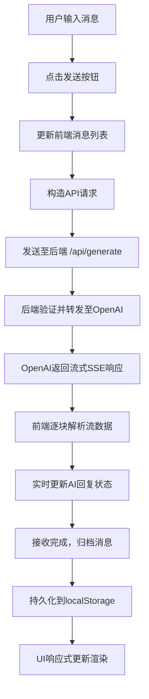
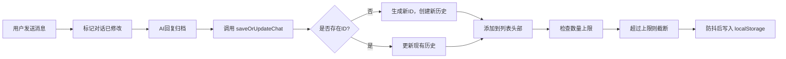
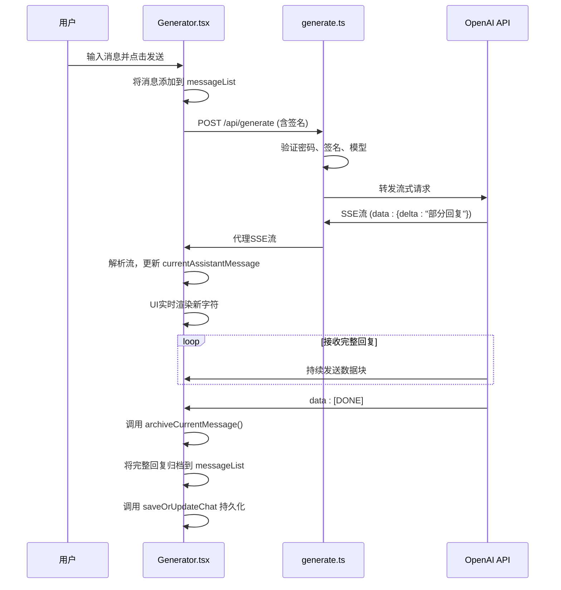
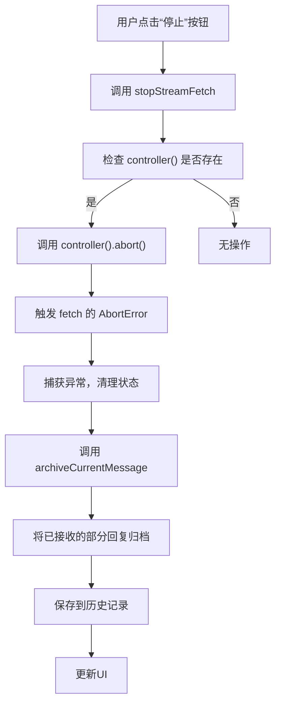

# 核心功能详解

<cite>
**本文档引用的文件**   
- [Generator.tsx](file://src/components/Generator.tsx)
- [historyStore.ts](file://src/store/historyStore.ts)
- [openAI.ts](file://src/utils/openAI.ts)
- [generate.ts](file://src/pages/api/generate.ts)
- [constants.ts](file://src/config/constants.ts)
- [auth.ts](file://src/utils/auth.ts)
- [MessageItem.tsx](file://src/components/MessageItem.tsx)
- [ChatHistory.tsx](file://src/components/ChatHistory.tsx)
</cite>

## 目录
1. [核心功能详解](#核心功能详解)
2. [消息生命周期与核心流程](#消息生命周期与核心流程)
3. [主界面组件分析](#主界面组件分析)
4. [对话历史持久化机制](#对话历史持久化机制)
5. [OpenAI API 封装逻辑](#openai-api-封装逻辑)
6. [后端API请求处理](#后端api请求处理)
7. [响应式状态管理](#响应式状态管理)
8. [关键交互流程图](#关键交互流程图)
9. [典型使用示例](#典型使用示例)

## 消息生命周期与核心流程

本节详细阐述从用户输入到AI响应的完整消息生命周期，涵盖前端处理、API调用、流式接收与本地存储的全过程。

**消息生命周期流程图**


**图示来源**
- [Generator.tsx](file://src/components/Generator.tsx#L124-L258)
- [openAI.ts](file://src/utils/openAI.ts#L25-L71)
- [historyStore.ts](file://src/store/historyStore.ts#L63-L104)

## 主界面组件分析

`Generator.tsx` 是应用的核心聊天界面组件，负责协调用户输入、消息发送、流式接收与状态更新。

**关键状态信号（Signal）**
- `messageList`: 存储当前对话的所有消息
- `currentAssistantMessage`: 流式接收中的AI回复内容
- `currentAssistantThinkMessage`: 流式接收中的AI思考过程
- `loading`: 标识AI正在生成回复
- `controller`: `AbortController` 实例，用于中断流式请求
- `isCurrentChatModified`: 标记当前对话是否已修改

**消息发送流程**
1. 用户在输入框输入内容并点击"发送"按钮。
2. 调用 `handleButtonClick` 函数，将用户输入添加到 `messageList`。
3. 调用 `requestWithLatestMessage` 发起API请求。

**Section sources**
- [Generator.tsx](file://src/components/Generator.tsx#L15-L392)

## 对话历史持久化机制

`historyStore.ts` 实现了基于 `localStorage` 的对话历史持久化策略。

**数据结构**
```typescript
interface ChatHistory {
  id: string          // 唯一标识符
  title: string       // 对话标题
  messages: ChatMessage[] // 消息列表
  systemRole: string  // 系统角色设定
  createdAt: number   // 创建时间戳
  updatedAt: number   // 更新时间戳
}
```

**核心逻辑**
- **保存/更新**: `saveOrUpdateChat` 函数根据 `existingId` 判断是创建新对话还是更新现有对话。
- **ID生成**: `generateUniqueId` 优先使用 `crypto.randomUUID()`，降级为时间戳+随机数。
- **标题生成**: `generateTitle` 从第一条用户消息生成标题。
- **数量限制**: 通过 `CONFIG.MAX_HISTORY_COUNT` 限制本地存储的对话数量。
- **防抖保存**: 使用 `useThrottleFn` 对保存操作进行防抖，避免频繁写入。

**持久化流程**


**Section sources**
- [historyStore.ts](file://src/store/historyStore.ts#L0-L112)

## OpenAI API 封装逻辑

`openAI.ts` 文件封装了与OpenAI API交互的核心逻辑。

**请求构造**
`generatePayload` 函数构造符合OpenAI API规范的请求体：
- **Headers**: 设置 `Authorization`、`Content-Type` 和 `Accept: text/event-stream`。
- **Body**: 包含 `model`、`messages`、`temperature` 和 `stream: true`。

**流式响应解析**
`parseOpenAIStream` 函数将OpenAI的SSE流转换为浏览器可读的 `ReadableStream`：
1. 创建 `ReadableStream` 并获取 `reader`。
2. 使用 `eventsource-parser` 解析SSE事件。
3. 当收到 `data: [DONE]` 时关闭流。
4. 解析 `data` 字段中的JSON，提取 `choices[0].delta.content`。
5. 将提取的文本通过 `controller.enqueue()` 推送到流中。

**错误处理**
- 检查 `rawResponse.ok`，返回原始响应以保留状态码。
- 捕获解析和读取过程中的异常。

**Section sources**
- [openAI.ts](file://src/utils/openAI.ts#L0-L72)

## 后端API请求处理

`generate.ts` 是处理前端请求的后端API路由。

**处理流程**
1. **参数解析**: 从请求体中解构 `sign`, `time`, `messages`, `pass`, `temperature`, `model`。
2. **输入验证**: 检查 `messages` 是否存在。
3. **密码验证**: 如果设置了 `SITE_PASSWORD`，验证 `pass` 参数。
4. **签名验证**: 在生产环境验证请求签名，防止重放攻击。
5. **模型验证**: 检查请求的模型是否在允许列表中。
6. **请求转发**: 使用 `generatePayload` 构造请求，通过 `undici` 的 `fetch` 转发到OpenAI。
7. **流式代理**: 使用 `parseOpenAIStream` 将OpenAI的响应流直接代理回前端。

**安全机制**
- **签名验证**: 结合时间戳、消息内容和密钥生成签名，验证时间戳是否在 `CONFIG.AUTH_TIMEOUT` (5分钟) 内。
- **代理支持**: 通过 `HTTPS_PROXY` 环境变量支持网络代理。

**Section sources**
- [generate.ts](file://src/pages/api/generate.ts#L0-L71)

## 响应式状态管理

应用使用SolidJS的响应式系统，通过 `createSignal` 管理状态。

**状态更新机制**
- **信号（Signal）**: 每个 `createSignal` 创建一个可读写的响应式状态。
- **副作用（Effect）**: `createEffect` 在依赖的信号变化时自动执行。
- **UI绑定**: JSX模板中直接使用信号的getter函数，自动建立依赖关系。

**示例：自动滚动**
```typescript
// 当 isStick() 为 true 时，自动平滑滚动到底部
createEffect(() => (isStick() && smoothToBottom()))
```
此 `effect` 监听 `isStick` 信号，当其值变化时，如果为 `true`，则执行 `smoothToBottom`。

**Section sources**
- [Generator.tsx](file://src/components/Generator.tsx#L15-L25)

## 关键交互流程图

### 消息发送与流式接收序列图


**Diagram sources**
- [Generator.tsx](file://src/components/Generator.tsx#L124-L258)
- [openAI.ts](file://src/utils/openAI.ts#L25-L71)
- [historyStore.ts](file://src/store/historyStore.ts#L63-L104)

### 中断生成流程图


**Diagram sources**
- [Generator.tsx](file://src/components/Generator.tsx#L260-L270)

## 典型使用示例

### 发送消息
```typescript
const handleButtonClick = async() => {
  const inputValue = inputRef.value
  if (!inputValue) return

  // 1. 清空输入框
  inputRef.value = ''
  
  // 2. 创建新消息对象
  const newMessage: ChatMessage = {
    role: 'user',
    content: inputValue,
    think: '',
  }
  
  // 3. 更新消息列表状态
  setMessageList([
    ...messageList(),
    newMessage,
  ])
  
  // 4. 标记对话已修改
  setIsCurrentChatModified(true)
  
  // 5. 开启自动滚动
  setStick(true)
  
  // 6. 发起流式请求
  requestWithLatestMessage()
  
  // 7. 立即滚动到底部
  instantToBottom()
}
```

### 接收流式回复
```typescript
// 在 requestWithLatestMessage 函数中
const reader = data.getReader()
const decoder = new TextDecoder('utf-8')
let buffer = ''
let inThinkTag = false

while (!done) {
  const { value, done: readerDone } = await reader.read()
  if (value) {
    buffer += decoder.decode(value, { stream: true })
    
    // 处理包含 <think> 标签的流数据
    while (true) {
      if (inThinkTag) {
        // ... 处理 think 标签内的内容
        setCurrentAssistantThinkMessage(currentAssistantThinkMessage() + thinkContent)
      } else {
        // ... 处理普通回复内容
        setCurrentAssistantMessage(currentAssistantMessage() + regularContent)
      }
    }
    // 自动滚动
    isStick() && instantToBottom()
  }
  done = readerDone
}
// 接收完成后归档消息
archiveCurrentMessage()
```

### 中断生成
```typescript
const stopStreamFetch = () => {
  if (controller()) {
    // 1. 中断 fetch 请求
    controller().abort()
    // 2. 归档已接收的部分回复
    archiveCurrentMessage()
  }
}
```
此函数通过 `AbortController` 中断正在进行的流式请求，并将已接收的部分内容作为完整回复归档。

**Section sources**
- [Generator.tsx](file://src/components/Generator.tsx#L124-L392)
- [MessageItem.tsx](file://src/components/MessageItem.tsx#L0-L119)
- [ChatHistory.tsx](file://src/components/ChatHistory.tsx#L0-L115)