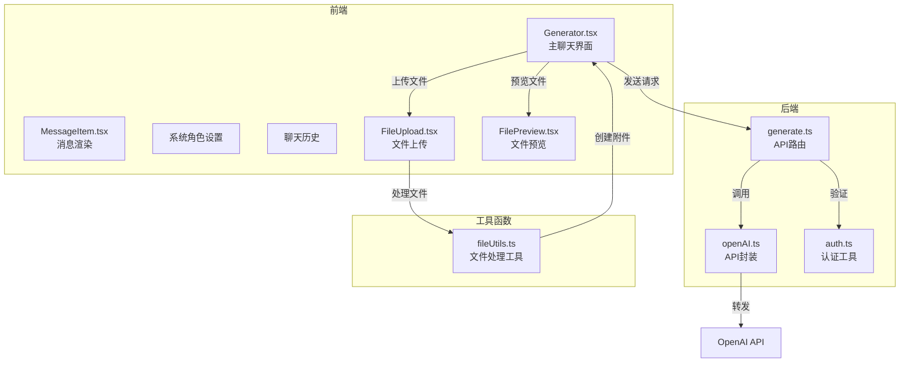
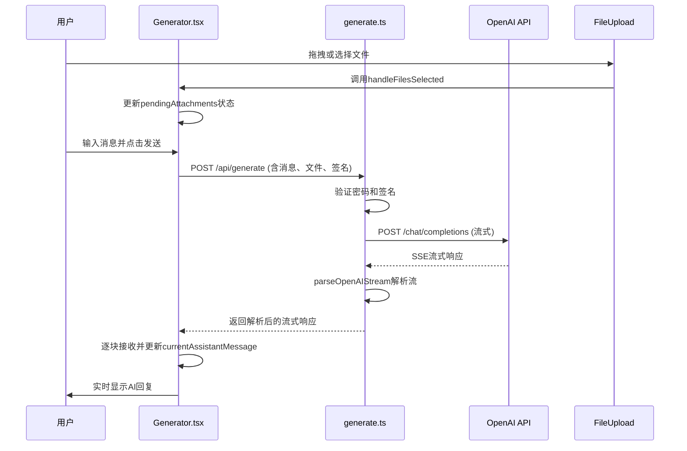
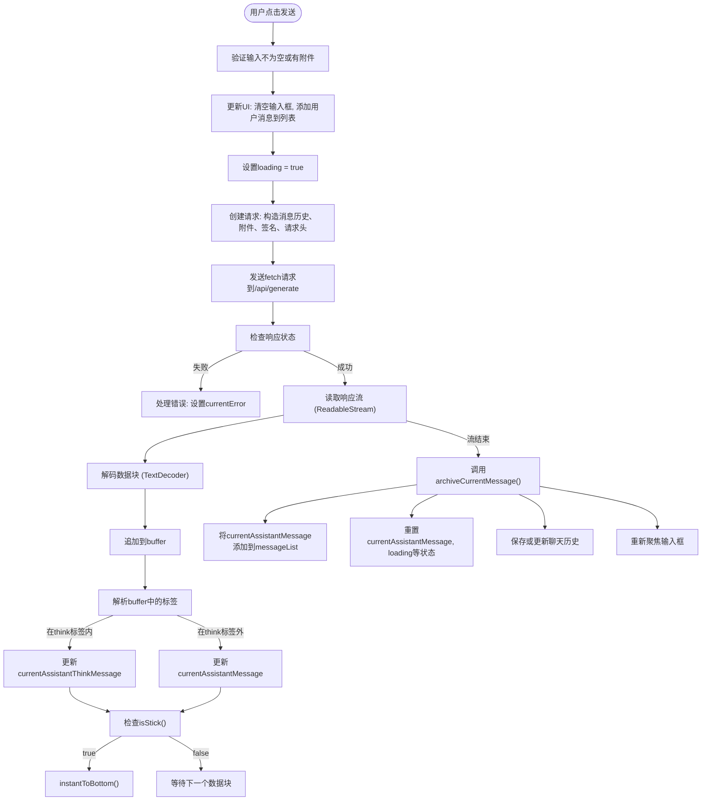
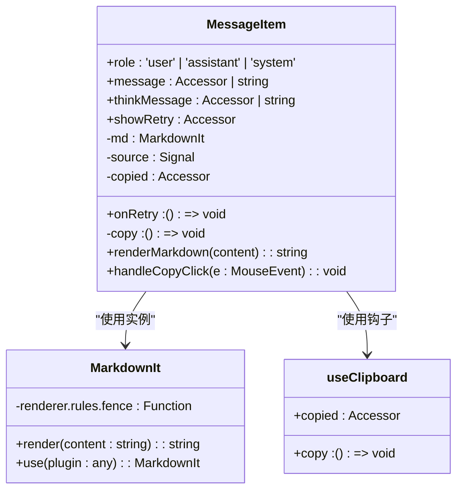
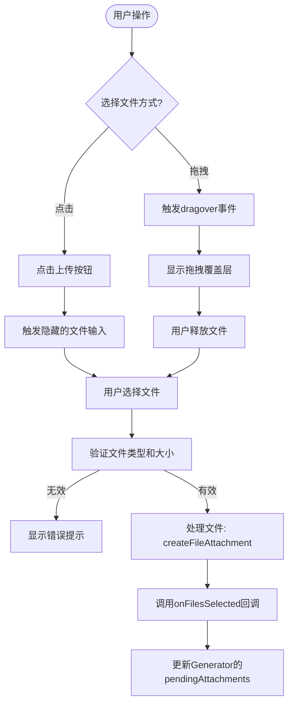
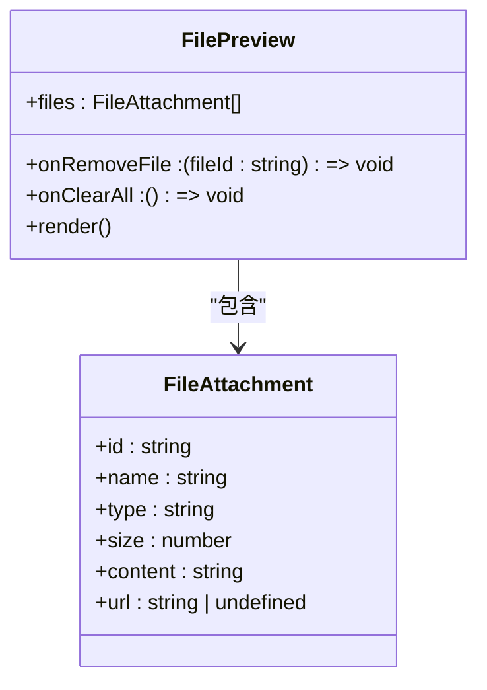

<docs>
# 聊天交互功能

<cite>
**本文档中引用的文件**   
- [Generator.tsx](file://src/components/Generator.tsx) - *新增文件上传功能*
- [MessageItem.tsx](file://src/components/MessageItem.tsx)
- [openAI.ts](file://src/utils/openAI.ts)
- [generate.ts](file://src/pages/api/generate.ts)
- [auth.ts](file://src/utils/auth.ts)
- [FileUpload.tsx](file://src/components/FileUpload.tsx) - *新增文件上传组件*
- [FilePreview.tsx](file://src/components/FilePreview.tsx) - *新增文件预览组件*
- [fileUtils.ts](file://src/utils/fileUtils.ts) - *新增文件处理工具*
</cite>

## 更新摘要
**已更新内容**   
- 在架构概览中新增文件上传流程
- 在详细组件分析中新增`Generator.tsx`的文件上传功能分析
- 新增`FileUpload.tsx`和`FilePreview.tsx`组件分析
- 更新依赖分析以包含新的文件处理组件
- 修复了故障排除指南中缺失的文件上传相关问题

## 目录
1. [项目结构](#项目结构)
2. [核心组件](#核心组件)
3. [架构概览](#架构概览)
4. [详细组件分析](#详细组件分析)
5. [依赖分析](#依赖分析)
6. [性能考虑](#性能考虑)
7. [故障排除指南](#故障排除指南)
8. [结论](#结论)

## 项目结构

该项目是一个基于SolidJS的轻量级聊天应用，采用前后端分离架构。前端使用Astro框架构建，后端通过API路由处理请求。核心聊天功能由`src/components`目录下的组件驱动，其中`Generator.tsx`是主聊天界面，`MessageItem.tsx`负责消息渲染。工具函数位于`src/utils`目录，包括与OpenAI API通信的`openAI.ts`和用于请求签名的`auth.ts`。API端点`/api/generate`位于`src/pages/api/generate.ts`，负责接收前端请求并转发给OpenAI服务。新增的文件上传功能由`FileUpload.tsx`、`FilePreview.tsx`和`fileUtils.ts`共同实现。

**Diagram sources**
- [Generator.tsx](file://src/components/Generator.tsx)
- [FileUpload.tsx](file://src/components/FileUpload.tsx)
- [FilePreview.tsx](file://src/components/FilePreview.tsx)
- [fileUtils.ts](file://src/utils/fileUtils.ts)
- [generate.ts](file://src/pages/api/generate.ts)
- [openAI.ts](file://src/utils/openAI.ts)
- [auth.ts](file://src/utils/auth.ts)

**Section sources**
- [Generator.tsx](file://src/components/Generator.tsx)
- [MessageItem.tsx](file://src/components/MessageItem.tsx)
- [openAI.ts](file://src/utils/openAI.ts)
- [generate.ts](file://src/pages/api/generate.ts)
- [FileUpload.tsx](file://src/components/FileUpload.tsx)
- [FilePreview.tsx](file://src/components/FilePreview.tsx)
- [fileUtils.ts](file://src/utils/fileUtils.ts)

## 核心组件

本节深入分析实现聊天交互功能的六个核心文件。`Generator.tsx`作为主组件，管理用户输入、状态和UI更新。`MessageItem.tsx`专门负责将AI的回复内容渲染为富文本。`openAI.ts`封装了与OpenAI API通信的底层逻辑，而`generate.ts`则作为服务器端的入口，处理来自前端的请求。新增的`FileUpload.tsx`和`FilePreview.tsx`组件分别负责文件上传和预览功能，`fileUtils.ts`提供了文件处理的工具函数。

**Section sources**
- [Generator.tsx](file://src/components/Generator.tsx#L1-L392)
- [MessageItem.tsx](file://src/components/MessageItem.tsx#L1-L119)
- [openAI.ts](file://src/utils/openAI.ts#L1-L72)
- [generate.ts](file://src/pages/api/generate.ts#L1-L71)
- [FileUpload.tsx](file://src/components/FileUpload.tsx#L1-L114)
- [FilePreview.tsx](file://src/components/FilePreview.tsx#L1-L47)
- [fileUtils.ts](file://src/utils/fileUtils.ts#L1-L108)

## 架构概览

该应用的聊天交互遵循典型的客户端-服务器-外部API模式。用户在前端`Generator.tsx`中输入消息并点击发送，触发`requestWithLatestMessage`函数。该函数构造一个包含消息历史、模型参数和安全签名的请求，发送到后端`/api/generate`端点。服务器端的`generate.ts`首先验证请求的密码和签名，然后使用`openAI.ts`中定义的`generatePayload`函数创建一个转发到OpenAI API的请求。OpenAI API通过SSE（Server-Sent Events）协议流式返回响应，`openAI.ts`中的`parseOpenAIStream`函数将其解析并转换为一个新的ReadableStream，最终由前端逐块接收并更新UI。新增的文件上传功能允许用户通过拖拽或点击上传文件，文件信息被存储在`pendingAttachments`信号中，并在发送消息时一并提交。

**Diagram sources**
- [Generator.tsx](file://src/components/Generator.tsx#L124-L258)
- [FileUpload.tsx](file://src/components/FileUpload.tsx#L1-L114)
- [fileUtils.ts](file://src/utils/fileUtils.ts#L1-L108)
- [generate.ts](file://src/pages/api/generate.ts#L16-L70)
- [openAI.ts](file://src/utils/openAI.ts#L25-L71)

## 详细组件分析

### Generator.tsx 分析

`Generator.tsx`是整个聊天界面的核心控制器。它使用SolidJS的`createSignal`创建了多个响应式状态变量来管理应用状态，例如`messageList`存储完整的对话历史，`currentAssistantMessage`存储正在接收的AI回复流，`loading`表示请求状态。新增了`pendingAttachments`信号来管理待上传的文件列表。

当用户点击发送按钮时，`handleButtonClick`函数被调用。该函数首先将用户输入和附件添加到`messageList`中，然后调用`requestWithLatestMessage`发起请求。`requestWithLatestMessage`函数是流式通信的关键。它使用`fetch` API向`/api/generate`发起POST请求，并设置`Accept: text/event-stream`头以启用流式传输。请求体中包含了经过`generateSignature`函数签名的消息历史、时间戳、模型参数和附件信息。

收到响应后，代码通过`response.body.getReader()`获取一个读取器，并在一个`while`循环中持续读取数据块。接收到的数据是UTF-8编码的文本流，通过`TextDecoder`进行解码。一个关键的逻辑是处理`<think>`标签。代码维护一个`buffer`字符串和一个`inThinkTag`标志，用于解析包含在`<think>`和`</think>`标签内的思考过程，并将其与主回复内容分开，分别更新`currentAssistantThinkMessage`和`currentAssistantMessage`信号。每当有新内容时，`isStick()`检查是否开启自动滚动，并调用`instantToBottom()`立即滚动到底部。

**Diagram sources**
- [Generator.tsx](file://src/components/Generator.tsx#L124-L258)

**Section sources**
- [Generator.tsx](file://src/components/Generator.tsx#L1-L392)

### MessageItem.tsx 分析

`MessageItem.tsx`组件负责将`ChatMessage`对象渲染为最终的HTML。其核心是一个使用`markdown-it`库创建的Markdown解析器实例。该实例通过`.use(mdKatex)`和`.use(mdHighlight)`插件，分别启用了KaTeX公式渲染和代码高亮功能。

组件通过`renderMarkdown`函数将消息内容（`message`或`thinkMessage`）转换为HTML字符串。一个重要的自定义逻辑是重写了`fence`（代码块）的渲染规则。在标准的代码块HTML外，包裹了一个包含“复制”按钮的`div`。这个按钮的`data-code`属性存储了经过`encodeURIComponent`编码的原始代码内容。当用户点击“复制”按钮时，`handleCopyClick`事件处理器会从`data-code`属性中提取并解码代码，然后利用`solidjs-use`提供的`useClipboard`钩子将其复制到系统剪贴板，并显示“已复制”的提示。

**Diagram sources**
- [MessageItem.tsx](file://src/components/MessageItem.tsx#L1-L119)

**Section sources**
- [MessageItem.tsx](file://src/components/MessageItem.tsx#L1-L119)

### openAI.ts 分析

`openAI.ts`文件提供了两个关键函数：`generatePayload`和`parseOpenAIStream`。`generatePayload`函数负责构造发送给OpenAI API的请求配置对象（`RequestInit`）。它设置了必要的请求头，包括`Authorization`（包含API密钥）、`Content-Type`和关键的`Accept: text/event-stream`，后者明确要求OpenAI以SSE格式流式返回响应。请求体中包含了模型、消息列表、温度参数和`stream: true`。

`parseOpenAIStream`函数是处理流式响应的核心。它接收一个来自`fetch`的原始`Response`对象。首先，它检查响应是否成功。然后，它创建一个新的`ReadableStream`，其`start`方法中包含一个事件解析器。该解析器使用`eventsource-parser`库来处理SSE协议。每当解析器收到一个`event`类型的SSE消息时，它会检查数据是否为`[DONE]`（表示流结束），如果是则关闭流。否则，它会尝试将数据解析为JSON，提取出`choices[0].delta.content`中的增量文本内容，并使用`controller.enqueue()`将其编码后推送到新的流中。这个新流最终被包装成一个`Response`对象返回，使得前端可以像处理普通流一样消费它。

**Section sources**
- [openAI.ts](file://src/utils/openAI.ts#L1-L72)

### generate.ts 分析

`generate.ts`是服务器端的API路由，处理来自前端的`/api/generate` POST请求。它首先从请求体中解构出`sign`、`time`、`messages`等参数。接着进行一系列验证：检查`messages`是否存在，验证提供的`pass`是否与环境变量`SITE_PASSWORD`匹配，以及在生产环境中验证`sign`签名是否有效（通过`verifySignature`函数，该函数会检查时间戳是否在有效期内并重新计算签名进行比对）。

验证通过后，它确定要使用的模型（优先使用请求中的`model`，否则使用环境变量或默认值），并检查该模型是否在允许列表中。随后，它调用`openAI.ts`中的`generatePayload`函数创建一个请求选项对象，并使用`undici`库的`fetch`函数将请求转发到OpenAI API的`/chat/completions`端点。如果设置了`HTTPS_PROXY`，它还会通过`ProxyAgent`为请求配置代理。最后，无论成功与否，它都使用`parseOpenAIStream`函数处理OpenAI的响应，并将其返回给前端。

**Section sources**
- [generate.ts](file://src/pages/api/generate.ts#L1-L71)

### FileUpload.tsx 分析

`FileUpload.tsx`组件实现了文件上传功能，支持拖拽和点击选择两种方式。组件使用`createSignal`创建了`isDragOver`和`isUploading`两个状态来管理UI交互。用户可以通过拖拽文件到页面或点击上传按钮来选择文件。支持的文件类型包括图片（JPEG、PNG、GIF、WebP）、PDF和文本文件（TXT、MD）。

当用户选择文件后，`handleFiles`函数会被调用。该函数首先检查文件是否有效（类型和大小），然后使用`fileUtils.ts`中的`createFileAttachment`函数将文件转换为`FileAttachment`对象，并通过`onFilesSelected`回调将附件列表传递给父组件`Generator.tsx`。上传过程中会显示"上传中..."的提示，并禁用上传按钮防止重复操作。

**Diagram sources**
- [FileUpload.tsx](file://src/components/FileUpload.tsx#L1-L114)
- [fileUtils.ts](file://src/utils/fileUtils.ts#L1-L108)

**Section sources**
- [FileUpload.tsx](file://src/components/FileUpload.tsx#L1-L114)

### FilePreview.tsx 分析

`FilePreview.tsx`组件负责显示已选择的文件列表，并提供移除和清除功能。组件接收`files`数组作为输入，并使用`For`循环渲染每个文件的预览。每个文件预览包含文件图标、文件名、文件大小和移除按钮。文件图标根据文件类型动态显示（图片、PDF、文本等）。

用户可以通过点击单个文件的"×"按钮来移除该文件，或点击"清除全部"按钮来移除所有文件。移除文件时会调用`onRemoveFile`回调，并在必要时清理文件的预览URL以防止内存泄漏。当没有文件时，组件不会渲染任何内容。

**Diagram sources**
- [FilePreview.tsx](file://src/components/FilePreview.tsx#L1-L47)

**Section sources**
- [FilePreview.tsx](file://src/components/FilePreview.tsx#L1-L47)

## 依赖分析

该应用的组件间依赖关系清晰。前端组件`Generator.tsx`直接依赖`MessageItem.tsx`来渲染每一条消息。`Generator.tsx`和`generate.ts`都依赖`openAI.ts`中定义的`generatePayload`和`parseOpenAIStream`函数。`generate.ts`还依赖`auth.ts`中的`verifySignature`函数进行安全验证。`