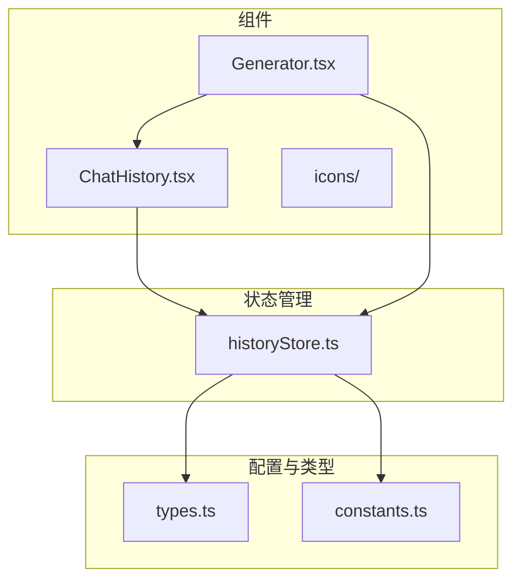
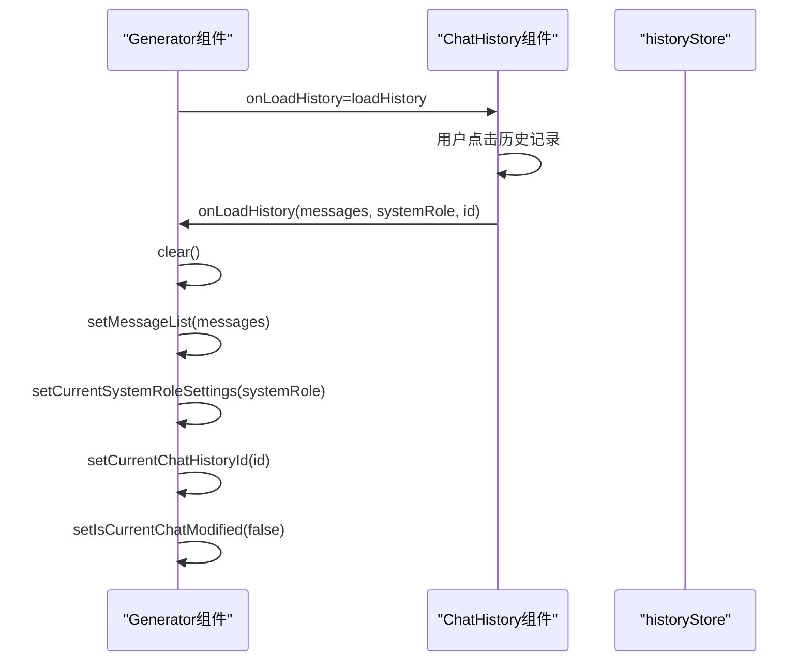
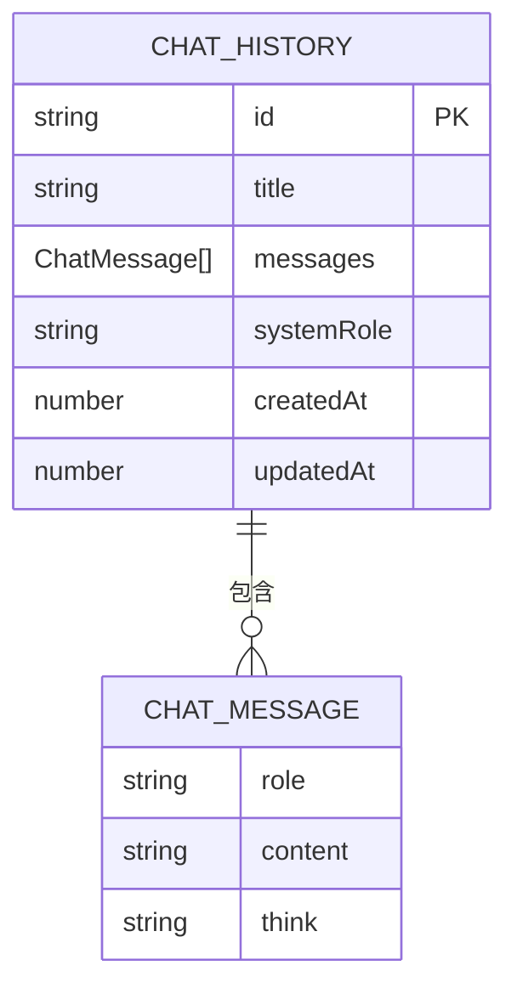
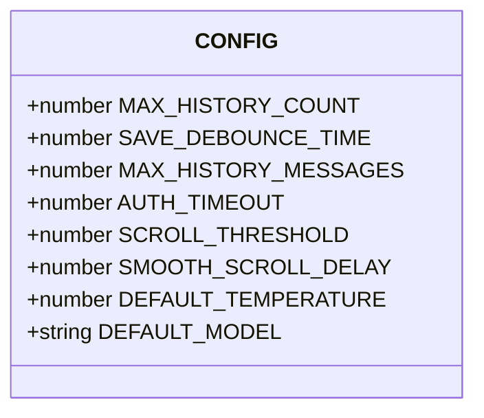
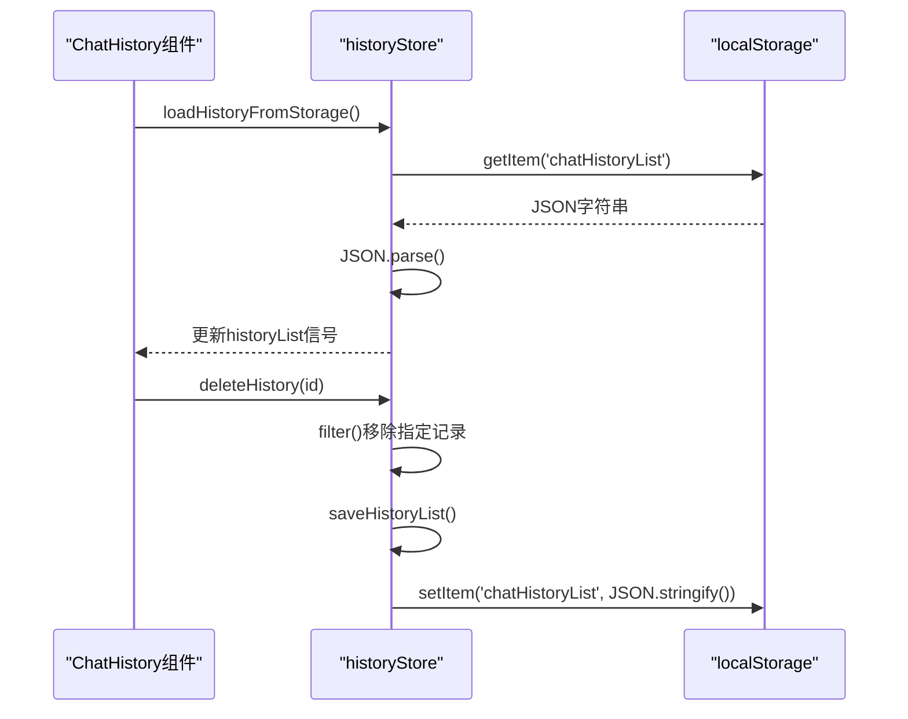
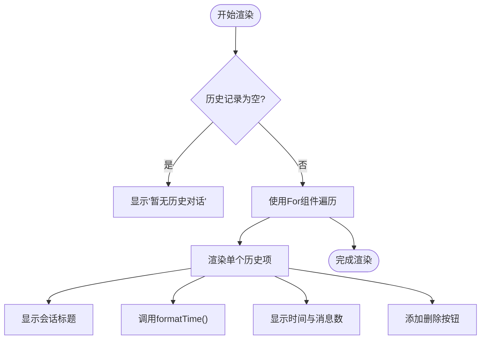
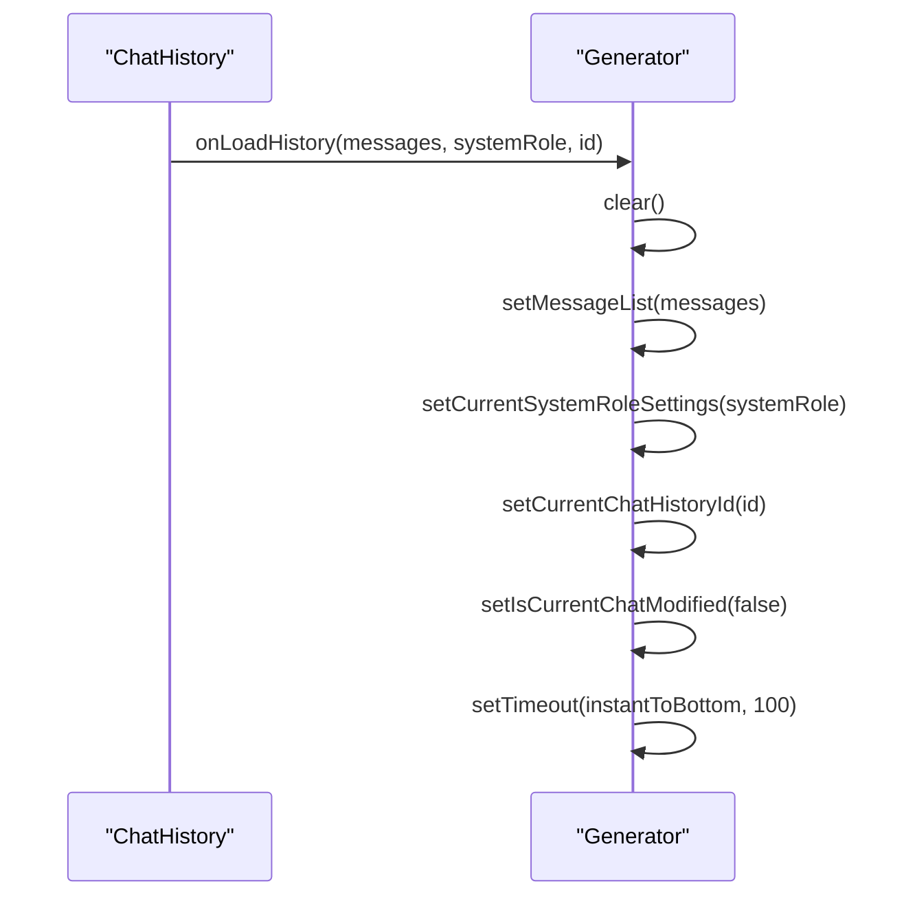

# ChatHistory组件

<cite>
**本文档引用的文件**   
- [ChatHistory.tsx](file://src/components/ChatHistory.tsx)
- [historyStore.ts](file://src/store/historyStore.ts)
- [types.ts](file://src/types.ts)
- [constants.ts](file://src/config/constants.ts)
- [Generator.tsx](file://src/components/Generator.tsx)
</cite>

## 目录
1. [项目结构分析](#项目结构分析)
2. [核心组件分析](#核心组件分析)
3. [数据结构与类型定义](#数据结构与类型定义)
4. [历史记录管理机制](#历史记录管理机制)
5. [用户界面与交互逻辑](#用户界面与交互逻辑)
6. [数据流与状态管理](#数据流与状态管理)
7. [持久化存储策略](#持久化存储策略)
8. [版本兼容性与错误处理](#版本兼容性与错误处理)

## 项目结构分析



**图表来源**
- [ChatHistory.tsx](file://src/components/ChatHistory.tsx)
- [historyStore.ts](file://src/store/historyStore.ts)
- [Generator.tsx](file://src/components/Generator.tsx)
- [types.ts](file://src/types.ts)
- [constants.ts](file://src/config/constants.ts)

**本节来源**
- [ChatHistory.tsx](file://src/components/ChatHistory.tsx)
- [historyStore.ts](file://src/store/historyStore.ts)

## 核心组件分析

### ChatHistory组件功能概述

ChatHistory组件是聊天应用中负责管理用户历史对话的核心UI组件。它提供了一个可展开的侧边栏界面，允许用户查看、加载和删除之前的聊天记录。该组件通过与historyStore的状态管理机制紧密集成，实现了历史数据的本地持久化存储和检索功能。

组件的主要职责包括：
- 显示历史对话列表
- 处理用户点击加载历史记录的事件
- 提供删除单个历史记录的功能
- 管理历史对话弹窗的显示与隐藏状态

**本节来源**
- [ChatHistory.tsx](file://src/components/ChatHistory.tsx)

### Generator组件与ChatHistory的集成



**图表来源**
- [Generator.tsx](file://src/components/Generator.tsx#L387)
- [ChatHistory.tsx](file://src/components/ChatHistory.tsx#L25)

**本节来源**
- [Generator.tsx](file://src/components/Generator.tsx)
- [ChatHistory.tsx](file://src/components/ChatHistory.tsx)

## 数据结构与类型定义

### 历史记录数据模型



**图表来源**
- [types.ts](file://src/types.ts#L10-L18)

**本节来源**
- [types.ts](file://src/types.ts)

### 配置常量定义



**图表来源**
- [constants.ts](file://src/config/constants.ts#L1-L37)

**本节来源**
- [constants.ts](file://src/config/constants.ts)

## 历史记录管理机制

### 本地存储读取与写入

ChatHistory组件通过导入historyStore中的API来实现本地存储的读取、写入与删除操作。核心机制如下：

1. **数据读取**：组件在挂载时调用`loadHistoryFromStorage()`函数，从localStorage中读取名为'chatHistoryList'的JSON字符串，并解析为ChatHistory数组。

2. **数据写入**：通过`saveHistoryList`函数实现数据写入，该函数使用防抖技术（由solidjs-use的useThrottleFn提供）来优化性能，避免频繁的存储操作。

3. **数据删除**：`deleteHistory`函数通过过滤掉指定ID的记录来实现删除功能，然后调用`saveHistoryList`更新存储。



**图表来源**
- [historyStore.ts](file://src/store/historyStore.ts#L48-L110)
- [ChatHistory.tsx](file://src/components/ChatHistory.tsx#L16)

**本节来源**
- [historyStore.ts](file://src/store/historyStore.ts)
- [ChatHistory.tsx](file://src/components/ChatHistory.tsx)

### 会话标题生成策略

会话标题的生成遵循以下逻辑：
- 查找会话中的第一条用户消息
- 截取该消息的前25个字符作为标题
- 如果消息长度超过25个字符，则添加省略号
- 如果没有用户消息，则使用默认标题"新对话"

```typescript
const generateTitle = (messages: ChatMessage[]) => {
  const firstUserMessage = messages.find(msg => msg.role === 'user')
  if (firstUserMessage) {
    return firstUserMessage.content.slice(0, 25) + (firstUserMessage.content.length > 25 ? '...' : '')
  }
  return '新对话'
}
```

**本节来源**
- [historyStore.ts](file://src/store/historyStore.ts#L32-L40)

## 用户界面与交互逻辑

### 历史记录列表渲染

历史记录列表的渲染逻辑包含以下关键要素：

1. **条件渲染**：当`historyList()`为空时显示"暂无历史对话"提示；否则使用`<For>`组件遍历并渲染每条记录。

2. **时间戳格式化**：`formatTime`函数根据时间差显示不同的格式：
   - 同一天：显示具体时间（如"14:30"）
   - 昨天：显示"昨天"
   - 7天内：显示"X天前"
   - 超过7天：显示月日（如"3月15日"）

3. **最近使用排序**：新的历史记录被添加到数组开头，确保最近的会话显示在列表顶部。



**图表来源**
- [ChatHistory.tsx](file://src/components/ChatHistory.tsx#L61-L113)

**本节来源**
- [ChatHistory.tsx](file://src/components/ChatHistory.tsx)

### 会话切换状态重置

当用户从历史记录中加载会话时，会触发一系列状态重置操作：

1. **清除当前会话**：调用`clear()`函数清空当前消息列表和相关状态
2. **加载历史数据**：将历史记录中的消息和系统角色设置应用到当前状态
3. **更新会话状态**：设置当前会话ID并标记为未修改状态
4. **滚动到底部**：延迟滚动到最新消息位置



**图表来源**
- [Generator.tsx](file://src/components/Generator.tsx#L323-L341)

**本节来源**
- [Generator.tsx](file://src/components/Generator.tsx)

## 数据流与状态管理

### 组件间通信机制

ChatHistory组件与Generator组件通过props回调函数进行通信：

1. **回调函数传递**：Generator组件将`loadHistory`函数作为`onLoadHistory`属性传递给ChatHistory组件。

2. **事件触发**：当用户点击历史记录时，ChatHistory组件调用`props.onLoadHistory()`。

3. **状态更新**：Generator组件接收到回调后，更新自身状态以加载历史会话。

```typescript
// Generator组件中的回调定义
const loadHistory = (messages: ChatMessage[], systemRole: string, historyId?: string) => {
  clear()
  setMessageList(messages)
  setCurrentSystemRoleSettings(systemRole)
  setCurrentChatHistoryId(historyId)
  setIsCurrentChatModified(false)
}

// ChatHistory组件中的调用
const loadHistory = (history: ChatHistory) => {
  props.onLoadHistory(history.messages, history.systemRole, history.id)
  setShowHistory(false)
}
```

**本节来源**
- [Generator.tsx](file://src/components/Generator.tsx#L323-L341)
- [ChatHistory.tsx](file://src/components/ChatHistory.tsx#L25)

## 持久化存储策略

### 数据结构设计

持久化存储的数据结构设计考虑了以下因素：

1. **唯一标识**：使用`crypto.randomUUID()`生成UUID，降级方案为时间戳+随机数。

2. **时间戳管理**：包含`createdAt`和`updatedAt`两个时间戳，分别记录创建和更新时间。

3. **容量限制**：通过`MAX_HISTORY_COUNT`常量（默认25）限制历史记录数量，超出时自动截断。

4. **防抖保存**：使用`SAVE_DEBOUNCE_TIME`（默认500ms）进行防抖，避免频繁写入存储。

```typescript
const saveHistoryList = useThrottleFn((list: ChatHistory[]) => {
  try {
    localStorage.setItem('chatHistoryList', JSON.stringify(list))
    setHistoryList(list)
  } catch (e) {
    console.error('Failed to save chat history:', e)
  }
}, CONFIG.SAVE_DEBOUNCE_TIME, false, true)
```

**本节来源**
- [historyStore.ts](file://src/store/historyStore.ts#L48-L55)
- [constants.ts](file://src/config/constants.ts#L4-L7)

### 版本兼容性处理

存储机制包含以下版本兼容性处理：

1. **错误处理**：在JSON解析和存储操作中使用try-catch块，防止因数据损坏导致应用崩溃。

2. **降级方案**：当`crypto.randomUUID()`不可用时，使用时间戳+随机数的组合方案生成唯一ID。

3. **数据验证**：在保存前检查消息数组是否为空，避免保存无效数据。

```typescript
// 加载时的错误处理
const loadHistoryFromStorage = () => {
  try {
    const saved = localStorage.getItem('chatHistoryList')
    if (saved) {
      setHistoryList(JSON.parse(saved))
    }
  } catch (e) {
    console.error('Failed to load chat history:', e)
  }
}
```

**本节来源**
- [historyStore.ts](file://src/store/historyStore.ts#L10-L18)

## 版本兼容性与错误处理

### 错误处理机制

系统实现了多层次的错误处理机制：

1. **存储操作错误**：在localStorage读写操作中使用try-catch捕获异常，并记录错误日志。

2. **ID生成错误**：当`crypto.randomUUID()`失败时，捕获异常并使用降级方案。

3. **数据完整性**：通过类型系统和运行时检查确保数据结构的完整性。

```mermaid
flowchart TD
A[开始存储操作] --> B{操作成功?}
B --> |是| C[更新状态]
B --> |否| D[捕获异常]
D --> E[记录错误日志]
E --> F[继续执行]
G[开始ID生成] --> H{crypto可用?}
H --> |是| I[尝试randomUUID()]
H --> |否| J[使用时间戳+随机数]
I --> K{生成成功?}
K --> |是| L[返回UUID]
K --> |否| M[使用时间戳+随机数]
```

**图表来源**
- [historyStore.ts](file://src/store/historyStore.ts#L10-L18)
- [historyStore.ts](file://src/store/historyStore.ts#L38-L46)

**本节来源**
- [historyStore.ts](file://src/store/historyStore.ts)

### 数据流图

```mermaid
graph TD
A[用户操作] --> B{操作类型}
B --> |加载历史| C[ChatHistory组件]
B --> |创建/更新| D[Generator组件]
C --> E[调用onLoadHistory回调]
E --> F[Generator.clear()]
F --> G[设置消息和系统角色]
G --> H[更新会话状态]
H --> I[滚动到底部]
D --> J[调用saveOrUpdateChat]
J --> K[生成或更新历史记录]
K --> L[调用saveHistoryList]
L --> M[防抖处理]
M --> N[写入localStorage]
N --> O[更新historyList信号]
O --> P[界面自动更新]
```

**图表来源**
- [ChatHistory.tsx](file://src/components/ChatHistory.tsx)
- [historyStore.ts](file://src/store/historyStore.ts)
- [Generator.tsx](file://src/components/Generator.tsx)

**本节来源**
- [ChatHistory.tsx](file://src/components/ChatHistory.tsx)
- [historyStore.ts](file://src/store/historyStore.ts)
- [Generator.tsx](file://src/components/Generator.tsx)