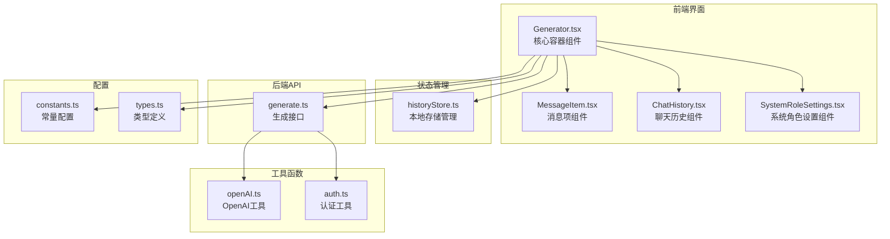
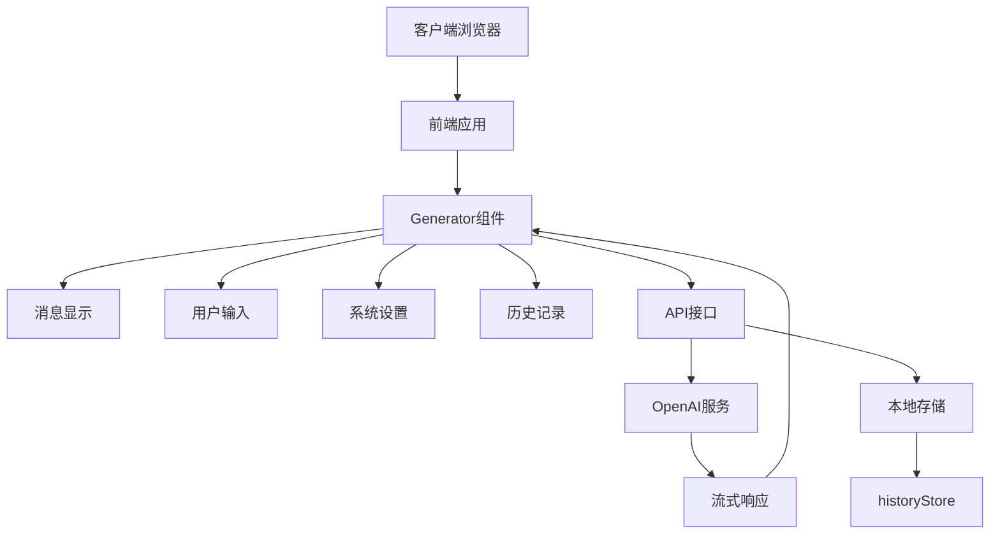
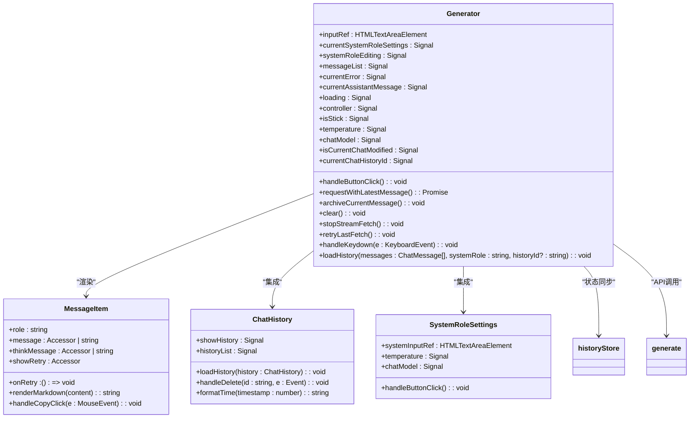
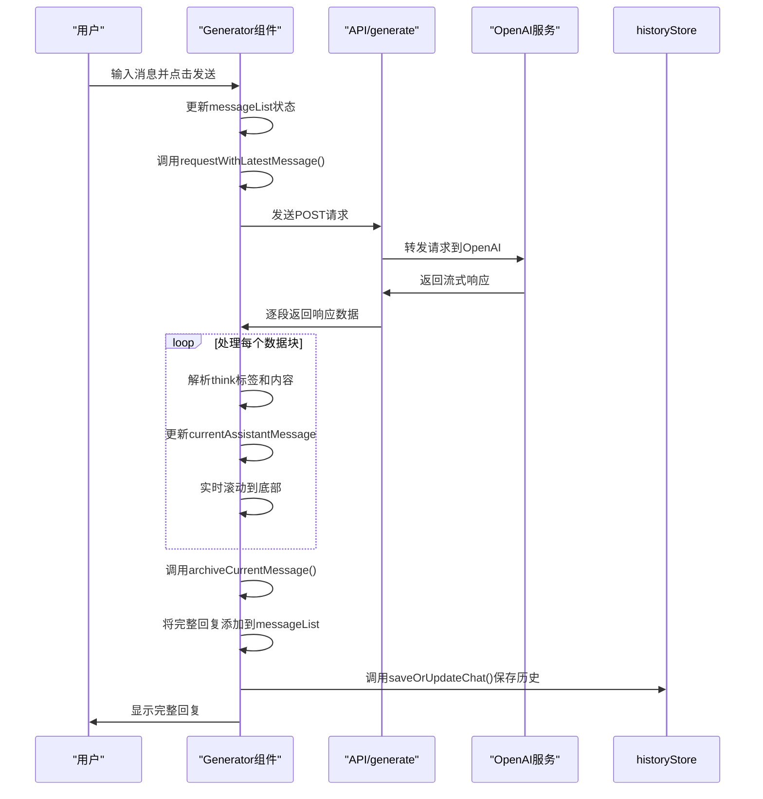
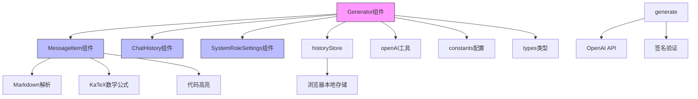
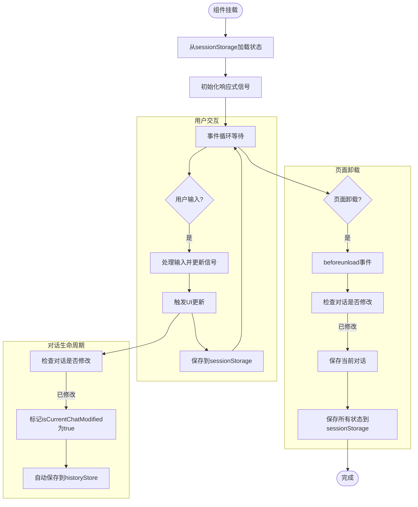
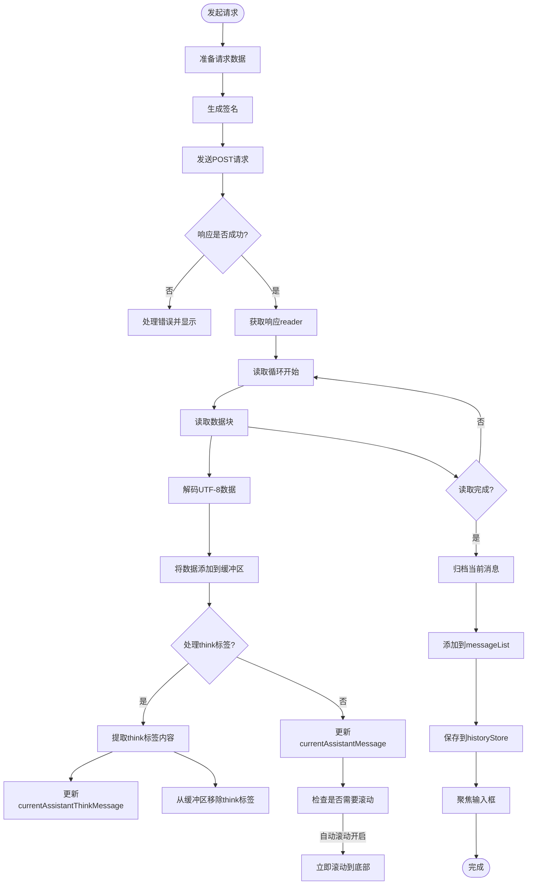
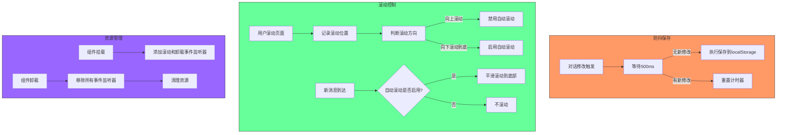
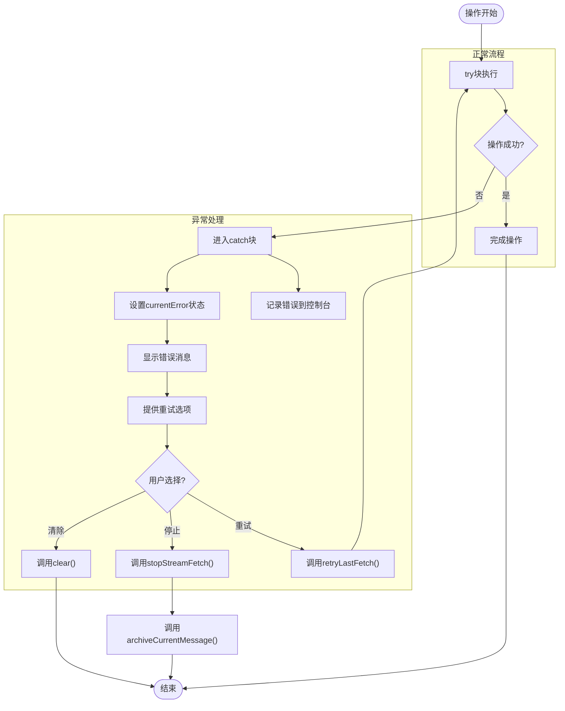

# Generator组件

<cite>
**本文档中引用的文件**   
- [Generator.tsx](file://src/components/Generator.tsx#L1-L392)
- [MessageItem.tsx](file://src/components/MessageItem.tsx#L1-L119)
- [ChatHistory.tsx](file://src/components/ChatHistory.tsx#L1-L115)
- [SystemRoleSettings.tsx](file://src/components/SystemRoleSettings.tsx#L1-L106)
- [historyStore.ts](file://src/store/historyStore.ts#L1-L112)
- [generate.ts](file://src/pages/api/generate.ts#L1-L71)
- [openAI.ts](file://src/utils/openAI.ts#L1-L72)
- [constants.ts](file://src/config/constants.ts#L1-L38)
- [types.ts](file://src/types.ts#L1-L20)
- [index.astro](file://src/pages/index.astro#L1-L37)
</cite>

## 目录
1. [项目结构分析](#项目结构分析)
2. [核心组件分析](#核心组件分析)
3. [架构概览](#架构概览)
4. [详细组件分析](#详细组件分析)
5. [依赖关系分析](#依赖关系分析)
6. [状态管理机制](#状态管理机制)
7. [API调用与流式响应](#api调用与流式响应)
8. [生命周期与事件处理](#生命周期与事件处理)
9. [性能优化策略](#性能优化策略)
10. [错误处理机制](#错误处理机制)

## 项目结构分析

项目采用基于功能的模块化组织结构，主要分为组件、配置、API路由、状态管理和工具函数等模块。核心聊天功能集中在`src/components`目录下，通过Astro框架的SSG能力进行渲染。



**Diagram sources**
- [Generator.tsx](file://src/components/Generator.tsx#L1-L392)
- [historyStore.ts](file://src/store/historyStore.ts#L1-L112)
- [generate.ts](file://src/pages/api/generate.ts#L1-L71)

**Section sources**
- [Generator.tsx](file://src/components/Generator.tsx#L1-L392)
- [project_structure](file://#L1-L50)

## 核心组件分析

`Generator.tsx`作为聊天界面的核心容器组件，负责协调各个子组件的工作，管理对话状态流和用户输入逻辑。它通过Solid.js的响应式系统实现高效的状态更新和UI渲染。

**Section sources**
- [Generator.tsx](file://src/components/Generator.tsx#L1-L392)

## 架构概览

整个应用采用前后端分离架构，前端使用Solid.js实现响应式UI，后端通过Astro API路由与OpenAI服务通信。`Generator`组件处于组件树的顶层，负责整合所有功能模块。



**Diagram sources**
- [Generator.tsx](file://src/components/Generator.tsx#L1-L392)
- [generate.ts](file://src/pages/api/generate.ts#L1-L71)
- [historyStore.ts](file://src/store/historyStore.ts#L1-L112)

## 详细组件分析

### Generator组件分析

`Generator`组件作为聊天界面的主容器，集成了消息显示、用户输入、系统设置和历史记录等功能模块，通过响应式信号系统管理复杂的对话状态。

#### 响应式状态管理


**Diagram sources**
- [Generator.tsx](file://src/components/Generator.tsx#L13-L392)
- [MessageItem.tsx](file://src/components/MessageItem.tsx#L1-L119)
- [ChatHistory.tsx](file://src/components/ChatHistory.tsx#L1-L115)
- [SystemRoleSettings.tsx](file://src/components/SystemRoleSettings.tsx#L1-L106)

**Section sources**
- [Generator.tsx](file://src/components/Generator.tsx#L1-L392)

### 消息处理流程

#### 消息发送与响应序列图


**Diagram sources**
- [Generator.tsx](file://src/components/Generator.tsx#L200-L300)
- [generate.ts](file://src/pages/api/generate.ts#L1-L71)

**Section sources**
- [Generator.tsx](file://src/components/Generator.tsx#L200-L300)

## 依赖关系分析

`Generator`组件与多个子组件和工具模块存在紧密的依赖关系，形成了完整的聊天功能闭环。



**Diagram sources**
- [Generator.tsx](file://src/components/Generator.tsx#L1-L392)
- [project_structure](file://#L1-L50)

**Section sources**
- [Generator.tsx](file://src/components/Generator.tsx#L1-L392)

## 状态管理机制

`Generator`组件利用Solid.js的信号系统实现响应式状态管理，同时与`historyStore`协同工作，确保对话状态在内存和本地存储之间保持同步。

#### 状态同步流程图


**Diagram sources**
- [Generator.tsx](file://src/components/Generator.tsx#L50-L100)
- [historyStore.ts](file://src/store/historyStore.ts#L1-L112)

**Section sources**
- [Generator.tsx](file://src/components/Generator.tsx#L50-L100)

## API调用与流式响应

`Generator`组件通过`fetch` API与后端`/api/generate`接口通信，实现流式响应处理，提供类似ChatGPT的实时打字效果。

#### API调用流程图


**Diagram sources**
- [Generator.tsx](file://src/components/Generator.tsx#L200-L300)
- [generate.ts](file://src/pages/api/generate.ts#L1-L71)
- [openAI.ts](file://src/utils/openAI.ts#L1-L72)

**Section sources**
- [Generator.tsx](file://src/components/Generator.tsx#L200-L300)

## 生命周期与事件处理

`Generator`组件利用Solid.js的生命周期钩子管理组件的挂载、更新和卸载过程，确保资源的正确分配和释放。

#### 组件生命周期图
```mermaid
stateDiagram-v2
[*] --> Created
Created --> Mounted : onMount()
Mounted --> Active : 事件处理
Active --> Scrolling : 滚动事件
Scrolling --> CheckPosition["检查滚动位置"]
CheckPosition --> |用户向上滚动| DisableStick["禁用自动滚动"]
CheckPosition --> |用户向下滚动到底| EnableStick["启用自动滚动"]
Active --> KeyInput : 键盘事件
KeyInput --> CheckEnter{"按Enter键?"}
CheckEnter --> |是| SendMessage["发送消息"]
CheckEnter --> |Shift+Enter| NewLine["换行"]
Active --> ButtonClick : 按钮点击
ButtonClick --> HandleClick["处理点击事件"]
Active --> PageUnload : beforeunload
PageUnload --> CheckModified["检查对话是否修改"]
CheckModified --> |已修改| SaveChat["保存对话"]
CheckModified --> SaveState["保存状态到sessionStorage"]
PageUnload --> Unmounted : onCleanup()
Unmounted --> [*]
```

**Diagram sources**
- [Generator.tsx](file://src/components/Generator.tsx#L50-L100)

**Section sources**
- [Generator.tsx](file://src/components/Generator.tsx#L50-L100)

## 性能优化策略

`Generator`组件采用了多种性能优化策略，包括防抖保存、平滑滚动控制和资源清理等机制。

#### 性能优化机制


**Diagram sources**
- [Generator.tsx](file://src/components/Generator.tsx#L50-L100)
- [historyStore.ts](file://src/store/historyStore.ts#L30-L40)

**Section sources**
- [Generator.tsx](file://src/components/Generator.tsx#L50-L100)

## 错误处理机制

`Generator`组件实现了完善的错误处理机制，能够捕获和处理网络请求、API调用和用户交互中的各种异常情况。

#### 错误处理流程图


**Diagram sources**
- [Generator.tsx](file://src/components/Generator.tsx#L250-L280)

**Section sources**
- [Generator.tsx](file://src/components/Generator.tsx#L250-L280)