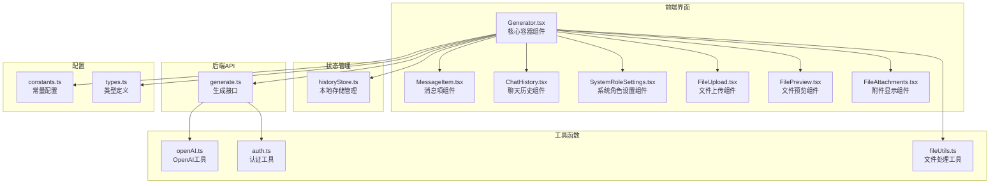
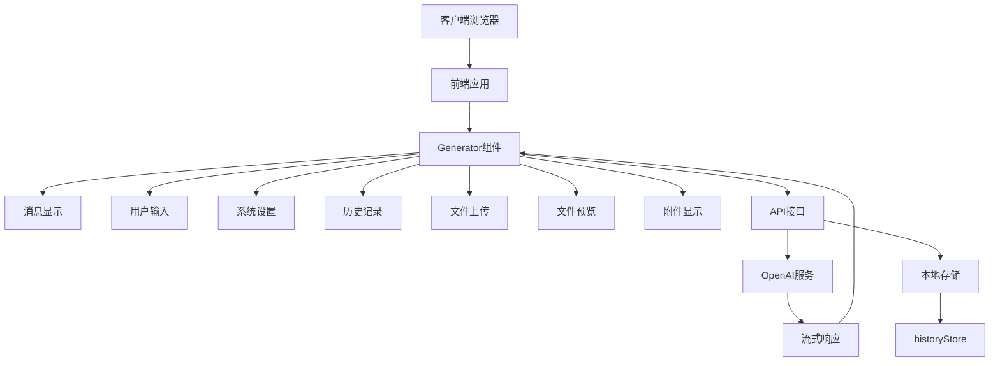

<docs>
# Generator组件

<cite>
**本文档中引用的文件**   
- [Generator.tsx](file://src/components/Generator.tsx#L1-L392) - *新增文件上传功能*
- [MessageItem.tsx](file://src/components/MessageItem.tsx#L1-L119)
- [ChatHistory.tsx](file://src/components/ChatHistory.tsx#L1-L115)
- [SystemRoleSettings.tsx](file://src/components/SystemRoleSettings.tsx#L1-L106)
- [historyStore.ts](file://src/store/historyStore.ts#L1-L112)
- [generate.ts](file://src/pages/api/generate.ts#L1-L71)
- [openAI.ts](file://src/utils/openAI.ts#L1-L72)
- [constants.ts](file://src/config/constants.ts#L1-L38)
- [types.ts](file://src/types.ts#L1-L20)
- [index.astro](file://src/pages/index.astro#L1-L37)
- [FileUpload.tsx](file://src/components/FileUpload.tsx#L1-L114) - *新增文件上传组件*
- [FilePreview.tsx](file://src/components/FilePreview.tsx#L1-L47) - *新增文件预览组件*
- [FileAttachments.tsx](file://src/components/FileAttachments.tsx#L1-L77) - *新增附件处理组件*
- [fileUtils.ts](file://src/utils/fileUtils.ts#L1-L154) - *新增文件处理工具*
</cite>

## 更新摘要
**变更内容**   
- 新增了文件上传、预览和附件处理功能的详细说明
- 更新了项目结构分析，包含新的文件处理组件
- 新增了文件处理流程的序列图
- 更新了依赖关系分析，包含文件处理相关模块
- 新增了文件状态管理的说明
- 更新了响应式状态管理的类图
- 优化了消息处理流程的描述

## 目录
1. [项目结构分析](#项目结构分析)
2. [核心组件分析](#核心组件分析)
3. [架构概览](#架构概览)
4. [详细组件分析](#详细组件分析)
5. [依赖关系分析](#依赖关系分析)
6. [状态管理机制](#状态管理机制)
7. [API调用与流式响应](#api调用与流式响应)
8. [生命周期与事件处理](#生命周期与事件处理)
9. [性能优化策略](#性能优化策略)
10. [错误处理机制](#错误处理机制)

## 项目结构分析

项目采用基于功能的模块化组织结构，主要分为组件、配置、API路由、状态管理和工具函数等模块。核心聊天功能集中在`src/components`目录下，通过Astro框架的SSG能力进行渲染。新增了文件上传、预览和附件处理的相关组件。



**图表来源**
- [Generator.tsx](file://src/components/Generator.tsx#L1-L392)
- [historyStore.ts](file://src/store/historyStore.ts#L1-L112)
- [generate.ts](file://src/pages/api/generate.ts#L1-L71)
- [FileUpload.tsx](file://src/components/FileUpload.tsx#L1-L114)
- [FilePreview.tsx](file://src/components/FilePreview.tsx#L1-L47)
- [FileAttachments.tsx](file://src/components/FileAttachments.tsx#L1-L77)

**本节来源**
- [Generator.tsx](file://src/components/Generator.tsx#L1-L392)
- [project_structure](file://#L1-L50)

## 核心组件分析

`Generator.tsx`作为聊天界面的核心容器组件，负责协调各个子组件的工作，管理对话状态流和用户输入逻辑。它通过Solid.js的响应式系统实现高效的状态更新和UI渲染。新增了文件上传、预览和附件处理功能，支持用户在对话中上传文件。

**本节来源**
- [Generator.tsx](file://src/components/Generator.tsx#L1-L392)

## 架构概览

整个应用采用前后端分离架构，前端使用Solid.js实现响应式UI，后端通过Astro API路由与OpenAI服务通信。`Generator`组件处于组件树的顶层，负责整合所有功能模块，包括新增的文件处理功能。



**图表来源**
- [Generator.tsx](file://src/components/Generator.tsx#L1-L392)
- [generate.ts](file://src/pages/api/generate.ts#L1-L71)
- [historyStore.ts](file://src/store/historyStore.ts#L1-L112)

## 详细组件分析

### Generator组件分析

`Generator`组件作为聊天界面的主容器，集成了消息显示、用户输入、系统设置、历史记录和文件处理等功能模块，通过响应式信号系统管理复杂的对话状态。

#### 响应式状态管理
```mermaid
classDiagram
class Generator {
+inputRef : HTMLTextAreaElement
+currentSystemRoleSettings : Signal<string>
+systemRoleEditing : Signal<boolean>
+messageList : Signal<ChatMessage[]>
+currentError : Signal<ErrorMessage>
+currentAssistantMessage : Signal<string>
+loading : Signal<boolean>
+controller : Signal<AbortController>
+isStick : Signal<boolean>
+temperature : Signal<number>
+chatModel : Signal<string>
+isCurrentChatModified : Signal<boolean>
+currentChatHistoryId : Signal<string>
+pendingAttachments : Signal<FileAttachment[]>
+handleButtonClick() : void
+requestWithLatestMessage() : Promise<void>
+archiveCurrentMessage() : void
+clear() : void
+stopStreamFetch() : void
+retryLastFetch() : void
+handleKeydown(e : KeyboardEvent) : void
+loadHistory(messages : ChatMessage[], systemRole : string, historyId? : string) : void
+handleFilesSelected(files : FileAttachment[]) : void
+removeFile(fileId : string) : void
+clearAllFiles() : void
}
class MessageItem {
+role : string
+message : Accessor<string> | string
+thinkMessage : Accessor<string> | string
+showRetry : Accessor<boolean>
+onRetry : () => void
+renderMarkdown(content) : string
+handleCopyClick(e : MouseEvent) : void
}
class ChatHistory {
+showHistory : Signal<boolean>
+historyList : Signal<ChatHistory[]>
+loadHistory(history : ChatHistory) : void
+handleDelete(id : string, e : Event) : void
+formatTime(timestamp : number) : string
}
class SystemRoleSettings {
+systemInputRef : HTMLTextAreaElement
+temperature : Signal<number>
+chatModel : Signal<string>
+handleButtonClick() : void
}
class FileUpload {
+isDragOver : Signal<boolean>
+isUploading : Signal<boolean>
+handleFiles(files : FileList) : Promise<void>
+handleDragEvent(e : DragEvent, isDragging? : boolean) : void
+handleInputChange(e : Event) : void
}
class FilePreview {
+files : FileAttachment[]
+onRemoveFile(fileId : string) : void
+onClearAll() : void
}
class FileAttachments {
+attachments : FileAttachment[]
+downloadFile(attachment : FileAttachment) : void
}
Generator --> MessageItem : "渲染"
Generator --> ChatHistory : "集成"
Generator --> SystemRoleSettings : "集成"
Generator --> FileUpload :