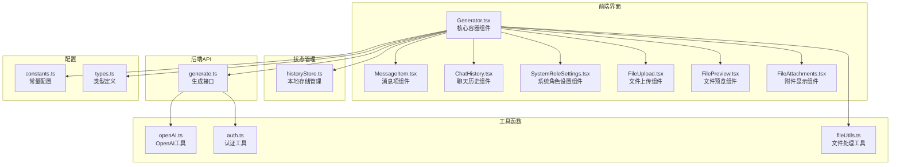
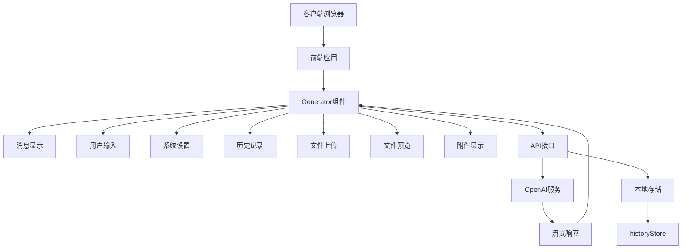
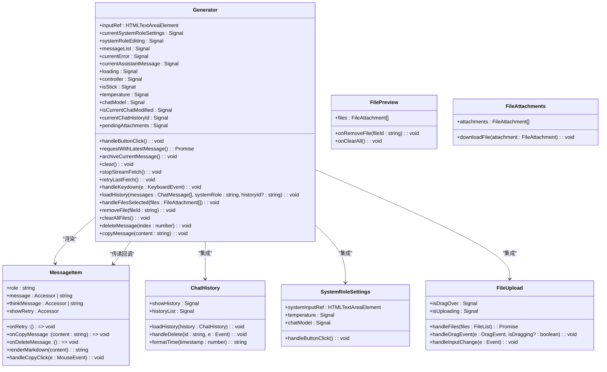
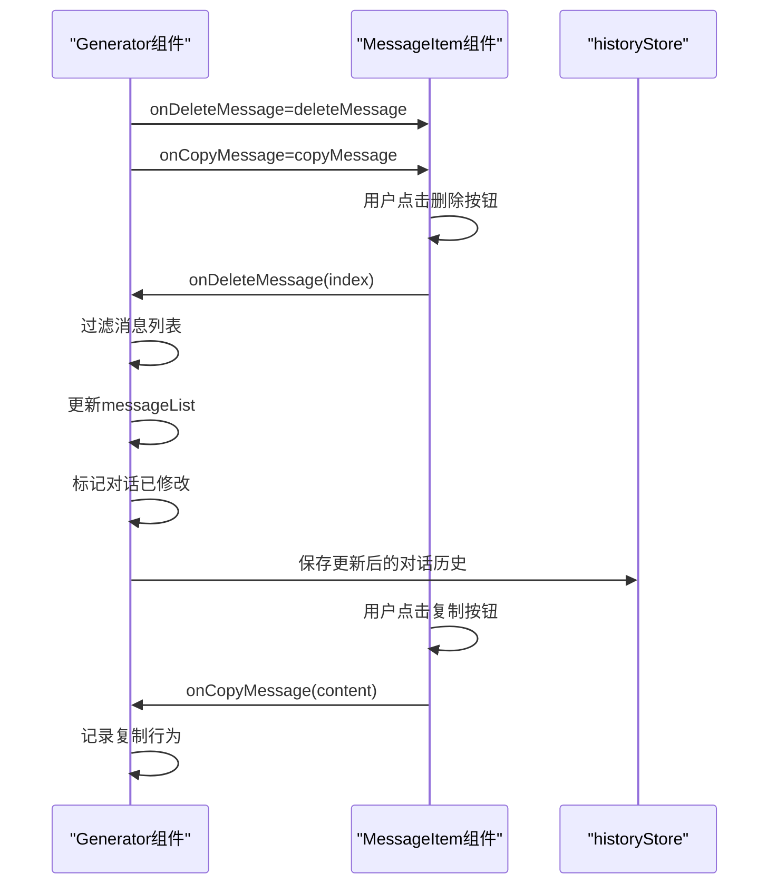

# Generator组件

<cite>
**本文档中引用的文件**   
- [Generator.tsx](file://src/components/Generator.tsx#L1-L466) - *新增复制和删除单条消息功能*
- [MessageItem.tsx](file://src/components/MessageItem.tsx#L1-L171) - *新增onCopyMessage和onDeleteMessage回调支持*
- [ChatHistory.tsx](file://src/components/ChatHistory.tsx#L1-L115)
- [SystemRoleSettings.tsx](file://src/components/SystemRoleSettings.tsx#L1-L106)
- [historyStore.ts](file://src/store/historyStore.ts#L1-L112)
- [generate.ts](file://src/pages/api/generate.ts#L1-L71)
- [openAI.ts](file://src/utils/openAI.ts#L1-L72)
- [constants.ts](file://src/config/constants.ts#L1-L38)
- [types.ts](file://src/types.ts#L1-L29)
- [FileUpload.tsx](file://src/components/FileUpload.tsx#L1-L114)
- [FilePreview.tsx](file://src/components/FilePreview.tsx#L1-L47)
- [FileAttachments.tsx](file://src/components/FileAttachments.tsx#L1-L77)
- [fileUtils.ts](file://src/utils/fileUtils.ts#L1-L154)
</cite>

## 更新摘要
**变更内容**   
- 新增了复制单条消息和删除单条消息功能的详细说明
- 更新了组件间通信机制，包含新的回调函数传递
- 新增了消息操作的序列图
- 更新了依赖关系分析，包含消息操作相关逻辑
- 新增了消息删除后的状态同步策略说明
- 更新了响应式状态管理的类图
- 优化了用户交互流程的描述

## 目录
1. [项目结构分析](#项目结构分析)
2. [核心组件分析](#核心组件分析)
3. [架构概览](#架构概览)
4. [详细组件分析](#详细组件分析)
5. [依赖关系分析](#依赖关系分析)
6. [状态管理机制](#状态管理机制)
7. [API调用与流式响应](#api调用与流式响应)
8. [生命周期与事件处理](#生命周期与事件处理)
9. [性能优化策略](#性能优化策略)
10. [错误处理机制](#错误处理机制)

## 项目结构分析

项目采用基于功能的模块化组织结构，主要分为组件、配置、API路由、状态管理和工具函数等模块。核心聊天功能集中在`src/components`目录下，通过Astro框架的SSG能力进行渲染。新增了消息复制和删除功能的相关逻辑。

**图表来源**
- [Generator.tsx](file://src/components/Generator.tsx#L1-L466)
- [historyStore.ts](file://src/store/historyStore.ts#L1-L112)
- [generate.ts](file://src/pages/api/generate.ts#L1-L71)
- [FileUpload.tsx](file://src/components/FileUpload.tsx#L1-L114)
- [FilePreview.tsx](file://src/components/FilePreview.tsx#L1-L47)
- [FileAttachments.tsx](file://src/components/FileAttachments.tsx#L1-L77)

**本节来源**
- [Generator.tsx](file://src/components/Generator.tsx#L1-L466)
- [project_structure](file://#L1-L50)

## 核心组件分析

`Generator.tsx`作为聊天界面的核心容器组件，负责协调各个子组件的工作，管理对话状态流和用户输入逻辑。它通过Solid.js的响应式系统实现高效的状态更新和UI渲染。新增了复制和删除单条消息的功能，支持用户对历史消息进行操作。

**本节来源**
- [Generator.tsx](file://src/components/Generator.tsx#L1-L466)

## 架构概览

整个应用采用前后端分离架构，前端使用Solid.js实现响应式UI，后端通过Astro API路由与OpenAI服务通信。`Generator`组件处于组件树的顶层，负责整合所有功能模块，包括新增的消息操作功能。

**图表来源**
- [Generator.tsx](file://src/components/Generator.tsx#L1-L466)
- [generate.ts](file://src/pages/api/generate.ts#L1-L71)
- [historyStore.ts](file://src/store/historyStore.ts#L1-L112)

## 详细组件分析

### Generator组件分析

`Generator`组件作为聊天界面的主容器，集成了消息显示、用户输入、系统设置、历史记录和文件处理等功能模块，通过响应式信号系统管理复杂的对话状态。

#### 响应式状态管理

**图表来源**
- [Generator.tsx](file://src/components/Generator.tsx#L1-L466)
- [MessageItem.tsx](file://src/components/MessageItem.tsx#L1-L171)

#### 消息操作功能实现
`Generator`组件新增了`deleteMessage`和`copyMessage`两个函数，用于处理单条消息的删除和复制操作。`deleteMessage`函数接收消息索引作为参数，从`messageList`中过滤掉指定索引的消息，并更新对话状态。当消息被删除后，如果对话历史长度大于0，则调用`saveOrUpdateChat`函数保存更新后的对话历史。`copyMessage`函数接收消息内容作为参数，可以用于记录复制行为或进行其他处理。

**图表来源**
- [Generator.tsx](file://src/components/Generator.tsx#L1-L466)
- [MessageItem.tsx](file://src/components/MessageItem.tsx#L1-L171)

**本节来源**
- [Generator.tsx](file://src/components/Generator.tsx#L1-L466)
- [MessageItem.tsx](file://src/components/MessageItem.tsx#L1-L171)