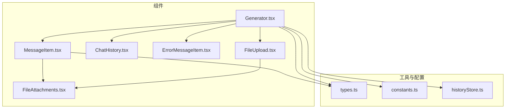
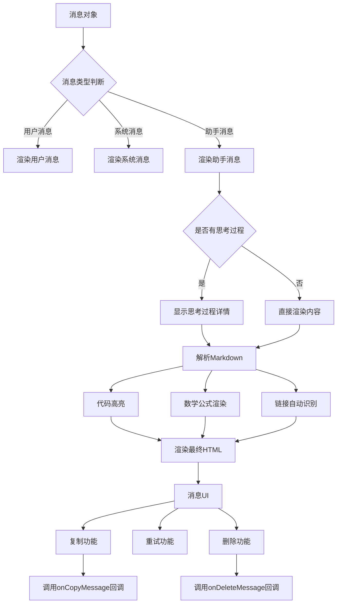
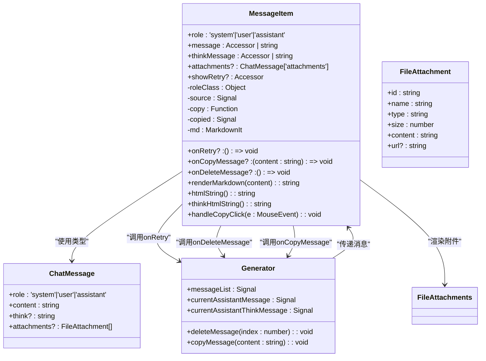
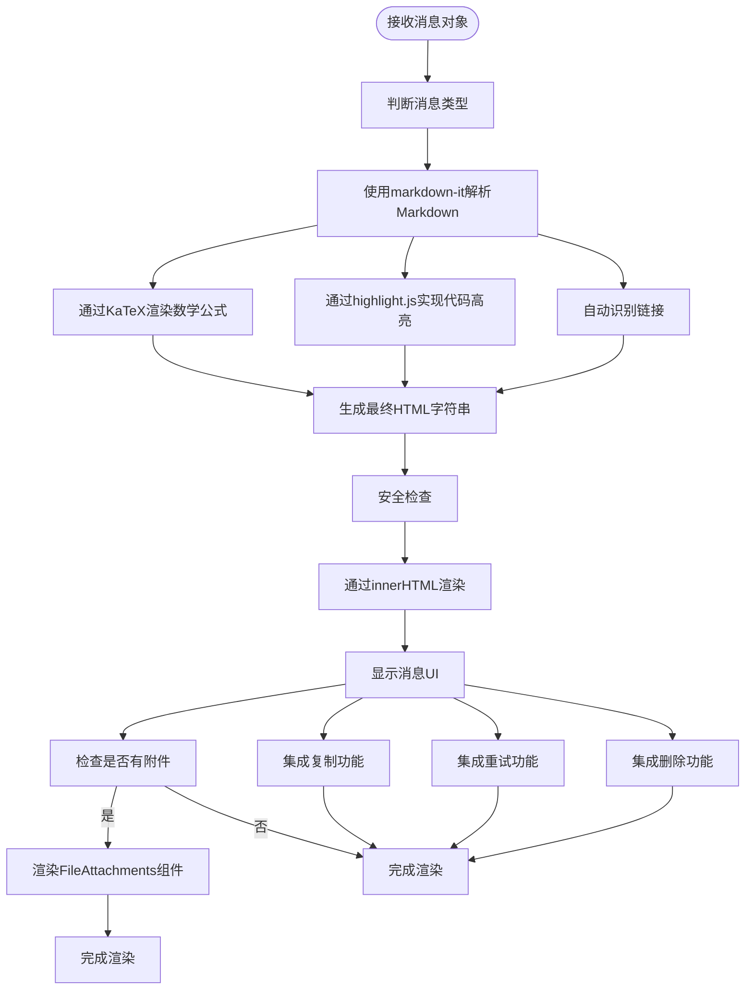
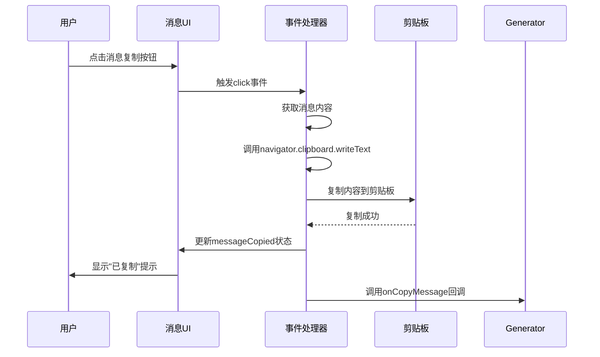
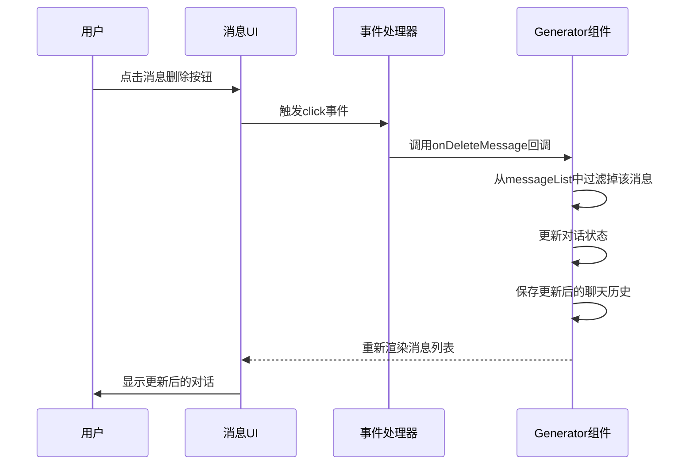
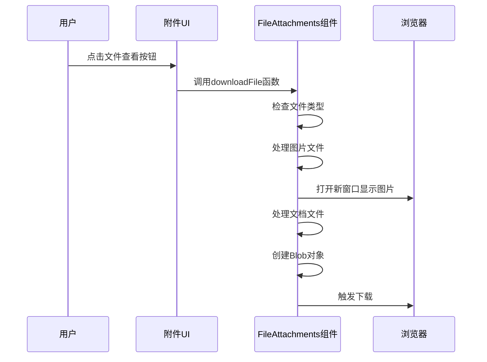
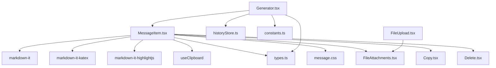

# MessageItem组件

<cite>
**本文档引用的文件**   
- [MessageItem.tsx](file://src/components/MessageItem.tsx#L1-L171) - *新增复制单条消息和删除单条消息功能*
- [Generator.tsx](file://src/components/Generator.tsx#L1-L466) - *向MessageItem传递onCopyMessage和onDeleteMessage回调*
- [types.ts](file://src/types.ts#L1-L29) - *定义ChatMessage类型*
- [FileAttachments.tsx](file://src/components/FileAttachments.tsx#L1-L77) - *附件渲染组件*
- [message.css](file://src/message.css#L1-L78) - *消息样式定义*
- [Copy.tsx](file://src/components/icons/Copy.tsx#L1-L9) - *复制图标组件*
- [Delete.tsx](file://src/components/icons/Delete.tsx#L1-L8) - *删除图标组件*
</cite>

## 更新摘要
**变更内容**   
- 在MessageItem组件中新增了复制单条消息和删除单条消息功能
- 更新了组件结构与数据流图，包含新的消息操作功能
- 新增了消息操作交互流程图
- 更新了消息渲染流程，包含消息复制和删除逻辑
- 添加了消息操作功能的交互实现说明
- 更新了依赖分析，包含Copy和Delete图标组件

## 目录
1. [简介](#简介)
2. [项目结构](#项目结构)
3. [核心组件](#核心组件)
4. [架构概述](#架构概述)
5. [详细组件分析](#详细组件分析)
6. [依赖分析](#依赖分析)
7. [性能考虑](#性能考虑)
8. [故障排除指南](#故障排除指南)
9. [结论](#结论)

## 简介
MessageItem组件是聊天应用中的核心UI组件，负责渲染单条消息内容。该组件具备强大的富文本解析能力，支持Markdown语法、代码高亮和数学公式渲染。它通过集成markdown-it、highlight.js和KaTeX等库，将原始文本转换为美观的富文本内容。组件还实现了消息复制、重试等交互功能，并通过安全的渲染机制防止XSS攻击。消息内容支持流式更新，能够实时显示AI的思考过程和生成结果。最新版本中，组件新增了复制单条消息和删除单条消息的功能，用户可以通过悬停在消息上出现的操作按钮来执行这些操作。

## 项目结构
项目采用基于Astro和Solid.js的现代前端架构，组件化设计清晰。核心功能集中在src/components目录下，其中MessageItem.tsx是消息渲染的核心组件。



**图示来源**
- [MessageItem.tsx](file://src/components/MessageItem.tsx#L1-L171)
- [Generator.tsx](file://src/components/Generator.tsx#L1-L466)
- [types.ts](file://src/types.ts#L1-L29)
- [FileAttachments.tsx](file://src/components/FileAttachments.tsx#L1-L77)

**本节来源**
- [MessageItem.tsx](file://src/components/MessageItem.tsx#L1-L171)
- [Generator.tsx](file://src/components/Generator.tsx#L1-L466)

## 核心组件
MessageItem组件是聊天界面中负责渲染单条消息的核心组件。它接收来自Generator组件的消息对象，通过markdown-it解析Markdown语法，集成highlight.js实现代码块高亮，使用KaTeX渲染数学公式。组件实现了消息复制功能，用户可以点击代码块的复制按钮将代码内容复制到剪贴板。对于AI助手的消息，组件还支持显示思考过程，通过`<details>`标签折叠展示。组件通过innerHTML安全地渲染解析后的HTML内容，并通过事件委托处理复制按钮的点击事件。最新版本中，组件新增了复制和删除单条消息的功能，通过引入Copy和Delete图标组件，在消息悬停时显示操作按钮。

**本节来源**
- [MessageItem.tsx](file://src/components/MessageItem.tsx#L1-L171)
- [Generator.tsx](file://src/components/Generator.tsx#L1-L466)

## 架构概述
MessageItem组件的架构设计体现了现代前端组件化的最佳实践。它作为纯展示组件，接收来自父组件Generator的props，不直接管理复杂的状态。组件的渲染流程清晰：首先初始化markdown-it实例并配置插件，然后定义渲染函数将消息内容转换为HTML，最后在JSX中通过innerHTML插入解析后的内容。最新版本中，组件增加了对消息操作的处理，当用户悬停在消息上时，会显示复制和删除按钮，分别用于复制整条消息内容和删除该消息。



**图示来源**
- [MessageItem.tsx](file://src/components/MessageItem.tsx#L1-L171)
- [Generator.tsx](file://src/components/Generator.tsx#L1-L466)

## 详细组件分析
### MessageItem组件分析
MessageItem组件是聊天应用中负责消息渲染的核心组件，它将原始文本消息转换为美观的富文本内容，并提供交互功能。

#### 组件结构与数据流


**图示来源**
- [MessageItem.tsx](file://src/components/MessageItem.tsx#L1-L171)
- [types.ts](file://src/types.ts#L1-L29)
- [Generator.tsx](file://src/components/Generator.tsx#L1-L466)
- [FileAttachments.tsx](file://src/components/FileAttachments.tsx#L1-L77)

#### 消息渲染流程
MessageItem组件的消息渲染流程从接收到消息对象开始，经过多个处理阶段，最终输出富文本内容。



**图示来源**
- [MessageItem.tsx](file://src/components/MessageItem.tsx#L1-L171)
- [Generator.tsx](file://src/components/Generator.tsx#L1-L466)

**本节来源**
- [MessageItem.tsx](file://src/components/MessageItem.tsx#L1-L171)
- [Generator.tsx](file://src/components/Generator.tsx#L1-L466)

### 消息解析能力分析
MessageItem组件具备强大的消息解析能力，能够将Markdown格式的文本转换为丰富的HTML内容。

#### Markdown解析与扩展功能
```mermaid
sequenceDiagram
participant Message as MessageItem组件
participant MarkdownIt as markdown-it实例
participant Katex as KaTeX插件
participant Highlight as highlight.js插件
Message->>MarkdownIt : 初始化实例
MarkdownIt->>MarkdownIt : 配置linkify : true
MarkdownIt->>MarkdownIt : 配置breaks : true
MarkdownIt->>Katex : 注册mdKatex插件
MarkdownIt->>Highlight : 注册mdHighlight插件
Message->>Message : 重写代码块渲染规则
Message->>Message : 添加复制按钮
Message->>Message : 存储编码后的代码内容
Message->>MarkdownIt : 调用render()方法
MarkdownIt->>Katex : 处理$$...$$数学公式
MarkdownIt->>Highlight : 处理
```...```代码块
    MarkdownIt-->>Message: 返回HTML字符串
    Message-->>UI: 通过innerHTML显示内容
```

**图示来源**
- [MessageItem.tsx](file://src/components/MessageItem.tsx#L1-L171)

**本节来源**
- [MessageItem.tsx](file://src/components/MessageItem.tsx#L1-L171)

### 交互功能分析
MessageItem组件提供了丰富的用户交互功能，包括消息复制、重新生成、消息删除和文件查看。

#### 复制功能实现


**图示来源**
- [MessageItem.tsx](file://src/components/MessageItem.tsx#L1-L171)
- [Generator.tsx](file://src/components/Generator.tsx#L1-L466)

**本节来源**
- [MessageItem.tsx](file://src/components/MessageItem.tsx#L1-L171)
- [Generator.tsx](file://src/components/Generator.tsx#L1-L466)

#### 删除功能实现


**图示来源**
- [MessageItem.tsx](file://src/components/MessageItem.tsx#L1-L171)
- [Generator.tsx](file://src/components/Generator.tsx#L1-L466)

**本节来源**
- [MessageItem.tsx](file://src/components/MessageItem.tsx#L1-L171)
- [Generator.tsx](file://src/components/Generator.tsx#L1-L466)

#### 附件交互实现


**图示来源**
- [FileAttachments.tsx](file://src/components/FileAttachments.tsx#L1-L77)
- [MessageItem.tsx](file://src/components/MessageItem.tsx#L1-L171)

**本节来源**
- [FileAttachments.tsx](file://src/components/FileAttachments.tsx#L1-L77)
- [MessageItem.tsx](file://src/components/MessageItem.tsx#L1-L171)

#### 重试功能实现


**图示来源**
- [MessageItem.tsx](file://src/components/MessageItem.tsx#L1-L171)
- [Generator.tsx](file://src/components/Generator.tsx#L1-L466)

**本节来源**
- [MessageItem.tsx](file://src/components/MessageItem.tsx#L1-L171)
- [Generator.tsx](file://src/components/Generator.tsx#L1-L466)

## 依赖分析
MessageItem组件依赖多个外部库和内部模块，形成了清晰的依赖关系。



**图示来源**
- [MessageItem.tsx](file://src/components/MessageItem.tsx#L1-L171)
- [Generator.tsx](file://src/components/Generator.tsx#L1-L466)
- [types.ts](file://src/types.ts#L1-L29)
- [FileAttachments.tsx](file://src/components/FileAttachments.tsx#L1-L77)
- [Copy.tsx](file://src/components/icons/Copy.tsx#L1-L9)
- [Delete.tsx](file://src/components/icons/Delete.tsx#L1-L8)

**本节来源**
- [MessageItem.tsx](file://src/components/MessageItem.tsx#L1-L171)
- [Generator.tsx](file://src/components/Generator.tsx#L1-L466)

## 性能考虑
MessageItem组件在性能方面表现良好，主要得益于Solid.js的高效响应式系统和合理的渲染策略。组件使用createSignal管理状态，确保只有相关部分在状态变化时重新渲染。对于消息内容的渲染，组件通过memoization技术缓存解析结果，避免重复解析相同的Markdown内容。事件处理采用事件委托模式，在消息容器上监听点击事件，而不是为每个复制按钮单独绑定事件，减少了内存占用。流式渲染支持使用户能够实时看到AI生成的内容，提升了用户体验。CSS方面，组件使用UnoCSS进行原子化样式管理，减少了CSS文件体积。附件功能通过懒加载和资源清理机制优化性能，使用URL.revokeObjectURL及时释放预览URL，防止内存泄漏。新增的复制和删除功能通过条件渲染，只在消息悬停时显示操作按钮，减少了不必要的DOM元素。

## 故障排除指南
当MessageItem组件出现问题时，可以从以下几个方面进行排查：

1. **富文本不显示**：检查消息内容是否为空，确认message和thinkMessage属性是否正确传递。
2. **数学公式不渲染**：确认KaTeX插件是否正确加载，检查数学公式语法是否正确（使用$$...$$或$...$）。
3. **代码高亮失效**：检查highlight.js插件是否正常工作，确认代码块语法是否正确（使用```language ...```）。
4. **复制功能无效**：检查浏览器是否支持Clipboard API，确认useClipboard钩子是否正确初始化。
5. **样式错乱**：检查message.css是否正确加载，确认UnoCSS配置是否包含所需样式。
6. **重试功能无响应**：检查onRetry回调函数是否正确传递，确认Generator组件的状态管理是否正常。
7. **附件不显示**：检查消息对象的attachments属性是否存在且格式正确，确认FileAttachments组件是否正确导入。
8. **文件预览失败**：检查文件URL是否正确生成，确认cleanupFileUrl是否在适当时候调用释放资源。
9. **消息操作按钮不显示**：检查onCopyMessage和onDeleteMessage回调是否正确传递，确认鼠标悬停时的CSS样式是否正常。
10. **删除消息失败**：检查onDeleteMessage回调是否正确实现，确认Generator组件的deleteMessage函数是否正常工作。

**本节来源**
- [MessageItem.tsx](file://src/components/MessageItem.tsx#L1-L171)
- [message.css](file://src/message.css#L1-L78)
- [FileAttachments.tsx](file://src/components/FileAttachments.tsx#L1-L77)

## 结论
MessageItem组件是一个功能丰富、设计良好的前端组件，它成功地将复杂的富文本解析和用户交互功能封装在一个简洁的接口中。组件通过集成markdown-it、highlight.js和KaTeX等成熟库，提供了专业的Markdown渲染能力。安全的innerHTML使用和事件委托模式确保了组件的性能和安全性。与Generator组件的清晰职责划分体现了良好的组件化设计思想。流式渲染支持和思考过程可视化功能显著提升了用户体验。最新版本中新增的复制单条消息和删除单条消息功能，通过Copy和Delete图标组件实现了对消息的便捷操作，进一步增强了聊天应用的功能性。整体而言，该组件是现代前端开发中组件化、模块化设计的优秀范例，具有良好的可维护性和扩展性。