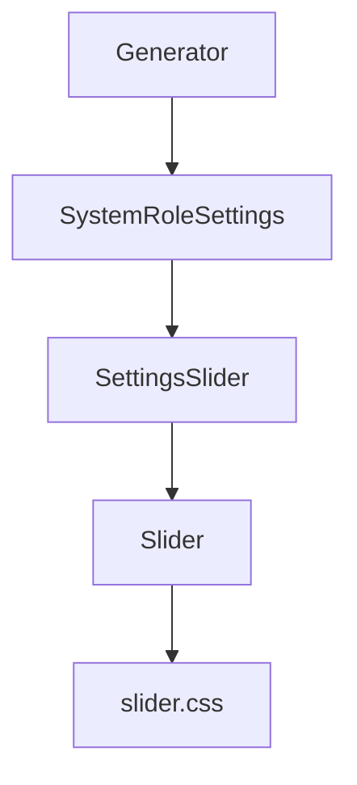
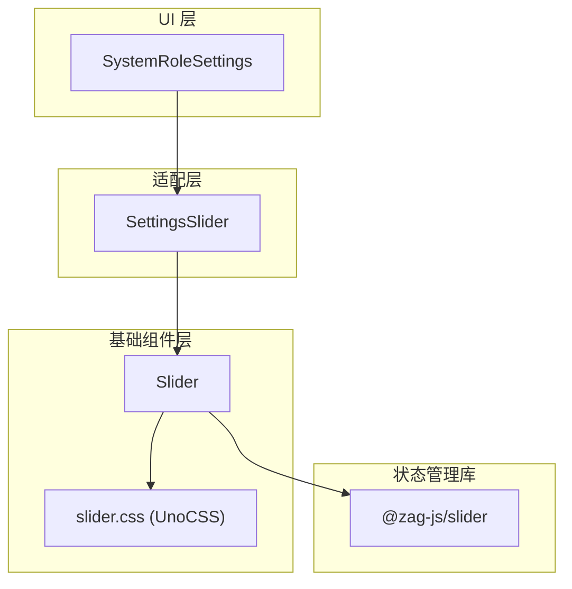
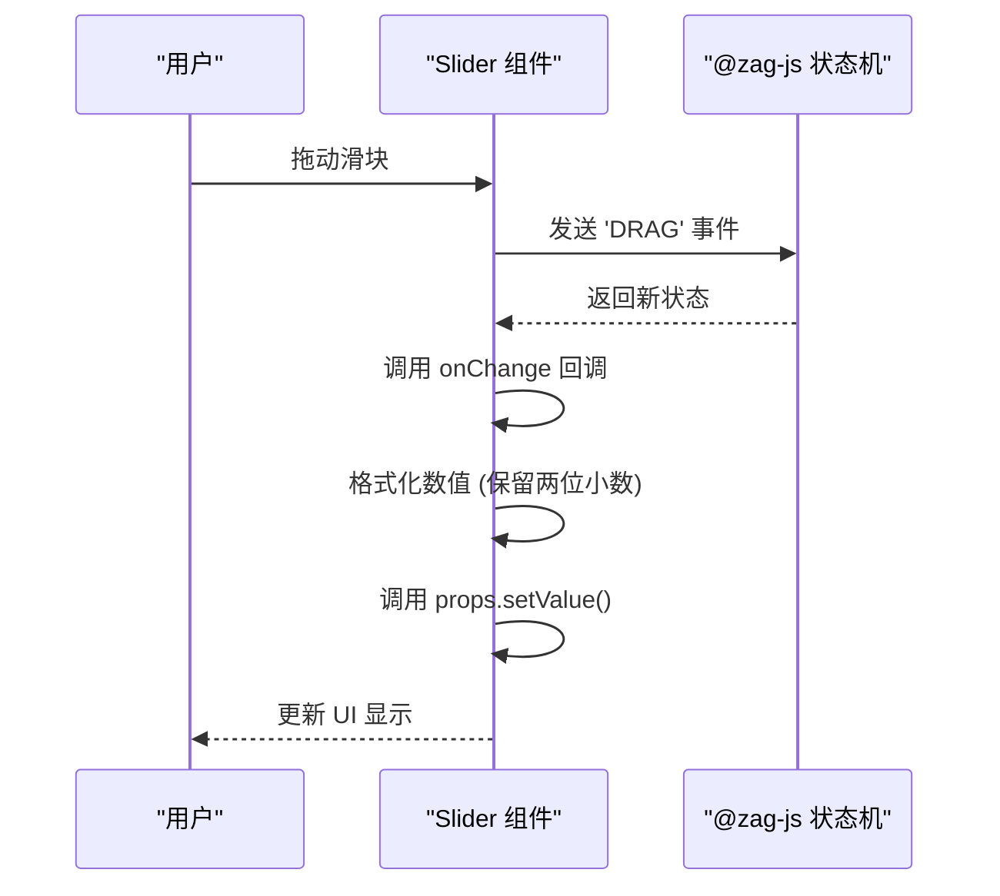
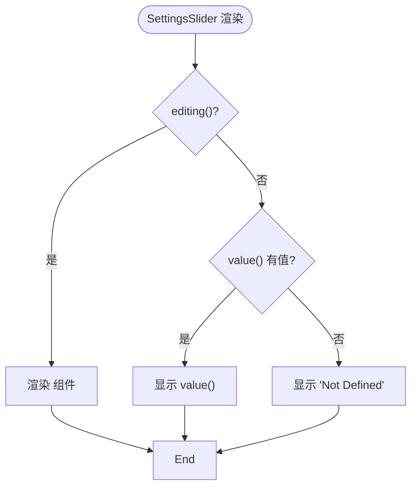
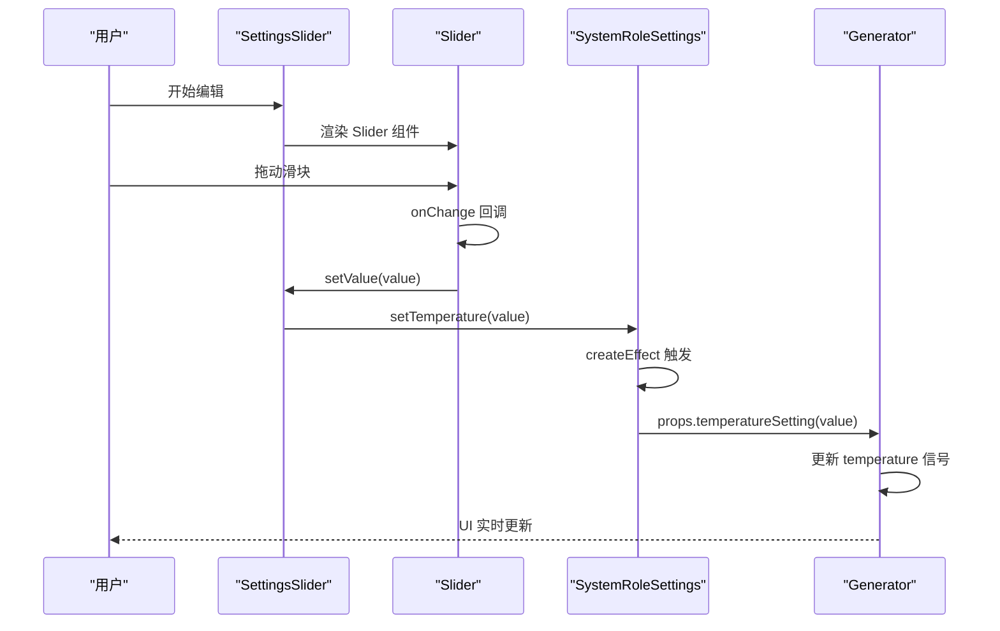

# Slider与SettingsSlider组件

<cite>
**本文档引用的文件**  
- [Slider.tsx](file://src/components/Slider.tsx)
- [SettingsSlider.tsx](file://src/components/SettingsSlider.tsx)
- [SystemRoleSettings.tsx](file://src/components/SystemRoleSettings.tsx)
- [Generator.tsx](file://src/components/Generator.tsx)
- [slider.css](file://src/slider.css)
</cite>

## 目录
1. [简介](#简介)
2. [项目结构](#项目结构)
3. [核心组件](#核心组件)
4. [架构概览](#架构概览)
5. [详细组件分析](#详细组件分析)
6. [依赖关系分析](#依赖关系分析)
7. [性能考量](#性能考量)
8. [故障排除指南](#故障排除指南)
9. [结论](#结论)

## 简介
本文档深入分析了 `Slider` 与 `SettingsSlider` 两个滑块组件的设计与实现。`Slider` 是一个基础滑块组件，封装了原生 `input[type='range']` 并提供响应式值绑定；`SettingsSlider` 在其基础上扩展，集成了标签显示与数值反馈功能。文档将阐述它们在参数调节场景（如 temperature、top_p）中的使用模式，包括步长控制、范围限定与实时更新机制。通过 `Generator` 组件中的调用示例，展示其 props 接口设计与事件回调模式，并分析其通过 UnoCSS 实现的响应式布局与交互反馈效果。

## 项目结构
项目采用基于功能的文件组织方式，核心组件位于 `src/components/` 目录下。`Slider.tsx` 和 `SettingsSlider.tsx` 是两个独立的 UI 组件，`SystemRoleSettings.tsx` 是使用它们的父级设置组件，而 `Generator.tsx` 是最终的调用方，构成了完整的调用链。



**图示来源**
- [Generator.tsx](file://src/components/Generator.tsx)
- [SystemRoleSettings.tsx](file://src/components/SystemRoleSettings.tsx)
- [SettingsSlider.tsx](file://src/components/SettingsSlider.tsx)
- [Slider.tsx](file://src/components/Slider.tsx)

**本节来源**
- [Generator.tsx](file://src/components/Generator.tsx)
- [SystemRoleSettings.tsx](file://src/components/SystemRoleSettings.tsx)

## 核心组件
`Slider` 和 `SettingsSlider` 是实现参数调节功能的核心 UI 组件。`Slider` 提供了基础的滑动输入功能，而 `SettingsSlider` 则针对应用设置场景进行了封装，增加了编辑状态管理与空值处理。

**本节来源**
- [Slider.tsx](file://src/components/Slider.tsx#L1-L59)
- [SettingsSlider.tsx](file://src/components/SettingsSlider.tsx#L1-L42)

## 架构概览
整个滑块组件系统采用分层架构。底层是 `Slider` 组件，它利用 `@zag-js/slider` 库的状态机来管理滑块的复杂交互逻辑。中间层是 `SettingsSlider`，它作为适配器，将通用的 `Slider` 组件与应用特定的设置数据模型（`SettingsUI`）连接起来。最上层是 `SystemRoleSettings`，它负责管理用户编辑状态并协调多个设置项。



**图示来源**
- [Slider.tsx](file://src/components/Slider.tsx)
- [SettingsSlider.tsx](file://src/components/SettingsSlider.tsx)
- [SystemRoleSettings.tsx](file://src/components/SystemRoleSettings.tsx)
- [slider.css](file://src/slider.css)

## 详细组件分析

### Slider 组件分析
`Slider` 组件是一个高度封装的基础滑块，它使用 `@zag-js/slider` 库来处理滑块的可访问性和复杂交互。

#### 组件接口与属性
`Slider` 组件通过 `Props` 接口定义了其输入参数：
```typescript
interface Props {
  name: string
  value: Accessor<number> // SolidJS 响应式访问器
  min: number
  max: number
  step: number
  disabled?: boolean
  setValue: (v: number) => void // 值变更回调
}
```
- **name**: 滑块的标签名称。
- **value**: 当前值的 SolidJS 响应式访问器。
- **min/max/step**: 定义滑块的范围和步长。
- **setValue**: 值变更时的回调函数，用于更新父组件状态。

#### 状态机集成
组件使用 `useMachine` 钩子初始化 `@zag-js/slider` 的状态机。状态机的配置包括：
- `id`: 唯一标识符。
- `value`: 初始值。
- `min`, `max`, `step`: 范围和步长。
- `onChange`: 回调函数，在值变更时被调用，它会格式化数值并触发 `props.setValue`。



**图示来源**
- [Slider.tsx](file://src/components/Slider.tsx#L15-L59)

**本节来源**
- [Slider.tsx](file://src/components/Slider.tsx#L1-L59)

### SettingsSlider 组件分析
`SettingsSlider` 是一个应用特定的包装组件，它简化了 `Slider` 在设置界面中的使用。

#### 组件接口与属性
`SettingsSlider` 的 `Props` 接口如下：
```typescript
interface Props {
  settings: SettingsUI // 设置项配置对象
  editing: Accessor<boolean> // 编辑状态
  value: Accessor<number>
  setValue: (v: number) => void
}
```
- **settings**: 一个包含 `name`, `type`, `min`, `max`, `step` 等属性的配置对象。
- **editing**: 一个布尔值访问器，决定是显示滑块还是只读值。

#### 条件渲染逻辑
组件根据 `editing()` 的值进行条件渲染：
- 当 `editing()` 为 `true` 时，渲染 `Slider` 组件，并传入 `settings` 中的配置。
- 当 `editing()` 为 `false` 时，如果 `value()` 有值，则直接显示该值；否则显示 "Not Defined"。



**图示来源**
- [SettingsSlider.tsx](file://src/components/SettingsSlider.tsx#L1-L42)

**本节来源**
- [SettingsSlider.tsx](file://src/components/SettingsSlider.tsx#L1-L42)

### Generator 组件中的调用分析
`Generator` 组件是滑块功能的最终使用者，它通过 `SystemRoleSettings` 间接调用了 `SettingsSlider`。

#### 状态管理
`Generator` 组件使用 `createSignal` 创建了 `temperature` 和 `chatModel` 两个响应式状态：
```typescript
const [temperature, setTemperature] = createSignal(CONFIG.DEFAULT_TEMPERATURE)
```

#### 回调函数传递
`Generator` 将 `setTemperature` 函数包装成 `temperatureSetting` 回调，并通过 `props` 传递给 `SystemRoleSettings`：
```typescript
const temperatureSetting = (value: number) => { setTemperature(value) }
...
<SystemRoleSettings temperatureSetting={temperatureSetting} ... />
```

#### 在 SystemRoleSettings 中的集成
`SystemRoleSettings` 接收 `temperatureSetting` 回调，并在 `createEffect` 中将其与内部的 `temperature` 信号同步。当用户在 `SettingsSlider` 中调整滑块时，`setValue` (即 `setTemperature`) 被调用，从而更新 `Generator` 中的状态。



**图示来源**
- [Generator.tsx](file://src/components/Generator.tsx#L1-L392)
- [SystemRoleSettings.tsx](file://src/components/SystemRoleSettings.tsx#L1-L105)
- [SettingsSlider.tsx](file://src/components/SettingsSlider.tsx#L1-L42)

**本节来源**
- [Generator.tsx](file://src/components/Generator.tsx#L1-L392)
- [SystemRoleSettings.tsx](file://src/components/SystemRoleSettings.tsx#L1-L105)

## 依赖关系分析
组件间的依赖关系清晰，形成了一个单向的数据流。
```mermaid
graph LR
Generator --> SystemRoleSettings
SystemRoleSettings --> SettingsSlider
SettingsSlider --> Slider
Slider --> "@zag-js/solid"
Slider --> "@zag-js/slider"
```
- **高内聚**: 每个组件职责单一，`Slider` 处理交互，`SettingsSlider` 处理业务逻辑，`SystemRoleSettings` 处理 UI 布局。
- **低耦合**: 组件间通过明确的 props 接口通信，`SettingsSlider` 不关心 `Slider` 的具体实现，`SystemRoleSettings` 不关心 `SettingsSlider` 的内部逻辑。

**图示来源**
- [Generator.tsx](file://src/components/Generator.tsx)
- [SystemRoleSettings.tsx](file://src/components/SystemRoleSettings.tsx)
- [SettingsSlider.tsx](file://src/components/SettingsSlider.tsx)
- [Slider.tsx](file://src/components/Slider.tsx)

**本节来源**
- [Generator.tsx](file://src/components/Generator.tsx)
- [SystemRoleSettings.tsx](file://src/components/SystemRoleSettings.tsx)
- [SettingsSlider.tsx](file://src/components/SettingsSlider.tsx)
- [Slider.tsx](file://src/components/Slider.tsx)

## 性能考量
- **响应式更新**: 使用 SolidJS 的响应式系统，确保只有依赖状态变化的组件才会重新渲染，性能高效。
- **防抖处理**: 虽然滑块本身没有防抖，但 `@zag-js/slider` 的状态机优化了事件处理，避免了不必要的计算。
- **样式优化**: CSS 类通过 UnoCSS 按需生成，减少了最终打包体积。

## 故障排除指南
- **滑块无反应**: 检查 `setValue` 回调是否正确传递，确保 `value` 和 `setValue` 构成一个完整的响应式信号。
- **数值显示不正确**: 检查 `formatSliderValue` 函数的逻辑，确认 `min`, `max`, `step` 是否在合理范围内。
- **样式丢失**: 确认 `slider.css` 文件已正确导入，且 UnoCSS 配置正确。

## 结论
`Slider` 与 `SettingsSlider` 组件的设计体现了良好的分层与封装思想。`Slider` 作为一个通用、可访问的基础组件，通过 `@zag-js` 库保证了高质量的交互体验。`SettingsSlider` 则作为业务适配层，简化了在特定场景下的使用。整个系统通过清晰的 props 传递和响应式状态管理，实现了参数的实时调节与反馈，为 `Generator` 组件提供了灵活且可靠的配置能力。