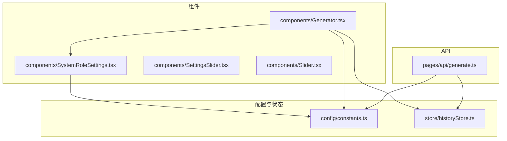
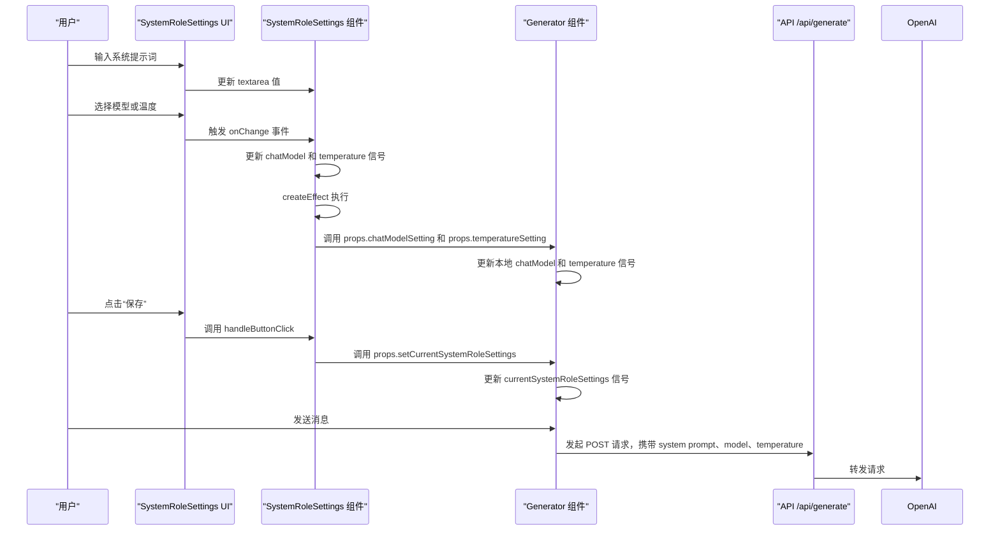
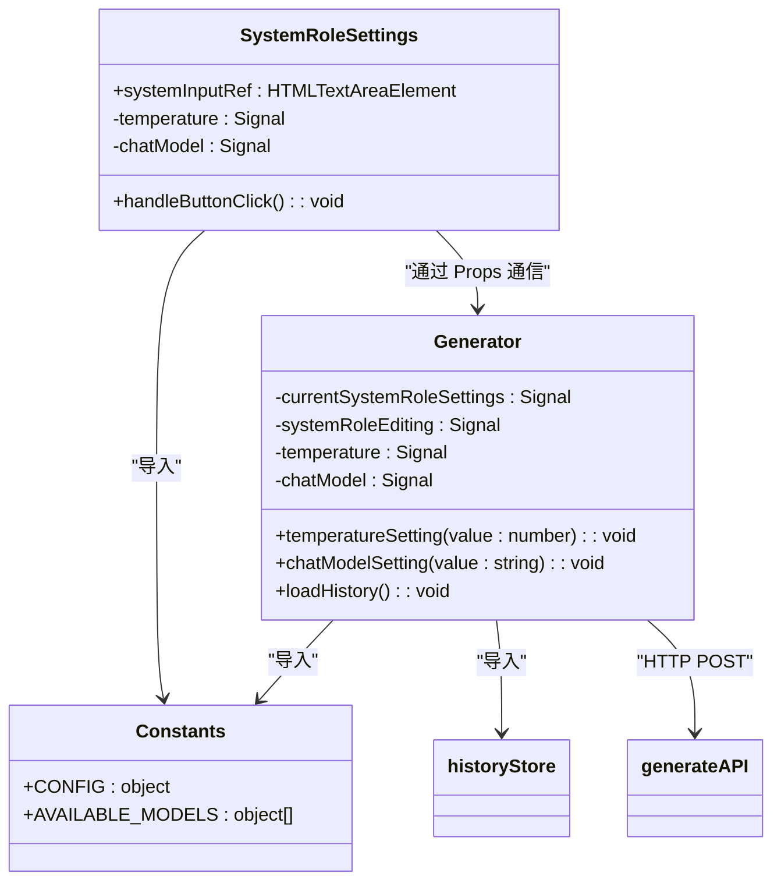
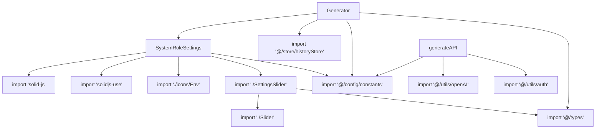

# SystemRoleSettings组件

<cite>
**本文档引用的文件**  
- [SystemRoleSettings.tsx](file://src/components/SystemRoleSettings.tsx#L1-L106)
- [constants.ts](file://src/config/constants.ts#L1-L38)
- [Generator.tsx](file://src/components/Generator.tsx#L1-L392)
- [generate.ts](file://src/pages/api/generate.ts#L1-L71)
- [historyStore.ts](file://src/store/historyStore.ts#L1-L112)
- [SettingsSlider.tsx](file://src/components/SettingsSlider.tsx#L1-L43)
- [Slider.tsx](file://src/components/Slider.tsx#L1-L60)
</cite>

## 目录
1. [简介](#简介)
2. [项目结构](#项目结构)
3. [核心组件](#核心组件)
4. [架构概览](#架构概览)
5. [详细组件分析](#详细组件分析)
6. [依赖分析](#依赖分析)
7. [性能考虑](#性能考虑)
8. [故障排除指南](#故障排除指南)
9. [结论](#结论)

## 简介
SystemRoleSettings组件是聊天应用中的核心配置界面，负责管理AI助手的系统提示词（system prompt）、模型选择和温度参数。该组件提供了一个响应式的UI控件，允许用户自定义AI的行为模式，并将这些设置实时传递给Generator组件，用于生成AI响应。本文档将深入解析该组件的实现机制、数据流、与常量的关联关系以及在多模型场景下的适配策略。

## 项目结构
项目采用基于功能的文件组织方式，核心组件位于`src/components`目录下，配置常量集中于`src/config`目录，状态管理逻辑则放置在`src/store`中。SystemRoleSettings作为用户交互的关键部分，与Generator组件紧密集成，共同构成了聊天功能的核心。

**图示来源**  
- [SystemRoleSettings.tsx](file://src/components/SystemRoleSettings.tsx#L1-L106)
- [Generator.tsx](file://src/components/Generator.tsx#L1-L392)
- [constants.ts](file://src/config/constants.ts#L1-L38)
- [historyStore.ts](file://src/store/historyStore.ts#L1-L112)
- [generate.ts](file://src/pages/api/generate.ts#L1-L71)

**本节来源**  
- [SystemRoleSettings.tsx](file://src/components/SystemRoleSettings.tsx#L1-L106)
- [Generator.tsx](file://src/components/Generator.tsx#L1-L392)

## 核心组件
SystemRoleSettings组件是用户配置AI行为的核心界面。它通过一个文本区域接收用户输入的系统提示词，并提供下拉菜单供用户选择不同的AI模型，以及一个滑块来调节生成的“温度”（随机性）。这些配置通过响应式信号（signals）与父组件Generator进行双向绑定，确保配置的实时生效。

**本节来源**  
- [SystemRoleSettings.tsx](file://src/components/SystemRoleSettings.tsx#L1-L106)
- [Generator.tsx](file://src/components/Generator.tsx#L1-L392)

## 架构概览
SystemRoleSettings组件的架构体现了清晰的单向数据流和响应式编程模式。用户在UI上的操作会更新本地状态，这些状态变化通过`createEffect`副作用自动同步到Generator组件的回调函数中，最终在发起API请求时被使用。

**图示来源**  
- [SystemRoleSettings.tsx](file://src/components/SystemRoleSettings.tsx#L1-L106)
- [Generator.tsx](file://src/components/Generator.tsx#L1-L392)
- [generate.ts](file://src/pages/api/generate.ts#L1-L71)

## 详细组件分析

### SystemRoleSettings组件分析
SystemRoleSettings是一个功能完整的表单组件，它集成了UI控件、状态管理和与父组件的通信。

#### 组件结构与UI控件
组件的UI分为三个主要部分：提示词输入区、参数设置区和操作按钮区。
- **提示词输入区**：一个`<textarea>`元素，其`value`属性绑定到`props.currentSystemRoleSettings()`，确保显示的是当前有效的系统提示词。用户编辑时，内容会暂存在`systemInputRef`中，直到点击“保存”。
- **参数设置区**：包含一个模型选择下拉框和一个温度调节滑块。
  - **模型选择**：`<select>`元素的`value`绑定到本地`chatModel`信号。其选项通过`<For>`循环`AVAILABLE_MODELS`常量生成。`onChange`事件会调用`setChatModel`更新信号。
  - **温度调节**：使用`SettingsSlider`组件，它接收`temperature`信号的值和`setTemperature`函数作为属性，实现了滑块的双向绑定。
- **操作按钮区**：一个“保存”按钮，点击后将`systemInputRef`中的值通过`props.setCurrentSystemRoleSettings`同步到父组件，并关闭编辑模式。

#### 与Solid.js表单系统的集成
该组件充分利用了Solid.js的响应式系统：
- **信号（Signals）**：使用`createSignal`创建`temperature`和`chatModel`信号，管理本地状态。`useStorage`钩子创建了一个持久化的`chatModel`信号，其值存储在浏览器的`localStorage`中，键名为`selected_model`。
- **副作用（Effects）**：`createEffect`是实现与父组件通信的关键。每当`temperature`或`chatModel`信号的值发生变化时，该副作用就会执行，调用`props.temperatureSetting`和`props.chatModelSetting`这两个从父组件传入的回调函数，将最新的配置值“推送”给Generator组件。
- **属性（Props）**：组件通过`Props`接口定义了多个`Accessor`（访问器）和`Setter`（设置器），形成了与父组件的响应式连接。例如，`currentSystemRoleSettings`是一个`Accessor<string>`，用于读取当前提示词；`setCurrentSystemRoleSettings`是一个`Setter<string>`，用于更新父组件中的提示词。

**图示来源**  
- [SystemRoleSettings.tsx](file://src/components/SystemRoleSettings.tsx#L1-L106)
- [Generator.tsx](file://src/components/Generator.tsx#L1-L392)
- [constants.ts](file://src/config/constants.ts#L1-L38)
- [historyStore.ts](file://src/store/historyStore.ts#L1-L112)
- [generate.ts](file://src/pages/api/generate.ts#L1-L71)

**本节来源**  
- [SystemRoleSettings.tsx](file://src/components/SystemRoleSettings.tsx#L1-L106)
- [Generator.tsx](file://src/components/Generator.tsx#L1-L392)

### 预设角色与常量关联分析
SystemRoleSettings组件与`src/config/constants.ts`文件中的常量紧密关联，确保了配置的统一和可维护性。
- **AVAILABLE_MODELS**：该常量定义了应用支持的所有AI模型。SystemRoleSettings组件直接使用这个数组来渲染模型选择下拉框的选项。这保证了前端UI和后端允许的模型列表保持一致。
- **CONFIG**：该常量对象包含了多个默认值。
  - `CONFIG.DEFAULT_TEMPERATURE`：作为`temperature`信号的初始值，为用户提供了一个合理的默认随机性水平。
  - `CONFIG.DEFAULT_MODEL`：虽然SystemRoleSettings使用`useStorage`并以`AVAILABLE_MODELS[0].id`作为初始值，但`CONFIG.DEFAULT_MODEL`在Generator组件中作为`chatModel`信号的默认值，形成了一个备用的默认模型策略。

**本节来源**  
- [constants.ts](file://src/config/constants.ts#L1-L38)
- [SystemRoleSettings.tsx](file://src/components/SystemRoleSettings.tsx#L1-L106)
- [Generator.tsx](file://src/components/Generator.tsx#L1-L392)

### 输入验证与默认值回退策略分析
该应用的验证逻辑主要分布在前端和后端，共同保障了配置的合法性。
- **前端验证**：SystemRoleSettings组件本身没有对系统提示词的内容进行复杂的验证（如长度、格式），它主要依赖`textarea`的原生属性（如`rows`）进行基本的UI约束。其主要的“验证”体现在模型选择上，通过`AVAILABLE_MODELS`常量限制了用户只能选择预设的模型ID。
- **后端验证**：真正的验证发生在`/api/generate`路由中。`generate.ts`文件会检查传入的`model`参数是否在`allowedModels`（由`AVAILABLE_MODELS`派生）列表内。如果不在，会返回400错误，阻止非法请求到达OpenAI API。这构成了关键的安全防线。
- **默认值回退**：系统在多个层面实现了默认值回退。
  1. **模型**：如果API请求中没有提供`model`参数，后端会使用`apiModel`（由`OPENAI_API_MODEL`环境变量或`CONFIG.DEFAULT_MODEL`决定）作为默认模型。
  2. **温度**：如果请求中没有提供`temperature`，`generatePayload`工具函数会使用一个默认值（代码中未显示，但通常为0.7）。
  3. **系统提示词**：如果`currentSystemRoleSettings()`为空，Generator组件在构建请求消息列表时会跳过添加`system`角色的消息，从而让AI使用其内置的默认行为。

**本节来源**  
- [generate.ts](file://src/pages/api/generate.ts#L1-L71)
- [SystemRoleSettings.tsx](file://src/components/SystemRoleSettings.tsx#L1-L106)
- [Generator.tsx](file://src/components/Generator.tsx#L1-L392)

### 实时生效机制分析
SystemRoleSettings组件通过Solid.js的响应式系统实现了配置的实时生效。
- **模型和温度**：得益于`createEffect`，`chatModel`和`temperature`信号的任何变化都会立即触发对`props.chatModelSetting`和`props.temperatureSetting`的调用。这两个函数直接更新Generator组件内的信号。当下一次用户发送消息时，`requestWithLatestMessage`函数会使用这些最新的信号值来构建API请求，从而实现参数的即时生效，无需保存或刷新。
- **系统提示词**：提示词的生效是“准实时”的。用户在编辑时，更改仅存在于`systemInputRef`中，不会影响当前的AI行为。只有当用户点击“保存”后，`handleButtonClick`才会调用`props.setCurrentSystemRoleSettings`，将新提示词同步到Generator组件。此后发起的所有请求都会包含这个新的系统角色设定。

**本节来源**  
- [SystemRoleSettings.tsx](file://src/components/SystemRoleSettings.tsx#L1-L106)
- [Generator.tsx](file://src/components/Generator.tsx#L1-L392)

### 多模型场景下的提示词适配策略
该组件本身不直接处理提示词的模型适配，而是通过以下策略支持多模型：
- **统一接口**：无论用户选择哪个模型（如GPT-4.1, DeepSeek-V3, Grok-3），系统提示词都以相同的方式（作为`system`角色的消息）被添加到请求中。这依赖于这些模型都遵循类似的对话协议。
- **后端路由**：`generate.ts`中的`modelToUse`逻辑确保了前端选择的模型ID能被正确传递给OpenAI API或其他兼容的API。只要模型提供商支持`system`消息，提示词就能生效。
- **提示词设计**：实际的提示词效果取决于用户输入的内容和所选模型的能力。例如，一个为GPT-4设计的复杂提示词可能在较弱的模型上效果不佳。组件本身不干预这一点，它提供了一个通用的通道。

**本节来源**  
- [SystemRoleSettings.tsx](file://src/components/SystemRoleSettings.tsx#L1-L106)
- [generate.ts](file://src/pages/api/generate.ts#L1-L71)

## 依赖分析
SystemRoleSettings组件的依赖关系清晰，体现了良好的模块化设计。

**图示来源**  
- [SystemRoleSettings.tsx](file://src/components/SystemRoleSettings.tsx#L1-L106)
- [SettingsSlider.tsx](file://src/components/SettingsSlider.tsx#L1-L43)
- [Generator.tsx](file://src/components/Generator.tsx#L1-L392)
- [generate.ts](file://src/pages/api/generate.ts#L1-L71)

**本节来源**  
- [SystemRoleSettings.tsx](file://src/components/SystemRoleSettings.tsx#L1-L106)
- [SettingsSlider.tsx](file://src/components/SettingsSlider.tsx#L1-L43)
- [Generator.tsx](file://src/components/Generator.tsx#L1-L392)
- [generate.ts](file://src/pages/api/generate.ts#L1-L71)

## 性能考虑
- **useStorage**：使用`solidjs-use`的`useStorage`钩子持久化模型选择，避免了每次页面加载都重置为默认值，提升了用户体验。
- **createEffect**：副作用的执行是高效的，仅在依赖的信号（`temperature`和`chatModel`）变化时触发，避免了不必要的计算。
- **无复杂验证**：前端省略了复杂的输入验证，减少了客户端的计算开销，将验证任务交给后端处理。

## 故障排除指南
- **问题：更改模型或温度后，AI行为没有变化。**
  - **原因**：模型和温度的更改是实时的，但系统提示词需要点击“保存”才能生效。请确认是否已保存提示词更改。
- **问题：选择的模型无法使用，出现错误。**
  - **原因**：后端`generate.ts`中的`allowedModels`列表可能未包含该模型ID。请检查`AVAILABLE_MODELS`常量和后端的`allowedModels`是否同步。
- **问题：系统提示词在刷新页面后丢失。**
  - **原因**：系统提示词通过`sessionStorage`持久化（在Generator组件的`onMount`和`handleBeforeUnload`中处理），而非`localStorage`。关闭浏览器标签页后会丢失。如需长期保存，应通过“历史记录”功能保存整个对话。
- **问题：无法输入系统提示词。**
  - **原因**：当对话中已有消息时，`canEdit`属性为`false`，会禁用编辑模式。系统提示词只能在对话开始前设置。

**本节来源**  
- [SystemRoleSettings.tsx](file://src/components/SystemRoleSettings.tsx#L1-L106)
- [Generator.tsx](file://src/components/Generator.tsx#L1-L392)
- [generate.ts](file://src/pages/api/generate.ts#L1-L71)

## 结论
SystemRoleSettings组件是一个设计精良的响应式配置界面。它通过Solid.js的信号和副作用机制，实现了与Generator组件的无缝集成，确保了系统提示词、模型和温度等关键参数的实时、动态配置。组件通过依赖`constants.ts`中的常量，保证了配置的统一性，并通过后端验证和多层默认值回退策略，增强了系统的健壮性。其清晰的依赖关系和模块化设计，使得代码易于维护和扩展，是整个聊天应用中不可或缺的核心组件。