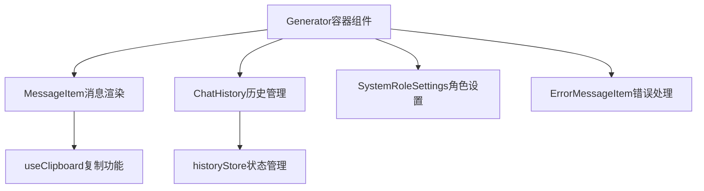
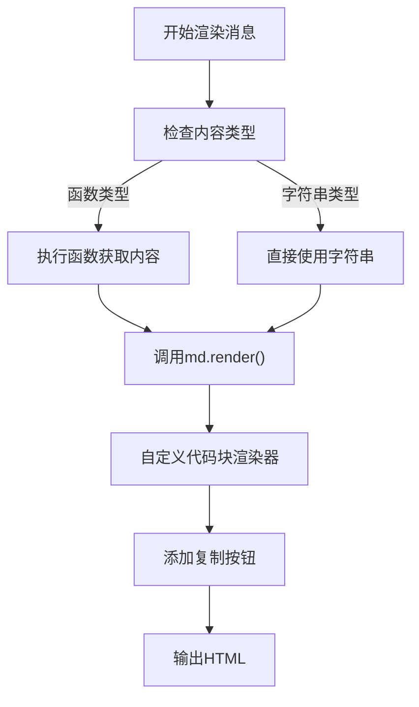
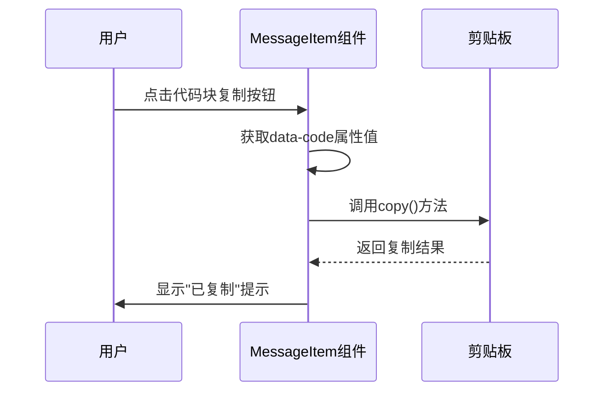
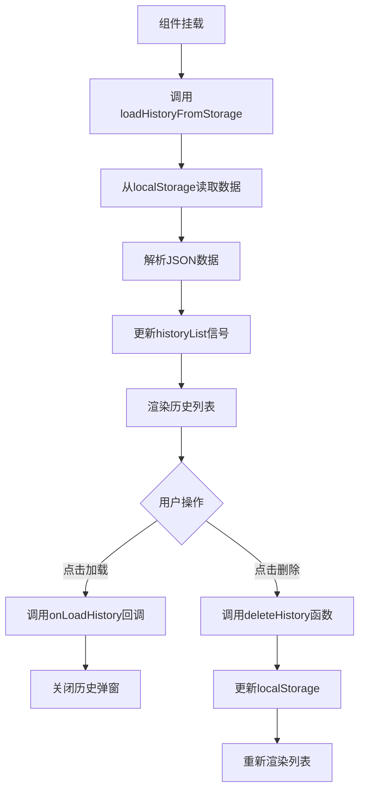
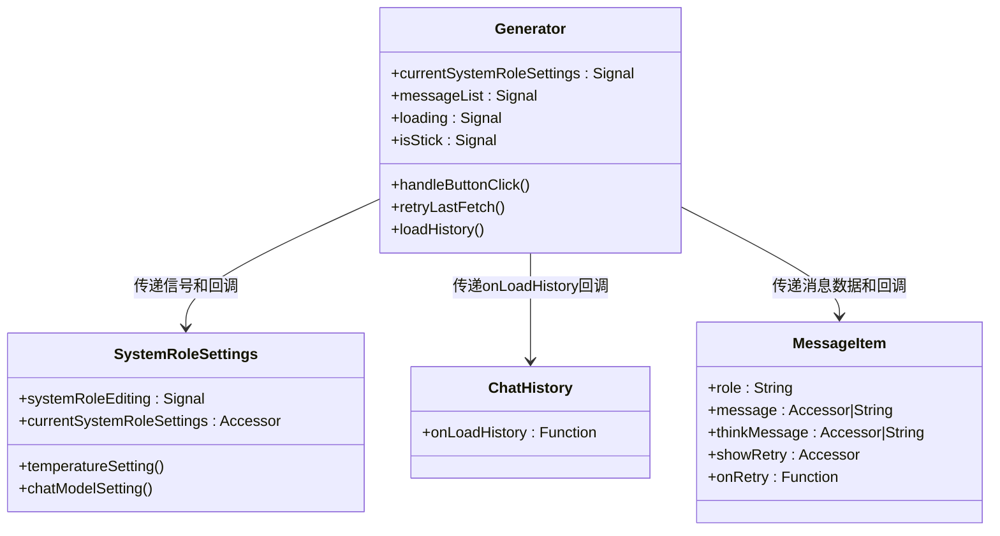
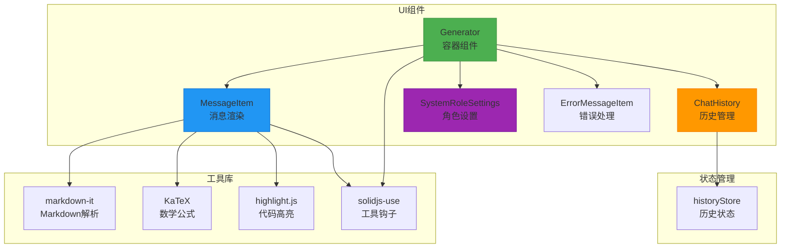

# 组件架构

<cite>
**本文档中引用的文件**   
- [Generator.tsx](file://src/components/Generator.tsx#L1-L390)
- [MessageItem.tsx](file://src/components/MessageItem.tsx#L1-L117)
- [ChatHistory.tsx](file://src/components/ChatHistory.tsx#L1-L113)
- [SystemRoleSettings.tsx](file://src/components/SystemRoleSettings.tsx#L1-L60)
- [historyStore.ts](file://src/store/historyStore.ts#L1-L46)
</cite>

## 目录
1. [组件架构](#组件架构)
2. [核心组件分析](#核心组件分析)
3. [组件间通信模式](#组件间通信模式)
4. [响应式系统应用](#响应式系统应用)
5. [依赖关系图](#依赖关系图)

## 核心组件分析

深入剖析chat-mini的UI组件架构设计，重点解析Generator组件作为容器组件如何集成MessageItem（单条消息渲染）、ChatHistory（历史对话管理）、SystemRoleSettings（角色设置）等子组件。

**组件间依赖关系**
Generator组件作为核心容器，通过props机制集成多个子组件，形成完整的聊天界面。其主要集成关系如下：
- **MessageItem**: 负责渲染单条消息，支持Markdown解析、代码高亮和数学公式渲染
- **ChatHistory**: 管理对话历史记录，提供历史对话的加载与删除功能
- **SystemRoleSettings**: 管理系统角色设置和模型参数配置



**Section sources**
- [Generator.tsx](file://src/components/Generator.tsx#L1-L390)
- [MessageItem.tsx](file://src/components/MessageItem.tsx#L1-L117)
- [ChatHistory.tsx](file://src/components/ChatHistory.tsx#L1-L113)
- [SystemRoleSettings.tsx](file://src/components/SystemRoleSettings.tsx#L1-L60)

### MessageItem组件分析

详细说明MessageItem.tsx如何处理Markdown解析、代码高亮、数学公式渲染及消息操作（复制、删除）。

**Markdown解析与渲染**
MessageItem组件使用`markdown-it`库实现Markdown解析，并集成`markdown-it-katex`和`markdown-it-highlightjs`插件支持数学公式和代码高亮。



**关键代码实现**
```typescript
const md = (() => {
  const instance = new MarkdownIt({
    linkify: true,
    breaks: true,
  }).use(mdKatex).use(mdHighlight)
  
  // 自定义代码块渲染，添加复制功能
  const fence = instance.renderer.rules.fence!
  instance.renderer.rules.fence = (...args) => {
    const [tokens, idx] = args
    const token = tokens[idx]
    const rawCode = fence(...args)
    return `<div class="relative">
      <div data-code="${encodeURIComponent(token.content)}" class="copy-btn gpt-copy-btn group">
        <svg>...</svg>
        <div class="group-hover:op-100 gpt-copy-tips">
          ${copied() ? '已复制' : '复制'}
        </div>
      </div>
      ${rawCode}
    </div>`
  }
  return instance
})()
```

**消息操作功能**
- **复制功能**: 通过`useClipboard`钩子实现代码块复制，点击复制按钮时将代码内容复制到剪贴板
- **重试功能**: 对于助手消息，提供"重新生成"按钮，允许用户重新请求AI响应



**Section sources**
- [MessageItem.tsx](file://src/components/MessageItem.tsx#L1-L117)

### ChatHistory组件分析

阐述ChatHistory.tsx如何与historyStore交互实现历史加载与切换。

**历史数据管理流程**
ChatHistory组件通过导入`historyStore`中的`historyState`和`deleteHistory`函数，实现对本地存储的历史对话数据的管理。



**关键交互逻辑**
- **加载历史**: 当用户点击历史记录时，通过`onLoadHistory`回调函数将历史消息传递给父组件
- **删除历史**: 实现删除功能，调用`deleteHistory`函数从存储中移除指定记录
- **时间格式化**: 提供`formatTime`工具函数，将时间戳转换为友好的显示格式（如"昨天"、"3天前"等）

```typescript
const loadHistory = (history: ChatHistory) => {
  props.onLoadHistory(history.messages, history.systemRole, history.id)
  setShowHistory(false)
}

const handleDelete = (id: string, e: Event) => {
  e.stopPropagation()
  deleteHistory(id)
}
```

**Section sources**
- [ChatHistory.tsx](file://src/components/ChatHistory.tsx#L1-L113)
- [historyStore.ts](file://src/store/historyStore.ts#L1-L46)

## 组件间通信模式

分析组件间通过props传递信号与回调函数的通信模式。

**Props传递模式**
组件间通过props传递信号（signals）和回调函数（callbacks），实现数据流的单向传递和事件处理。



**具体通信示例**
1. **Generator → SystemRoleSettings**: 传递`currentSystemRoleSettings`信号和`temperatureSetting`回调函数
2. **Generator → ChatHistory**: 传递`loadHistory`函数作为`onLoadHistory`回调
3. **Generator → MessageItem**: 传递`retryLastFetch`函数作为`onRetry`回调

```typescript
// Generator组件中的props传递
return (
  <SystemRoleSettings
    currentSystemRoleSettings={currentSystemRoleSettings}
    temperatureSetting={temperatureSetting}
    chatModelSetting={chatModelSetting}
  />
  <Index each={messageList()}>
    {(message, index) => (
      <MessageItem
        role={message().role}
        message={message().content}
        thinkMessage={message().think}
        showRetry={() => (message().role === 'assistant' && index === messageList().length - 1)}
        onRetry={retryLastFetch}
      />
    )}
  </Index>
  <ChatHistory onLoadHistory={loadHistory} />
)
```

**Section sources**
- [Generator.tsx](file://src/components/Generator.tsx#L1-L390)

## 响应式系统应用

展示Solid.js响应式系统在组件协同中的应用。

**Signal与Effect机制**
Generator组件充分利用Solid.js的响应式系统，通过`createSignal`创建状态信号，通过`createEffect`监听状态变化。

```mermaid
flowchart LR
A[createSignal] --> B[状态信号]
B --> C[组件渲染]
C --> D[用户交互]
D --> E[信号值变化]
E --> F[createEffect触发]
F --> G[执行副作用]
G --> H[DOM更新]
subgraph "自动滚动逻辑"
I[isStick信号] --> J[createEffect]
J --> K[isStick()为真]
K --> L[调用smoothToBottom]
L --> M[平滑滚动到底部]
end
```

**关键响应式实现**
- **自动滚动**: 使用`createEffect`监听`isStick`信号，当值为`true`时自动滚动到底部
- **状态持久化**: 在`onMount`生命周期中从`sessionStorage`恢复状态信号
- **副作用清理**: 使用`onCleanup`在组件卸载时清理事件监听器

```typescript
// 自动滚动效果
createEffect(() => (isStick() && smoothToBottom()))

// 组件挂载时的初始化
onMount(() => {
  // 从sessionStorage恢复状态
  if (sessionStorage.getItem('messageList'))
    setMessageList(JSON.parse(sessionStorage.getItem('messageList')))
  
  // 添加滚动事件监听
  window.addEventListener('scroll', handleScroll)
  
  // 清理函数
  onCleanup(() => {
    window.removeEventListener('scroll', handleScroll)
  })
})
```

**Section sources**
- [Generator.tsx](file://src/components/Generator.tsx#L1-L390)

## 依赖关系图

提供组件依赖关系图，并结合实际代码片段说明关键渲染逻辑。



**关键渲染逻辑说明**
Generator组件使用`Index`控制流包装器遍历`messageList`信号，为每条消息创建`MessageItem`实例。这种模式确保了列表的高效更新，仅重新渲染发生变化的项目。

```typescript
<Index each={messageList()}>
  {(message, index) => (
    <MessageItem
      role={message().role}
      message={message().content}
      thinkMessage={message().think}
      showRetry={() => (message().role === 'assistant' && index === messageList().length - 1)}
      onRetry={retryLastFetch}
    />
  )}
</Index>
```

**Section sources**
- [Generator.tsx](file://src/components/Generator.tsx#L1-L390)
- [MessageItem.tsx](file://src/components/MessageItem.tsx#L1-L117)
- [ChatHistory.tsx](file://src/components/ChatHistory.tsx#L1-L113)
- [historyStore.ts](file://src/store/historyStore.ts#L1-L46)