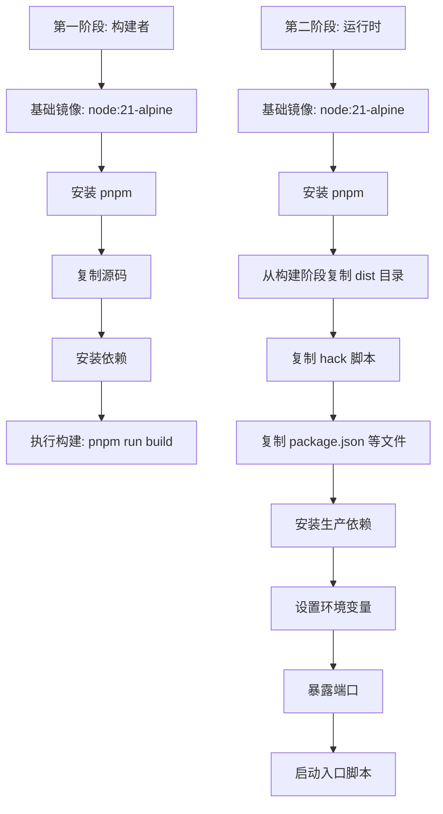
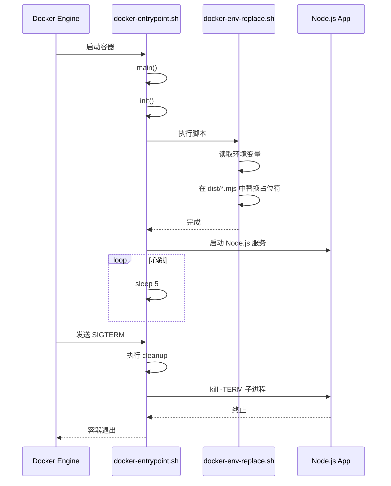

# Docker 部署

<cite>
**本文档中引用的文件**  
- [Dockerfile](file://Dockerfile)
- [docker-compose.yml](file://docker-compose.yml)
- [hack/docker-entrypoint.sh](file://hack/docker-entrypoint.sh)
- [hack/docker-env-replace.sh](file://hack/docker-env-replace.sh)
- [src/env.d.ts](file://src/env.d.ts)
- [package.json](file://package.json)
- [src/config/constants.ts](file://src/config/constants.ts)
</cite>

## 目录
1. [Docker 多阶段构建详解](#docker-多阶段构建详解)  
2. [环境变量注入机制分析](#环境变量注入机制分析)  
3. [Docker Compose 服务编排配置](#docker-compose-服务编排配置)  
4. [构建与启动命令示例](#构建与启动命令示例)  
5. [常见问题排查与解决方案](#常见问题排查与解决方案)

## Docker 多阶段构建详解

`Dockerfile` 采用多阶段构建（multi-stage build）策略，旨在分离构建环境与运行环境，从而实现最终镜像的轻量化。



**Diagram sources**  
- [Dockerfile](file://Dockerfile#L1-L17)

### 构建阶段 (builder)

```dockerfile
FROM node:21-alpine as builder
WORKDIR /usr/src
RUN npm install -g pnpm@7
COPY . .
RUN pnpm install
RUN pnpm run build
```

- **基础镜像**: 使用 `node:21-alpine`，基于 Alpine Linux，体积小，安全性高。
- **工作目录**: 设置为 `/usr/src`。
- **依赖安装**: 全局安装 `pnpm@7` 包管理器。
- **源码复制**: 将项目所有文件复制到容器内。
- **依赖安装**: 执行 `pnpm install` 安装所有依赖（包括开发依赖）。
- **构建命令**: 执行 `pnpm run build`，根据 `package.json` 中的定义，该命令调用 `astro build`，生成静态文件到 `dist` 目录。

### 运行阶段 (runtime)

```dockerfile
FROM node:21-alpine
WORKDIR /usr/src
RUN npm install -g pnpm@7
COPY --from=builder /usr/src/dist ./dist
COPY --from=builder /usr/src/hack ./
COPY package.json pnpm-lock.yaml .npmrc ./
RUN pnpm install --prod
ENV HOST=0.0.0.0 PORT=3000 NODE_ENV=production
EXPOSE $PORT
CMD ["/bin/sh", "docker-entrypoint.sh"]
```

- **轻量化策略**: 仅复制构建产物（`dist` 目录）和必要的运行时脚本（`hack` 目录），不包含源码、开发依赖和构建工具，显著减小镜像体积。
- **依赖优化**: 使用 `pnpm install --prod` 仅安装生产依赖，避免携带开发时的包。
- **环境变量**: 设置 `NODE_ENV=production` 以启用生产模式优化。
- **端口暴露**: 通过 `EXPOSE` 指令声明服务监听的端口。
- **启动命令**: 指定 `docker-entrypoint.sh` 作为容器启动时执行的脚本。

**Section sources**  
- [Dockerfile](file://Dockerfile#L1-L17)
- [package.json](file://package.json#L8-L10)

## 环境变量注入机制分析

由于前端代码在构建时（`astro build`）需要将环境变量编译进静态文件，但直接在构建时注入会失去部署灵活性（例如，无法在运行时通过 `.env` 文件或 Docker 环境变量动态配置），该项目采用了一种“构建后注入”的巧妙方案。

### 核心原理

1.  **构建时占位符**: 在源码中，环境变量通过 `import.meta.env.VAR_NAME` 访问。Astro 构建工具会将其替换为一个占位符表达式 `({}).VAR_NAME`。
2.  **运行时替换**: 容器启动时，`docker-entrypoint.sh` 脚本调用 `docker-env-replace.sh`，使用 `sed` 命令在 `dist` 目录的 `.mjs` 文件中搜索并替换这些占位符为实际的环境变量值。

### docker-env-replace.sh 脚本分析

```sh
#!/bin/sh

# 从容器环境变量中读取值
openai_api_key=$OPENAI_API_KEY
https_proxy=$HTTPS_PROXY
openai_api_base_url=$OPENAI_API_BASE_URL
head_scripts=$HEAD_SCRIPTS
public_secret_key=$PUBLIC_SECRET_KEY
site_password=$SITE_PASSWORD
openai_api_model=$OPENAI_API_MODEL

# 遍历 dist 目录下所有 .mjs 文件
for file in $(find ./dist -type f -name "*.mjs"); do
  # 使用 sed 命令进行全局文本替换
  sed "s|({}).OPENAI_API_KEY|\"$openai_api_key\"|g;
  s|({}).HTTPS_PROXY|\"$https_proxy\"|g;
  s|({}).OPENAI_API_BASE_URL|\"$openai_api_base_url\"|g;
  s|({}).HEAD_SCRIPTS|\"$head_scripts\"|g;
  s|({}).PUBLIC_SECRET_KEY|\"$public_secret_key\"|g;
  s|({}).OPENAI_API_MODEL|\"$openai_api_model\"|g;
  s|({}).SITE_PASSWORD|\"$site_password\"|g" $file > tmp
  mv tmp $file
done

rm -rf tmp
```

- **变量映射**: 脚本将 Docker 容器的环境变量（如 `OPENAI_API_KEY`）赋值给内部 shell 变量。
- **文件查找**: 使用 `find` 命令定位 `dist` 目录下所有 `.mjs` 文件。
- **文本替换**: 利用 `sed` 的流编辑功能，将 `({}).VAR_NAME` 替换为 `"实际值"`。`g` 标志确保全局替换。
- **原子操作**: 替换结果先写入临时文件 `tmp`，再用 `mv` 命令覆盖原文件，保证操作的原子性。

### docker-entrypoint.sh 启动流程

```sh
#!/bin/sh

sub_service_pid=""
sub_service_command="node dist/server/entry.mjs"

function init() {
    /bin/sh ./docker-env-replace.sh  # 执行环境变量替换
}

function main {
  init  # 初始化：注入环境变量

  echo "Starting service..."
  eval "$sub_service_command &"  # 启动主服务进程
  sub_service_pid=$!

  trap cleanup SIGTERM SIGINT  # 设置信号处理器
  echo "Running script..."
  while [ true ]; do
      sleep 5
  done
}

function cleanup {
  echo "Cleaning up!"
  kill -TERM $sub_service_pid  # 优雅终止子进程
}

main
```

- **初始化**: `init` 函数调用 `docker-env-replace.sh`，确保在应用启动前完成环境变量注入。
- **进程管理**: 使用 `eval` 启动 `node dist/server/entry.mjs` 服务，并记录其进程 ID (`sub_service_pid`)。
- **信号处理**: 通过 `trap` 命令捕获 `SIGTERM` 和 `SIGINT` 信号，执行 `cleanup` 函数以优雅地终止子进程，确保容器可以被正常停止。



**Diagram sources**  
- [hack/docker-entrypoint.sh](file://hack/docker-entrypoint.sh#L1-L30)
- [hack/docker-env-replace.sh](file://hack/docker-env-replace.sh#L1-L29)

**Section sources**  
- [hack/docker-entrypoint.sh](file://hack/docker-entrypoint.sh#L1-L30)
- [hack/docker-env-replace.sh](file://hack/docker-env-replace.sh#L1-L29)
- [src/env.d.ts](file://src/env.d.ts#L1-L14)

## Docker Compose 服务编排配置

`docker-compose.yml` 文件定义了 `chat-mini` 应用的服务编排，使其可以与反向代理（如 nginx-proxy）协同工作。

```yaml
version: '3'

services:
  chat:
    build: .
    container_name: chat-mini
    restart: always
    ports:
        - "3000:3000"
    environment:
        OPENAI_API_KEY: ${OPENAI_API_KEY}
        OPENAI_API_BASE_URL: ${OPENAI_API_BASE_URL}
        VIRTUAL_HOST: ${VIRTUAL_HOST}
        LETSENCRYPT_HOST: ${VIRTUAL_HOST}
        VIRTUAL_PROTO: http
        VIRTUAL_PORT: 3000
    networks:
      - nginx-proxy_nginx-proxy

networks:
  nginx-proxy_nginx-proxy:
    external: true
```

### 配置项详解

- **build: .**: 指定构建上下文为当前目录，Docker Compose 将使用 `Dockerfile` 构建镜像。
- **container_name: chat-mini**: 为容器指定一个固定的名称，便于管理和识别。
- **restart: always**: 设置容器的重启策略为“始终重启”，确保服务的高可用性。
- **ports: "3000:3000"**: 将宿主机的 3000 端口映射到容器的 3000 端口，允许外部访问。
- **environment**: 定义容器内的环境变量。
  - `OPENAI_API_KEY`: 必需，OpenAI API 密钥。
  - `OPENAI_API_BASE_URL`: 可选，用于设置 API 代理或私有化部署的地址。
  - `VIRTUAL_HOST`, `LETSENCRYPT_HOST`, `VIRTUAL_PROTO`, `VIRTUAL_PORT`: 这些是 `nginx-proxy` 和 `letsencrypt-nginx-proxy-companion` 服务使用的标准环境变量，用于自动配置反向代理和 HTTPS 证书。
- **networks**: 将服务连接到名为 `nginx-proxy_nginx-proxy` 的外部网络。该网络由 `nginx-proxy` 容器创建，`external: true` 表示该网络在 `docker-compose.yml` 文件之外定义。

**Section sources**  
- [docker-compose.yml](file://docker-compose.yml#L1-L20)

## 构建与启动命令示例

### 构建镜像

使用 `docker-compose` 命令构建镜像。`--build` 参数确保即使镜像已存在也会重新构建。

```bash
# 构建镜像并以后台模式启动服务
docker-compose up -d --build
```

### 启动服务

如果镜像已存在，可以直接启动服务。

```bash
# 启动服务（不重新构建）
docker-compose up -d

# 停止并移除容器、网络
docker-compose down
```

### 通过环境变量进行自定义配置

在运行 `docker-compose` 命令前，需要先设置环境变量。推荐使用 `.env` 文件。

1.  创建 `.env` 文件：
    ```bash
    # .env
    OPENAI_API_KEY=your_openai_api_key_here
    OPENAI_API_BASE_URL=https://api.openai.com
    VIRTUAL_HOST=chat.yourdomain.com
    ```
2.  启动服务：
    ```bash
    docker-compose up -d --build
    ```
    `docker-compose` 会自动读取 `.env` 文件中的变量。

**Section sources**  
- [docker-compose.yml](file://docker-compose.yml#L1-L20)
- [README.md](file://README.md#L100-L105)

## 常见问题排查与解决方案

### 1. 容器启动失败

**现象**: `docker-compose up` 后容器立即退出或报错。

**排查步骤**:
1.  查看日志：`docker logs chat-mini`
2.  检查 `OPENAI_API_KEY` 是否已正确设置。这是最常见的原因。
3.  确认 `.env` 文件存在且格式正确，变量名拼写无误。
4.  检查 `Dockerfile` 中的构建命令是否成功，可尝试单独运行 `docker build`。

### 2. 环境变量未生效

**现象**: 应用行为与预期不符，例如 API 请求未使用代理。

**排查步骤**:
1.  进入容器：`docker exec -it chat-mini /bin/sh`
2.  检查环境变量：`echo $OPENAI_API_KEY`，确认变量值正确。
3.  检查 `dist` 目录下的 `.mjs` 文件：`cat dist/client/index.mjs | grep OPENAI_API_KEY`，确认占位符已被替换。
4.  确认 `docker-entrypoint.sh` 脚本已执行。检查日志中是否有 "Starting service..." 等输出。

### 3. API 路径 404 错误

**现象**: 访问 `/api/generate` 等 API 路径返回 404。

**排查步骤**:
1.  确认 `dist` 目录中存在 `server` 子目录，且包含 `entry.mjs` 等文件。这表明 Astro SSR 构建成功。
2.  检查 `Dockerfile` 中 `COPY --from=builder /usr/src/dist ./dist` 命令是否正确执行。
3.  确认 `docker-entrypoint.sh` 中的 `sub_service_command` 指向正确的入口文件 `node dist/server/entry.mjs`。
4.  查看应用日志，确认 Node.js 服务已成功启动并监听端口。

**Section sources**  
- [Dockerfile](file://Dockerfile#L1-L17)
- [hack/docker-entrypoint.sh](file://hack/docker-entrypoint.sh#L1-L30)
- [hack/docker-env-replace.sh](file://hack/docker-env-replace.sh#L1-L29)
- [docker-compose.yml](file://docker-compose.yml#L1-L20)