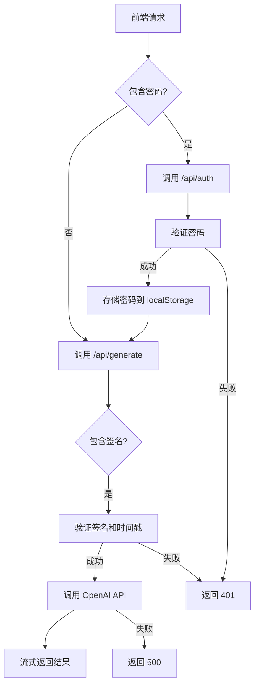
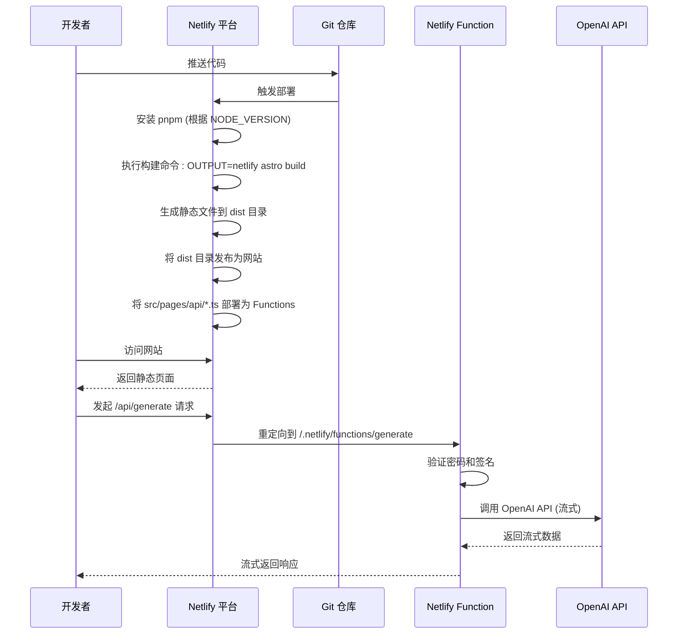
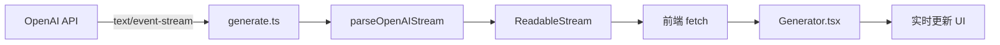

# Netlify 部署

<cite>
**本文档中引用的文件**   
- [netlify.toml](file://netlify.toml)
- [astro.config.mjs](file://astro.config.mjs)
- [package.json](file://package.json)
- [src/pages/api/auth.ts](file://src/pages/api/auth.ts)
- [src/pages/api/generate.ts](file://src/pages/api/generate.ts)
- [src/utils/openAI.ts](file://src/utils/openAI.ts)
- [src/env.d.ts](file://src/env.d.ts)
- [README.md](file://README.md)
</cite>

## 目录
1. [项目结构分析](#项目结构分析)
2. [Netlify 配置解析](#netlify-配置解析)
3. [API 路由与函数实现](#api-路由与函数实现)
4. [环境变量配置](#环境变量配置)
5. [构建与部署流程](#构建与部署流程)
6. [流式响应处理机制](#流式响应处理机制)
7. [部署后测试与故障排除](#部署后测试与故障排除)

## 项目结构分析

本项目是一个基于 Astro 框架的轻量级 AI 聊天应用，采用模块化设计，主要分为以下几个部分：

- **核心源码** (`src/`): 包含组件、页面、工具函数和配置。
- **静态资源** (`public/`): 存放图标、PWA 资源等。
- **配置文件**: `netlify.toml` 用于 Netlify 部署，`vercel.json` 用于 Vercel 部署，`astro.config.mjs` 是 Astro 的主配置文件。
- **构建脚本**: 在 `package.json` 中定义了针对不同平台的构建命令。

关键的 API 函数位于 `src/pages/api/` 目录下，Netlify 会自动将此目录下的 `.ts` 文件识别为 Serverless Functions。

**Section sources**
- [project_structure](file://project_structure)

## Netlify 配置解析

`netlify.toml` 文件是部署到 Netlify 的核心配置文件，它定义了构建环境、命令、发布目录和头部信息。

```toml
[build.environment]
  NETLIFY_USE_PNPM = "true"
  NODE_VERSION = "18"

[build]
  command = "OUTPUT=netlify astro build"
  publish = "dist"

[[headers]]
  for = "/manifest.webmanifest"
  [headers.values]
    Content-Type = "application/manifest+json"
```

**配置项详解**:

- **[build.environment]**: 设置构建时的环境变量。
  - `NETLIFY_USE_PNPM = "true"`: 指示 Netlify 使用 pnpm 包管理器，与项目使用的 `pnpm-lock.yaml` 保持一致。
  - `NODE_VERSION = "18"`: 指定构建环境的 Node.js 版本为 18，确保与本地开发环境兼容。

- **[build]**: 定义构建过程。
  - `command = "OUTPUT=netlify astro build"`: 这是核心的构建命令。`OUTPUT=netlify` 是一个环境变量，用于在 `astro.config.mjs` 中选择 Netlify 适配器。`astro build` 是 Astro 的构建命令，它会根据配置生成生产环境的静态文件。
  - `publish = "dist"`: 指定构建完成后，Netlify 应该将 `dist` 目录下的文件作为网站的根目录进行发布。这是 Astro 默认的构建输出目录。

- **[[headers]]**: 为特定文件设置 HTTP 响应头。
  - 此处为 `/manifest.webmanifest` 文件设置了 `Content-Type: application/manifest+json`，确保浏览器能正确解析 PWA 的清单文件。

**Section sources**
- [netlify.toml](file://netlify.toml#L0-L12)

## API 路由与函数实现

Netlify 通过 `src/pages/api/` 目录下的文件来创建 Serverless Functions。每个 `.ts` 文件都会被部署为一个独立的 API 端点，路径为 `/.netlify/functions/[filename]`。

### 认证 API (`auth.ts`)

该文件实现了简单的密码验证逻辑。

```typescript
// src/pages/api/auth.ts
import type { APIRoute } from 'astro'

const realPassword = import.meta.env.SITE_PASSWORD || ''
const passList = realPassword.split(',') || []

export const post: APIRoute = async(context) => {
  const body = await context.request.json()
  const { pass } = body
  return new Response(JSON.stringify({
    code: (!realPassword || pass === realPassword || passList.includes(pass)) ? 0 : -1,
  }))
}
```

- **功能**: 接收一个包含 `pass` 字段的 POST 请求，检查其是否与环境变量 `SITE_PASSWORD` 匹配（支持多个密码，用逗号分隔）。
- **路由**: 部署后，该函数的 URL 为 `/.netlify/functions/auth`。
- **重定向**: 在 `netlify.toml` 中虽然没有显式定义 `[[redirects]]`，但 Netlify 的 `@astrojs/netlify` 适配器会自动处理路由。在 `astro.config.mjs` 中，`adapter` 被设置为 `netlify()`，它会将 `/api/*` 的请求重定向到对应的函数。例如，对 `/api/auth` 的请求会被自动代理到 `/.netlify/functions/auth`。

### 生成 API (`generate.ts`)

这是应用的核心，负责与 OpenAI API 通信并流式返回结果。

```typescript
// src/pages/api/generate.ts
// ... imports ...

const apiKey = import.meta.env.OPENAI_API_KEY
const httpsProxy = import.meta.env.HTTPS_PROXY
const baseUrl = ((import.meta.env.OPENAI_API_BASE_URL) || 'https://api.openai.com/v1').trim().replace(/\/$/, '')
const sitePassword = import.meta.env.SITE_PASSWORD || ''
const passList = sitePassword.split(',') || []
const allowedModels = AVAILABLE_MODELS.map(m => m.id)
const apiModel = import.meta.env.OPENAI_API_MODEL || CONFIG.DEFAULT_MODEL

export const post: APIRoute = async(context) => {
  const body = await context.request.json()
  const { sign, time, messages, pass, temperature, model } = body
  // 1. 输入验证
  if (!messages) {
    return new Response(JSON.stringify({ error: { message: 'No input text.' } }), { status: 400 })
  }
  // 2. 密码验证
  if (sitePassword && !(sitePassword === pass || passList.includes(pass))) {
    return new Response(JSON.stringify({ error: { message: 'Invalid password.' } }), { status: 401 })
  }
  // 3. 签名验证 (生产环境)
  if (import.meta.env.PROD && !await verifySignature({ t: time, m: messages?.[messages.length - 1]?.content || '' }, sign)) {
    return new Response(JSON.stringify({ error: { message: 'Invalid signature.' } }), { status: 401 })
  }
  // 4. 模型验证
  const modelToUse = model || apiModel
  if (!allowedModels.includes(modelToUse)) {
    return new Response(JSON.stringify({ error: { message: `Model ${modelToUse} is not allowed.` } }), { status: 400 })
  }
  // 5. 构造请求
  const initOptions = generatePayload(apiKey, messages, temperature, modelToUse)
  if (httpsProxy) initOptions.dispatcher = new ProxyAgent(httpsProxy)
  // 6. 调用 OpenAI API
  const response = await fetch(`${baseUrl}/chat/completions`, initOptions).catch((err: Error) => {
    console.error(err)
    return new Response(JSON.stringify({ error: { code: err.name, message: err.message } }), { status: 500 })
  }) as Response
  // 7. 处理并返回流式响应
  return parseOpenAIStream(response) as Response
}
```

- **功能**: 接收聊天消息，经过多重验证后，转发请求到 OpenAI API，并将流式响应返回给前端。
- **路由**: 部署后，该函数的 URL 为 `/.netlify/functions/generate`。同样，`/api/generate` 会被自动重定向至此。

**Diagram sources**
- [src/pages/api/auth.ts](file://src/pages/api/auth.ts#L0-L13)
- [src/pages/api/generate.ts](file://src/pages/api/generate.ts#L0-L70)

**Section sources**
- [src/pages/api/auth.ts](file://src/pages/api/auth.ts#L0-L13)
- [src/pages/api/generate.ts](file://src/pages/api/generate.ts#L0-L70)

## 环境变量配置

为了保障应用的认证和生成功能正常运行，必须在 Netlify 的 UI 或 CLI 中设置以下环境变量。



**Diagram sources**
- [src/pages/api/auth.ts](file://src/pages/api/auth.ts#L0-L13)
- [src/pages/api/generate.ts](file://src/pages/api/generate.ts#L0-L70)
- [src/utils/auth.ts](file://src/utils/auth.ts#L0-L34)

**Section sources**
- [src/pages/api/auth.ts](file://src/pages/api/auth.ts#L0-L13)
- [src/pages/api/generate.ts](file://src/pages/api/generate.ts#L0-L70)
- [src/utils/auth.ts](file://src/utils/auth.ts#L0-L34)

### 必需的环境变量

根据 `src/env.d.ts` 和 `README.md`，以下是必须设置的环境变量：

| 变量名 | 说明 | 是否必需 |
| :--- | :--- | :--- |
| `OPENAI_API_KEY` | OpenAI 的 API 密钥，用于调用其服务。 | **是** |
| `PUBLIC_SECRET_KEY` | 用于生成和验证 API 请求签名的密钥，防止重放攻击。 | **是** |
| `SITE_PASSWORD` | 网站访问密码，可以设置多个，用英文逗号分隔。留空则无需密码。 | 否 |
| `OPENAI_API_MODEL` | 默认使用的 OpenAI 模型 ID，例如 `gpt-3.5-turbo`。 | 否 |

### 可选的环境变量

| 变量名 | 说明 |
| :--- | :--- |
| `HTTPS_PROXY` | OpenAI API 的代理地址，例如 `http://127.0.0.1:7890`。 |
| `OPENAI_API_BASE_URL` | 自定义 OpenAI API 的基础 URL，可用于私有化部署或反向代理。 |
| `HEAD_SCRIPTS` | 在页面 `</head>` 标签前注入的脚本，例如分析代码。 |

**设置方法**:
1.  **Netlify UI**: 进入站点设置 -> Build & deploy -> Environment -> Environment variables，添加键值对。
2.  **Netlify CLI**: 使用命令 `netlify env:set KEY_NAME "value"`。

**Section sources**
- [src/env.d.ts](file://src/env.d.ts#L0-L14)
- [README.md](file://README.md#L59-L65)

## 构建与部署流程

部署流程清晰且自动化，主要步骤如下：



**Diagram sources**
- [netlify.toml](file://netlify.toml#L0-L12)
- [astro.config.mjs](file://astro.config.mjs#L0-L68)
- [package.json](file://package.json#L0-L46)

**Section sources**
- [netlify.toml](file://netlify.toml#L0-L12)
- [astro.config.mjs](file://astro.config.mjs#L0-L68)
- [package.json](file://package.json#L0-L46)

1.  **代码推送**: 开发者将代码推送到连接的 Git 仓库（如 GitHub）。
2.  **触发构建**: Netlify 监听到代码变更，自动触发构建流程。
3.  **环境准备**: 根据 `netlify.toml` 中的 `[build.environment]`，准备 Node.js 18 环境并使用 pnpm 安装依赖。
4.  **执行构建**: 运行 `command` 指定的命令 `OUTPUT=netlify astro build`。
    - `OUTPUT=netlify` 环境变量被 `astro.config.mjs` 中的 `envAdapter()` 函数读取，从而选择 `@astrojs/netlify` 适配器。
    - Astro 构建器开始工作，将 Astro 组件编译为静态 HTML、CSS 和 JavaScript，并输出到 `dist` 目录。
    - 同时，`src/pages/api/` 目录下的 API 文件被识别并准备部署为 Serverless Functions。
5.  **发布**: 构建成功后，Netlify 将 `dist` 目录的内容发布到分配的域名下。
6.  **函数部署**: `src/pages/api/` 下的函数被部署到 Netlify Edge Functions，可通过 `/.netlify/functions/[name]` 访问。

## 流式响应处理机制

为了实现类似 ChatGPT 的逐字输出效果，应用使用了流式响应（Streaming）。



**Diagram sources**
- [src/pages/api/generate.ts](file://src/pages/api/generate.ts#L0-L70)
- [src/utils/openAI.ts](file://src/utils/openAI.ts#L0-L71)
- [src/components/Generator.tsx](file://src/components/Generator.tsx#L124-L211)

**Section sources**
- [src/pages/api/generate.ts](file://src/pages/api/generate.ts#L0-L70)
- [src/utils/openAI.ts](file://src/utils/openAI.ts#L0-L71)
- [src/components/Generator.tsx](file://src/components/Generator.tsx#L124-L211)

### 后端处理 (`parseOpenAIStream`)

在 `src/utils/openAI.ts` 中，`parseOpenAIStream` 函数负责处理来自 OpenAI 的 `text/event-stream` 响应。

```typescript
export const parseOpenAIStream = (rawResponse: Response) => {
  const stream = new ReadableStream({
    async start(controller) {
      const reader = rawResponse.body?.pipeThrough(new TextDecoderStream()).getReader()
      const parser = createParser((event) => {
        if (event.type === 'event') {
          const data = event.data
          if (data === '[DONE]') {
            controller.close()
            return
          }
          try {
            const json = JSON.parse(data)
            const text = json.choices[0]?.delta?.content || ''
            if (text) {
              controller.enqueue(new TextEncoder().encode(text))
            }
          } catch (e) {
            controller.error(e)
          }
        }
      })
      // ... 读取并解析原始流 ...
    },
  })
  return new Response(stream)
}
```

该函数创建了一个新的 `ReadableStream`，将 OpenAI 的 SSE (Server-Sent Events) 数据解析，并将每个 `delta.content` 作为独立的文本块推送给前端。

### 前端处理 (`Generator.tsx`)

前端通过 `fetch` 获取这个流式响应，并使用 `ReadableStream` 的 `reader` 逐块读取数据，实时更新 UI。

## 部署后测试与故障排除

### 测试 API 连通性

1.  **直接访问函数 URL**: 部署后，直接在浏览器中访问 `https://your-site.netlify.app/.netlify/functions/auth`。如果返回 `{"code":0}` 或 `{"code":-1}`，说明函数已成功部署。
2.  **使用 curl 测试生成 API**:
    ```bash
    curl -X POST https://your-site.netlify.app/api/generate \
      -H "Content-Type: application/json" \
      -d '{"messages": [{"role": "user", "content": "Hello"}], "pass": "your_password_if_set"}'
    ```
    如果配置正确，应该能看到流式的 JSON 响应。

### 典型问题与应对策略

- **重定向失效**:
  - **现象**: 访问 `/api/generate` 返回 404。
  - **原因**: `@astrojs/netlify` 适配器未正确加载。
  - **解决**: 确认 `astro.config.mjs` 中 `adapter` 的值是 `netlify()`，并且 `OUTPUT=netlify` 环境变量在构建时被正确设置。

- **函数超时**:
  - **现象**: 聊天响应缓慢或直接报错 `500`，日志显示 `Function timed out`。
  - **原因**: Netlify Edge Functions 的默认超时时间为 10 秒，而 OpenAI 的流式响应可能超过此时间。
  - **解决**: **建议调整函数超时设置**。在 Netlify UI 中，进入 `Functions` 设置，将超时时间增加到 30 秒或更长。或者，在 `netlify.toml` 中为特定函数设置超时（如果支持）。

- **环境变量未注入**:
  - **现象**: API 返回 `500` 错误，日志显示 `OPENAI_API_KEY is not defined` 或 `Invalid password`。
  - **原因**: 环境变量未在 Netlify 上正确设置。
  - **解决**: 检查 Netlify 的 Environment Variables 设置，确保 `OPENAI_API_KEY` 和 `SITE_PASSWORD` 等变量已添加且值正确。注意，本地的 `.env` 文件不会被部署。

**Section sources**
- [netlify.toml](file://netlify.toml#L0-L12)
- [src/pages/api/generate.ts](file://src/pages/api/generate.ts#L0-L70)
- [README.md](file://README.md#L59-L65)