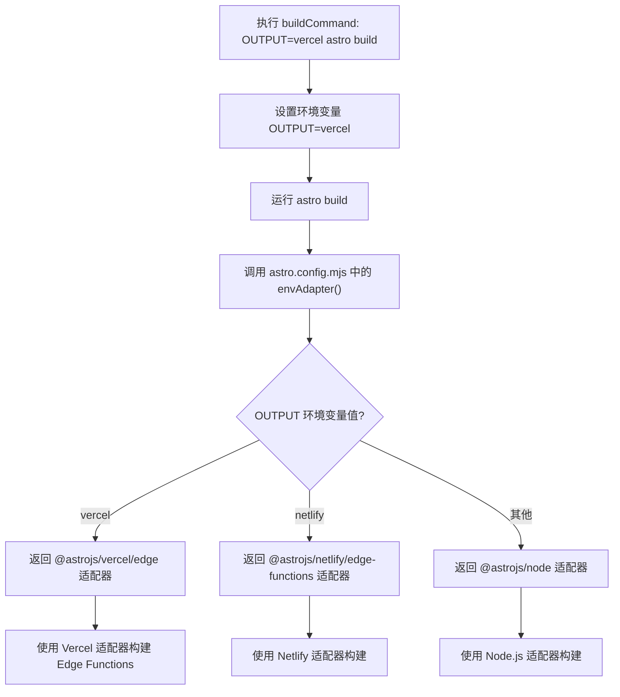
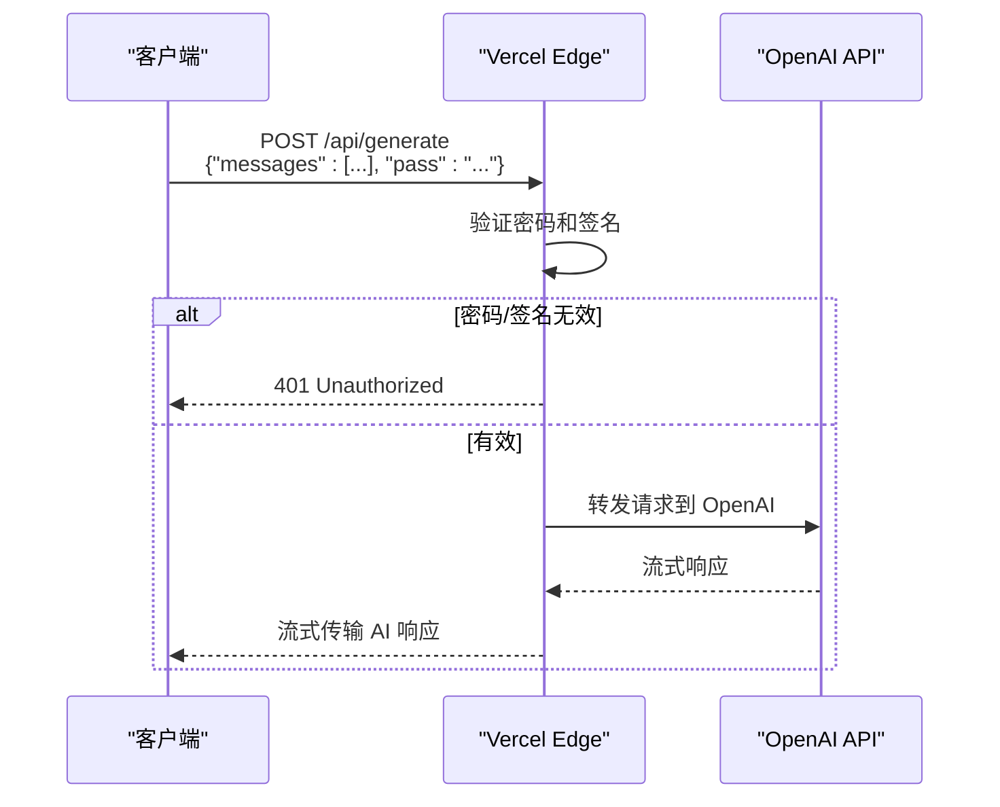

# Vercel 部署

<cite>
**本文档中引用的文件**  
- [vercel.json](file://vercel.json)
- [package.json](file://package.json)
- [astro.config.mjs](file://astro.config.mjs)
- [src/pages/api/generate.ts](file://src/pages/api/generate.ts)
- [src/pages/api/auth.ts](file://src/pages/api/auth.ts)
- [src/env.d.ts](file://src/env.d.ts)
- [plugins/disableBlocks.ts](file://plugins/disableBlocks.ts)
- [netlify.toml](file://netlify.toml)
- [README.md](file://README.md)
</cite>

## 目录
1. [简介](#简介)
2. [项目结构概览](#项目结构概览)
3. [Vercel 路由配置解析](#vercel-路由配置解析)
4. [构建流程与输出配置](#构建流程与输出配置)
5. [环境变量设置](#环境变量设置)
6. [Vercel 项目配置](#vercel-项目配置)
7. [API 端点验证与访问路径](#api-端点验证与访问路径)
8. [常见问题诊断与修复](#常见问题诊断与修复)
9. [总结](#总结)

## 简介
本指南旨在为开发者提供在 Vercel 平台上完整部署 `chat-mini` 项目的详细说明。文档深入解析了部署过程中的核心配置，包括 `vercel.json` 中的路由规则、构建命令的作用、环境变量的设置方法以及 Vercel 项目的配置选项。通过本指南，用户将能够成功部署应用并验证其功能，同时掌握常见部署问题的解决策略。

## 项目结构概览
`chat-mini` 是一个基于 Astro 框架构建的轻量级聊天应用，其结构清晰，模块化程度高。关键目录和文件包括：
- `src/pages/api/`: 存放所有 API 路由处理程序，如 `generate.ts` 和 `auth.ts`。
- `src/config/`: 包含应用的常量配置，如 `constants.ts`。
- `src/utils/`: 提供工具函数，如 OpenAI API 调用和身份验证。
- 根目录下的配置文件：`vercel.json`、`package.json`、`astro.config.mjs` 和 `netlify.toml` 分别用于不同平台的部署和构建。

该结构支持多平台部署（Vercel、Netlify、Docker），并通过环境变量和条件编译实现配置的灵活性。

## Vercel 路由配置解析
`vercel.json` 文件是 Vercel 部署的核心配置文件。在本项目中，它定义了构建命令，但**并未显式定义 `routes` 字段**。

```json
{
  "buildCommand": "OUTPUT=vercel astro build"
}
```

**路由机制说明**：
尽管 `vercel.json` 中没有 `routes` 数组，但 Astro 框架与 `@astrojs/vercel` 适配器的集成实现了自动路由。其工作原理如下：
1.  **约定优于配置**：Vercel 的 Astro 适配器遵循 Astro 的文件系统路由约定。`src/pages/api/*.ts` 文件会自动映射到 `/api/*` 路径。
2.  **自动处理**：当请求发送到 `/api/generate` 或 `/api/auth` 时，Vercel 会自动识别并调用 `src/pages/api/generate.ts` 和 `src/pages/api/auth.ts` 中的处理函数。
3.  **适配器作用**：`astro.config.mjs` 中的 `@astrojs/vercel/edge` 适配器负责将 Astro 应用打包成 Vercel Edge Functions，确保 API 路由在 Vercel 边缘网络上正确运行。

因此，`/api/*` 请求能够被正确路由到对应的 Astro API 路由处理程序，无需在 `vercel.json` 中手动配置 `routes`。

**Section sources**
- [vercel.json](file://vercel.json#L1-L3)
- [astro.config.mjs](file://astro.config.mjs#L10-L15)

## 构建流程与输出配置
构建流程是将源代码转换为可在生产环境运行的静态文件或服务器端代码的过程。本项目在 Vercel 环境中的构建流程如下：

### 构建命令 (`buildCommand`)
`vercel.json` 中的 `buildCommand` 设置为 `OUTPUT=vercel astro build`。此命令的执行流程如下：
1.  **设置环境变量**：`OUTPUT=vercel` 是一个环境变量，它被 `astro.config.mjs` 中的 `envAdapter()` 函数读取。
2.  **触发构建脚本**：该命令等效于执行 `pnpm build:vercel`（在 `package.json` 中定义）。
3.  **执行构建**：`astro build` 命令启动 Astro 的构建流程。



**Diagram sources**
- [vercel.json](file://vercel.json#L2)
- [package.json](file://package.json#L6-L8)
- [astro.config.mjs](file://astro.config.mjs#L10-L15)

### 输出配置 (`output`)
在 `astro.config.mjs` 中，`output: 'server'` 指定了构建输出为服务器端渲染（SSR）模式。结合 `adapter: envAdapter()`，这确保了应用被构建为一个服务器端应用，而不是静态站点（SSG）。对于 Vercel，这意味着应用将作为 Edge Functions 运行，提供低延迟的 API 响应。

**Section sources**
- [vercel.json](file://vercel.json#L2)
- [package.json](file://package.json#L6-L8)
- [astro.config.mjs](file://astro.config.mjs#L55-L57)

## 环境变量设置
环境变量是部署过程中至关重要的环节，用于安全地注入 API 密钥和应用配置。

### 关键环境变量
根据 `src/env.d.ts` 和 `README.md`，以下是必须在 Vercel 项目设置中配置的环境变量：

| 变量名 | 说明 |
| :--- | :--- |
| `OPENAI_API_KEY` | **必需**，用于调用 OpenAI API 的密钥。 |
| `SITE_PASSWORD` | 网站访问密码，支持多个密码（用英文逗号分隔）。留空则公开访问。 |
| `PUBLIC_SECRET_KEY` | 用于 API 调用签名的密钥，防止未授权访问。 |
| `HTTPS_PROXY` | OpenAI API 的代理地址（如 `http://127.0.0.1:7890`）。 |
| `OPENAI_API_BASE_URL` | OpenAI API 的基础 URL，可用于自定义代理或私有化部署。 |
| `OPENAI_API_MODEL` | 默认使用的模型 ID。 |

### 在 Vercel 中设置
1.  进入 Vercel 项目设置。
2.  导航到 **Settings** > **Environment Variables**。
3.  为上述每个变量添加 `Key` 和 `Value`。
4.  确保 `OPENAI_API_KEY` 被标记为 **Encrypted**。

**代码中的使用**：
在 `src/pages/api/generate.ts` 中，这些变量通过 `import.meta.env` 访问：
```typescript
const apiKey = import.meta.env.OPENAI_API_KEY
const sitePassword = import.meta.env.SITE_PASSWORD || ''
```
如果环境变量未设置，代码会使用默认值或抛出错误。

**Section sources**
- [src/env.d.ts](file://src/env.d.ts#L2-L12)
- [src/pages/api/generate.ts](file://src/pages/api/generate.ts#L6-L10)
- [README.md](file://README.md#L24-L65)

## Vercel 项目配置
在 Vercel 仪表板中创建项目时，需要进行以下关键配置：

### 框架检测忽略
Vercel 通常会自动检测项目框架。由于本项目使用了自定义的构建命令，建议**启用 "Ignore framework detection"**。这可以防止 Vercel 使用默认的构建设置，确保它完全遵循 `vercel.json` 中的指令。

### 根目录设定
项目的根目录即为仓库的根目录（`/`）。Vercel 会在此目录下查找 `vercel.json` 和 `package.json`。

### 构建指令设置
Vercel 会自动从 `vercel.json` 中读取 `buildCommand`。如果未正确读取，可以在项目设置的 **Build & Output Settings** 中手动指定：
- **Build Command**: `OUTPUT=vercel astro build`
- **Output Directory**: `dist` (由 Astro 构建命令默认生成)

### 对比 Netlify 配置
作为参考，`netlify.toml` 文件展示了 Netlify 的配置方式：
```toml
[build]
  command = "OUTPUT=netlify astro build"
  publish = "dist"
```
这表明不同平台通过设置不同的 `OUTPUT` 环境变量来触发相应的构建流程，体现了配置的灵活性。

**Section sources**
- [vercel.json](file://vercel.json#L2)
- [netlify.toml](file://netlify.toml#L5-L6)
- [astro.config.mjs](file://astro.config.mjs#L10-L15)

## API 端点验证与访问路径
部署成功后，可以通过以下方式验证 API 端点。

### 访问路径
- **前端应用**: `https://your-project.vercel.app`
- **API 端点**:
  - 生成响应: `https://your-project.vercel.app/api/generate`
  - 身份验证: `https://your-project.vercel.app/api/auth`

### 验证 API 端点
1.  **使用 `curl` 命令测试 `/api/generate`**:
    ```bash
    curl -X POST https://your-project.vercel.app/api/generate \
      -H "Content-Type: application/json" \
      -d '{
        "messages": [{"role": "user", "content": "Hello!"}],
        "pass": "your-site-password-if-set"
      }'
    ```
    如果配置正确，应收到一个来自 OpenAI 的流式响应。

2.  **预期响应**:
    - **成功 (200)**: 返回一个包含 AI 生成文本的流。
    - **密码错误 (401)**: 如果设置了密码但未提供或错误，返回 `{"error": {"message": "Invalid password."}}`。
    - **无输入 (400)**: 如果 `messages` 字段为空，返回 `{"error": {"message": "No input text."}}`。



**Diagram sources**
- [src/pages/api/generate.ts](file://src/pages/api/generate.ts#L16-L69)
- [src/pages/api/auth.ts](file://src/pages/api/auth.ts#L6-L13)

**Section sources**
- [src/pages/api/generate.ts](file://src/pages/api/generate.ts#L16-L69)

## 常见问题诊断与修复
### 404 错误
- **症状**: 访问 `/api/generate` 返回 404。
- **原因**: 
  - `src/pages/api/generate.ts` 文件路径错误或文件不存在。
  - `vercel.json` 或 `astro.config.mjs` 配置错误，导致构建失败。
- **修复**:
  1.  检查 `src/pages/api/` 目录下是否存在 `generate.ts`。
  2.  检查 Vercel 构建日志，确认 `astro build` 是否成功。
  3.  确认 `astro.config.mjs` 中已正确安装并配置 `@astrojs/vercel` 适配器。

### 构建失败
- **症状**: Vercel 构建日志显示错误。
- **原因**:
  - `pnpm` 版本不兼容。
  - `OUTPUT` 环境变量未被正确设置。
  - 依赖项安装失败。
- **修复**:
  1.  在 `vercel.json` 中明确指定 Node.js 版本（可选）。
  2.  确保 `buildCommand` 正确无误。
  3.  检查 `package.json` 中的 `packageManager` 字段，确保 Vercel 使用 `pnpm`。

### 环境变量缺失
- **症状**: API 返回 `500` 错误，日志显示 `OPENAI_API_KEY` 未定义。
- **原因**: `OPENAI_API_KEY` 未在 Vercel 环境变量中设置。
- **修复**:
  1.  进入 Vercel 项目设置。
  2.  在 **Environment Variables** 中添加 `OPENAI_API_KEY` 及其值。
  3.  重新部署项目。

### 特定于 Vercel 的代码块处理
项目使用了一个 Vite 插件 `disableBlocks.ts` 来处理特定于 Vercel 的代码：
```typescript
// #vercel-disable-blocks
import { ProxyAgent, fetch } from 'undici'
// #vercel-end
```
当 `OUTPUT=vercel` 时，`disableBlocks` 插件会移除 `#vercel-disable-blocks` 和 `#vercel-end` 之间的代码。这是因为在 Vercel Edge Functions 环境中，`undici` 的 `ProxyAgent` 不可用，需要移除相关代码以避免运行时错误。

**Section sources**
- [src/pages/api/generate.ts](file://src/pages/api/generate.ts#L1-L2)
- [plugins/disableBlocks.ts](file://plugins/disableBlocks.ts#L1-L16)

## 总结
本指南详细阐述了在 Vercel 平台上部署 `chat-mini` 项目的全过程。核心要点包括：利用 `vercel.json` 中的 `buildCommand` 触发构建，依赖 Astro 框架和 `@astrojs/vercel` 适配器实现 `/api/*` 路由的自动映射，通过 `OUTPUT=vercel` 环境变量控制构建流程，并正确设置 `OPENAI_API_KEY` 等关键环境变量。通过遵循本指南，开发者可以顺利完成部署，并通过验证 API 端点来确保应用正常运行。对于遇到的 404、构建失败或环境变量问题，也提供了相应的诊断和修复方法。