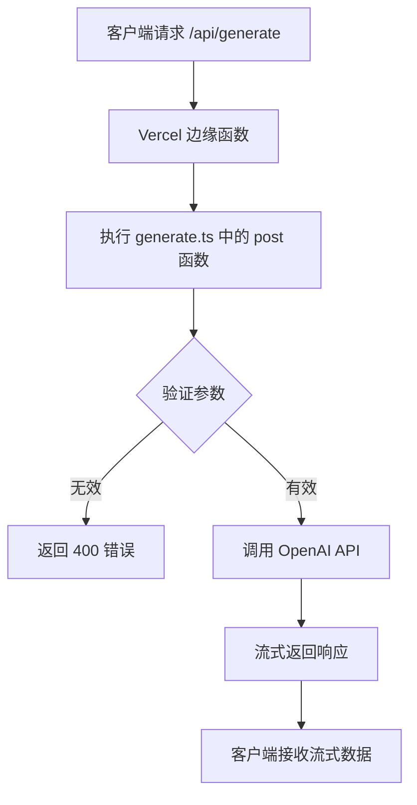

# 部署指南

<cite>
**本文档中引用的文件**   
- [Dockerfile](file://Dockerfile)
- [docker-compose.yml](file://docker-compose.yml)
- [docker-compose.dev.yml](file://docker-compose.dev.yml)
- [vercel.json](file://vercel.json)
- [netlify.toml](file://netlify.toml)
- [hack/docker-entrypoint.sh](file://hack/docker-entrypoint.sh)
- [hack/docker-env-replace.sh](file://hack/docker-env-replace.sh)
- [src/pages/api/generate.ts](file://src/pages/api/generate.ts)
- [src/pages/api/auth.ts](file://src/pages/api/auth.ts)
- [package.json](file://package.json)
- [README.md](file://README.md)
</cite>

## 目录
1. [Docker 部署](#docker-部署)
2. [Vercel 部署](#vercel-部署)
3. [Netlify 部署](#netlify-部署)
4. [平台对比与资源配置建议](#平台对比与资源配置建议)
5. [常见部署问题排查](#常见部署问题排查)

## Docker 部署

本项目通过 `Dockerfile` 和 `docker-compose.yml` 提供完整的容器化部署方案，适用于本地运行或私有服务器部署。

### Dockerfile 多阶段构建流程

`Dockerfile` 采用多阶段构建（multi-stage build）策略，以优化镜像大小并分离构建与运行环境。

```dockerfile
FROM node:21-alpine as builder
WORKDIR /usr/src
RUN npm install -g pnpm@7
COPY . .
RUN pnpm install
RUN pnpm run build

FROM node:21-alpine
WORKDIR /usr/src
RUN npm install -g pnpm@7
COPY --from=builder /usr/src/dist ./dist
COPY --from=builder /usr/src/hack ./
COPY package.json pnpm-lock.yaml .npmrc ./
RUN pnpm install
ENV HOST=0.0.0.0 PORT=3000 NODE_ENV=production
EXPOSE $PORT
CMD ["/bin/sh", "docker-entrypoint.sh"]
```

**构建流程解析：**
1. **构建阶段（builder）**：使用 `node:21-alpine` 镜像安装依赖并执行 `pnpm run build`，生成生产环境的静态文件至 `dist` 目录。
2. **运行阶段**：基于轻量级 `node:21-alpine` 镜像，仅复制构建产物（`dist`）、`hack` 脚本及必要配置文件，避免携带开发依赖，显著减小最终镜像体积。

**Section sources**
- [Dockerfile](file://Dockerfile#L1-L18)

### hack 目录脚本：环境变量注入机制

`hack` 目录包含两个关键 Shell 脚本，用于在容器启动时动态注入环境变量。

#### docker-env-replace.sh：编译后变量注入

该脚本在容器启动时运行，通过 `sed` 命令将环境变量注入已构建的 `.mjs` 文件中。

```bash
#!/bin/sh

openai_api_key=$OPENAI_API_KEY
https_proxy=$HTTPS_PROXY
openai_api_base_url=$OPENAI_API_BASE_URL
head_scripts=$HEAD_SCRIPTS
public_secret_key=$PUBLIC_SECRET_KEY
site_password=$SITE_PASSWORD
openai_api_model=$OPENAI_API_MODEL

for file in $(find ./dist -type f -name "*.mjs"); do
  sed "s|({}).OPENAI_API_KEY|\"$openai_api_key\"|g;
  s|({}).HTTPS_PROXY|\"$https_proxy\"|g;
  s|({}).OPENAI_API_BASE_URL|\"$openai_api_base_url\"|g;
  s|({}).HEAD_SCRIPTS|\"$head_scripts\"|g;
  s|({}).PUBLIC_SECRET_KEY|\"$public_secret_key\"|g;
  s|({}).OPENAI_API_MODEL|\"$openai_api_model\"|g;
  s|({}).SITE_PASSWORD|\"$site_password\"|g" $file > tmp
  mv tmp $file
done

rm -rf tmp
```

**功能说明：**
- 遍历 `dist` 目录下所有 `.mjs` 文件。
- 将占位符 `({}).VARIABLE_NAME` 替换为实际的环境变量值。
- 实现了构建时与运行时配置的分离，确保敏感信息（如 API 密钥）不会硬编码在构建产物中。

**Section sources**
- [hack/docker-env-replace.sh](file://hack/docker-env-replace.sh#L1-L30)

#### docker-entrypoint.sh：容器启动入口

该脚本作为容器的启动命令，负责执行环境变量注入并启动应用。

```bash
#!/bin/sh

sub_service_pid=""
sub_service_command="node dist/server/entry.mjs"

function init() {
    /bin/sh ./docker-env-replace.sh
}

function main {
  init

  echo "Starting service..."
  eval "$sub_service_command &"
  sub_service_pid=$!

  trap cleanup SIGTERM SIGINT
  echo "Running script..."
  while [ true ]; do
      sleep 5
  done
}

function cleanup {
  echo "Cleaning up!"
  kill -TERM $sub_service_pid
}

main
```

**执行流程：**
1. **init()**：调用 `docker-env-replace.sh` 注入环境变量。
2. **main()**：启动 Node.js 服务进程。
3. **cleanup()**：监听 `SIGTERM` 和 `SIGINT` 信号，优雅终止子进程。

**Section sources**
- [hack/docker-entrypoint.sh](file://hack/docker-entrypoint.sh#L1-L31)

### docker-compose.yml 服务编排配置

使用 `docker-compose.yml` 可一键启动服务，实现端口映射、环境变量注入和网络配置。

```yaml
version: '3'

services:
  chat:
    build: .
    container_name: chat-mini
    restart: always
    ports:
        - "3000:3000"
    environment:
        OPENAI_API_KEY: ${OPENAI_API_KEY}
        OPENAI_API_BASE_URL: ${OPENAI_API_BASE_URL}
        VIRTUAL_HOST: ${VIRTUAL_HOST}
        LETSENCRYPT_HOST: ${VIRTUAL_HOST}
        VIRTUAL_PROTO: http
        VIRTUAL_PORT: 3000
    networks:
      - nginx-proxy_nginx-proxy

networks:
  nginx-proxy_nginx-proxy:
    external: true
```

**配置说明：**
- **build: .**：基于当前目录的 `Dockerfile` 构建镜像。
- **ports**：将容器的 3000 端口映射到宿主机。
- **environment**：从宿主机的 `.env` 文件或环境变量中注入配置。
- **networks**：连接到外部 `nginx-proxy` 网络，支持反向代理和 HTTPS。

**Section sources**
- [docker-compose.yml](file://docker-compose.yml#L1-L21)

## Vercel 部署

Vercel 部署通过 `vercel.json` 配置文件定义构建行为，适用于边缘网络（Edge Network）部署。

### vercel.json 路由配置与 API 映射

```json
{
  "buildCommand": "OUTPUT=vercel astro build"
}
```

**配置解析：**
- **buildCommand**：指定构建命令为 `OUTPUT=vercel astro build`。此命令会触发 `package.json` 中的 `build:vercel` 脚本，生成针对 Vercel 平台优化的构建产物。
- **API 映射**：项目使用 Astro 框架，其 `src/pages/api/` 目录下的文件会自动映射为 API 路由：
  - `src/pages/api/auth.ts` → `/api/auth`
  - `src/pages/api/generate.ts` → `/api/generate`



**Diagram sources**
- [vercel.json](file://vercel.json#L1-L3)
- [src/pages/api/generate.ts](file://src/pages/api/generate.ts#L16-L69)

**Section sources**
- [vercel.json](file://vercel.json#L1-L3)
- [package.json](file://package.json#L6-L8)

## Netlify 部署

Netlify 部署通过 `netlify.toml` 配置文件管理构建和重定向规则。

### netlify.toml 构建指令与重定向规则

```toml
[build.environment]
  NETLIFY_USE_PNPM = "true"
  NODE_VERSION = "18"

[build]
  command = "OUTPUT=netlify astro build"
  publish = "dist"

[[headers]]
  for = "/manifest.webmanifest"
  [headers.values]
    Content-Type = "application/manifest+json"
```

**配置说明：**
- **build.environment**：指定使用 `pnpm` 作为包管理器，并设置 Node.js 版本为 18。
- **build.command**：执行 `OUTPUT=netlify astro build`，触发 `package.json` 中的 `build:netlify` 脚本。
- **publish**：指定部署目录为 `dist`。
- **headers**：为 `/manifest.webmanifest` 文件设置正确的 `Content-Type` 响应头，确保 PWA 功能正常。

**Section sources**
- [netlify.toml](file://netlify.toml#L1-L13)

## 平台对比与资源配置建议

| 部署平台 | 优势 | 劣势 | 推荐资源配置 |
| :--- | :--- | :--- | :--- |
| **Docker** | 完全控制环境，支持私有化部署，可自定义网络和存储 | 需自行维护服务器，配置复杂 | 内存：512MB+，CPU：1核，端口：3000 |
| **Vercel** | 一键部署，边缘网络低延迟，自动 HTTPS，无缝集成 CI/CD | 免费层有调用次数限制，冷启动延迟 | 内存：512MB，超时：10秒 |
| **Netlify** | 支持边缘函数，构建速度快，免费计划友好 | 功能相对 Vercel 较少 | 内存：512MB，超时：10秒 |

**资源配置建议：**
- **内存限制**：由于应用主要作为代理转发请求，512MB 内存足以应对大多数场景。
- **超时设置**：OpenAI API 响应可能较长，建议将超时时间设置为 10 秒以上，避免请求被提前终止。

## 常见部署问题排查

### 环境变量未加载

**现象**：应用启动但无法调用 OpenAI API，提示 API 密钥错误。

**排查方法：**
1. **Docker**：确认 `.env` 文件存在且包含 `OPENAI_API_KEY`，并检查 `docker-compose.yml` 中的 `environment` 配置是否正确引用。
2. **Vercel/Netlify**：在平台控制台的环境变量设置中，确认 `OPENAI_API_KEY` 已正确添加。
3. **通用检查**：查看应用日志，确认 `docker-env-replace.sh` 是否成功执行（Docker）或构建日志中是否显示环境变量注入。

**Section sources**
- [hack/docker-env-replace.sh](file://hack/docker-env-replace.sh#L1-L30)
- [docker-compose.yml](file://docker-compose.yml#L1-L21)

### API 路径 404 错误

**现象**：访问 `/api/generate` 或 `/api/auth` 返回 404。

**排查方法：**
1. **检查构建命令**：确保 `vercel.json` 或 `netlify.toml` 中的构建命令正确执行了 `astro build`。
2. **验证文件结构**：确认 `src/pages/api/` 目录下存在 `generate.ts` 和 `auth.ts` 文件。
3. **检查部署目录**：确认部署平台（如 Netlify）的 `publish` 目录设置为 `dist`，且构建产物已正确生成。
4. **路由映射**：Astro 框架要求 API 文件位于 `src/pages/api/` 下，路径会自动映射，确保文件命名和位置正确。

**Section sources**
- [src/pages/api/generate.ts](file://src/pages/api/generate.ts#L1-L70)
- [src/pages/api/auth.ts](file://src/pages/api/auth.ts#L1-L12)
- [vercel.json](file://vercel.json#L1-L3)
- [netlify.toml](file://netlify.toml#L1-L13)