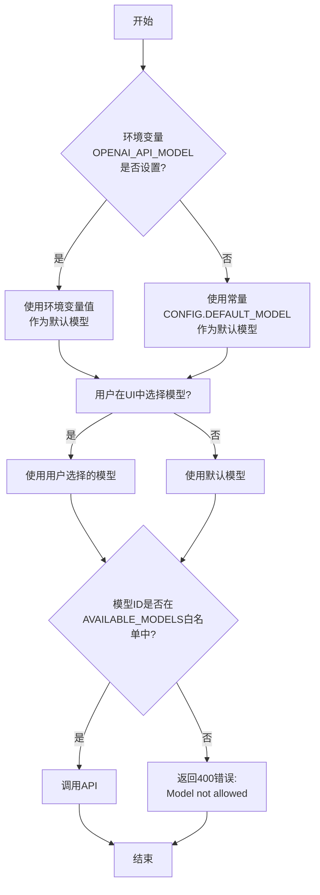

# 内部常量配置

<cite>
**本文档中引用的文件**   
- [constants.ts](file://src/config/constants.ts)
- [Generator.tsx](file://src/components/Generator.tsx)
- [SystemRoleSettings.tsx](file://src/components/SystemRoleSettings.tsx)
- [generate.ts](file://src/pages/api/generate.ts)
- [README.md](file://README.md)
</cite>

## 目录
1. [内部常量配置](#内部常量配置)
2. [核心常量定义与作用](#核心常量定义与作用)
3. [模型选择逻辑与优先级](#模型选择逻辑与优先级)
4. [前端组件中的常量使用](#前端组件中的常量使用)
5. [扩展自定义模型](#扩展自定义模型)
6. [构建与部署注意事项](#构建与部署注意事项)

## 核心常量定义与作用

`src/config/constants.ts` 文件是应用的核心配置中心，定义了多个影响应用行为的常量。这些常量在构建时被注入前端，确保了配置的静态性和性能。

**AVAILABLE_MODELS** 常量定义了前端模型选择器中可供用户选择的模型列表。它是一个包含 `id` 和 `name` 属性的对象数组，其中 `id` 与 API 调用时使用的模型标识符对应，`name` 则用于在用户界面中显示。

```ts
export const AVAILABLE_MODELS = [
  { id: 'gpt-4.1', name: 'OpenAI-4.1' },
  { id: 'gpt-5', name: 'OpenAI-5' },
  { id: 'gpt-4o', name: 'OpenAI-4o' },
  { id: 'o3', name: 'OpenAI-o3' },
  { id: 'DeepSeek-V3-0324', name: 'DeepSeek-V3' },
  { id: 'DeepSeek-R1-0528', name: 'DeepSeek-R1' },
  { id: 'grok-3', name: 'Grok-3' },
] as const
```

**DEFAULT_MODEL** 常量定义了应用的初始模型选择。当没有环境变量覆盖时，此模型将作为默认值被使用。

```ts
export const CONFIG = {
  // ...
  DEFAULT_MODEL: 'gpt-4.1', // 默认模型
  // ...
} as const
```

**Section sources**
- [constants.ts](file://src/config/constants.ts#L20-L37)

## 模型选择逻辑与优先级

应用中的模型选择遵循一个明确的优先级链，确保了配置的灵活性和安全性。

1.  **环境变量优先级最高**：`OPENAI_API_MODEL` 环境变量（在 `.env` 文件中设置）拥有最高优先级。如果此变量被设置，它将作为 API 调用的默认模型。
2.  **常量作为后备**：如果 `OPENAI_API_MODEL` 环境变量未设置，则使用 `constants.ts` 中定义的 `CONFIG.DEFAULT_MODEL` 作为默认模型。
3.  **用户选择覆盖**：用户可以在前端界面中通过下拉选择器选择一个模型。这个选择会覆盖上述所有默认值，并在本次会话中生效。
4.  **白名单验证**：最终使用的模型必须在 `AVAILABLE_MODELS` 定义的白名单中。API 路由 `generate.ts` 会检查请求中的模型 ID 是否存在于 `allowedModels` 列表中，若不存在则返回 400 错误。



**Diagram sources**
- [constants.ts](file://src/config/constants.ts#L20-L37)
- [generate.ts](file://src/pages/api/generate.ts#L13)

**Section sources**
- [constants.ts](file://src/config/constants.ts#L20-L37)
- [generate.ts](file://src/pages/api/generate.ts#L13)

## 前端组件中的常量使用

`AVAILABLE_MODELS` 和 `DEFAULT_MODEL` 常量在前端组件中被直接引用，以驱动用户界面和初始化状态。

### Generator.tsx 组件

`Generator.tsx` 是应用的核心生成器组件，负责管理对话状态和调用 API。

- **初始化状态**：组件使用 `createSignal` 创建 `chatModel` 信号，并将其初始值设置为 `CONFIG.DEFAULT_MODEL`。这确保了应用启动时有一个确定的默认模型。
  ```ts
  const [chatModel, setChatModel] = createSignal(CONFIG.DEFAULT_MODEL)
  ```
- **传递设置**：`Generator.tsx` 将 `temperature` 和 `chatModel` 的设置函数（`temperatureSetting` 和 `chatModelSetting`）作为 props 传递给 `SystemRoleSettings` 组件。
  ```ts
  const temperatureSetting = (value: number) => { setTemperature(value) }
  const chatModelSetting = (value: string) => { setChatModel(value) }
  ```
- **发起请求**：在调用 `/api/generate` 接口时，组件将当前的 `temperature()` 和 `chatModel()` 值作为请求体的一部分发送。
  ```ts
  fetch('/api/generate', {
    // ...
    body: JSON.stringify({
      // ...
      temperature: temperature(),
      model: chatModel(),
    }),
  })
  ```

### SystemRoleSettings.tsx 组件

`SystemRoleSettings.tsx` 组件负责渲染模型选择器和温度滑块。

- **模型选择器**：组件使用 `For` 循环遍历 `AVAILABLE_MODELS` 数组，为每个模型创建一个 `<option>` 元素。`select` 元素的 `value` 属性绑定到 `chatModel()` 信号，`onChange` 事件则调用 `setChatModel` 来更新状态。
  ```tsx
  <select
    value={chatModel()}
    onChange={e => setChatModel(e.currentTarget.value)}
  >
    <For each={AVAILABLE_MODELS}>
      {model => <option value={model.id}>{model.name}</option>}
    </For>
  </select>
  ```
- **状态同步**：`createEffect` 用于监听 `temperature` 和 `chatModel` 信号的变化，并通过 `props.temperatureSetting` 和 `props.chatModelSetting` 将变化通知给父组件 `Generator.tsx`。
  ```ts
  createEffect(() => {
    props.temperatureSetting(temperature())
    props.chatModelSetting(chatModel())
  })
  ```

**Section sources**
- [Generator.tsx](file://src/components/Generator.tsx#L29-L30)
- [SystemRoleSettings.tsx](file://src/components/SystemRoleSettings.tsx#L62-L72)

## 扩展自定义模型

要向应用中添加对新模型（如 Claude 或 Gemini）的支持，需要修改 `constants.ts` 文件。

### 添加 Claude 模型支持

1.  **编辑 `constants.ts`**：在 `AVAILABLE_MODELS` 数组中添加新的 Claude 模型条目。
    ```ts
    export const AVAILABLE_MODELS = [
      // ... existing models
      { id: 'claude-3-opus-20240229', name: 'Claude-3-Opus' },
      { id: 'claude-3-sonnet-20240229', name: 'Claude-3-Sonnet' },
      { id: 'claude-3-haiku-20240307', name: 'Claude-3-Haiku' },
    ] as const
    ```
2.  **（可选）更新默认模型**：可以将 `DEFAULT_MODEL` 修改为一个 Claude 模型，使其成为新默认值。
    ```ts
    DEFAULT_MODEL: 'claude-3-sonnet-20240229', // 默认模型
    ```

### 添加 Gemini 模型支持

1.  **编辑 `constants.ts`**：在 `AVAILABLE_MODELS` 数组中添加新的 Gemini 模型条目。
    ```ts
    export const AVAILABLE_MODELS = [
      // ... existing models
      { id: 'gemini-1.5-pro-latest', name: 'Gemini-1.5-Pro' },
      { id: 'gemini-1.5-flash-latest', name: 'Gemini-1.5-Flash' },
    ] as const
    ```
2.  **（可选）更新默认模型**：
    ```ts
    DEFAULT_MODEL: 'gemini-1.5-pro-latest', // 默认模型
    ```

**重要提示**：修改 `constants.ts` 文件后，**必须重新构建应用**。因为这些常量是在构建时被编译进前端代码的，直接修改文件不会影响已构建的静态资源。请运行 `pnpm build` 命令来生成新的生产版本。

**Section sources**
- [constants.ts](file://src/config/constants.ts#L20-L37)

## 构建与部署注意事项

- **常量注入机制**：`constants.ts` 中的常量是静态的，它们在应用构建时被直接编译进 JavaScript 包中。这意味着任何对这些常量的修改都需要重新执行构建流程（`pnpm build`）才能生效。
- **环境变量注入**：与常量不同，环境变量（如 `OPENAI_API_KEY`）是通过构建工具（如 Vite 或 Astro）在构建时注入的。它们可以在不修改源代码的情况下，通过 `.env` 文件进行配置。
- **部署影响**：由于常量是构建时注入的，因此在部署到不同环境（如 Vercel、Netlify、Docker）时，如果需要不同的模型列表或默认模型，必须在部署前修改 `constants.ts` 并重新构建。而环境变量则可以在部署平台的控制台中直接设置，无需重新构建代码。

**Section sources**
- [constants.ts](file://src/config/constants.ts)
- [README.md](file://README.md#L24-L65)