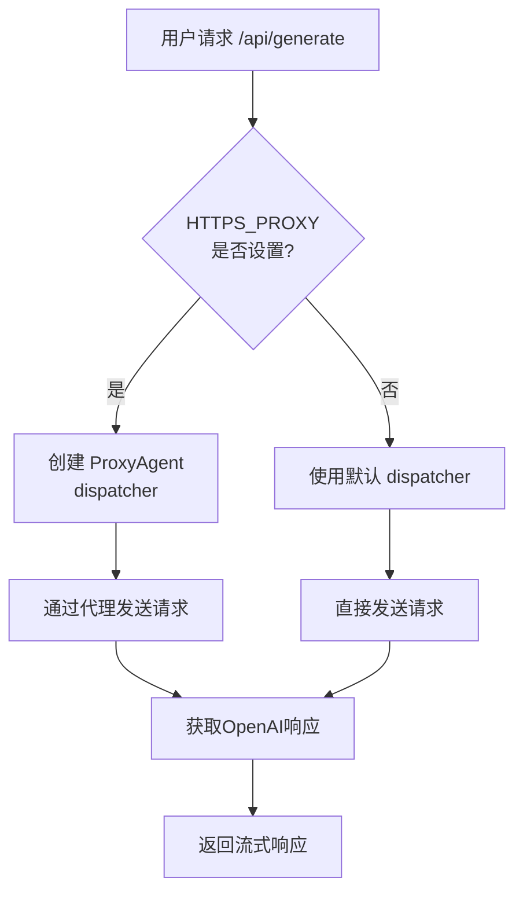
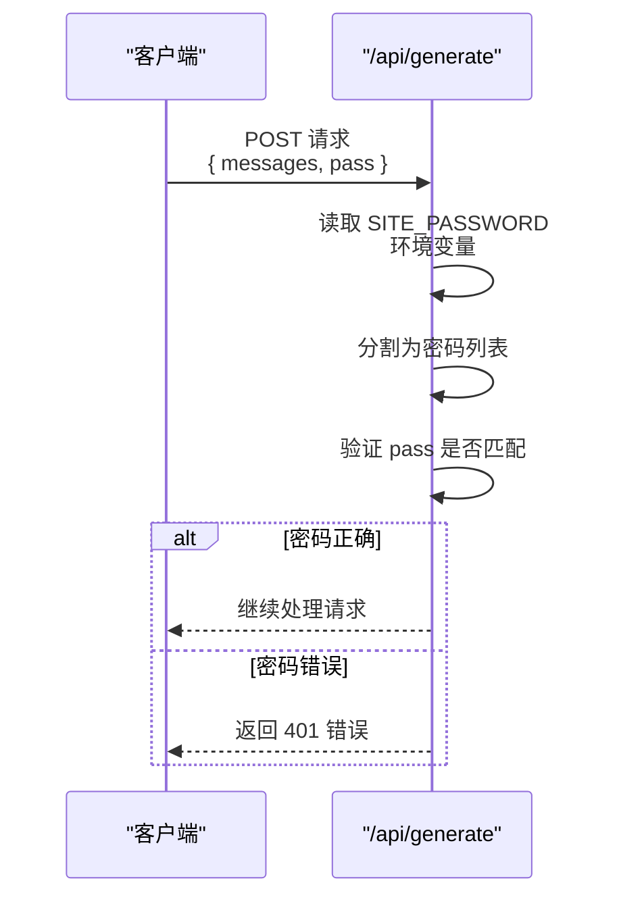
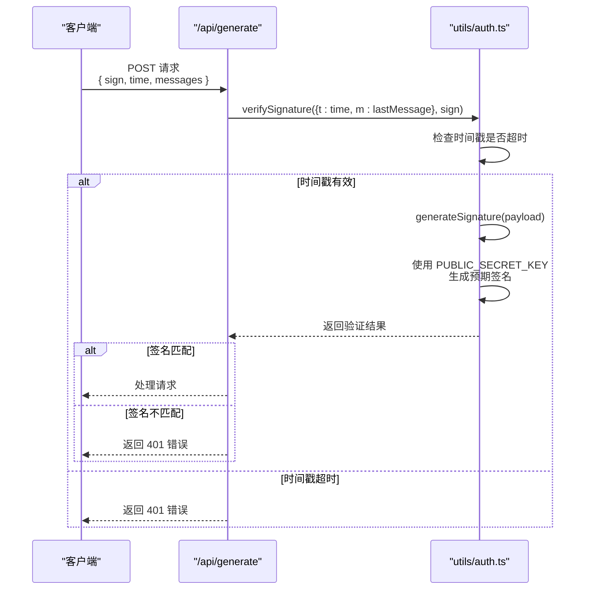

# 环境变量配置

<cite>
**本文档引用的文件**  
- [env.d.ts](file://src/env.d.ts#L3-L8)
- [constants.ts](file://src/config/constants.ts#L20-L28)
- [auth.ts](file://src/pages/api/auth.ts#L2-L13)
- [generate.ts](file://src/pages/api/generate.ts#L11-L70)
- [openAI.ts](file://src/utils/openAI.ts#L0-L71)
- [docker-env-replace.sh](file://hack/docker-env-replace.sh#L0-L29)
- [Dockerfile](file://Dockerfile#L0-L17)
- [vercel.json](file://vercel.json#L0-L2)
- [netlify.toml](file://netlify.toml#L0-L12)
</cite>

## 目录
1. [环境变量概览](#环境变量概览)
2. [核心环境变量详解](#核心环境变量详解)
3. [部署环境配置示例](#部署环境配置示例)
4. [模型扩展与代理切换机制](#模型扩展与代理切换机制)
5. [认证与安全机制分析](#认证与安全机制分析)
6. [最佳实践与安全建议](#最佳实践与安全建议)

## 环境变量概览

本项目通过环境变量实现高度可配置化，支持在不修改代码的前提下完成API密钥配置、访问控制、模型管理、网络代理等关键功能的定制。所有环境变量均通过 `import.meta.env` 在构建时注入，并在特定部署环境下通过脚本或平台配置实现动态替换。

环境变量主要分为以下几类：
- **API认证类**：用于连接OpenAI等后端服务
- **访问控制类**：用于前端站点的密码保护与请求签名验证
- **功能配置类**：用于自定义模型列表、注入脚本等
- **网络代理类**：用于解决网络访问限制

**Section sources**
- [env.d.ts](file://src/env.d.ts#L3-L8)

## 核心环境变量详解

### OPENAI_API_KEY（OpenAI API密钥）

**作用**：用于认证OpenAI API请求，是调用生成接口的必要凭证。

**格式要求**：字符串，通常以 `sk-` 开头，长度为51个字符。

**默认行为**：无默认值，必须配置，否则API调用将失败。

**代码实现**：
```ts
const apiKey = import.meta.env.OPENAI_API_KEY
```
该密钥被用于 `generatePayload` 函数中，作为 `Authorization` 头部的 `Bearer` 令牌发送。

**安全建议**：
- 严禁在客户端代码或公共仓库中硬编码
- 建议使用Vercel、Netlify等平台的环境变量管理功能
- 定期轮换密钥以降低泄露风险

**Section sources**
- [generate.ts](file://src/pages/api/generate.ts#L11)
- [openAI.ts](file://src/utils/openAI.ts#L5-L15)

### HTTPS_PROXY（可选的API代理地址）

**作用**：为OpenAI API请求提供HTTP/HTTPS代理，解决网络访问问题。

**格式要求**：标准代理URL格式，如 `http://127.0.0.1:7890` 或 `https://proxy.example.com:8080`。

**默认行为**：未设置时，直接连接OpenAI官方API地址。

**代码实现**：
```ts
const httpsProxy = import.meta.env.HTTPS_PROXY
// ...
if (httpsProxy)
  initOptions.dispatcher = new ProxyAgent(httpsProxy)
```
使用 `undici` 库的 `ProxyAgent` 实现代理转发。

**安全建议**：
- 确保代理服务器的安全性与稳定性
- 避免使用公共免费代理，防止敏感数据泄露

**Section sources**
- [generate.ts](file://src/pages/api/generate.ts#L11)
- [openAI.ts](file://src/utils/openAI.ts#L5-L15)

### SITE_PASSWORD（访问密码）

**作用**：用于基础认证，保护站点免受未授权访问。

**格式要求**：字符串，支持多个密码用英文逗号分隔。

**默认行为**：未设置时，站点为公开访问；设置后，必须提供正确密码才能使用。

**代码实现**：
```ts
const sitePassword = import.meta.env.SITE_PASSWORD || ''
const passList = sitePassword.split(',') || []
// ...
if (sitePassword && !(sitePassword === pass || passList.includes(pass))) {
  return new Response(..., { status: 401 })
}
```
在 `/api/generate` 接口中验证请求携带的密码。

**安全建议**：
- 使用强密码，避免简单字典词汇
- 生产环境务必启用
- 可设置多个密码便于团队协作

**Section sources**
- [generate.ts](file://src/pages/api/generate.ts#L11-L13)
- [auth.ts](file://src/pages/api/auth.ts#L2)

### PUBLIC_SECRET_KEY（签名密码）

**作用**：用于生成和验证API请求的签名，防止重放攻击。

**格式要求**：任意字符串，建议使用高强度随机字符串。

**默认行为**：未设置时，签名为空字符串，可能导致验证失败。

**代码实现**：
```ts
export const generateSignature = async(payload: AuthPayload) => {
  const { t: timestamp, m: lastMessage } = payload
  const secretKey = import.meta.env.PUBLIC_SECRET_KEY as string || ''
  const signText = `${timestamp}:${lastMessage}:${secretKey}`
  return await digestMessage(signText)
}
```
结合时间戳和最后一条消息内容，使用SHA-256生成签名。

**安全建议**：
- 必须设置，且保密性要求高
- 建议长度不少于32位
- 定期更换以增强安全性

**Section sources**
- [utils/auth.ts](file://src/utils/auth.ts#L15-L25)

### OPENAI_API_MODEL（默认API模型）

**作用**：指定后端API调用时使用的默认模型ID。

**格式要求**：字符串，必须是 `AVAILABLE_MODELS` 中定义的ID之一。

**默认行为**：未设置时，使用 `constants.ts` 中定义的 `DEFAULT_MODEL`（gpt-4.1）。

**代码实现**：
```ts
const apiModel = import.meta.env.OPENAI_API_MODEL || CONFIG.DEFAULT_MODEL
const modelToUse = model || apiModel
```
允许客户端请求覆盖此默认值。

**安全建议**：
- 确保设置的模型在 `AVAILABLE_MODELS` 列表中
- 避免使用已废弃或计费高昂的模型作为默认值

**Section sources**
- [generate.ts](file://src/pages/api/generate.ts#L11)

### AVAILABLE_MODELS（可用模型列表）

**注意**：此变量并非直接的环境变量，而是通过 `constants.ts` 中的常量定义，并可通过构建时替换实现动态配置。

**作用**：定义前端可选择和后端允许使用的模型列表。

**格式要求**：对象数组，每个对象包含 `id` 和 `name` 字段。

**默认值**：
```ts
export const AVAILABLE_MODELS = [
  { id: 'gpt-4.1', name: 'OpenAI-4.1' },
  { id: 'gpt-5', name: 'OpenAI-5' },
  { id: 'gpt-4o', name: 'OpenAI-4o' },
  { id: 'o3', name: 'OpenAI-o3' },
  { id: 'DeepSeek-V3-0324', name: 'DeepSeek-V3' },
  { id: 'DeepSeek-R1-0528', name: 'DeepSeek-R1' },
  { id: 'grok-3', name: 'Grok-3' },
] as const
```

**代码实现**：
```ts
const allowedModels = AVAILABLE_MODELS.map(m => m.id)
// ...
if (!allowedModels.includes(modelToUse)) {
  return new Response(..., { status: 400 })
}
```
在 `/api/generate` 接口中进行模型白名单校验。

**扩展方法**：通过修改 `constants.ts` 或在构建时替换文件内容实现模型扩展。

**Section sources**
- [constants.ts](file://src/config/constants.ts#L20-L28)
- [generate.ts](file://src/pages/api/generate.ts#L13)

## 部署环境配置示例

### Vercel 部署配置

Vercel 平台通过 `vercel.json` 配置构建命令，并在控制台设置环境变量。

**配置文件**：
```json
{
  "buildCommand": "OUTPUT=vercel astro build"
}
```

**配置方法**：
1. 在 Vercel 项目设置中进入 "Environment Variables"
2. 添加以下变量：
   - `OPENAI_API_KEY`: 你的 OpenAI 密钥
   - `SITE_PASSWORD`: 访问密码（如 `mypassword`）
   - `PUBLIC_SECRET_KEY`: 签名密钥（如 `mysecretpassword123`）
   - `HTTPS_PROXY`: 代理地址（可选）
3. 重新部署项目

**Section sources**
- [vercel.json](file://vercel.json#L0-L2)

### Netlify 部署配置

Netlify 通过 `netlify.toml` 配置构建环境和命令。

**配置文件**：
```toml
[build.environment]
  NETLIFY_USE_PNPM = "true"
  NODE_VERSION = "18"

[build]
  command = "OUTPUT=netlify astro build"
  publish = "dist"
```

**配置方法**：
1. 在 Netlify 项目设置中进入 "Environment variables"
2. 添加与 Vercel 相同的环境变量
3. 触发重新部署

**Section sources**
- [netlify.toml](file://netlify.toml#L0-L12)

### Docker 部署配置

Docker 部署通过 `Dockerfile` 和启动脚本实现环境变量注入。

**Dockerfile**：
```dockerfile
ENV HOST=0.0.0.0 PORT=3000 NODE_ENV=production
CMD ["/bin/sh", "docker-entrypoint.sh"]
```

**环境变量替换机制**：
`hack/docker-env-replace.sh` 脚本在容器启动时，将环境变量的值替换到已构建的 `.mjs` 文件中：

```sh
for file in $(find ./dist -type f -name "*.mjs"); do
  sed "s|({}).OPENAI_API_KEY|\"$openai_api_key\"|g;
  s|({}).SITE_PASSWORD|\"$site_password\"|g" $file > tmp
  mv tmp $file
done
```

**使用方法**：
```bash
docker run -d \
  -p 3000:3000 \
  -e OPENAI_API_KEY=sk-xxx \
  -e SITE_PASSWORD=mypassword \
  -e PUBLIC_SECRET_KEY=mysecret \
  chat-mini
```

**Section sources**
- [Dockerfile](file://Dockerfile#L0-L17)
- [docker-env-replace.sh](file://hack/docker-env-replace.sh#L0-L29)

## 模型扩展与代理切换机制

### 无代码修改的模型扩展

项目通过以下机制实现模型的无代码扩展：

1. **构建时变量替换**：`docker-env-replace.sh` 脚本可将 `AVAILABLE_MODELS` 常量的值替换为环境变量，实现动态模型列表注入。
2. **白名单校验**：`generate.ts` 中的 `allowedModels` 基于 `AVAILABLE_MODELS` 生成，确保只有预定义的模型可被使用。
3. **客户端选择**：前端通过 `AVAILABLE_MODELS` 常量渲染模型选择下拉框。

**扩展步骤**：
1. 修改 `constants.ts` 中的 `AVAILABLE_MODELS` 数组，添加新模型
2. 或在Docker部署时，通过脚本替换 `.mjs` 文件中的模型列表
3. 无需重新编译前端代码（Astro构建后为静态文件）

### 代理切换机制

代理切换通过 `HTTPS_PROXY` 环境变量实现：

1. 当 `HTTPS_PROXY` 设置时，`undici` 的 `ProxyAgent` 被注入到 `fetch` 请求的 `dispatcher` 中
2. 所有对 `https://api.openai.com` 的请求将通过指定代理转发
3. 未设置时，使用默认直连

此机制允许在不同网络环境下灵活切换代理，而无需修改任何代码逻辑。



**Diagram sources**
- [generate.ts](file://src/pages/api/generate.ts#L50-L60)
- [openAI.ts](file://src/utils/openAI.ts#L5-L15)

## 认证与安全机制分析

### PASSWORD 在请求拦截中的应用流程



**关键代码**：
```ts
const sitePassword = import.meta.env.SITE_PASSWORD || ''
const passList = sitePassword.split(',') || []
if (sitePassword && !(sitePassword === pass || passList.includes(pass))) {
  return new Response(..., { status: 401 })
}
```

**Section sources**
- [generate.ts](file://src/pages/api/generate.ts#L11-L13)

### SIGN_PASSWORD 在请求签名验证中的应用流程



**安全特性**：
- **防重放攻击**：通过时间戳验证，请求必须在 `AUTH_TIMEOUT`（5分钟）内有效
- **内容完整性**：签名包含最后一条消息内容，防止中间人篡改
- **密钥保护**：`PUBLIC_SECRET_KEY` 仅用于签名生成，不直接暴露

**Section sources**
- [generate.ts](file://src/pages/api/generate.ts#L11-L13)
- [utils/auth.ts](file://src/utils/auth.ts#L15-L35)

## 最佳实践与安全建议

1. **环境变量管理**：
   - 生产环境务必设置 `SITE_PASSWORD` 和 `PUBLIC_SECRET_KEY`
   - 使用高强度、随机生成的密钥
   - 定期轮换所有敏感密钥

2. **部署安全**：
   - Vercel/Netlify：使用平台提供的加密环境变量功能
   - Docker：避免在 `docker run` 命令中明文传递密钥，使用 `--env-file` 参数
   - 自建服务器：确保环境变量文件权限为600，仅限必要用户访问

3. **模型管理**：
   - 定期审查 `AVAILABLE_MODELS` 列表，移除不再支持的模型
   - 将高成本模型从默认列表中移除，防止意外使用

4. **监控与日志**：
   - 监控认证失败日志，防范暴力破解
   - 记录异常请求模式，及时发现潜在攻击

5. **更新策略**：
   - 及时更新依赖库，特别是加密相关库（如 `js-sha256`）
   - 关注OpenAI API变更，及时调整兼容性

通过合理配置环境变量，本项目实现了高度灵活、安全的部署能力，能够在多种环境下快速适配，同时保障核心服务的安全性。