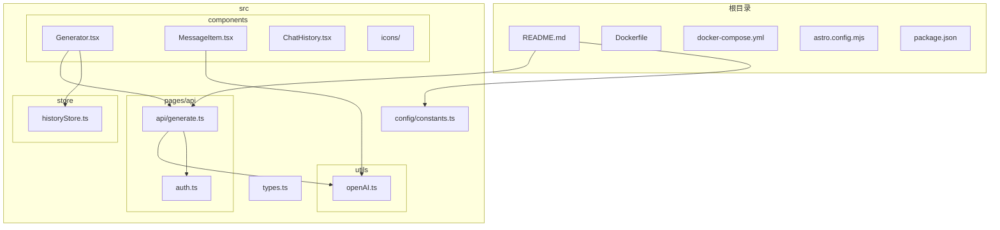
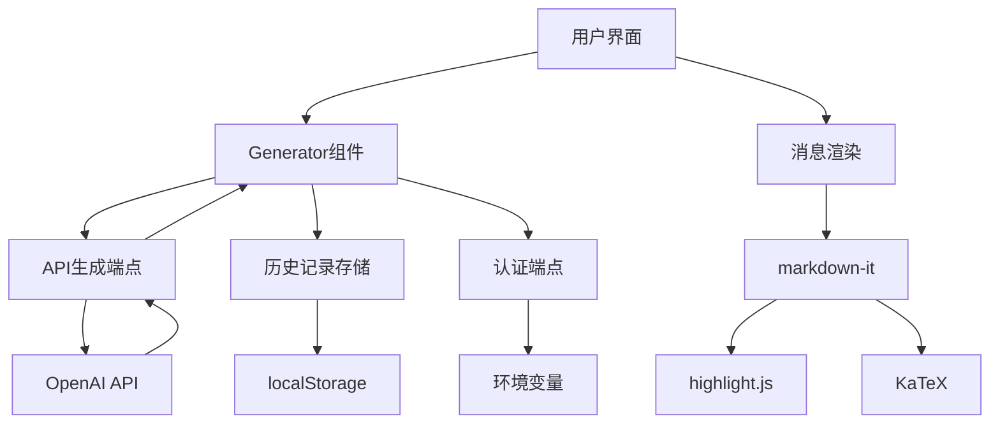
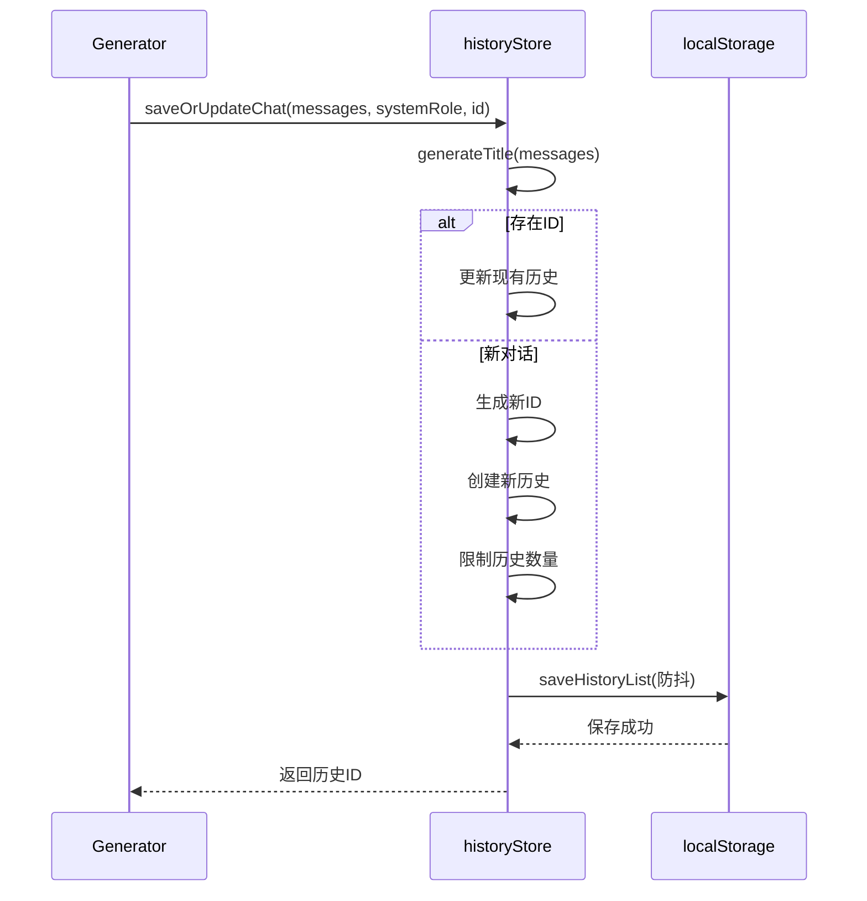
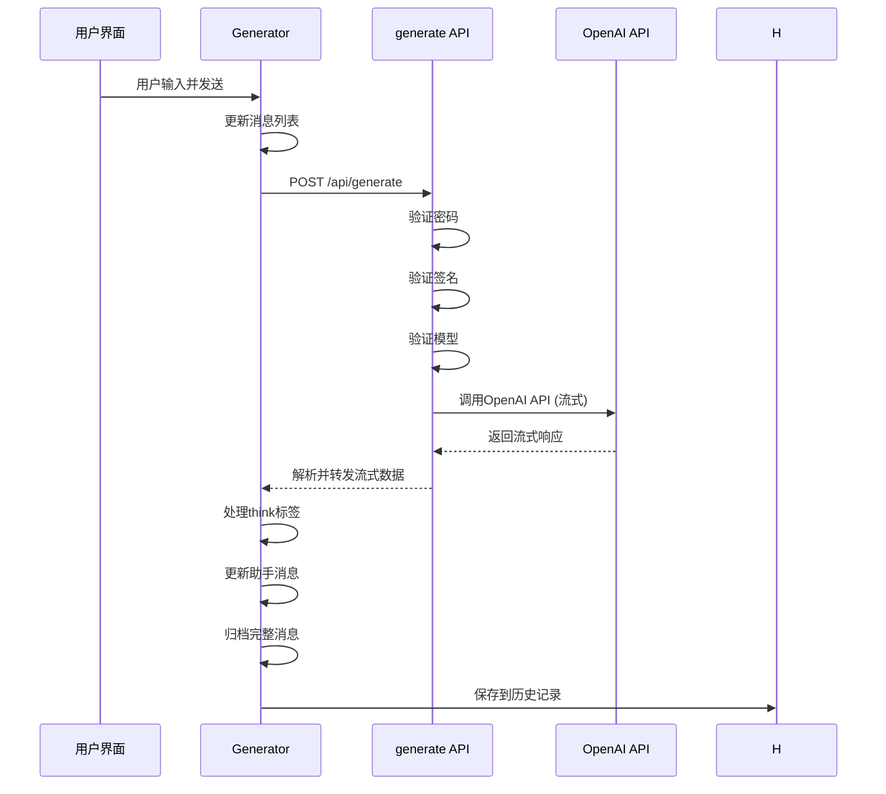
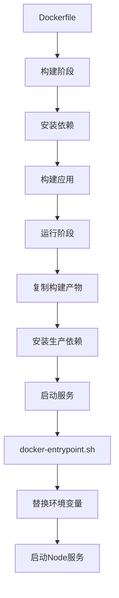
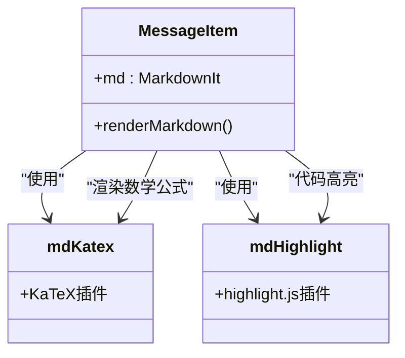
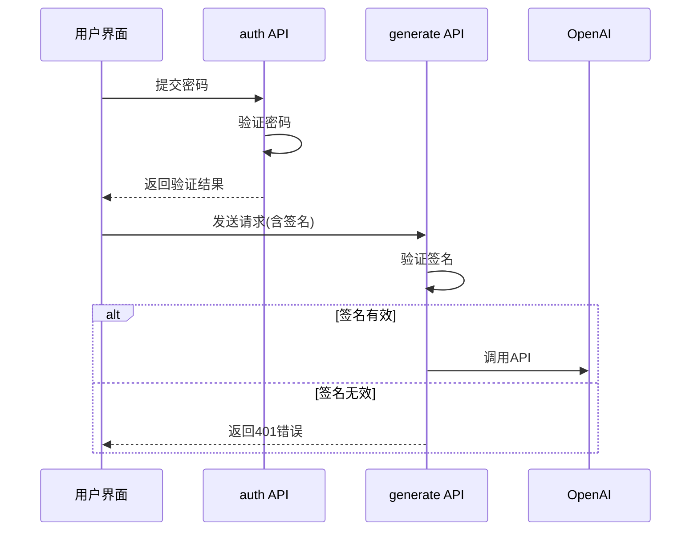

# 项目概述

<cite>
**本文档引用的文件**
- [README.md](file://README.md)
- [src/config/constants.ts](file://src/config/constants.ts)
- [src/pages/api/generate.ts](file://src/pages/api/generate.ts)
- [src/pages/api/auth.ts](file://src/pages/api/auth.ts)
- [src/store/historyStore.ts](file://src/store/historyStore.ts)
- [src/components/Generator.tsx](file://src/components/Generator.tsx)
- [src/utils/openAI.ts](file://src/utils/openAI.ts)
- [src/components/MessageItem.tsx](file://src/components/MessageItem.tsx)
- [astro.config.mjs](file://astro.config.mjs)
- [Dockerfile](file://Dockerfile)
- [docker-compose.yml](file://docker-compose.yml)
- [docker-compose.dev.yml](file://docker-compose.dev.yml)
- [hack/docker-entrypoint.sh](file://hack/docker-entrypoint.sh)
- [src/types.ts](file://src/types.ts)
</cite>

## 目录
1. [项目概述](#项目概述)
2. [项目结构](#项目结构)
3. [核心功能与技术栈](#核心功能与技术栈)
4. [系统架构分析](#系统架构分析)
5. [核心组件详解](#核心组件详解)
6. [数据流与处理逻辑](#数据流与处理逻辑)
7. [部署与配置](#部署与配置)
8. [用户体验优化](#用户体验优化)
9. [安全机制](#安全机制)
10. [结论](#结论)

## 项目结构

本项目采用基于功能的文件组织方式，结合Astro框架的约定式路由，形成了清晰的目录结构。



**图示来源**
- [README.md](file://README.md)
- [src/pages/api/generate.ts](file://src/pages/api/generate.ts)
- [src/components/Generator.tsx](file://src/components/Generator.tsx)
- [src/store/historyStore.ts](file://src/store/historyStore.ts)
- [src/utils/openAI.ts](file://src/utils/openAI.ts)

**本节来源**
- [README.md](file://README.md)
- [src/config/constants.ts](file://src/config/constants.ts)

## 核心功能与技术栈

### 功能特性

根据项目文档，chat-mini具备以下核心功能：

- **多平台部署**: 支持Docker、Vercel和Netlify一键部署
- **模型动态切换**: 在UI上直接选择并切换对话模型
- **思维过程可视化**: 渲染`<think>`标签以展示模型思考步骤
- **对话历史管理**: 自动在本地保存对话历史
- **消息操作**: 支持复制、删除消息及重新生成
- **富文本渲染**: 支持Markdown、代码高亮和LaTeX数学公式
- **PWA支持**: 可作为渐进式网络应用安装
- **安全防护**: 支持访问密码和API调用签名
- **参数调节**: 实时调整`temperature`等参数

### 技术选型

项目采用现代化的前端技术栈：

- **核心框架**: Astro
- **UI框架**: Solid.js
- **CSS方案**: UnoCSS
- **包管理器**: pnpm

**本节来源**
- [README.md](file://README.md)

## 系统架构分析

chat-mini采用前后端一体化的架构设计，利用Astro的服务器端渲染(SSR)能力，在服务端处理API请求，同时使用Solid.js构建响应式前端界面。



**图示来源**
- [src/components/Generator.tsx](file://src/components/Generator.tsx)
- [src/pages/api/generate.ts](file://src/pages/api/generate.ts)
- [src/store/historyStore.ts](file://src/store/historyStore.ts)
- [src/components/MessageItem.tsx](file://src/components/MessageItem.tsx)

**本节来源**
- [README.md](file://README.md)
- [astro.config.mjs](file://astro.config.mjs)

## 核心组件详解

### Generator组件分析

Generator组件是应用的核心，负责处理用户输入、调用API生成流式响应，并管理对话状态。

```mermaid
classDiagram
class Generator {
+messageList : ChatMessage[]
+currentAssistantMessage : string
+loading : boolean
+isStick : boolean
+handleButtonClick()
+requestWithLatestMessage()
+archiveCurrentMessage()
+clear()
+deleteMessage()
+loadHistory()
}
class MessageItem {
+renderMarkdown()
+copyToClipboard()
+handleCopyClick()
}
class ChatHistory {
+onLoadHistory()
}
Generator --> MessageItem : "渲染消息"
Generator --> ChatHistory : "加载历史"
Generator --> "api/generate" : "调用API"
```

**图示来源**
- [src/components/Generator.tsx](file://src/components/Generator.tsx)
- [src/components/MessageItem.tsx](file://src/components/MessageItem.tsx)
- [src/components/ChatHistory.tsx](file://src/components/ChatHistory.tsx)

**本节来源**
- [src/components/Generator.tsx](file://src/components/Generator.tsx)

### 状态管理分析

项目使用Solid.js的信号(Signal)系统进行状态管理，通过`historyStore.ts`实现对话历史的持久化存储。



**图示来源**
- [src/components/Generator.tsx](file://src/components/Generator.tsx)
- [src/store/historyStore.ts](file://src/store/historyStore.ts)

**本节来源**
- [src/store/historyStore.ts](file://src/store/historyStore.ts)

## 数据流与处理逻辑

### API请求流程



**图示来源**
- [src/components/Generator.tsx](file://src/components/Generator.tsx)
- [src/pages/api/generate.ts](file://src/pages/api/generate.ts)
- [src/utils/openAI.ts](file://src/utils/openAI.ts)

**本节来源**
- [src/pages/api/generate.ts](file://src/pages/api/generate.ts)
- [src/utils/openAI.ts](file://src/utils/openAI.ts)

### 流式响应处理

项目通过`parseOpenAIStream`函数处理OpenAI的流式响应，实现逐字输出效果。

```mermaid
flowchart TD
A[开始] --> B[创建ReadableStream]
B --> C[创建parser]
C --> D{事件类型}
D --> |event| E{数据类型}
E --> |正常数据| F[解析JSON]
F --> G[提取文本内容]
G --> H[通过encoder发送]
E --> |[DONE]| I[关闭流]
D --> |其他| J[忽略]
H --> K{是否完成}
K --> |否| L[继续读取]
L --> C
K --> |是| M[结束]
```

**图示来源**
- [src/utils/openAI.ts](file://src/utils/openAI.ts)

**本节来源**
- [src/utils/openAI.ts](file://src/utils/openAI.ts)

## 部署与配置

### 配置管理

项目配置分为环境变量和应用内常量两部分。

**环境变量配置**

| 变量名 | 说明 |
| :--- | :--- |
| `OPENAI_API_KEY` | OpenAI API密钥 |
| `SITE_PASSWORD` | 网站访问密码 |
| `PUBLIC_SECRET_KEY` | API调用签名密钥 |
| `HTTPS_PROXY` | OpenAI API代理地址 |

**应用内常量配置**

```typescript
export const CONFIG = {
  MAX_HISTORY_MESSAGES: 9,
  MAX_HISTORY_COUNT: 25,
  DEFAULT_TEMPERATURE: 0.6,
  DEFAULT_MODEL: 'gpt-4.1',
} as const
```

**本节来源**
- [README.md](file://README.md)
- [src/config/constants.ts](file://src/config/constants.ts)

### Docker部署

项目提供完整的Docker部署方案，包括生产环境和开发环境的配置。



**图示来源**
- [Dockerfile](file://Dockerfile)
- [hack/docker-entrypoint.sh](file://hack/docker-entrypoint.sh)
- [docker-compose.yml](file://docker-compose.yml)

**本节来源**
- [Dockerfile](file://Dockerfile)
- [docker-compose.yml](file://docker-compose.yml)
- [hack/docker-entrypoint.sh](file://hack/docker-entrypoint.sh)

## 用户体验优化

### 富文本渲染

项目集成markdown-it、highlight.js和KaTeX，实现高质量的内容渲染。



**图示来源**
- [src/components/MessageItem.tsx](file://src/components/MessageItem.tsx)

**本节来源**
- [src/components/MessageItem.tsx](file://src/components/MessageItem.tsx)

### PWA支持

通过`@vite-pwa/astro`插件实现PWA功能，提供接近原生应用的体验。

```typescript
AstroPWA({
  registerType: 'autoUpdate',
  injectRegister: 'inline',
  manifest: {
    name: 'Chat Mini',
    short_name: 'Chat Mini',
    description: '一个简单的智能聊天机器人。',
    theme_color: '#212129',
    background_color: '#ffffff',
    icons: [...]
  },
  client: {
    installPrompt: true,
    periodicSyncForUpdates: 20,
  }
})
```

**本节来源**
- [astro.config.mjs](file://astro.config.mjs)

## 安全机制

### 认证流程

项目实现双重安全防护：访问密码和API调用签名。



**图示来源**
- [src/pages/api/auth.ts](file://src/pages/api/auth.ts)
- [src/pages/api/generate.ts](file://src/pages/api/generate.ts)

**本节来源**
- [src/pages/api/auth.ts](file://src/pages/api/auth.ts)
- [src/pages/api/generate.ts](file://src/pages/api/generate.ts)

## 结论

chat-mini项目是一个设计精良的轻量级AI聊天应用，其主要特点包括：

1. **架构清晰**: 采用Astro+Solid.js的技术组合，实现了前后端一体化
2. **功能完整**: 包含对话管理、历史记录、模型切换等核心功能
3. **部署灵活**: 支持Docker、Vercel、Netlify等多种部署方式
4. **用户体验佳**: 实现流式响应、富文本渲染和PWA支持
5. **安全可靠**: 提供密码保护和API签名双重安全机制

该项目适合作为个人AI助手使用，也便于进行二次开发和定制。