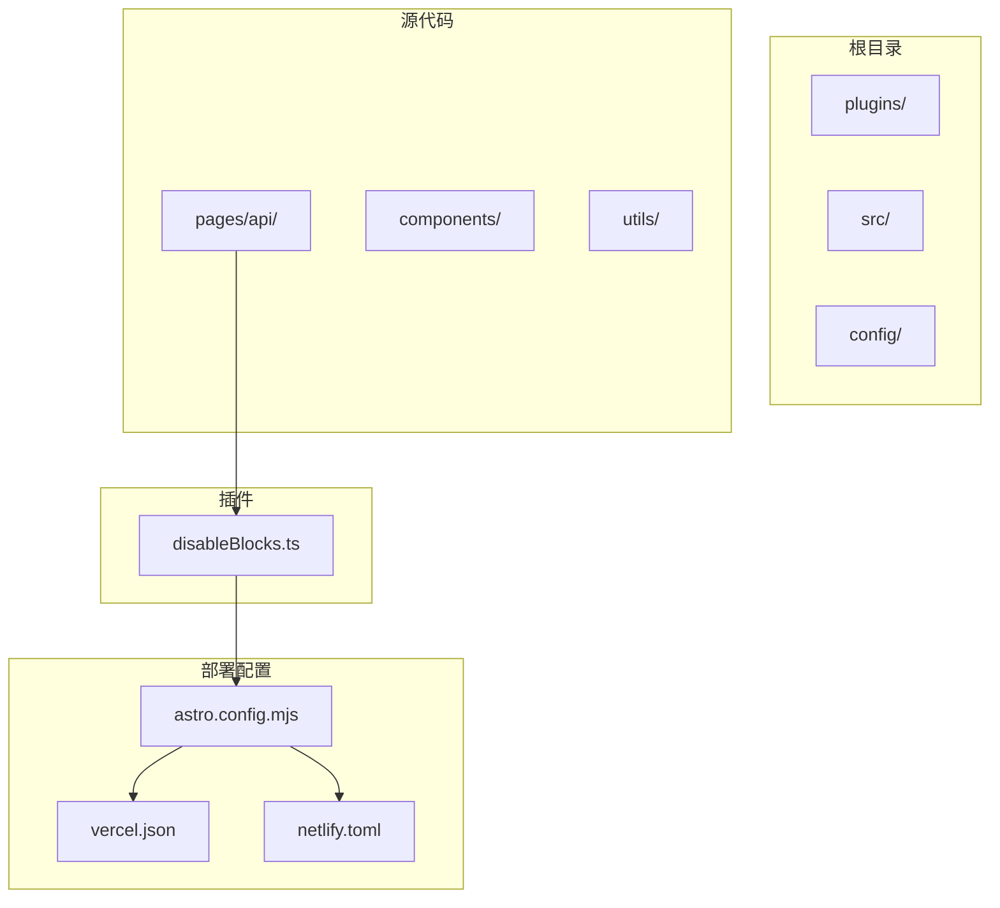
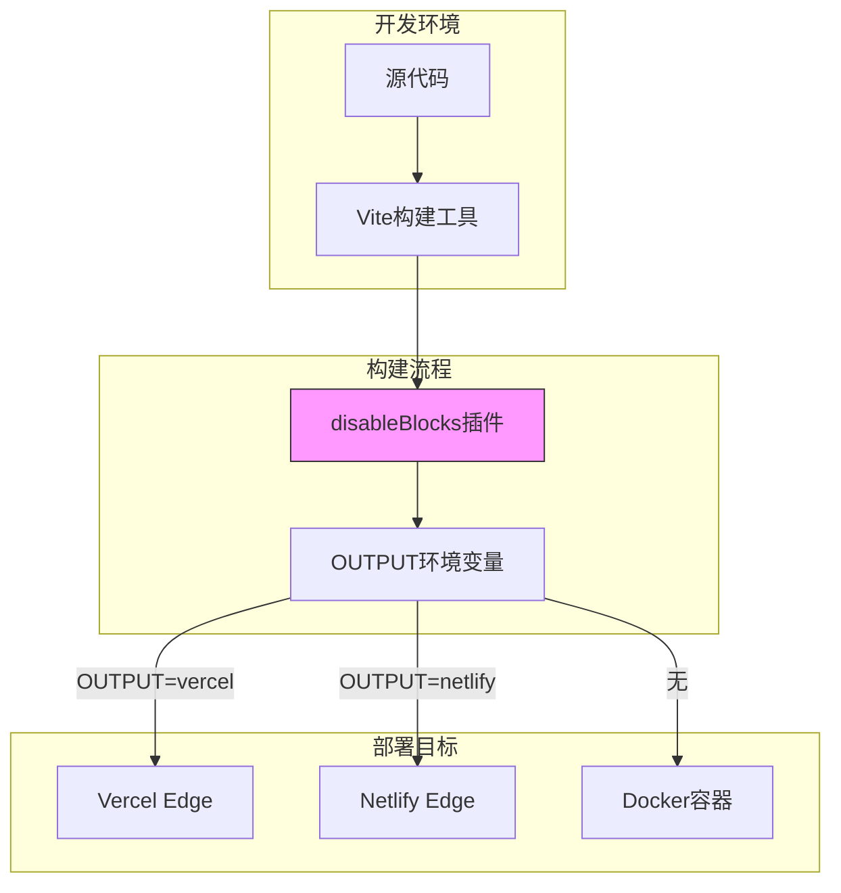
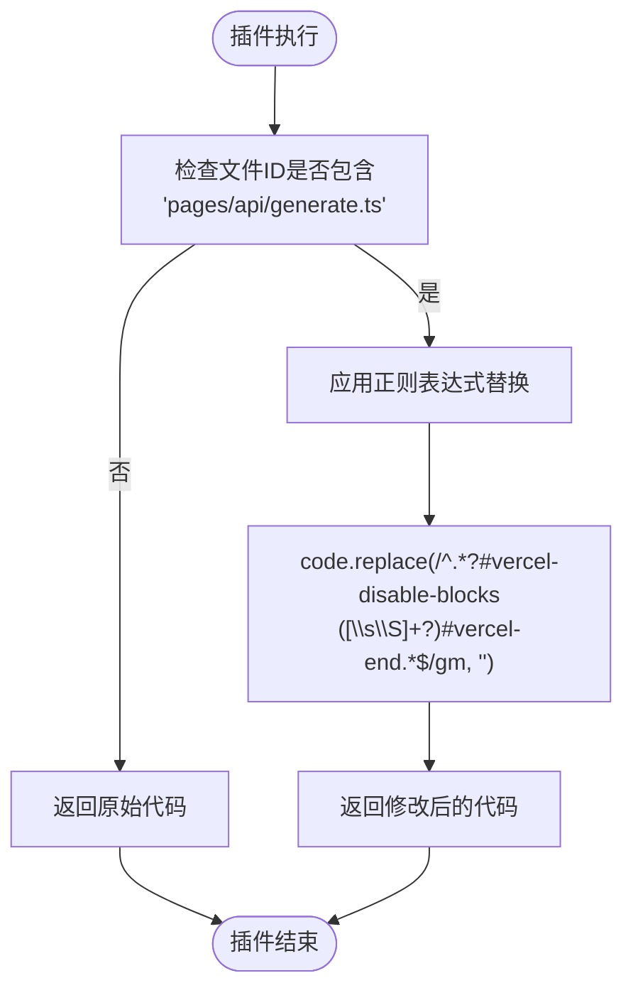
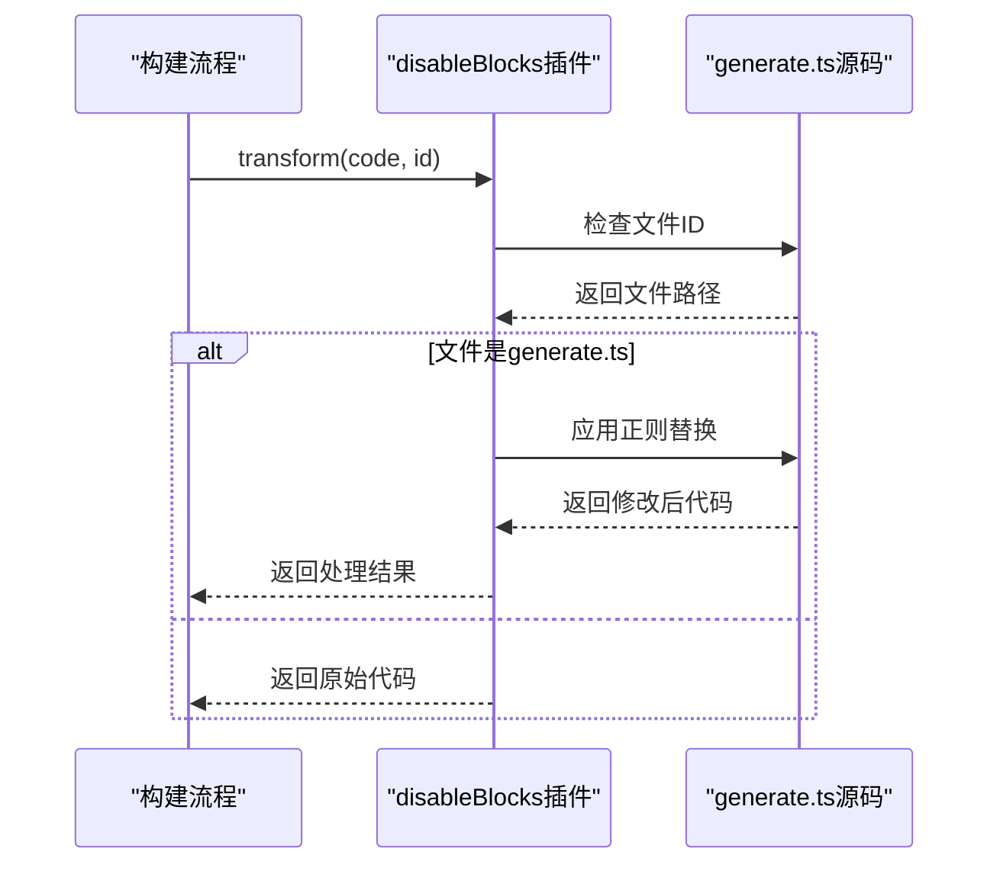
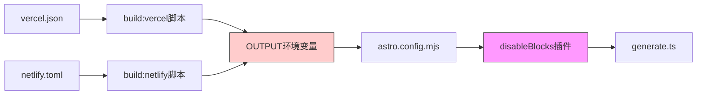

# 内容安全策略

<cite>
**本文档引用的文件**   
- [disableBlocks.ts](file://plugins/disableBlocks.ts)
- [generate.ts](file://src/pages/api/generate.ts)
- [astro.config.mjs](file://astro.config.mjs)
- [package.json](file://package.json)
- [vercel.json](file://vercel.json)
- [netlify.toml](file://netlify.toml)
</cite>

## 目录
1. [项目结构](#项目结构)
2. [核心组件](#核心组件)
3. [架构概述](#架构概述)
4. [详细组件分析](#详细组件分析)
5. [依赖分析](#依赖分析)

## 项目结构

项目采用模块化设计，主要分为插件、源代码、配置和部署文件。核心功能集中在`src`目录下，而`plugins`目录包含构建时的安全策略插件。



**图示来源**
- [plugins/disableBlocks.ts](file://plugins/disableBlocks.ts)
- [astro.config.mjs](file://astro.config.mjs)
- [vercel.json](file://vercel.json)
- [netlify.toml](file://netlify.toml)

**本节来源**
- [plugins/disableBlocks.ts](file://plugins/disableBlocks.ts)
- [astro.config.mjs](file://astro.config.mjs)

## 核心组件

`disableBlocks.ts`插件是本项目的核心安全组件，它通过Vite插件系统在构建时修改源代码，实现对特定代码块的条件性禁用。该插件主要针对`generate.ts`API端点，通过正则表达式匹配并移除被`#vercel-disable-blocks`标记包围的代码块。

**本节来源**
- [plugins/disableBlocks.ts](file://plugins/disableBlocks.ts)
- [src/pages/api/generate.ts](file://src/pages/api/generate.ts)

## 架构概述

系统采用Astro框架构建，结合Vite构建工具和边缘部署适配器，实现多平台部署能力。安全策略通过构建时插件实现，确保在不同部署环境中应用不同的安全配置。



**图示来源**
- [astro.config.mjs](file://astro.config.mjs)
- [package.json](file://package.json)
- [vercel.json](file://vercel.json)
- [netlify.toml](file://netlify.toml)

## 详细组件分析

### disableBlocks插件分析

`disableBlocks`插件是一个Vite插件，其主要功能是在构建过程中识别并移除特定的代码块，以增强应用在特定部署环境下的安全性。

#### 插件实现逻辑


**图示来源**
- [plugins/disableBlocks.ts](file://plugins/disableBlocks.ts#L1-L15)

#### 安全代码块识别
插件使用正则表达式`/^.*?#vercel-disable-blocks([\s\S]+?)#vercel-end.*$/gm`来识别需要禁用的代码块。该正则表达式具有以下特点：
- `^.*?`：非贪婪匹配行首任意字符
- `#vercel-disable-blocks`：匹配起始标记
- `([\s\S]+?)`：捕获组，匹配任意字符（包括换行符）
- `#vercel-end`：匹配结束标记
- `.*$`：匹配行尾任意字符
- `gm`：全局多行模式

**本节来源**
- [plugins/disableBlocks.ts](file://plugins/disableBlocks.ts#L1-L15)
- [src/pages/api/generate.ts](file://src/pages/api/generate.ts#L0-L14)

### API端点安全分析

`generate.ts`文件中的API端点包含了被安全策略保护的关键代码块，这些代码块在特定部署环境中会被禁用。

#### 受保护的代码块
```typescript
// #vercel-disable-blocks
import { ProxyAgent, fetch } from 'undici'
// #vercel-end

// ... 其他代码 ...

const initOptions = generatePayload(apiKey, messages, temperature, modelToUse)
// #vercel-disable-blocks
if (httpsProxy)
  initOptions.dispatcher = new ProxyAgent(httpsProxy)
// #vercel-end
```

这些代码块的主要功能是支持通过代理访问OpenAI API，但在Vercel和Netlify等边缘计算环境中，由于平台限制，这些功能需要被禁用。

#### 执行流程图


**图示来源**
- [src/pages/api/generate.ts](file://src/pages/api/generate.ts#L0-L14)
- [plugins/disableBlocks.ts](file://plugins/disableBlocks.ts#L1-L15)

**本节来源**
- [src/pages/api/generate.ts](file://src/pages/api/generate.ts)
- [plugins/disableBlocks.ts](file://plugins/disableBlocks.ts)

## 依赖分析

系统通过环境变量和构建脚本的组合，实现了灵活的部署配置和安全策略。



**图示来源**
- [package.json](file://package.json)
- [vercel.json](file://vercel.json)
- [netlify.toml](file://netlify.toml)
- [astro.config.mjs](file://astro.config.mjs)
- [plugins/disableBlocks.ts](file://plugins/disableBlocks.ts)

**本节来源**
- [package.json](file://package.json)
- [vercel.json](file://vercel.json)
- [netlify.toml](file://netlify.toml)
- [astro.config.mjs](file://astro.config.mjs)