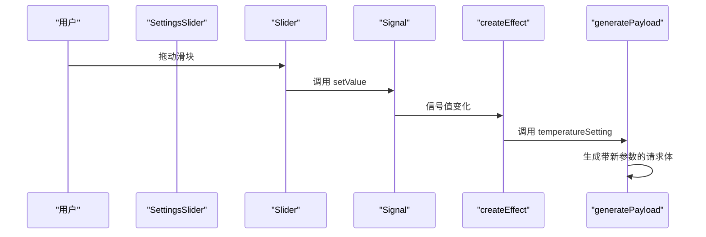
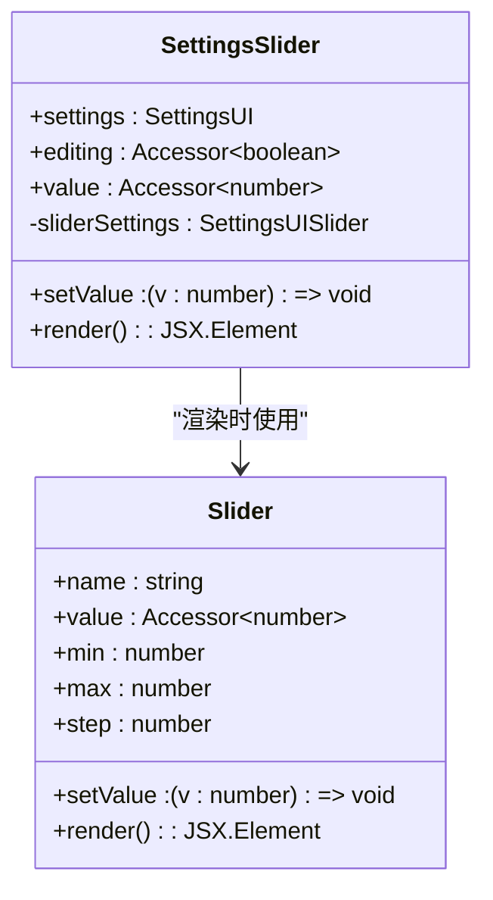
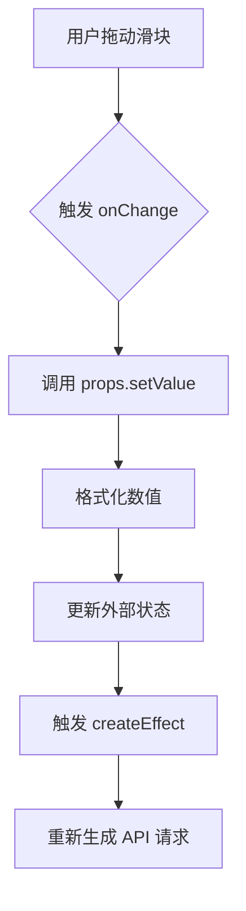
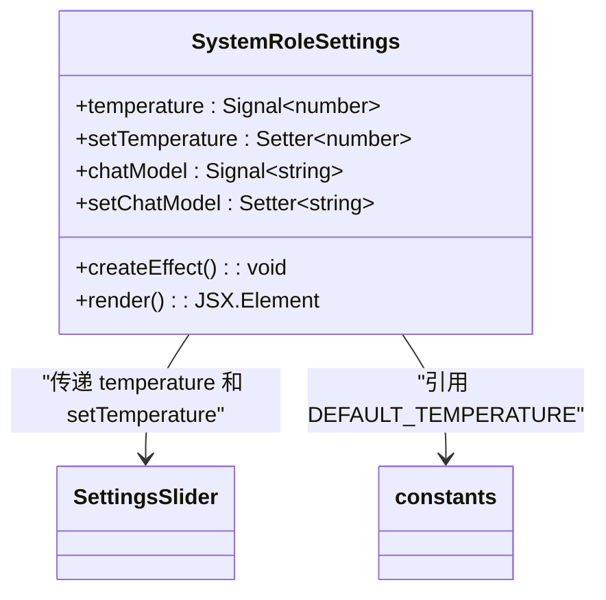
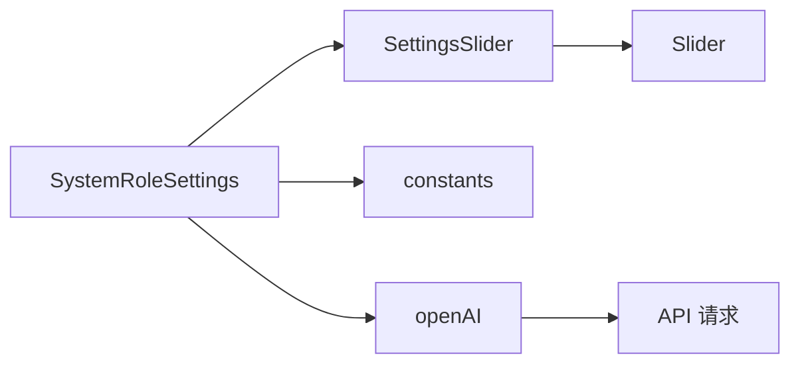

# 参数动态调节

<cite>
**本文档引用的文件**  
- [SettingsSlider.tsx](file://src/components/SettingsSlider.tsx)
- [Slider.tsx](file://src/components/Slider.tsx)
- [constants.ts](file://src/config/constants.ts)
- [openAI.ts](file://src/utils/openAI.ts)
- [SystemRoleSettings.tsx](file://src/components/SystemRoleSettings.tsx)
</cite>

## 目录
1. [简介](#简介)
2. [项目结构](#项目结构)
3. [核心组件](#核心组件)
4. [架构概览](#架构概览)
5. [详细组件分析](#详细组件分析)
6. [依赖关系分析](#依赖关系分析)
7. [性能考量](#性能考量)
8. [故障排除指南](#故障排除指南)
9. [结论](#结论)

## 简介
本文档全面介绍基于 `SettingsSlider` 和 `Slider` 组件实现的模型参数实时调节功能。重点涵盖 `temperature`、`top_p`、`presence_penalty` 等核心生成参数的滑块控制机制。文档将说明滑块组件如何通过 Solid.js 的响应式系统绑定到全局状态，并在用户调整时动态更新 API 请求配置。结合 `constants.ts` 中的默认值与边界定义，解释参数范围限制的设计原理。同时提供典型参数组合的使用建议，并展示如何通过 UI 反馈实时预览参数影响。

## 项目结构
项目采用功能模块化组织方式，主要分为组件、配置、工具和 API 接口等目录。参数调节功能的核心文件分布在 `src/components` 和 `src/config` 目录中。

```mermaid
graph TB
subgraph "组件"
A[SettingsSlider.tsx]
B[Slider.tsx]
C[SystemRoleSettings.tsx]
end
subgraph "配置"
D[constants.ts]
end
subgraph "工具"
E[openAI.ts]
end
A --> B : "依赖"
C --> A : "使用"
C --> D : "引用常量"
E --> C : "提供API配置"
```

**图示来源**  
- [SettingsSlider.tsx](file://src/components/SettingsSlider.tsx)
- [Slider.tsx](file://src/components/Slider.tsx)
- [SystemRoleSettings.tsx](file://src/components/SystemRoleSettings.tsx)
- [constants.ts](file://src/config/constants.ts)
- [openAI.ts](file://src/utils/openAI.ts)

## 核心组件
参数调节功能由 `SettingsSlider` 和 `Slider` 两个核心组件构成。`SettingsSlider` 是参数配置的容器组件，负责接收参数元信息（如名称、范围、步长）和状态绑定；`Slider` 是基础滑块实现，基于 `@zag-js/slider` 库封装，提供可访问性和响应式支持。

**组件来源**  
- [SettingsSlider.tsx](file://src/components/SettingsSlider.tsx#L1-L42)
- [Slider.tsx](file://src/components/Slider.tsx#L1-L60)

## 架构概览
参数调节功能的架构遵循响应式设计原则，数据流为单向流动：用户操作滑块 → 更新信号（Signal）状态 → 触发副作用 → 生成新的 API 请求配置。



**图示来源**  
- [SettingsSlider.tsx](file://src/components/SettingsSlider.tsx#L1-L42)
- [Slider.tsx](file://src/components/Slider.tsx#L1-L60)
- [SystemRoleSettings.tsx](file://src/components/SystemRoleSettings.tsx#L1-L105)
- [openAI.ts](file://src/utils/openAI.ts#L1-L72)

## 详细组件分析

### SettingsSlider 组件分析
`SettingsSlider` 组件作为参数配置的通用容器，接收 `settings` 对象描述参数的 UI 属性，并通过 `value` 和 `setValue` 与外部状态绑定。



**图示来源**  
- [SettingsSlider.tsx](file://src/components/SettingsSlider.tsx#L1-L42)

**组件来源**  
- [SettingsSlider.tsx](file://src/components/SettingsSlider.tsx#L1-L42)

### Slider 组件分析
`Slider` 组件基于 `@zag-js/slider` 状态机实现，封装了滑块的交互逻辑和 UI 渲染。它通过 `useMachine` 钩子管理内部状态，并在值变化时调用 `onChange` 回调。



**图示来源**  
- [Slider.tsx](file://src/components/Slider.tsx#L1-L60)

**组件来源**  
- [Slider.tsx](file://src/components/Slider.tsx#L1-L60)

### SystemRoleSettings 组件分析
`SystemRoleSettings` 是参数滑块的实际使用上下文，它定义了 `temperature` 信号并将其绑定到 `SettingsSlider` 组件。



**图示来源**  
- [SystemRoleSettings.tsx](file://src/components/SystemRoleSettings.tsx#L1-L105)

**组件来源**  
- [SystemRoleSettings.tsx](file://src/components/SystemRoleSettings.tsx#L1-L105)

## 依赖关系分析
参数调节功能的依赖关系清晰，各组件职责分明。`SettingsSlider` 依赖 `Slider` 实现基础交互，`SystemRoleSettings` 依赖 `SettingsSlider` 配置参数，`openAI.ts` 依赖最终的参数值生成请求。



**图示来源**  
- [SystemRoleSettings.tsx](file://src/components/SystemRoleSettings.tsx#L1-L105)
- [SettingsSlider.tsx](file://src/components/SettingsSlider.tsx#L1-L42)
- [Slider.tsx](file://src/components/Slider.tsx#L1-L60)
- [constants.ts](file://src/config/constants.ts)
- [openAI.ts](file://src/utils/openAI.ts#L1-L72)

## 性能考量
- **响应式更新**：Solid.js 的细粒度响应式系统确保只有依赖参数变化的组件才会重新渲染，避免不必要的性能开销。
- **防抖处理**：虽然当前实现未显式使用防抖，但 `createEffect` 的同步执行特性已足够应对滑块的高频更新。
- **数值格式化**：`formatSliderValue` 函数确保显示值保留两位小数，避免浮点数精度问题影响用户体验。

## 故障排除指南
- **滑块无响应**：检查 `setValue` 函数是否正确传递，确保 `editing()` 返回 `true`。
- **参数未生效**：确认 `createEffect` 是否正确订阅了信号变化，并调用了 `temperatureSetting`。
- **默认值错误**：检查 `constants.ts` 中的 `DEFAULT_TEMPERATURE` 是否被正确引用。
- **UI 显示异常**：确保 `slider.css` 已正确导入，样式未被覆盖。

**组件来源**  
- [SettingsSlider.tsx](file://src/components/SettingsSlider.tsx#L1-L42)
- [SystemRoleSettings.tsx](file://src/components/SystemRoleSettings.tsx#L1-L105)
- [constants.ts](file://src/config/constants.ts)

## 结论
本系统通过 `SettingsSlider` 和 `Slider` 组件实现了模型参数的直观调节功能。基于 Solid.js 的响应式系统，参数变化能够实时反映在 API 请求中。`constants.ts` 文件集中管理默认值和边界，确保了配置的一致性和可维护性。该设计模式清晰、可扩展，为未来添加更多参数提供了良好基础。