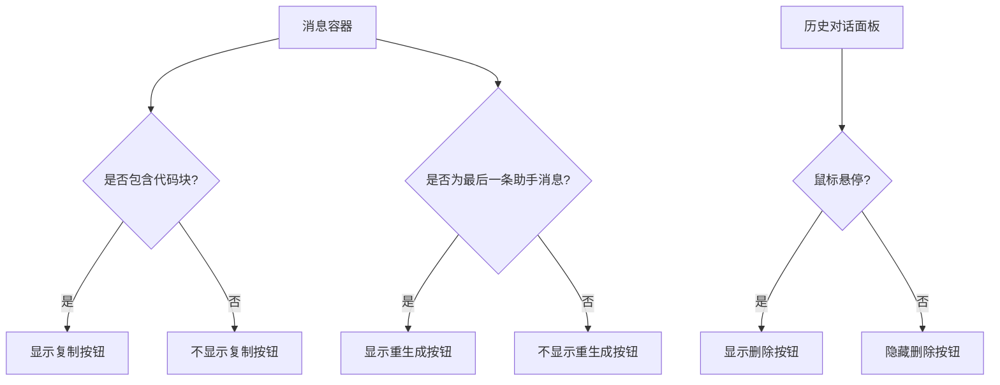
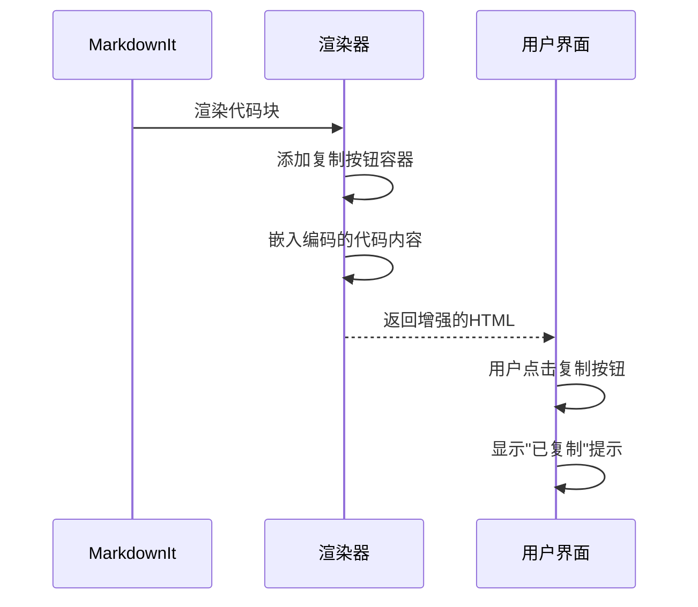
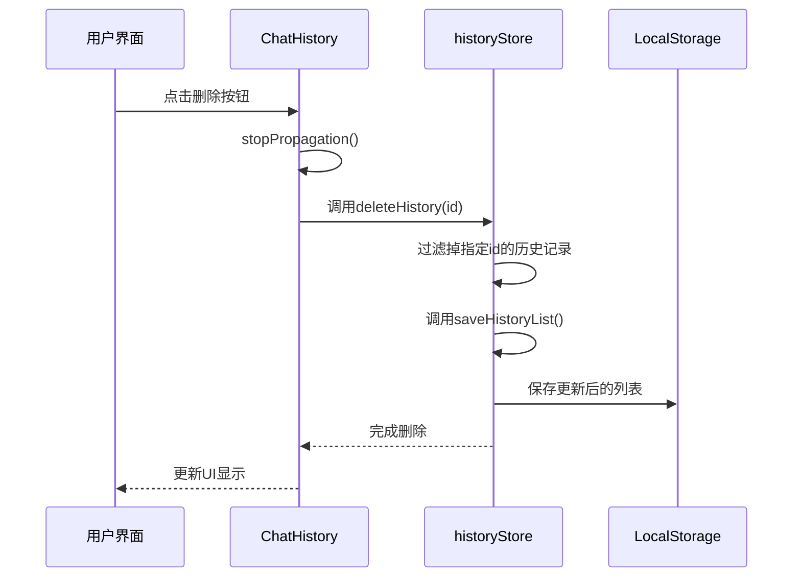
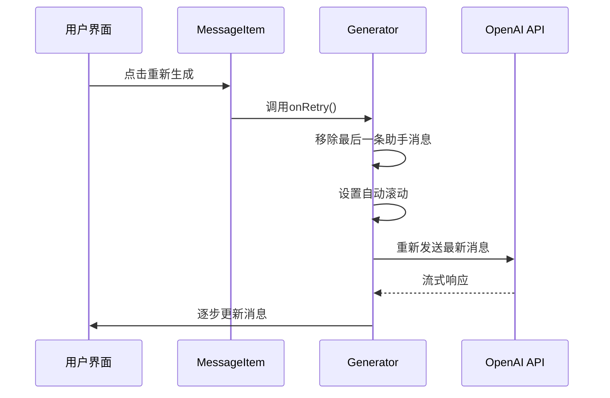
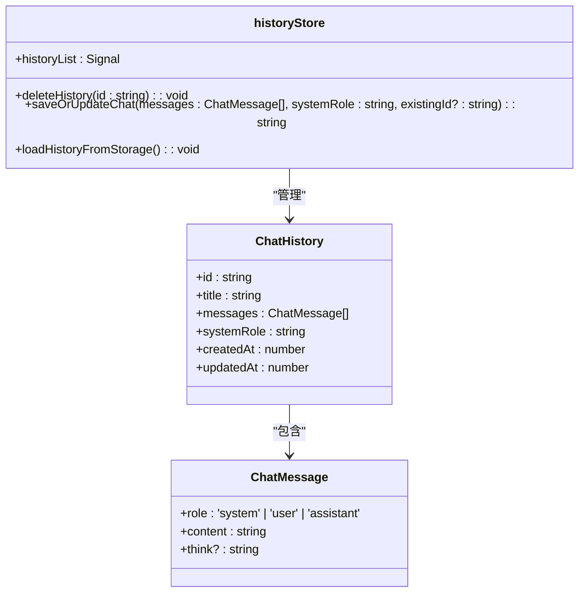

# 消息交互操作

<cite>
**本文档引用的文件**  
- [MessageItem.tsx](file://src/components/MessageItem.tsx#L1-L118)
- [historyStore.ts](file://src/store/historyStore.ts#L1-L111)
- [Delete.tsx](file://src/components/icons/Delete.tsx#L1-L6)
- [Refresh.tsx](file://src/components/icons/Refresh.tsx#L1-L5)
- [ChatHistory.tsx](file://src/components/ChatHistory.tsx#L1-L114)
- [ErrorMessageItem.tsx](file://src/components/ErrorMessageItem.tsx#L1-L60)
- [constants.ts](file://src/config/constants.ts#L1-L37)
- [Generator.tsx](file://src/components/Generator.tsx#L280-L391)
</cite>

## 目录
1. [消息交互功能概述](#消息交互功能概述)
2. [UI布局与事件绑定机制](#ui布局与事件绑定机制)
3. [消息复制功能实现](#消息复制功能实现)
4. [消息删除操作流程](#消息删除操作流程)
5. [消息重生成机制](#消息重生成机制)
6. [状态管理与本地存储](#状态管理与本地存储)
7. [错误处理与用户反馈](#错误处理与用户反馈)

## 消息交互功能概述

本系统实现了完整的消息交互功能，包括消息复制、删除和重新生成三大核心操作。这些功能通过前端组件与状态管理系统的协同工作实现，为用户提供流畅的对话体验。

消息复制功能允许用户一键复制代码块内容；删除功能支持移除单条或整个对话历史；重生成功能则在AI响应失败或用户不满意时提供重新请求的能力。所有操作均结合了直观的UI反馈和可靠的错误处理机制。

**Section sources**
- [MessageItem.tsx](file://src/components/MessageItem.tsx#L1-L118)
- [Generator.tsx](file://src/components/Generator.tsx#L280-L391)

## UI布局与事件绑定机制

消息交互功能的UI布局遵循简洁直观的设计原则，各操作按钮根据上下文动态显示。

### 操作按钮布局逻辑

- **复制按钮**：仅在消息包含代码块时显示，采用悬浮式设计，鼠标悬停时出现
- **重生成按钮**：仅在最后一条助手消息后显示，提供"重新生成"选项
- **删除按钮**：在历史对话面板中，每条记录右侧显示，鼠标悬停时可见



**Diagram sources**
- [MessageItem.tsx](file://src/components/MessageItem.tsx#L38-L78)
- [ChatHistory.tsx](file://src/components/ChatHistory.tsx#L86-L113)

### 事件绑定机制

各操作按钮通过SolidJS的事件绑定系统与相应处理函数连接：

- 复制按钮：通过事件委托绑定到消息容器的click事件
- 重生成按钮：直接绑定onClick事件到retryLastFetch函数
- 删除按钮：绑定onClick事件到handleDelete函数

**Section sources**
- [MessageItem.tsx](file://src/components/MessageItem.tsx#L80-L117)
- [ChatHistory.tsx](file://src/components/ChatHistory.tsx#L55-L60)

## 消息复制功能实现

消息复制功能专注于代码块的便捷复制，采用优化的事件处理机制。

### 复制逻辑实现

```typescript
const handleCopyClick = (e: MouseEvent) => {
  const el = e.target as HTMLElement
  let code: string | null = null

  if (el.matches('div.copy-btn')) {
    code = el.dataset.code ? decodeURIComponent(el.dataset.code) : null
  } else if (el.closest('div.copy-btn')) {
    const btn = el.closest('div.copy-btn') as HTMLElement
    code = btn.dataset.code ? decodeURIComponent(btn.dataset.code) : null
  }
  
  if (code) {
    setSource(code)
    copy()
  }
}
```

该逻辑通过以下步骤工作：
1. 检测点击目标是否为复制按钮或其子元素
2. 从data-code属性中提取编码的代码内容
3. 解码并设置到剪贴板源
4. 触发复制操作

### Markdown渲染增强

在Markdown渲染过程中，通过自定义fence规则注入复制功能：



**Diagram sources**
- [MessageItem.tsx](file://src/components/MessageItem.tsx#L38-L78)
- [message.css](file://src/message.css#L1-L78)

**Section sources**
- [MessageItem.tsx](file://src/components/MessageItem.tsx#L38-L78)

## 消息删除操作流程

消息删除功能分为两个层级：单条消息删除和整个对话历史删除。

### Delete.tsx图标组件

删除图标是一个简单的SVG组件：

```typescript
export default () => {
  return (
    <svg xmlns="http://www.w3.org/2000/svg" width="1.1em" height="1.1em" viewBox="0 0 24 24">
      <path fill="currentColor" d="M6 19c0 1.1.9 2 2 2h8c1.1 0 2-.9 2-2V7H6v12zM19 4h-3.5l-1-1h-5l-1 1H5v2h14V4z" />
    </svg>
  )
}
```

### 删除操作流程



### 实现细节

1. **事件阻止**：`e.stopPropagation()`防止事件冒泡到父容器
2. **状态更新**：通过`deleteHistory(id)`从全局状态中移除指定记录
3. **持久化**：更新后的列表自动保存到localStorage

**Diagram sources**
- [Delete.tsx](file://src/components/icons/Delete.tsx#L1-L6)
- [ChatHistory.tsx](file://src/components/ChatHistory.tsx#L55-L60)
- [historyStore.ts](file://src/store/historyStore.ts#L90-L93)

**Section sources**
- [ChatHistory.tsx](file://src/components/ChatHistory.tsx#L55-L60)
- [historyStore.ts](file://src/store/historyStore.ts#L90-L93)

## 消息重生成机制

重生成功能允许用户重新获取AI的响应，特别是在请求失败或结果不满意时。

### Refresh.tsx图标组件

重生成图标同样是一个SVG组件：

```typescript
export default () => {
  return (
    <svg xmlns="http://www.w3.org/2000/svg" width="1em" height="1em" viewBox="0 0 32 32">
    <path d="M25.95 7.65l.005-.004c-.092-.11-.197-.206-.293-.312c-.184-.205-.367-.41-.563-.603c-.139-.136-.286-.262-.43-.391c-.183-.165-.366-.329-.558-.482c-.16-.128-.325-.247-.49-.367c-.192-.14-.385-.277-.585-.406a13.513 13.513 0 0 0-.533-.324q-.308-.179-.625-.341c-.184-.094-.37-.185-.56-.27c-.222-.1-.449-.191-.678-.28c-.19-.072-.378-.145-.571-.208c-.246-.082-.498-.15-.75-.217c-.186-.049-.368-.102-.556-.143c-.29-.063-.587-.107-.883-.15c-.16-.023-.315-.056-.476-.073A12.933 12.933 0 0 0 6 7.703V4H4v8h8v-2H6.811A10.961 10.961 0 0 1 16 5a11.111 11.111 0 0 1 1.189.067c.136.015.268.042.403.061c.25.037.501.075.746.128c.16.035.315.08.472.121c.213.057.425.114.633.183c.164.054.325.116.486.178c.193.074.384.15.57.235c.162.072.32.15.477.23q.268.136.526.286c.153.09.305.18.453.276c.168.11.33.224.492.342c.14.102.282.203.417.312c.162.13.316.268.47.406c.123.11.248.217.365.332c.167.164.323.338.479.512A10.993 10.993 0 1 1 5 16H3a13 13 0 1 0 22.95-8.35z" fill="currentColor" />
    </svg>
  )
}
```

### 重生成流程



### retryLastFetch实现

```typescript
const retryLastFetch = () => {
  if (messageList().length > 0) {
    const lastMessage = messageList()[messageList().length - 1]
    if (lastMessage.role === 'assistant')
      setMessageList(messageList().slice(0, -1))
    // 重试时开启自动滚动
    setStick(true)
    requestWithLatestMessage()
  }
}
```

该函数执行以下操作：
1. 检查是否存在消息
2. 如果最后一条是助手消息，则将其从列表中移除
3. 启用自动滚动到底部
4. 重新发送最新消息请求

**Diagram sources**
- [Refresh.tsx](file://src/components/icons/Refresh.tsx#L1-L5)
- [Generator.tsx](file://src/components/Generator.tsx#L286-L293)
- [MessageItem.tsx](file://src/components/MessageItem.tsx#L109-L112)

**Section sources**
- [Generator.tsx](file://src/components/Generator.tsx#L286-L293)

## 状态管理与本地存储

系统使用historyStore进行全局状态管理，确保消息状态的一致性和持久化。

### historyStore架构



**Diagram sources**
- [historyStore.ts](file://src/store/historyStore.ts#L1-L111)
- [types.ts](file://src/types.ts)

### 状态变更流程

当执行删除或重生成操作时，状态更新遵循以下流程：

1. **删除操作**：
   - 调用`deleteHistory(id)`
   - 从`historyList`中过滤掉指定id的记录
   - 通过`saveHistoryList`更新状态并保存到localStorage

2. **重生成操作**：
   - 从`messageList`中移除最后一条助手消息
   - 调用`requestWithLatestMessage`重新请求
   - 新响应通过流式处理逐步更新
   - 最终调用`archiveCurrentMessage`保存到历史记录

### 乐观更新实现

系统采用乐观更新策略：
- 先更新本地UI状态
- 同时发起API请求
- 请求成功则保持状态，失败则回滚并显示错误

**Section sources**
- [historyStore.ts](file://src/store/historyStore.ts#L90-L108)

## 错误处理与用户反馈

系统实现了完善的错误处理机制，提供用户友好的反馈。

### 错误分类处理

```typescript
const getFriendlyErrorMessage = (error: ErrorMessage): string => {
  const { code, message } = error
  
  // 网络相关错误
  if (code?.includes('fetch') || message?.includes('fetch') || message?.includes('network')) {
    return ERROR_MESSAGES.NETWORK_ERROR
  }
  
  // 认证相关错误
  if (code?.includes('auth') || message?.includes('auth') || message?.includes('401')) {
    return ERROR_MESSAGES.AUTH_FAILED
  }
  
  // API相关错误
  if (code?.includes('api') || message?.includes('api')) {
    return '服务暂时不可用，请稍后重试'
  }
  
  // 默认返回原始消息，但去掉技术细节
  return message || '发生未知错误，请重试'
}
```

### 预定义错误消息

```typescript
export const ERROR_MESSAGES = {
  NETWORK_ERROR: '网络连接失败，请检查网络后重试',
  AUTH_FAILED: '身份验证失败，请重新登录',
  SAVE_FAILED: '保存失败，请稍后重试',
  LOAD_FAILED: '加载失败，请刷新页面重试',
} as const
```

### 错误显示组件

ErrorMessageItem组件提供：
- 用户友好的错误描述
- 可展开的技术详情
- 重试按钮

```mermaid
flowchart TD
A[发生错误] --> B{错误类型}
B --> C[网络错误]
B --> D[认证错误]
B --> E[API错误]
B --> F[未知错误]
C --> G[显示"网络连接失败"]
D --> H[显示"身份验证失败"]
E --> I[显示"服务暂时不可用"]
F --> J[显示原始消息]
G --> K[显示重试按钮]
H --> K
I --> K
J --> K
```

**Diagram sources**
- [ErrorMessageItem.tsx](file://src/components/ErrorMessageItem.tsx#L1-L60)
- [constants.ts](file://src/config/constants.ts#L30-L37)

**Section sources**
- [ErrorMessageItem.tsx](file://src/components/ErrorMessageItem.tsx#L1-L60)
- [constants.ts](file://src/config/constants.ts#L30-L37)