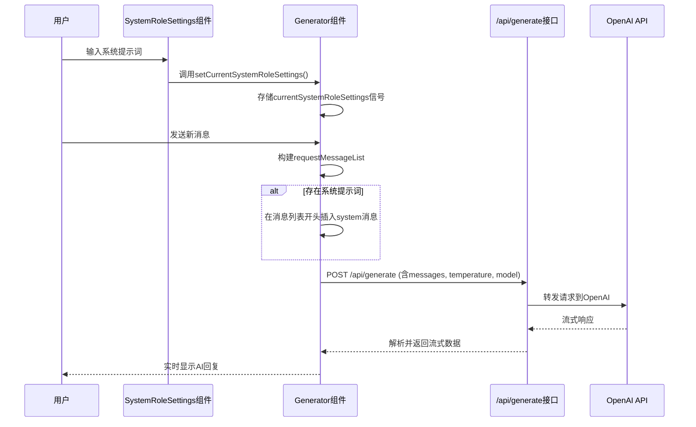
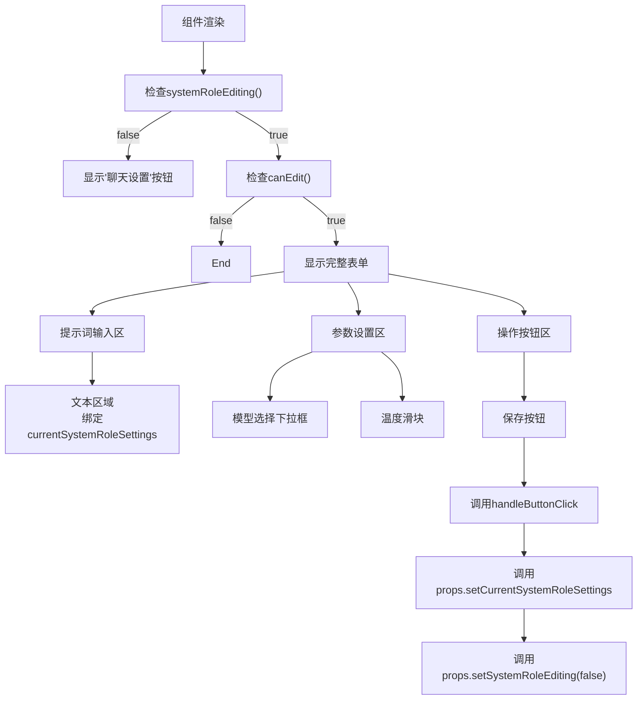
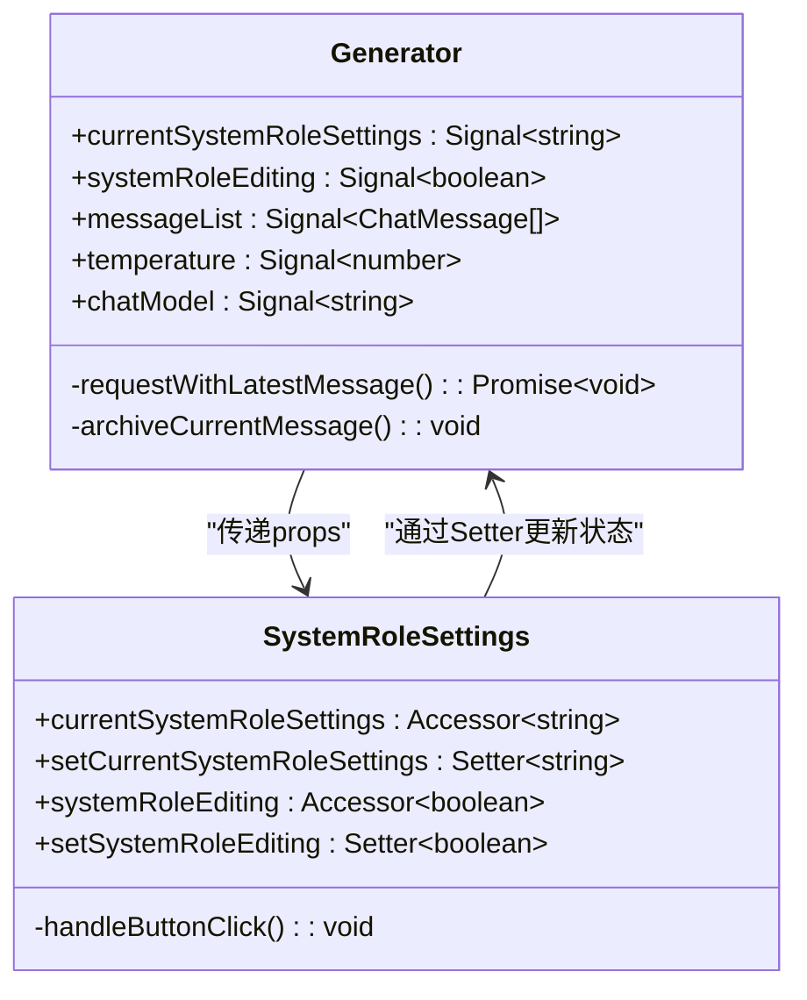
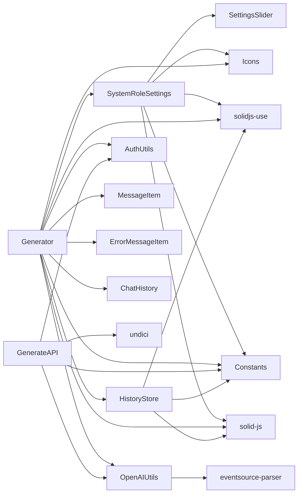

# 系统角色自定义

<cite>
**本文档引用文件**  
- [SystemRoleSettings.tsx](file://src/components/SystemRoleSettings.tsx)
- [Generator.tsx](file://src/components/Generator.tsx)
- [generate.ts](file://src/pages/api/generate.ts)
- [openAI.ts](file://src/utils/openAI.ts)
- [constants.ts](file://src/config/constants.ts)
- [historyStore.ts](file://src/store/historyStore.ts)
- [types.ts](file://src/types.ts)
</cite>

## 目录
1. [简介](#简介)
2. [项目结构](#项目结构)
3. [核心组件](#核心组件)
4. [架构概览](#架构概览)
5. [详细组件分析](#详细组件分析)
6. [依赖分析](#依赖分析)
7. [性能考虑](#性能考虑)
8. [故障排除指南](#故障排除指南)
9. [结论](#结论)

## 简介
本文档深入介绍SystemRoleSettings组件的实现机制，解释其如何允许用户通过输入自定义系统提示词（system prompt）来影响AI模型的行为模式。详细说明该组件的UI结构、响应式逻辑与状态管理方式，以及如何将用户输入的角色设置传递至Generator组件并最终集成到API请求中。结合代码示例展示其与Solid.js信号系统的集成方式。探讨典型使用场景，如设定AI为编程助手、创意写作者或翻译专家，并提供安全配置建议，防止提示注入风险。

## 项目结构
本项目采用基于功能的文件组织方式，主要模块包括组件、配置、API接口、工具函数和状态管理。核心前端逻辑集中在`src/components`目录下，后端API位于`src/pages/api`路径中。系统角色设置功能涉及多个关键文件，形成从前端UI到后端API的完整数据流。

```mermaid
graph TB
subgraph "前端组件"
SystemRoleSettings["SystemRoleSettings.tsx<br>角色设置UI"]
Generator["Generator.tsx<br>主对话生成器"]
SettingsSlider["SettingsSlider.tsx<br>滑块控件"]
Icons["icons/"]
end
subgraph "配置与工具"
Constants["constants.ts<br>应用常量"]
OpenAIUtils["openAI.ts<br>API请求工具"]
AuthUtils["auth.ts<br>认证工具"]
end
subgraph "状态管理"
HistoryStore["historyStore.ts<br>历史记录存储"]
end
subgraph "后端API"
GenerateAPI["generate.ts<br>生成接口"]
end
SystemRoleSettings --> Generator : "嵌入使用"
Generator --> GenerateAPI : "发起POST请求"
Generator --> HistoryStore : "保存/加载对话"
Generator --> Constants : "读取默认值"
GenerateAPI --> OpenAIUtils : "构建请求负载"
GenerateAPI --> AuthUtils : "验证签名"
```

**图示来源**  
- [SystemRoleSettings.tsx](file://src/components/SystemRoleSettings.tsx)
- [Generator.tsx](file://src/components/Generator.tsx)
- [generate.ts](file://src/pages/api/generate.ts)
- [openAI.ts](file://src/utils/openAI.ts)
- [constants.ts](file://src/config/constants.ts)
- [historyStore.ts](file://src/store/historyStore.ts)

**本节来源**  
- [SystemRoleSettings.tsx](file://src/components/SystemRoleSettings.tsx)
- [Generator.tsx](file://src/components/Generator.tsx)
- [generate.ts](file://src/pages/api/generate.ts)

## 核心组件
系统角色自定义功能的核心在于`SystemRoleSettings`组件，它提供了一个用户界面，允许用户输入自定义的系统提示词来定义AI的行为模式。该组件通过Solid.js的响应式系统与父组件`Generator`进行双向数据绑定，实现了状态的实时同步。用户输入的角色设定不仅影响当前对话，还会被持久化存储并与对话历史关联。

**本节来源**  
- [SystemRoleSettings.tsx](file://src/components/SystemRoleSettings.tsx#L1-L105)
- [Generator.tsx](file://src/components/Generator.tsx#L1-L391)

## 架构概览
系统角色自定义功能的架构遵循清晰的分层模式，从前端UI到后端API形成一条完整的数据处理链路。用户在前端输入的系统提示词通过组件间的状态传递，最终作为`system`角色消息被注入到发送给AI模型的上下文消息列表中。



**图示来源**  
- [SystemRoleSettings.tsx](file://src/components/SystemRoleSettings.tsx#L1-L105)
- [Generator.tsx](file://src/components/Generator.tsx#L1-L391)
- [generate.ts](file://src/pages/api/generate.ts#L1-L70)
- [openAI.ts](file://src/utils/openAI.ts#L1-L71)

## 详细组件分析
本节将深入分析`SystemRoleSettings`组件的实现细节，包括其UI结构、状态管理机制以及与其他组件的交互方式。

### SystemRoleSettings 组件分析
`SystemRoleSettings`组件是实现系统角色自定义的核心UI组件。它采用条件渲染的方式，在编辑模式和非编辑模式之间切换。当用户点击“聊天设置”按钮时，会显示一个包含文本区域、模型选择下拉框和温度滑块的完整表单。

#### UI结构与响应式逻辑
该组件的UI结构分为三个主要部分：提示词输入区、参数设置区和操作按钮区。它利用Solid.js的`Show`组件实现条件渲染，确保只有在`systemRoleEditing()`为`true`且`canEdit()`允许编辑时才显示完整的设置表单。



**图示来源**  
- [SystemRoleSettings.tsx](file://src/components/SystemRoleSettings.tsx#L1-L105)

**本节来源**  
- [SystemRoleSettings.tsx](file://src/components/SystemRoleSettings.tsx#L1-L105)

#### 状态管理与信号系统集成
`SystemRoleSettings`组件通过Solid.js的信号（Signal）系统实现了响应式状态管理。组件内部使用`createSignal`创建了`temperature`和`chatModel`两个本地状态，分别用于管理温度值和模型选择。特别地，`chatModel`状态使用了`useStorage`钩子，实现了与浏览器本地存储的同步，确保用户选择的模型在页面刷新后依然保留。

组件通过`props`接收来自父组件的多个访问器（Accessor）和设置器（Setter），形成了一个双向数据绑定的通道：
- `currentSystemRoleSettings`: 访问器，用于读取当前的系统提示词。
- `setCurrentSystemRoleSettings`: 设置器，用于更新父组件中的系统提示词状态。
- `systemRoleEditing` 和 `setSystemRoleEditing`: 用于控制编辑模式的开关。

`createEffect`被用来监听本地`temperature`和`chatModel`状态的变化，并通过`props.temperatureSetting`和`props.chatModelSetting`回调函数将变化通知给父组件，实现了参数设置的联动。

```typescript
// SystemRoleSettings.tsx 中的关键代码
const handleButtonClick = () => {
  props.setCurrentSystemRoleSettings(systemInputRef.value)
  props.setSystemRoleEditing(false)
}

createEffect(() => {
  props.temperatureSetting(temperature())
  props.chatModelSetting(chatModel())
})
```

**本节来源**  
- [SystemRoleSettings.tsx](file://src/components/SystemRoleSettings.tsx#L1-L105)
- [Generator.tsx](file://src/components/Generator.tsx#L1-L391)

### Generator 组件分析
`Generator`组件是整个对话系统的核心控制器，它负责管理对话消息列表、处理用户输入、调用API以及协调`SystemRoleSettings`等子组件。

#### 状态管理与数据流
`Generator`组件在顶层定义了多个信号来管理应用状态，其中与系统角色相关的关键状态是`currentSystemRoleSettings`和`setCurrentSystemRoleSettings`。这个信号对被作为`props`传递给`SystemRoleSettings`组件，形成了父子组件间的状态共享。



**图示来源**  
- [Generator.tsx](file://src/components/Generator.tsx#L1-L391)
- [SystemRoleSettings.tsx](file://src/components/SystemRoleSettings.tsx#L1-L105)

**本节来源**  
- [Generator.tsx](file://src/components/Generator.tsx#L1-L391)

#### 系统提示词的集成与API请求
`Generator`组件通过`requestWithLatestMessage`函数处理与AI模型的交互。该函数在发送请求前，会检查`currentSystemRoleSettings()`是否有值。如果有，则创建一个`role`为`system`的新消息对象，并使用`unshift`方法将其插入到`requestMessageList`的开头。这确保了系统提示词始终作为对话的初始指令被发送给AI模型。

```typescript
// Generator.tsx 中的关键代码
const requestWithLatestMessage = async() => {
  // ...
  const requestMessageList = messageList().slice(-maxHistoryMessages)
  if (currentSystemRoleSettings()) {
    requestMessageList.unshift({
      role: 'system',
      content: currentSystemRoleSettings(),
    })
  }
  // ...
  const response = await fetch('/api/generate', {
    method: 'POST',
    body: JSON.stringify({
      messages: requestMessageList,
      temperature: temperature(),
      model: chatModel(),
      // ... 其他参数
    }),
  })
  // ...
}
```

**本节来源**  
- [Generator.tsx](file://src/components/Generator.tsx#L1-L391)

### 后端API处理流程
后端API (`generate.ts`) 负责接收前端请求，验证其合法性，并将其转发给OpenAI服务。

#### 请求验证与转发
`generate.ts`文件中的`post`函数首先对请求体进行解构，获取`messages`、`temperature`、`model`等参数。它执行了多项安全验证，包括密码验证和签名验证。验证通过后，它会根据`model`参数或默认模型确定要使用的AI模型。

#### 请求负载生成
API使用`generatePayload`工具函数来构建发送给OpenAI的实际请求。该函数将从`generate.ts`接收到的`messages`数组直接包含在请求体中，这意味着前端注入的`system`消息会原封不动地传递给OpenAI API。

```typescript
// openAI.ts 中的关键代码
export const generatePayload = (
  apiKey: string,
  messages: ChatMessage[],
  temperature: number,
  model: string,
): RequestInit & { dispatcher?: any } => ({
  headers: {
    'Content-Type': 'application/json; charset=utf-8',
    'Authorization': `Bearer ${apiKey}`,
    'Accept': 'text/event-stream',
  },
  method: 'POST',
  body: JSON.stringify({
    model,
    messages, // 前端传入的完整消息列表，包含system消息
    temperature,
    stream: true,
  }),
})
```

**本节来源**  
- [generate.ts](file://src/pages/api/generate.ts#L1-L70)
- [openAI.ts](file://src/utils/openAI.ts#L1-L71)

## 依赖分析
系统角色自定义功能依赖于多个内部模块和外部服务，形成了一个紧密耦合的系统。



**图示来源**  
- [SystemRoleSettings.tsx](file://src/components/SystemRoleSettings.tsx#L1-L105)
- [Generator.tsx](file://src/components/Generator.tsx#L1-L391)
- [generate.ts](file://src/pages/api/generate.ts#L1-L70)
- [openAI.ts](file://src/utils/openAI.ts#L1-L71)
- [historyStore.ts](file://src/store/historyStore.ts#L1-L111)

**本节来源**  
- [SystemRoleSettings.tsx](file://src/components/SystemRoleSettings.tsx)
- [Generator.tsx](file://src/components/Generator.tsx)
- [generate.ts](file://src/pages/api/generate.ts)
- [openAI.ts](file://src/utils/openAI.ts)
- [historyStore.ts](file://src/store/historyStore.ts)

## 性能考虑
该功能在性能方面表现良好，主要得益于其合理的状态管理和数据流设计。
- **状态更新效率**：使用Solid.js的细粒度响应式系统，状态更新只触发必要的UI重新渲染。
- **网络请求优化**：API请求采用流式传输（streaming），用户可以即时看到AI的回复，而无需等待整个响应完成。
- **本地存储**：使用`sessionStorage`缓存对话和设置，减少了不必要的状态初始化开销。
- **防抖保存**：对历史记录的保存操作使用了防抖（debounce），避免了频繁的本地存储写入。

## 故障排除指南
### 常见问题
1.  **系统提示词未生效**：
    *   **检查点**：确认`SystemRoleSettings`的`canEdit`条件是否满足（通常要求对话为空）。
    *   **检查点**：检查`Generator`组件中`requestWithLatestMessage`函数的`if (currentSystemRoleSettings())`条件是否被正确执行。
2.  **模型或温度设置未保存**：
    *   **检查点**：`SystemRoleSettings`中的`chatModel`使用`useStorage`，而`temperature`是本地信号，刷新页面后温度会重置为默认值。
3.  **API请求失败**：
    *   **检查点**：验证环境变量`OPENAI_API_KEY`是否正确配置。
    *   **检查点**：检查`generate.ts`中的签名验证逻辑，确保前端生成的签名与后端验证逻辑匹配。

**本节来源**  
- [Generator.tsx](file://src/components/Generator.tsx#L1-L391)
- [generate.ts](file://src/pages/api/generate.ts#L1-L70)
- [SystemRoleSettings.tsx](file://src/components/SystemRoleSettings.tsx#L1-L105)

## 结论
`SystemRoleSettings`组件通过一个简洁的UI和Solid.js强大的响应式系统，实现了对AI行为模式的灵活控制。其设计模式清晰，数据流从用户输入，经由`Generator`组件的状态管理，最终通过API请求无缝集成到与AI模型的交互中。该功能不仅提升了用户体验，还展示了如何在现代前端框架中构建可复用、状态驱动的组件。通过将系统提示词与对话历史一同持久化，该设计确保了用户自定义角色的连续性和一致性。为防止提示注入等安全风险，建议在生产环境中对用户输入的系统提示词进行内容审核和长度限制。