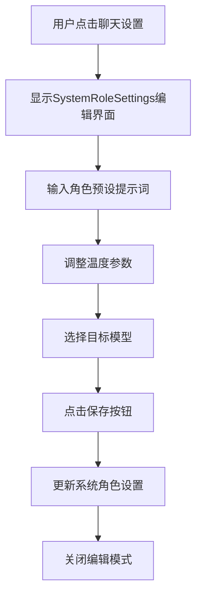
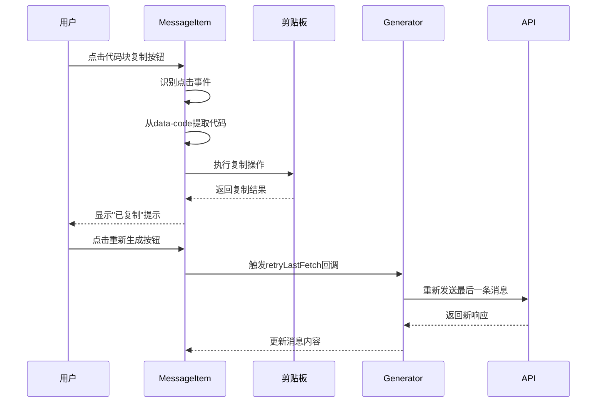
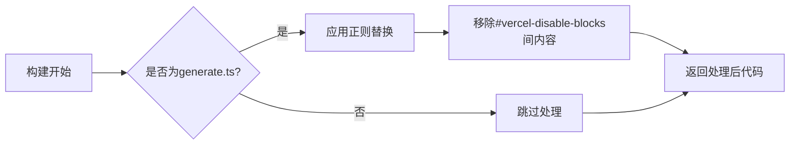
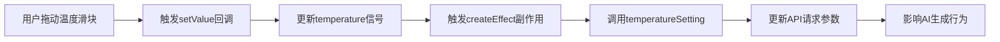
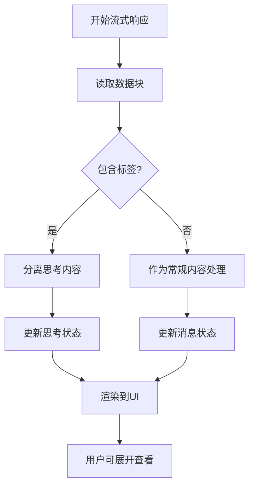
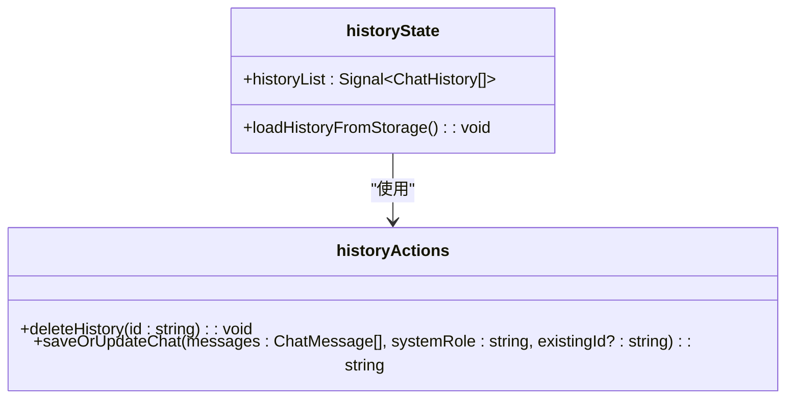

# 高级功能

<cite>
**本文档引用的文件**  
- [SystemRoleSettings.tsx](file://src/components/SystemRoleSettings.tsx)
- [MessageItem.tsx](file://src/components/MessageItem.tsx)
- [disableBlocks.ts](file://plugins/disableBlocks.ts)
- [SettingsSlider.tsx](file://src/components/SettingsSlider.tsx)
- [generate.ts](file://src/pages/api/generate.ts)
- [historyStore.ts](file://src/store/historyStore.ts)
- [unocss.config.ts](file://unocss.config.ts)
- [Generator.tsx](file://src/components/Generator.tsx)
- [types.ts](file://src/types.ts)
</cite>

## 目录
1. [高级功能](#高级功能)
2. [系统角色自定义](#系统角色自定义)
3. [消息操作逻辑](#消息操作逻辑)
4. [安全内容过滤](#安全内容过滤)
5. [参数实时调控](#参数实时调控)
6. [思维过程可视化](#思维过程可视化)
7. [高级使用技巧](#高级使用技巧)

## 系统角色自定义

`SystemRoleSettings` 组件实现了系统角色提示词的自定义功能，允许用户通过文本输入框为AI设定特定的行为模式和角色定位。该组件通过`currentSystemRoleSettings`信号（Signal）管理当前的角色设置，并在用户点击保存按钮时更新状态。

组件包含两个主要功能区域：角色预设输入区和参数设置区。角色预设区提供一个文本域，用户可在此输入详细的AI行为指令。参数设置区则包含模型选择下拉框和温度滑块，分别用于选择对话模型和调节生成随机性。



**图示来源**  
- [SystemRoleSettings.tsx](file://src/components/SystemRoleSettings.tsx#L1-L105)

**本节来源**  
- [SystemRoleSettings.tsx](file://src/components/SystemRoleSettings.tsx#L1-L105)

## 消息操作逻辑

`MessageItem` 组件实现了消息的复制、删除和重新生成等核心操作逻辑。通过集成`solidjs-use`的剪贴板功能，实现了代码块的复制能力。组件使用`markdown-it`扩展库渲染Markdown内容，并在代码块周围包裹自定义的复制按钮。

消息复制功能通过事件委托实现：在组件挂载时为消息容器添加点击事件监听器，当用户点击复制按钮时，从`data-code`属性中提取解码后的代码内容并执行复制操作。重新生成功能通过`onRetry`回调实现，仅在最后一条助手消息上显示"重新生成"按钮。



**图示来源**  
- [MessageItem.tsx](file://src/components/MessageItem.tsx#L1-L118)

**本节来源**  
- [MessageItem.tsx](file://src/components/MessageItem.tsx#L1-L118)

## 安全内容过滤

`disableBlocks.ts` 插件实现了特定内容块的安全过滤机制，主要用于在Vercel等平台部署时移除不兼容的代码段。该插件通过Astro的构建插件系统，在代码转换阶段识别并移除被特殊注释标记的代码块。

插件定义了一个`transform`函数，当检测到文件路径包含`pages/api/generate.ts`时，使用正则表达式匹配并移除`#vercel-disable-blocks`和`#vercel-end`之间的所有内容。这种设计允许开发者在同一代码库中维护多个部署环境的特定配置，而不会相互干扰。



**图示来源**  
- [disableBlocks.ts](file://plugins/disableBlocks.ts#L1-L16)

**本节来源**  
- [disableBlocks.ts](file://plugins/disableBlocks.ts#L1-L16)

## 参数实时调控

前端参数滑块通过`SettingsSlider`组件实现，该组件封装了基础滑块控件，提供温度（temperature）和top_p等参数的实时调节功能。当用户拖动滑块时，`setTemperature`函数被调用，更新对应的信号值。

参数值的变化通过`createEffect`副作用自动同步到API请求中。在`SystemRoleSettings`组件中，每当温度值改变，都会触发`temperatureSetting`回调函数，将最新参数传递给生成器。这些参数最终通过`generatePayload`函数包含在OpenAI API请求的初始化选项中。



**图示来源**  
- [SettingsSlider.tsx](file://src/components/SettingsSlider.tsx#L1-L42)
- [generate.ts](file://src/pages/api/generate.ts#L1-L70)

**本节来源**  
- [SettingsSlider.tsx](file://src/components/SettingsSlider.tsx#L1-L42)
- [generate.ts](file://src/pages/api/generate.ts#L1-L70)

## 思维过程可视化

思维过程可视化功能通过特殊的`<think>`标签实现，允许AI在响应中包含其思考步骤。该功能的实现分为三个部分：流式响应解析、状态管理和UI渲染。

在`Generator.tsx`中，流式响应被逐块读取并缓存在缓冲区中。解析器持续检查缓冲区中的`<think>`和`</think>`标签，将思考内容与常规响应内容分离，分别更新`currentAssistantThinkMessage`和`currentAssistantMessage`信号。在`MessageItem`组件中，思考内容被包裹在`<details>`元素中，默认折叠显示，用户可点击展开查看完整思考过程。



**图示来源**  
- [Generator.tsx](file://src/components/Generator.tsx#L170-L211)
- [MessageItem.tsx](file://src/components/MessageItem.tsx#L80-L117)

**本节来源**  
- [Generator.tsx](file://src/components/Generator.tsx#L170-L211)
- [MessageItem.tsx](file://src/components/MessageItem.tsx#L80-L117)

## 高级使用技巧

### 构建专用角色模板
用户可通过`SystemRoleSettings`组件创建专用角色模板。在角色预设输入框中输入详细的AI行为指令，如"你是一位资深软件架构师，用简洁明了的方式解释技术概念"，可创建专业咨询角色。建议将常用模板保存在外部文档中，需要时复制粘贴使用。

### 批量管理对话历史
系统通过`historyStore.ts`实现对话历史的本地存储和管理。`saveOrUpdateChat`函数负责保存或更新对话记录，`deleteHistory`函数提供删除功能。历史记录以时间倒序排列，最多保存`CONFIG.MAX_HISTORY_COUNT`条记录。用户可通过点击历史按钮查看和加载过往对话。



**图示来源**  
- [historyStore.ts](file://src/store/historyStore.ts#L1-L111)

**本节来源**  
- [historyStore.ts](file://src/store/historyStore.ts#L1-L111)

### 自定义样式扩展
项目使用UnoCSS作为CSS方案，通过`unocss.config.ts`中的快捷方式（shortcuts）实现样式扩展。用户可在配置文件中添加自定义快捷方式，如`.my-custom-style`，然后在组件中直接使用。这种原子化CSS方法既保持了样式一致性，又提供了高度的可定制性。

```typescript
// unocss.config.ts 中的快捷方式示例
shortcuts: [{
  'gpt-copy-btn': 'absolute top-12px right-12px z-3 fcc border b-transparent w-8 h-8 p-2 bg-light-300 dark:bg-dark-300 op-90 cursor-pointer',
  'gpt-retry-btn': 'fi gap-1 px-2 py-0.5 op-70 border border-slate rounded-md text-sm cursor-pointer hover:bg-slate/10',
}]
```

**本节来源**  
- [unocss.config.ts](file://unocss.config.ts#L1-L56)